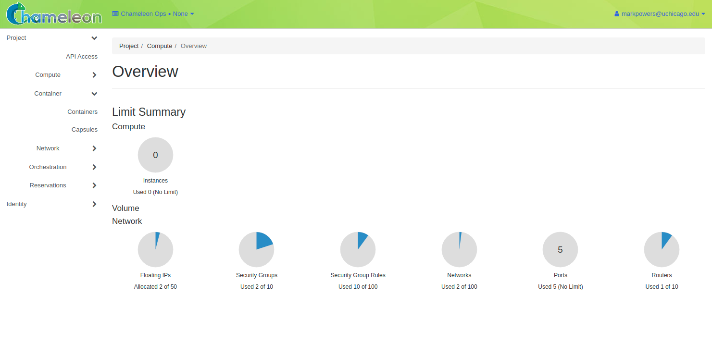
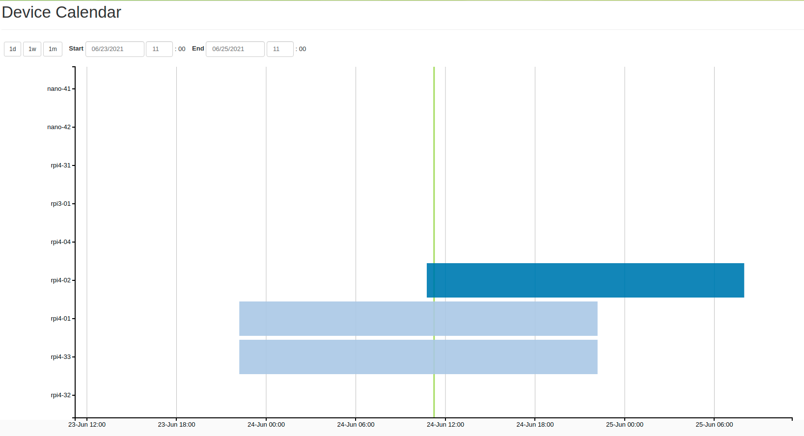
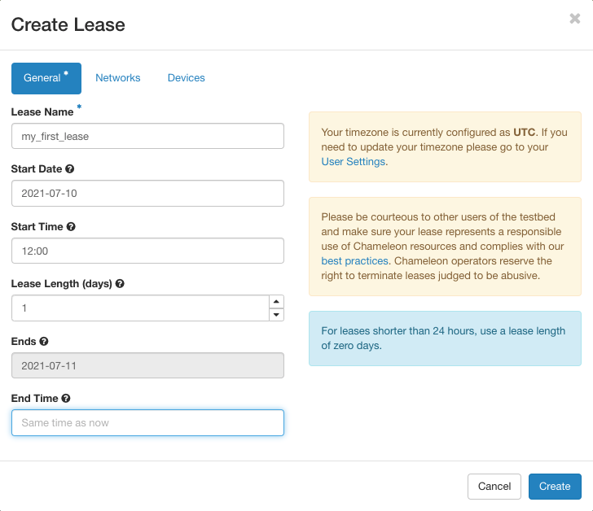
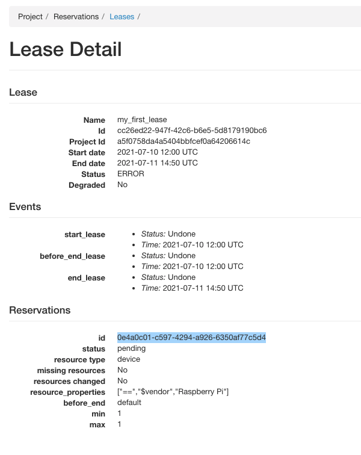

.. _InCommon: https://incommon.org/federation

.. _getting-started-edge:

=============================
Getting started with CHI@Edge
=============================

This guide will walk you through the initial steps of getting an account,
joining a project and working with your first container.

.. contents:: :local:

.. _getting-started-edge-user:

Step 1: Log in to Chameleon
===========================

Just click the “Log in” button situated in the top right corner of `our main page
<https://www.chameleoncloud.org>`_ -- you probably won’t even need to create an account! 

If your institution is a member of `InCommon`_ (most US research and education
institutions are) -- or if you have a Google account -- you can log in with your
institutional/Google credentials via the federated login. Otherwise, the log in process 
will guide you to create an account (:ref:`read more about logging into Chameleon
via federated login <federation>`).

On your first Chameleon login you will be asked to accept `terms and conditions
<https://auth.chameleoncloud.org/auth/realms/chameleon/terms>`_ of use. Please,
note that as part of those terms and conditions you are requested to acknowledge
Chameleon in publications produced using the testbed: see our FAQ for
information on `how to reference Chameleon in your publications
<https://www.chameleoncloud.org/learn/frequently-asked-questions/#toc-how-should-i-reference-chameleon->`_
and the suggested `acknowledgement text
<https://www.chameleoncloud.org/learn/frequently-asked-questions/#toc-how-should-i-acknowledge-chameleon-in-my-publications->`_.

Once you log in, you will be able to :ref:`edit your Chameleon profile
<profile-page>`, sign up for webinars, and participate in our community.
However, to actually use the testbed you will first need to **join or create a
project** (see below).

.. _getting-started-edge-project:

Step 2: Create or join a project
================================

To get access to Chameleon resources, you will need to be associated with a
**project** that is assigned a **resource allocation**.

If you want to **join an existing Chameleon project**, you will need to ask the PI
of the project to add your username. You can find your username in `your Chameleon profile
<https://www.chameleoncloud.org/user/profile/>`_--it is also displayed in the
top-right corner when you are logged in.

If you want to **create a project**, you will first either need to obtain a PI
status or work with somebody who has PI status. To determine if you can obtain
PI status, please see a :ref:`list of PI eligibility criteria <pi-eligibility>`.
If you do not meet these criteria (e.g., students generally do not), you will
need to ask your advisor or other scientist supervising your research to create
the project for you. You can request PI status by checking a box in `your
Chameleon profile <https://www.chameleoncloud.org/user/profile/>`_. Chameleon PI
status requests are typically reviewed within one business day.

Once you have PI status, you may apply for a new project with an initial
allocation. A project application typically consists of a short description of
your intended research and takes one business day to process. Once your project
has been approved, you will be able to utilize the testbed sites.

Step 3: Start using Chameleon!
==============================

Congratulations, you are now ready to launch your first container! Containers
are a simple way to deploy applications. Learn more about what containers are 
with `this guide from docker <https://www.docker.com/resources/what-container>`_.
Follow these steps to launch a container and manage it.

The CHI\@Edge dashboard
-----------------------

Chameleon edge resources are available through 
`CHI@Edge <https://chi.edge.chameleoncloud.org>`_. When you access this site, you are 
first taken to a dashboard, which shows a summary of your project's current 
resource usage. The dashboard looks  something like this:

   An overview of your project's current resource usage

The Lease Calendar
------------------

Visit the calendar for edge devices by going to `this link <https://chi.edge.chameleoncloud.org/project/leases/device_calendar/>`_.
This calendar lets you discover when resources are available to use. The *Y* 
axis of this chart represents the different edge devices in the system, and the
*X* axis represents time.

   A chart displaying when devices are available.

Create a Reservation
--------------------

In order to guarentee access to an edge device, you can reserve it.
Alternatively, you can create a container on demand, provided there are
available devices at the time of creation. Here, we provide instructions for
using reservations, which can be skipped if a reservation is not needed. We
include instructions for using either the dashboard interface, or with the CLI.

Create a Reservation Using the Dashboard
~~~~~~~~~~~~~~~~~~~~~~~~~~~~~~~~~~~~~~~~

After navigating to the CHI@Edge dashboard, follow these instructions to create
a reservation.

#. In the sidebar, click *Reservations*, then click *Leases*
#. Click on the *+ Create Lease* button in the toolbar
#. Enter a name, for example *my_first_lease*
#. Update the start date and time, along with the end date and time.
#. Next to *General* at the top, select *Devices*. Here, enter 1 for both the
   minimum and maximum number of devices. You can also add a device filter
   for a specific type of edge device.
#. Click *Create*.

   The Create Lease dialog

Your reservation will show in the list of leases. Once the status changes from
*PENDING* to *ACTIVE*, you will be able to launch a container. Before you can
do this, you must get the reservation ID of a device. Click on your lease name
from the Leases overview to see the *Lease Detail* page. Under the
*Reservations* header, you will see an *id* field. Note this value. For example
in the following figure, the value is `0e4a0c01-c597-4294-a926-6350af77c5d4`.

   The Lease Detail page, with the reservation ID highlighted in blue.

Create a Reservation Using the CLI
~~~~~~~~~~~~~~~~~~~~~~~~~~~~~~~~~~

If you have previously installed blazar, you will need to reinstall in order to
add in the new changes for edge devices

.. code-block:: shell

  pip install git+https://github.com/chameleoncloud/python-blazarclient@chameleoncloud/xena

Be sure to use the the OpenStack RC file downloaded from the Edge site, which
means you should be logged into the GUI at
`CHI@Edge <https://chi.edge.chameleoncloud.org>`_. Once there, you can follow
the :ref:`same instructions <cli-rc-script>`
as is done on the other sites to download this file.

To create a lease, use the ``lease-create`` command. The following arguments are
required:

- ``--reservation`` with ``resource_type=device``, ``min``, ``max``, and ``resource_properties`` attributes
- ``--start-date`` in ``YYYY-MM-DD HH:MM`` format
- ``--end-date`` in ``YYYY-MM-DD HH:MM`` format
- A lease name.

The attribute ``resource_properties`` may be used to specify what sort of edge
device you want to reserve. For example, to reserve a Raspberry Pi from June 24, 
2021 at 3:00pm to June 25, 2021 at 1:00pm, with the name ``my-first-lease``, you
may use the following command:

.. code-block:: shell

  openstack reservation lease create \
    --reservation resource_type=device,min=1,max=1,resource_properties='["==", "$vendor", "Raspberry Pi"]' \
    --start-date "2021-06-24 15:00" --end-date "2021-06-25 13:00" \
    my-first-lease

You may also use the device name to reserve a specific device. For example, to 
reserve the device named ``rpi3-01``, you can change your command like below:

.. code-block:: shell

  openstack reservation lease create \
    --reservation resource_type=device,min=1,max=1,resource_properties='["==", "$name", "rpi3-01"]' \
    --start-date "2021-06-24 15:00" --end-date "2021-06-25 13:00" \
    my-first-lease

The output of ``reservation lease create`` should look like

.. code-block:: shell

    +--------------+-----------------------------------------------------------------------+
    | Field        | Value                                                                 |
    +--------------+-----------------------------------------------------------------------+
    | created_at   | 2021-06-24 15:43:36                                                   |
    | degraded     | False                                                                 |
    | end_date     | 2021-06-25T13:00:00.000000                                            |
    | events       | {                                                                     |
    |              |     "created_at": "2021-06-24 15:43:36",                              |
    |              |     "updated_at": null,                                               |
    |              |     "id": "243988c9-5e04-484e-991e-e9a19bc107f9",                     |
    |              |     "lease_id": "8aad6912-2eb5-4140-812f-123e5cb56ca3",               |
    |              |     "event_type": "end_lease",                                        |
    |              |     "time": "2021-06-25T13:00:00.000000",                             |
    |              |     "status": "UNDONE"                                                |
    |              | }                                                                     |
    |              | {                                                                     |
    |              |     "created_at": "2021-06-24 15:43:36",                              |
    |              |     "updated_at": null,                                               |
    |              |     "id": "8aa2f211-9434-4ae0-a01a-e454e0a045e7",                     |
    |              |     "lease_id": "8aad6912-2eb5-4140-812f-123e5cb56ca3",               |
    |              |     "event_type": "before_end_lease",                                 |
    |              |     "time": "2021-06-24T15:45:00.000000",                             |
    |              |     "status": "UNDONE"                                                |
    |              | }                                                                     |
    |              | {                                                                     |
    |              |     "created_at": "2021-06-24 15:43:36",                              |
    |              |     "updated_at": null,                                               |
    |              |     "id": "e8892924-649a-4beb-aa46-9e16f6331dab",                     |
    |              |     "lease_id": "8aad6912-2eb5-4140-812f-123e5cb56ca3",               |
    |              |     "event_type": "start_lease",                                      |
    |              |     "time": "2021-06-24T15:45:00.000000",                             |
    |              |     "status": "UNDONE"                                                |
    |              | }                                                                     |
    | id           | 8aad6912-2eb5-4140-812f-123e5cb56ca3                                  |
    | name         | my-first-lease                                                        |
    | project_id   | a5f0758da4a5404bbfcef0a64206614c                                      |
    | reservations | {                                                                     |
    |              |     "created_at": "2021-06-24 15:43:36",                              |
    |              |     "updated_at": "2021-06-24 15:43:36",                              |
    |              |     "id": "500e0c36-2089-46a5-bf7c-cc46e5f65a0d",                     |
    |              |     "lease_id": "8aad6912-2eb5-4140-812f-123e5cb56ca3",               |
    |              |     "resource_id": "48001fa1-ccb5-4e30-b511-a90455930776",            |
    |              |     "resource_type": "device",                                        |
    |              |     "status": "pending",                                              |
    |              |     "missing_resources": false,                                       |
    |              |     "resources_changed": false,                                       |
    |              |     "resource_properties": "[\"==\", \"$vendor\", \"Raspberry Pi\"]", |
    |              |     "before_end": "default",                                          |
    |              |     "min": 1,                                                         |
    |              |     "max": 1                                                          |
    |              | }                                                                     |
    | start_date   | 2021-06-24T15:45:00.000000                                            |
    | status       | PENDING                                                               |
    | trust_id     | ec2a893aa0494d72bcc5fbb3b73e7e66                                      |
    | updated_at   | 2021-06-24 15:43:36                                                   |
    | user_id      | b8f54aa95b96b9fb69e31a3e39df6a7bad29581439cf8bd8c9d59d9d7d048f3a      |
    +--------------+-----------------------------------------------------------------------+

Look for the *reservations* entry, and within this item find the *id* entry. In
the above example, this is *500e0c36-2089-46a5-bf7c-cc46e5f65a0d*. Save this
value someone, as it will be used later. Note that this is not the value from the
row with *id* in the left column.

.. note::

  It may take up to a minute for your reservation to change from PENDING to 
  ACTIVE status. One the lease becomes ACTIVE, you can use it.

At this point you can return to the GUI to continue setting up your container.

Setting up networking
---------------------
If you are planning to make your container accessible over the Internet with a
Floating IP, your container will need to run a security group in order to expose
the ports needed. Below is a brief introduction to security groups in Chameleon, 
or you can find a more in depth explanation 
:ref:`here <kvm-security-groups>`.

#. First, in the sidebar click *Network*, then click *Security Groups*. You can 
   examine an existing group's rules by clicking *Manage Rules* next to it. If 
   you already have a security group here that meets your needs, you can skip 
   the next step. Otherwise, you will need to create a new security group.

#. To create a new security group, click *+ Create Security Group*, enter a name 
   for your new group in the wizard, and then click *Create Security Group*. 
   You will be redirected to the screen to manage your new group's rules. Select 
   *Add Rule* to open the add rule wizard. Under *Rule*, you can select from 
   common rules, or if your needs are not met by one of these options, select 
   one of the custom rules. For example, if your container runs a web
   server, you may want to add the rules HTTP and HTTPS, allowing for traffic
   on ports 80 and 443.

  .. figure:: create_security_group.png
     :alt: Create Security Group Wizard
     :figclass: screenshot

     Enter a name for the security group.

Launching a container
---------------------

To start launching a container, follow the following steps:

1. In the sidebar, click *Container*, then click *Containers*.

2. Click on the *Create Container* button in the toolbar and the *Create
   Container* wizard will load

3. Give your container a name. For example, since it's your first container, 
   *my_first_container* may be a good name. Then, enter the name of an 
   image you want to launch from Docker Hub. You must use the full name of the 
   image. Optionally, you can supply a custom command to override the default
   command run by Docker.

  .. note::
    You may also use a Glance ID for your image, by selecting *Glance* under the
    *Image Driver* field. You should only provide a Glance ID if you've 
    previously created a container snapshot, which stores the snapshot as a 
    Glance image.

  .. important::
    Only the ARM architecture is currently supported. Make sure the image used 
    is compatible with ARM. `Here is a list of such images on Docker Hub <https://hub.docker.com/search?type=image&architecture=arm64>`_.

  .. figure:: create_container.png
    :alt: Create Container wizard
    :figclass: screenshot

    Enter a name and image name.

4. Click *Networks* in sidebar. Then, find *containernet1* in the image list and
   click the *Up* arrow to select it.

   .. figure:: create_container_networks.png
      :alt: Selecting a network
      :figclass: screenshot

      Select the containernet1 network

5. Click *Security Groups* in sidebar. Select the security group you wish to use
   by clicking the *Up* arrow to select it.

   .. figure:: create_container_security_groups.png
      :alt: Select security groups to use
      :figclass: screenshot

      You select your desired security group.

6. Click *Scheduler Hints* in the sidebar. Next to custom, enter "reservation"
   and click the *+* sign. It will move to the right, and there enter the
   reservation ID saved from the ``lease-create`` step. If you are launching
   a container on demand, you can skip this step.

   .. figure:: scheduler_hints.png
      :alt: Enter the reservation ID in Scheduler Hints
      :figclass: screenshot

      Enter "reservation" and then the reservation ID.

7. Click the *Create* button.

Congratulations, you have launched an container! It may take a few minutes for
your container to become active if the image is not yet downloaded to the
target device.

 .. _device-profile:

Launching with a Device Profile
~~~~~~~~~~~~~~~~~~~~~~~~~~~~~~~

For some functions, extra setup must take place while a container is launched.
For example, to use a camera, docker needs to load the device. This setup is
handled by launching your container with a device profile. You can see what
device profiles work with each device on our `table of current hardware <https://chameleoncloud.org/experiment/chiedge/hardware-info/>`_.

Additionally, all devices support the profile ``cap_net_admin``, which gives
adds the capability ``CAP_NET_ADMIN`` to a container.

To use a device profile, you must launch your container using the CLI or
the python interface, python-chi. In the CLI, a device profile is used by
adding the argument ``--device-profile "<profile_name>"``. With python-chi,
you can include ``device_profiles=["<profile_name>"]`` as a keyword argument to
``container.create_container``.

Associating an IP address
-------------------------

For your container to be accessible over the Internet, you need to
first assign a floating IP address.

#. First, select your container name in the *Containers* page, which will
   bring you to an overview for the container. Under *Spec*, you will see a
   field titled *Addresses* and within this, you should see an IP address next
   to the text *addr*. Note this address.

#. Go to the *Floating IP* dashboard by clicking on *Network* and *Floating IPs*
   in the sidebar.

    .. figure:: floating_ip_overview.png
       :alt: The Floating IP dashboard
       :figclass: screenshot

#. If you have a Floating IP not currently associated to a container, click the
   *Associate* button for the IP. A dialog will load that allows you to assign a
   publicly accessible IP to your container. Under *Port to be associated*, use
   the IP address from the container overview from step 1. Click the *Associate*
   button in the dialog to complete the process of associating the public IP to
   your container.

   .. figure:: associate_ip_edge.png
      :alt: The Manage Floating IP Associations dialog
      :figclass: screenshot

      Here you can assign a floating IP address

#. If you didn't already have a Floating IP available, you may allocate one to
   your project by clicking on the *Allocate IP to Project* button along the top
   row in the Floating IP dashboard. A new dialog will open for allocating the
   floating IP.

   .. figure:: associate_pool.png
      :alt: The Allocate Floating IP dialog
      :figclass: screenshot

      This dialog allows you to allocate an IP address from Chameleon's public
      IP pool

   Click the *Allocate IP* button. The Floating IP dashboard will reload and you
   should see your new Floating IP appear in the list. You can now go back to
   step 3.

.. _access-to-your-container:

Access to your container
------------------------

Once your container has launched, there are a few ways to interact with it. 

If your container communicates over the network, you can use the assigned
floating IP to access it. For example, if your container is running a web server
on port ``8888``, with floating IP ``129.114.108.102``, you can connect to it by
going to ``http://129.114.108.102:8888`` in your browser.

By selecting your container name from the list of containers, you will be taken
to an overview page for your container. Here, you can select the logs tab to
see the output from your container. In the top right of this page, next to the
button labeled *Refresh*, you can select the drop-down arrow. One of the options
in this drop-down menu is *Execute Command*. Clicking this will open a window,
allowing you to enter a command to execute on your container. The output from
this command will then be displayed, after the command runs. In the future,
you will be able to connect to your container via the *Console* tab, but for the
moment this is not supported.

   .. figure:: execute_command.png
      :alt: The Execute Command window
      :figclass: screenshot

      This dialog allows you to execute a command on your container.

FAQs
====

How do I access my container?
-----------------------------
See :ref:`Access to your container <access-to-your-container>`.

You may wish to `install an ssh server <https://stackoverflow.com/questions/18136389/using-ssh-keys-inside-docker-container/43318322#43318322>`_ 
on your container. If you do so, please ensure that password access is disabled
in order to keep your container secure.

How do I upload files to my container?
--------------------------------------
Using the Jupyter interface, you can do:

.. code-block:: python

  from chi import container
  container.upload(container_uuid, local_path, remote_path)

This method is limited to a small file size per each upload.

If your container runs an SSH server, you can copy files using tools like
``scp``.

Can I use a private image from DockerHub?
-----------------------------------------
We do not support pulling from private Docker registries, but you can use
Glance to do this, which is the image service used for Chameleon's baremetal
and KVM sites. Run a command:

.. code-block:: shell
      docker save <image> | openstack image create --container-format=docker --disk-format=raw <name>

When you launch a container, you can select "Glance" as the image driver, with
the name of your image.

Can I launch my container with runtime capabilities or in privileged mode?
--------------------------------------------------------------------------
Containers can only be launched with a set of approved capabilities for
security reasons. See :ref:`this section <device-profile>` for how to use
capabilities and what capabilties are available.

How do I check GPU memory usage on the Jetsons?
-----------------------------------------------
This can be done with ``tegrastats``. This is included in Nvidia's L4T base image,
or you can follow these steps to get the binary, which can be copied to your
image.

First, get the `tegrastats binary from Nvidia <https://repo.download.nvidia.com/jetson/>`_
which is in the `nvidia-l4t-tools package <https://repo.download.nvidia.com/jetson/t210/pool/main/n/nvidia-l4t-tools/nvidia-l4t-tools_32.5.1-20210614115125_arm64.deb>`_.

Extract the file ``dpkg-deb -x <filename>.deb <output_dir>"``, and then you
can find the single tegrastats binary in ``./usr/bin``. 

My container stops with status ``Exited(1)``
--------------------------------------------
Check the "Logs" tab for more information on what actually went wrong.

If you see the error ``exec user process caused: exec format error``, the issue
most likely an architecture issue. Make sure your container is built for the
proper CPU type, which is ``linux/arm64`` on most of our devices.

