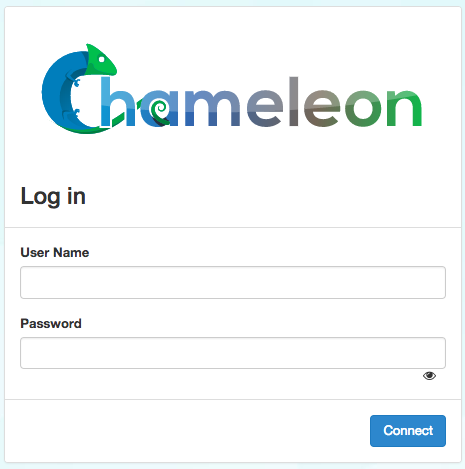
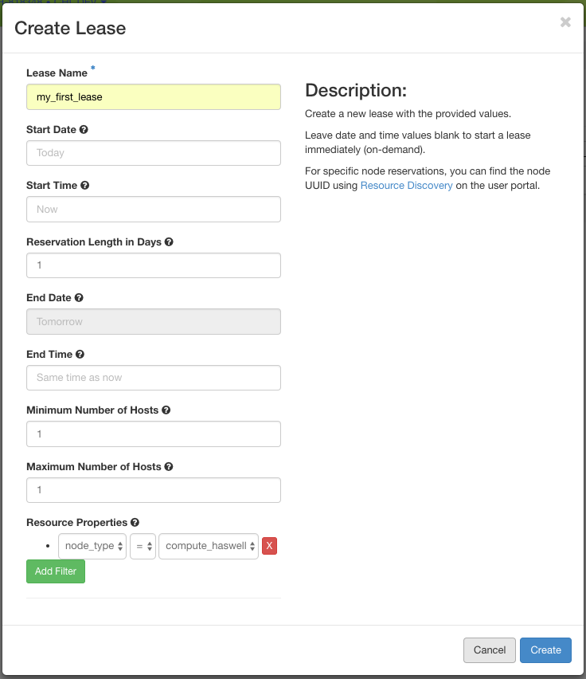

==================
Getting Started
==================

This guide will walk you through the initial steps of getting an account, joining a project and working with your first instance.

.. contents:: :local:

--------------------------------------------
Step 1: Create a Chameleon account
--------------------------------------------

You will first need to `create a user account <https://www.chameleoncloud.org/register>`_.

This includes agreeing to the `Chameleon terms and conditions <https://www.chameleoncloud.org/terms/view/site-terms/1.00/>`_ which, among others, ask you to acknowledge the use of Chameleon in your publications. As part of creating an account you may request PI status, which means that you will be able to create and lead Chameleon projects. PI status is typically available to faculty members or research scientists at a scientific institution. 

.. role:: redbold

.. important::  If you are a student, :redbold:`do not` request PI status.

After you have verified your account using the link sent via e-mail, you may continue to create a project if you are a PI, or join a PI's project if you are a student.

--------------------------------------------
Step 2: Create or join a project
--------------------------------------------

To use Chameleon, you will need to be associated with a *project* that is assigned an *allocation*.

If you are a PI, you may `apply for a new project <https://www.chameleoncloud.org/user/projects/new/>`_. A project application typically consists of a description of your intended research and takes one business day to process. Once your project has been approved, you may add users to your project.

For more information about project management, please see :ref:`Project Management Section <project-management>` or :ref:`FAQs of projection management <faq-project>`.

--------------------------------------------
Step 3: Start using Chameleon!
--------------------------------------------

Congratulations, you are now ready to launch your first instance! Instances are much like what you may expect to find in a virtual machine, except here the instances are on bare-metal nodes - the core feature of Chameleon. A bare-metal node is a whole compute node that you have exclusive access to. An instance is going to be a bare-metal node that has been launched with an operating system image. Follow these steps to make a reservation for a machine, launch an instance and log in to it.

The Chameleon Dashboard
=======================

Chameleon resources are available at two sites. You may login to the Chameleon Dashboard for resources at `the University of Chicago <https://chi.uc.chameleoncloud.org>`_ or `the Texas Advanced Computing Center <https://chi.tacc.chameleoncloud.org>`_. Use the account name and password that you signed up with.

.. note:: If you change your account password, it takes approximately ten minutes for the change to propagate to each dashboard.

  The Chameleon Dashboard login

Once you are logged in, you should see a summary of your project's current resource usage. It should look like this:

.. figure:: dashboard.png
  :alt: The Chameleon Dashboard's resource usage summary

  An overview of your project's current resource usage

Reserving a Node
================

First, we need to reserve a node for our use. Chameleon provides bare-metal access to nodes. When you create a reservation for one or more nodes, only you and users on your project will be able to use those nodes for the time specified. We will create a single day reservation for a compute node, which are the most common types of nodes available on Chameleon.

#. In the sidebar, click *Reservations*, then click *Leases*
#. Click on the *+ Create Lease* button in the toolbar
#. Type *my_first_lease* for the lease name
#. Find the *Resource Properties* section. In the dropdown below *node_type*, select *compute_haswell*
#. Click the *Create* button

  The Create Lease dialog - be sure to select compute in the dropdown below node_type

The reservation will start shortly, at which point you can launch an instance on a bare-metal node.

.. note:: You have created an "on demand" reservation. When you do not specify a start date or time in the future, the reservation will start as soon as possible and will last one day.

Launching an Instance
=====================

Once the reservation starts, you can launch a bare-metal instance on the node that has been leased to you.

#. In the sidebar, click *Compute*, then click *Instances*
#. Click on the *Launch Instance* button in the toolbar and the *Launch Instance* wizard will load
#. Type *my_first_instance* for the instance name and select your *my_first_lease* reservation

   .. figure:: launch_details.png
      :alt: Launch details

      Enter an instance name and select your reservation

#. Click *Source* in sidebar. Then, find *CC-CentOS7* in the image list and click the *Up* arrow to select it.

   .. figure:: launch_source.png
      :alt: Selecting an image

      Select the CC-CentOS7 image

#. Click *Flavor* in sidebar. Select the *baremetal* flavor.

   .. figure:: launch_flavor.png
      :alt: Select the baremetal flavor

      Select the baremetal flavor

#. Click *Keypair* in sidebar. Click the *+ Create Key Pair* button and enter ``mychameleonkey`` for the key name. This will automatically start a download for a file named ``mychameleonkey.pem``. This is your private key pair that you will use to access your instance.

   .. figure:: launch_keypair.png
      :alt: Create a keypair to secure your instance

      You can create or import a public/private keypair for accessing your instance.

#. Click the *Launch Instance* button.

Congratulations, you have launched an instance on a bare-metal node!

Associating an IP Address
=========================

Your instance may take approximately ten minutes to launch. The launching process includes powering down, loading the operating system over the networking, and booting up for the first time on a rack located either at the University of Chicago or the Texas Advanced Computing Center, depending on where you chose to launch your instance. Before you can access your instance, you need to first assign a floating IP address - an IP address that is accessible over the public Internet.

#. If you don't see your instance, go to the *Instances* list by clicking on *Compute* and *Instances* in the sidebar.
#. Locate your instance. It is probably in the *Spawning* state.

   .. figure:: instance_entry.png
      :alt: The current state of your instance

      Your instance is probably in the "Spawning" state

#. Click the *Associate Floating IP* button. A dialog will load that allows you to assign a publicly accessible IP.

   .. figure:: associate_manage.png
      :alt: The Manage Floating IP Associations dialog

      Here you can assign a floating IP address

#. You may allocate a floating IP for your project by clicking on the *+* button next to the dropdown that says *Select an IP address*. A new dialog will open for allocating floating IP.

   .. figure:: associate_pool.png
      :alt: The Allocate Floating IP dialog

      This dialog allows you to allocate an IP address for Chameleon's global IP pool

#. Click the *Allocate IP* button. You will return to the previous dialog and an IP address will be selected for you.

   .. figure:: associate_ip.png
      :alt: You have now allocated a floating IP

      You have now allocated a floating IP address 

#. Click the *Associate* button and a floating IP will be associated to your instance.

Accessing Your Instance
=======================

Once your instance has launched with an associated floating IP address, it can be accessed via SSH using the private key that you have downloaded during the `Launching an Instance`_ step

.. note:: The following instructions assume that you are using a macOS or Linux terminal equivalent. You may view our `YouTube video on how to login via SSH on Windows <https://youtu.be/MDK5D2ptJiQ>`_.

To log in to your instance, follow the steps:

#. Open a terminal window and navigate to where you have saved the ``mychameleonkey.pem`` file. Change the permissions on the file to user read/write only:

   .. code-block:: bash

      chmod 600 mychameleonkey.pem

#. Add the key to your current SSH identity

   .. code-block:: bash

      ssh-add mychameleonkey.pem

#. Log in to your Chameleon instance via SSH using the ``cc`` user account and your floating IP address. If your floating IP address was ``129.114.108.102``, you would use the command:

   .. code-block:: bash

      ssh cc@129.114.108.102

   .. note:: Change the IP address in this command to match your instance's floating IP address!

