.. _`service hours`: https://chameleoncloud.org/learn/frequently-asked-questions/#toc-what-are-the-units-of-an-allocation-and-how-am-i-charged-

.. _`Hardware Discovery`: https://chameleoncloud.org/hardware/

.. _globus: https://www.globus.org/

.. _Chameleon: https://chameleoncloud.org/

.. _InCommon: https://incommon.org/federation

.. _`User Dashboard`: https://chameleoncloud.org/user/dashboard/

.. _`Projects Dashboard`: https://chameleoncloud.org/user/projects/

.. _python-chi: https://python-chi.readthedocs.io/en/latest/

.. _`GPU v100`: https://chameleoncloud.org/hardware/node/sites/uc/clusters/chameleon/nodes/24401231-4587-4377-a5ff-cc8b51ab99ac/

.. _`Bare Metal Experiment Pattern`: https://trovi.chameleoncloud.org/dashboard/artifacts/370ce99a-3e03-43e9-83e3-b61fd9692dc0

.. _`Appliances Catalog`: https://trovi.chameleoncloud.org/dashboard/artifacts?tags=appliance

.. _getting-started:

----

================
Getting Started
================

**Welcome to the Chameleon testbed! We're excited you're here.**

In this guide, we walk through the core steps of using Chameleon resources:
discovering hardware, making a reservation, configuring your instance, and
connecting to it.

Not sure what Chameleon is? Read our :doc:`about page <../index>` before
continuing.

.. attention::

   **Before you begin**, make sure you have the following:

   - A **Chameleon user account** — see our :doc:`federated authentication
     guide <../user/federation>` to create one
   - Membership in an **active Chameleon project** — see our :doc:`project
     guide <../user/project>` to create a project or join an existing one

   Project setup can take time due to review and approval processes. Complete
   these steps before continuing with this guide.

At the end of this tutorial, you'll have learned how to:

- Find resources using the `Hardware Discovery`_ page and check lease
  availability via the :ref:`Resource Calendars <the-lease-calendars>`
- Make :doc:`advanced reservations<../technical/reservations/index>` for
  Chameleon resources
- Configure, launch, and connect to an instance running on a bare metal server
- Orchestrate a Chameleon experiment using Jupyter and python-chi_ *(advanced —
  see our* :doc:`companion guide <jupyter-python-chi>` *)*

**Table of Contents**

.. contents:: :local:

Ready to launch your first instance on a Chameleon **bare metal** node? In this
guide, we'll use the graphical user interface (GUI) on the Chameleon_ portal.
You can head there now in a separate browser window
(https://chameleoncloud.org).

Once you've completed this guide, our :doc:`companion guide
<jupyter-python-chi>` walks through the same steps using Jupyter and
python-chi_, Chameleon's Python library for programmatic experiment
orchestration.

.. important::
   **Bare metal** instances are physical servers that you have exclusive access to
   during your reservation. This is different from virtualized clouds, where
   multiple users share the same physical hardware through virtualization
   technologies. Chameleon's bare metal approach provides users with direct access     
   to the underlying hardware, allowing for greater customization, performance, and power monitoring.
   Chameleon offers bare metal reservations at |CHI@TACC| (Austin, TX), |CHI@UC| (Chicago, IL), and
   |CHI@NCAR| (Boulder, CO).

   Chameleon also offers a multi-tenant, **virtualized cloud** via |KVM@TACC| (see
   :ref:`kvm`) and **container-based edge** computing via |CHI@Edge| (`docs
   <https://chameleoncloud.gitbook.io/chi-edge/getting-started>`_). See our blog
   for a guide on `choosing between bare metal and virtualized instances
   <https://chameleoncloud.org/blog/2025/10/21/bare-metal-or-kvm-which-should-you-choose-and-when/>`_.

Pick Your Hardware
-------------------

.. raw:: html

   <a href="https://chameleoncloud.org/hardware/" class="portal-btn" target="_blank">Open Hardware Discovery →</a>

We'll start at the `Hardware Discovery`_ page on the Chameleon Portal, where
you can filter our bare metal nodes across all CHI sites using dozens of fields
(including GPU configuration, memory, RAM, CPUs, etc.). You can also view
detailed specifications for each node, including CPU, memory, storage, and
networking.

We have our hardware pre-selected for this guide, so we'll skip
most of the hardware discovery details for now. See
:doc:`../technical/discovery/index` for a full walkthrough of the discovery
tools.

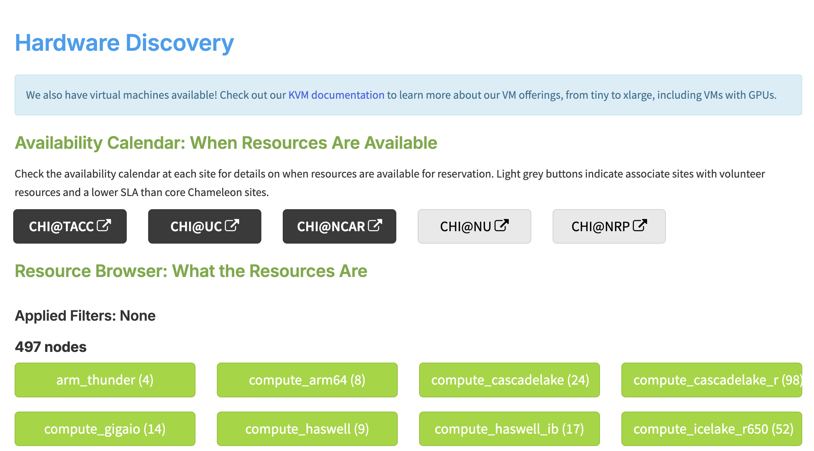

.. important::
   Chameleon resources are available *per site*, which means you **must** select
   the correct site to access specific hardware.

   The main Chameleon Infrastructure (CHI) sites are:

   - **Texas Advanced Computing Center (TACC)**: Austin, TX — ``CHI@TACC``
   - **University of Chicago (UC)**: Chicago, IL — ``CHI@UC``
   - **National Center for Atmospheric Research (NCAR)**: Boulder, CO — ``CHI@NCAR``

   For example, the `GPU v100`_ node is only available at |CHI@UC|. Always
   confirm which site hosts your preferred hardware before making a reservation.

For this guide we'll use ``Compute Cascadelake R`` nodes, available at both
|CHI@UC| and |CHI@TACC|. They're plentiful and typically reservable on demand,
which makes them a good choice for a first experiment. You can follow the same
steps below to get started with any bare metal hardware on Chameleon -- as a
challenge, try following this guide with a different node that you find on the
`Hardware Discovery`_ page.

My First Reservation: Reserving a Node
---------------------------------------

On Chameleon, you must reserve your resources before you can launch an instance
on them. Chameleon supports both *on-demand* and *advanced* reservations. We
will use an on-demand reservation for this guide, but note that you can reserve
resources in advance, which is often necessary to get access to popular, scarce
hardware like GPUs.

Step 1: Access a Testbed Site
~~~~~~~~~~~~~~~~~~~~~~~~~~~~~

As mentioned above, different Chameleon sites have different hardware. To log
in to a Chameleon site from the main Chameleon_ portal page, click on the
``Experiment`` tab on the nav bar at the top. From the dropdown, select a
Chameleon site. We will be working with nodes available in either |CHI@UC|
or |CHI@TACC|, so you can select one of those.

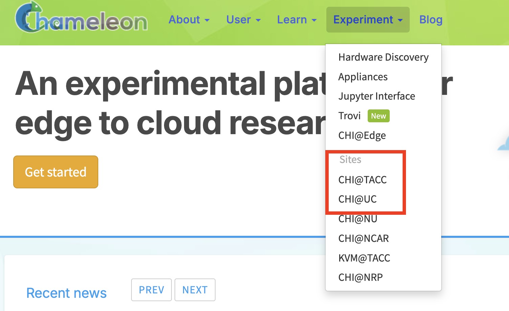

   Select a site to use.

When you access one of the sites, you are first taken to an **overview page**,
which shows a summary of your resource usage for your current project and site.
The dashboard will appear as below:

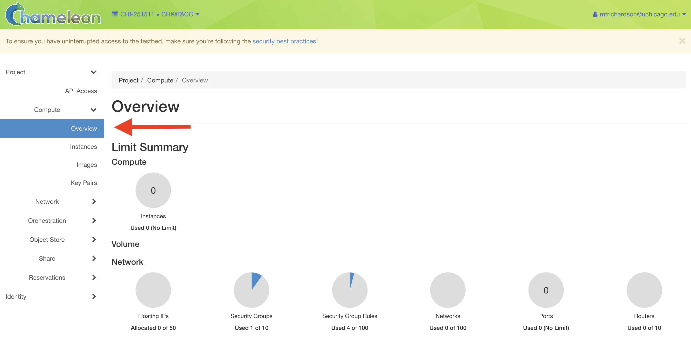

   An overview of your project's current resource usage for the selected site

Notice that the URL has changed to a specific domain for the testbed site we
chose. You can also see which site you are currently on by clicking on the
dropdown next to the Chameleon logo at the top left of the window.

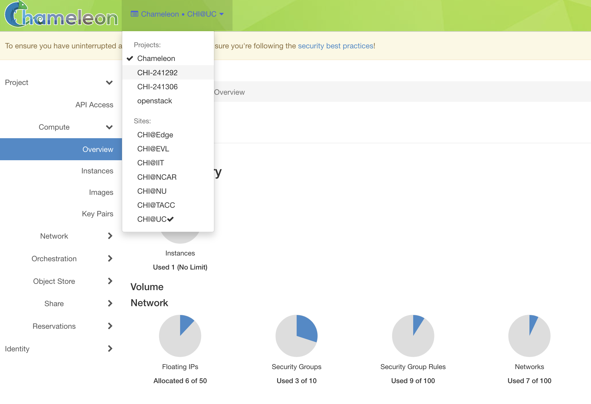

   Dropdown menu to change your project and site without returning to the portal

This section tells you which project you are currently using and which site. By
clicking on the dropdown menu, you can change to another Chameleon site or
change to another project.

.. important::
   Projects will only appear as an option in this menu if they have a current
   active allocation of compute resources.

Step 2: Go to the Host Calendar
~~~~~~~~~~~~~~~~~~~~~~~~~~~~~~~~

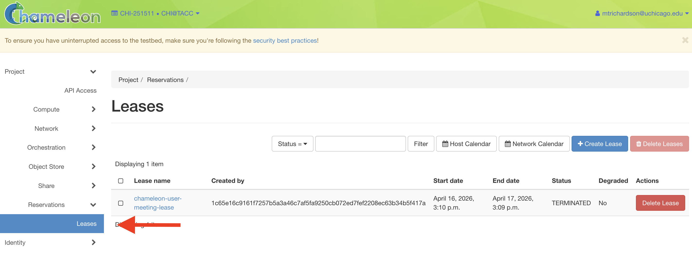

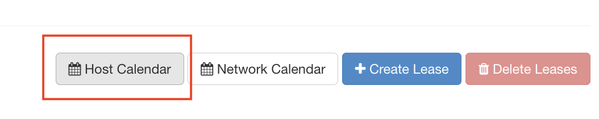

From the overview page, select ``Reservations`` in the side navigation bar,
then click ``Leases``. On the Leases page, click the **Host Calendar** button.

The calendar shows a Gantt chart of node availability. Each row represents an
individual node. Use the **Node Type** filter at the top to narrow the view to
your desired hardware — in our case, ``compute_cascadelake_r``.

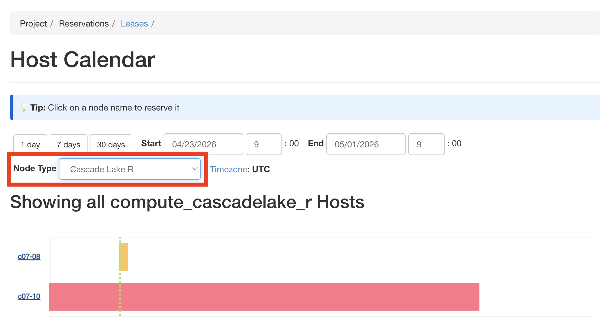

   Filter the calendar by node type to see which nodes are currently free.

.. attention::
   Node types available in the filter are restricted to the site you are
   currently using. If you don't see a node type you expect, make sure you are
   logged in to the correct site.

Step 3: Reserve a Node Directly from the Calendar
~~~~~~~~~~~~~~~~~~~~~~~~~~~~~~~~~~~~~~~~~~~~~~~~~~~

When you spot an available node (a row with no active reservations blocking
your desired start time), click on the node name -- ``c07-14`` in the example
below -- associated with that row. This opens the **Create Lease** dialog with
the node already pre-selected for you.

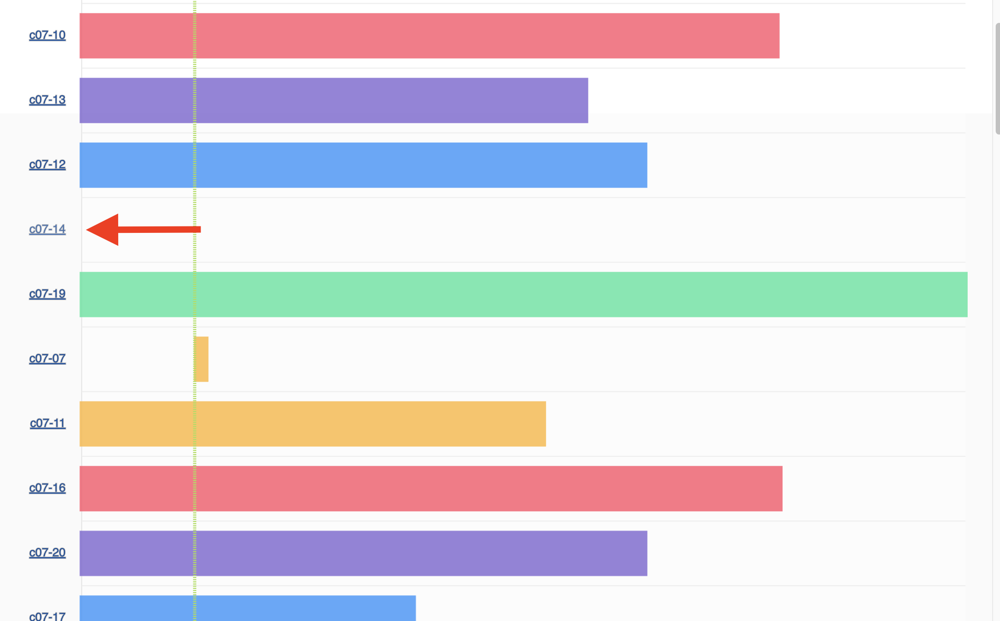

   Click a node row to open the Create Lease dialog with that node pre-filled.

Let's go through the lease form.

**General**

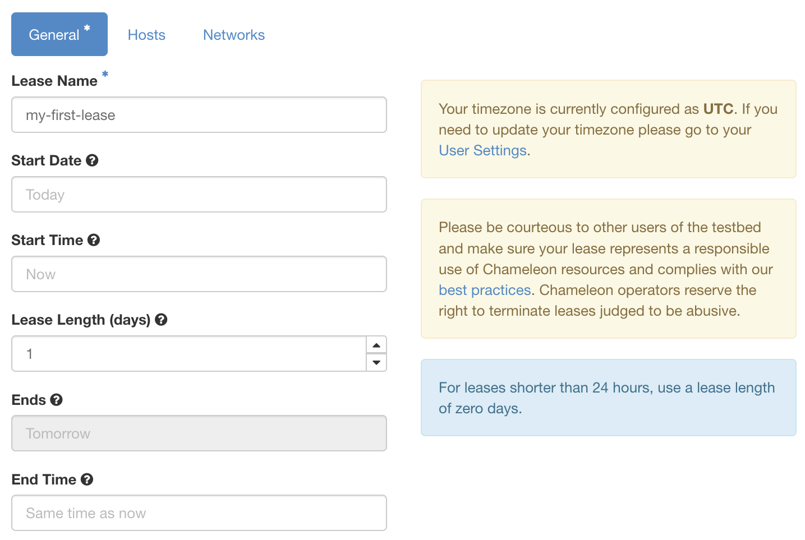

   Specify your lease name and duration.

Give your lease a name (e.g. ``my-first-lease``). For an on-demand lease you
can leave the start time as-is — the form defaults to starting immediately with
a one-day duration. To make an advanced reservation, adjust the start date,
number of days (maximum 7), and end time.

**Hosts**

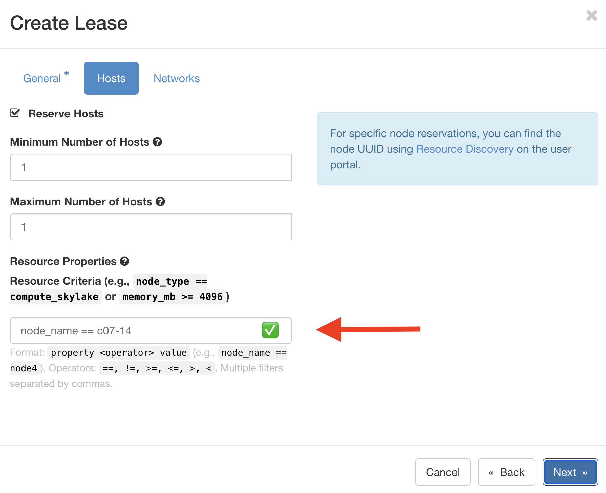

   The Hosts section with the node pre-selected from the calendar.

Because we clicked a specific node in the calendar, the Hosts section is
already pre-populated with a resource property filter that matches that exact
node. You don't need to change anything here.

In general, this section lets you filter by any resource property — node type,
UUID, memory, GPU configuration, and more — to target the hardware you want. If
you are creating a lease without using the calendar, this is where you would
specify your node properties (e.g. ``node_type == compute_cascadelake_r``) and
the number of hosts (minimum and maximum).

**Networks**

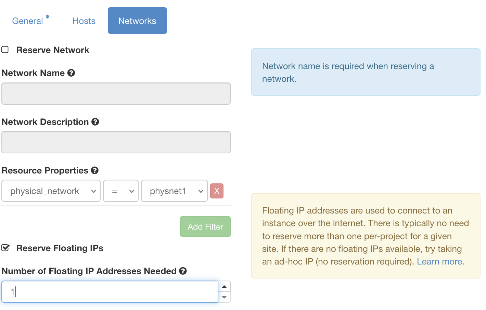

   Select your network reservation options.

You will almost certainly want to reserve a **Floating IP** here. Floating IPs
are publicly routable addresses used to SSH into your instance from the
internet. There is typically no need to reserve more than one per project per
site. If no floating IPs are available in the pool, you can allocate one
ad-hoc from the Floating IPs dashboard after your lease is active.

.. note::
   Reserving a floating IP in the lease form guarantees you receive one. The
   pool can occasionally run dry, so reserving upfront is the safer option.

If your experiment requires an isolated private network across multiple nodes,
check **Reserve Network** as well — but for a single-node first experiment,
this is not necessary.

Step 4: Submit Your Lease
~~~~~~~~~~~~~~~~~~~~~~~~~~

Click **Create**. Your lease will appear on the Leases page with a status of
``PENDING``. Once the scheduler confirms the reservation, it transitions to
``ACTIVE`` and you can launch an instance on that node.

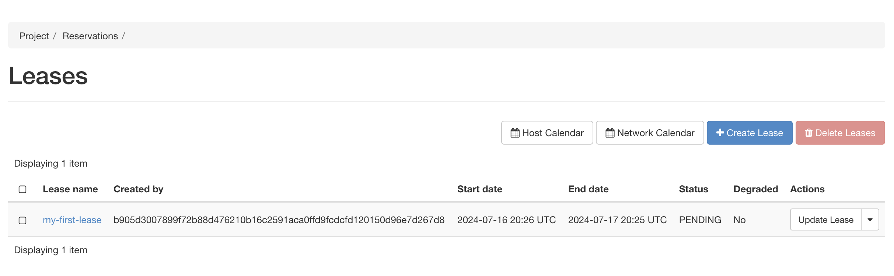

.. important::
   Do not stack back-to-back reservations to work around the 7-day limit.
   Leases found to be doing this may be deleted. See our `best practices
   <https://www.chameleoncloud.org/learn/frequently-asked-questions/#toc-what-are-the-best-practices-of-chameleon-usage->`_
   for guidance on longer reservations.

My First Instance: Launching an Instance
----------------------------------------

In the following steps, we will walk through how to configure and launch an
instance on hardware we just reserved. In the GUI, this process will feel
similar to the process we just followed to create a new lease. You will specify
your instance details in a form and submit it to the system. Chameleon will
then automatically configure, build, and launch your instance.

.. note::
   
   Building and launching an instance on bare metal (especially when using beefy
   appliances and images) can take a long time. After creating your instance, **you
   may need to wait for 10 to 20 minutes before the instance will be running**.

To create a new instance, follow the steps below:

Step 1: Go to the Instances Dashboard
~~~~~~~~~~~~~~~~~~~~~~~~~~~~~~~~~~~~~

In the sidebar from your site dasboard, click *Compute*, then click *Instances*

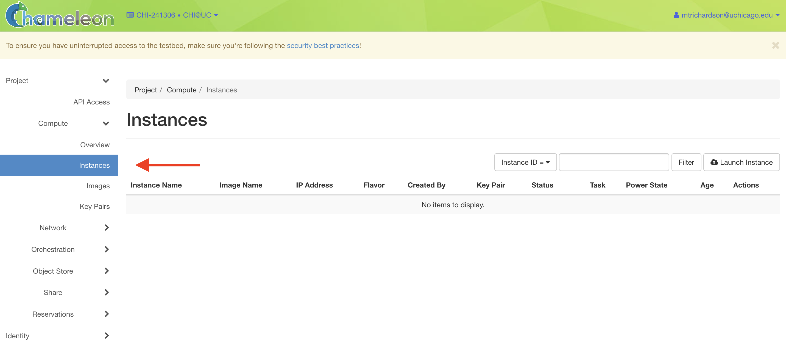

Step 2: Create a New Instance
~~~~~~~~~~~~~~~~~~~~~~~~~~~~~

Click on the *Launch Instance* button in the toolbar and the *Launch
Instance* wizard will load.

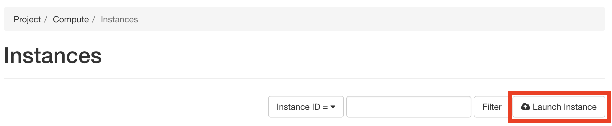

Below, we go through each step of the *Launch Instance* form.

**Details**

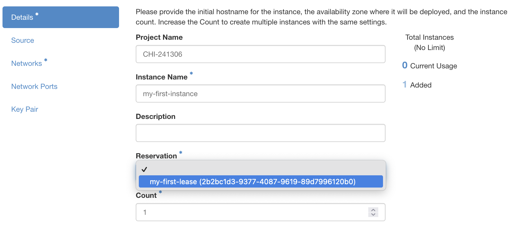
   
   Enter the main details about your instance, including which reservation to use.

Give your instance a descriptive name (`my-first-instance`) and a short
description (optional). You will also need to specify the lease that you
will use for this instance. You can select the reservation that you just
created from the dropdown. We can also specify how many instances we want to
launch. The default is one and we have one node so we'll stick with that.

**Source**

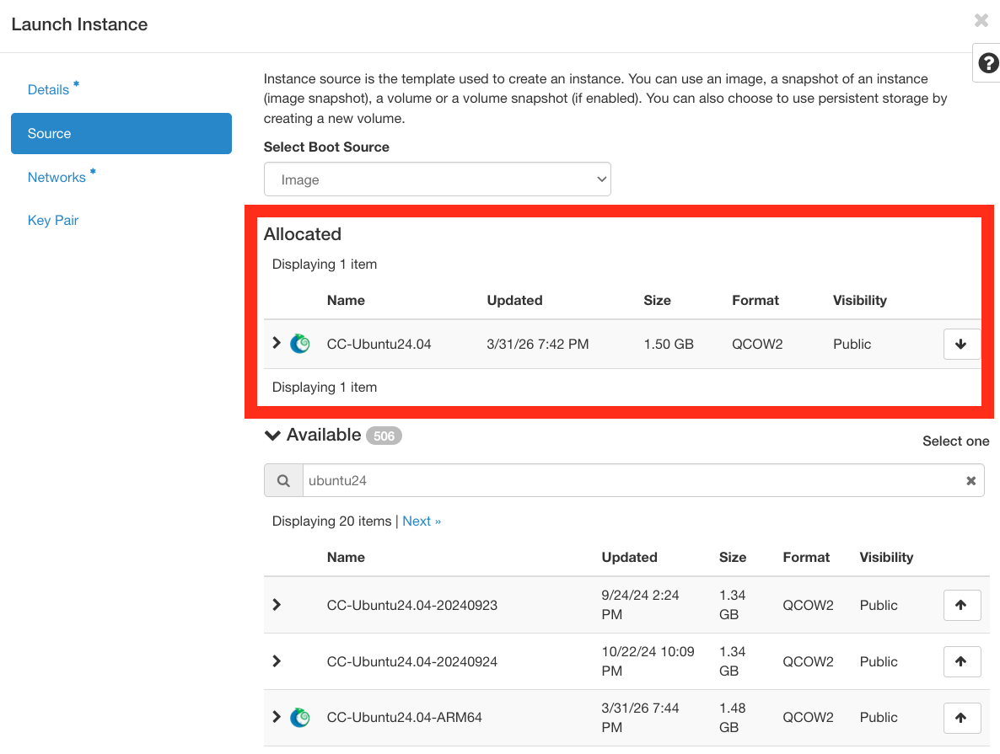
   
   Select your image source.

In the next section, we can configure a source that we will use for our
instance. This can be an image, a snapshotted image, a volume, or some other
appliance. Chameleon staff maintain a set of supported images (identified with
a Chameleon badge in the list); these are also browsable via the `Appliances
Catalog`_ on Trovi. There are also user-uploaded images and appliances. For our
demo, we'll use the supported ``CC-Ubuntu24.04`` image. Scroll down in the list
or type the name of the image in the search bar, find the image, and click the
up-arrow icon next to it to allocate it as the instance source. See
:doc:`../technical/images/index` for full documentation on images and
appliances.

**Networks**

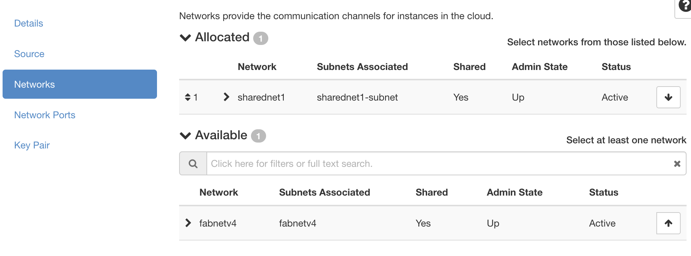

   Allocate a network.

On the next section, we can allocate a network to provide communication
channels for instances in the cloud. For this guide, we'll use ``sharednet1``,
Chameleon's shared default network — it provides internet connectivity
out of the box and is the simplest option for a first experiment.

``fabnetv4`` is a second shared network specifically for accessing FABRIC
testbed resources and cross-site stitching — see
:doc:`../technical/networks/networks_fabnet` for details.

.. note::
   If you plan to run many instances (for example, a class experiment with
   many students), consider creating a **project network** (an isolated VLAN)
   instead of placing all instances on ``sharednet1``. A project network gives
   your experiment a private broadcast domain while still allowing you to
   assign floating IPs to individual instances for public access. See
   :doc:`../technical/networks/networks_vlan` for details.

**Key Pairs**

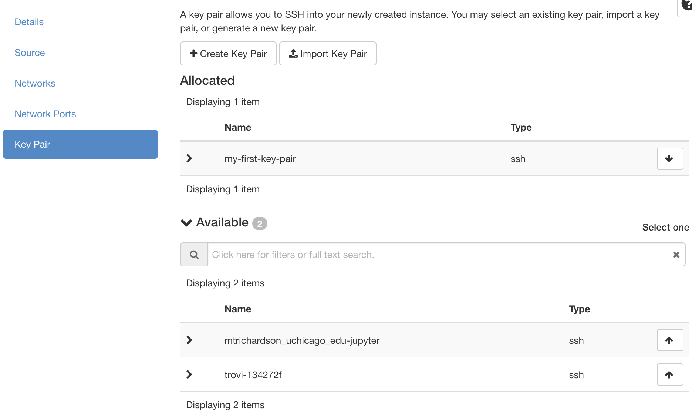

   Add a key pair to the instance.

As a final step to create our instance, we can set up a key pair. We **must**
add a key pair if we want to remotely access the instance after it is
running.

.. tip::

   For a **comprehensive walkthrough of setting up a new key pair for Chameleon**,
   see reference `here <https://teaching-on-testbeds.github.io/hello-chameleon/#exercise-create-ssh-keys>`_.

To add a key pair, we can either add a new one using ``Create Key Pair`` and
storing the credentials on our local machine, or import an existing key using
the ``Import Key Pair``. If you have previously uploaded a key pair to Chameleon,
this key pair will appear in the "Available" section below. You can then reuse
that key pair.

Step 3: Click Launch
~~~~~~~~~~~~~~~~~~~~~

Finally, we are ready to click ``Launch Instance``. Doing so will take us
back to our Instances page, where we should see a new row for the instance that
we just created. We can see most of the important information about our
instance from here. We can also click on the instance name (like with a lease)
to view more details.

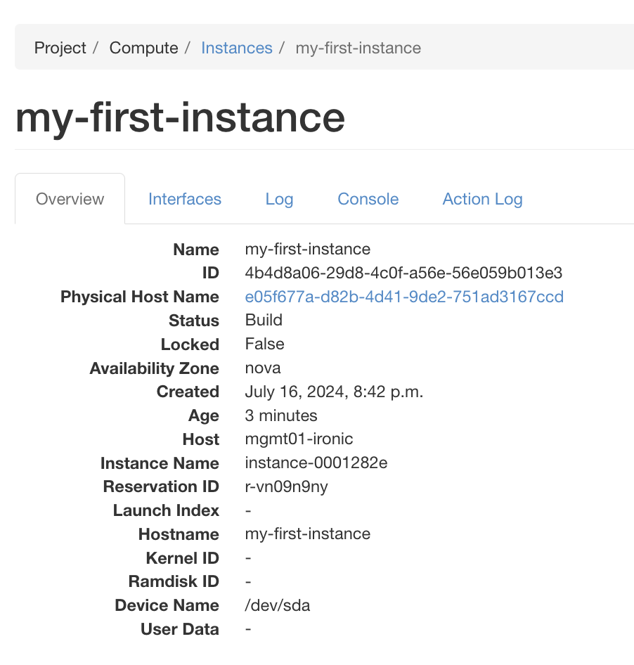

The detailed page gives you an overview of the instance. There are also other
options to view logs, open a console (once the instance is running), and more.

First Contact: Associating an IP Address & SSH
----------------------------------------------

Your instance may take approximately ten to fifteen minutes to launch depending
on the node type. The launch process includes powering up, loading the
operating system over the network, and booting up for the first time on a rack
located at one of our hardware sites, depending on where you chose to launch
your instance.

Once the instance is running, we will connect to it from our local computer via
SSH with the key pair that we added during our configuration step. The steps in
the following section will show you how to connect to your instance so you can
start working with the node you reserved.

Step 1: Associate an IP
~~~~~~~~~~~~~~~~~~~~~~~

Before you can access your instance, you need to first assign a floating IP
address - an IP address that is accessible over the public Internet. You can do
this from the same GUI dashboard where you made your reservation and launched
your instance. 

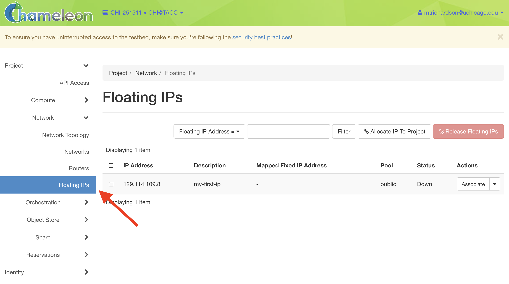

To associate an IP address with your instance, follow these
steps.

#. Go to the *Floating IP* dashboard by clicking on *Network* and *Floating IPs*
   in the sidebar.

    .. figure:: floating_ip_overview.png
       :alt: The Floating IP dashboard
       :figclass: screenshot

#. Look for a free Floating IP not currently associated to an instance, click the
   *Associate* button for the IP. A dialog will load that allows you to assign a
   publicly accessible IP to your instance. Click the *Associate* button in the
   dialog to link the public IP to your instance.

   .. figure:: associate_ip.png
      :alt: The Manage Floating IP Associations dialog
      :figclass: screenshot

      Here you can assign a floating IP address

#. If you didn't already have a Floating IP available, you may allocate one to
   your project by clicking on the *Allocate IP to Project* button along the top
   row in the Floating IP dashboard. A new dialog will open for allocating the
   floating IP.

   .. figure:: associate_pool.png
      :alt: The Allocate Floating IP dialog
      :figclass: screenshot

      This dialog allows you to allocate an IP address from Chameleon's public
      IP pool

   Click the *Allocate IP* button. The Floating IP dashboard will reload and you
   should see your new Floating IP appear in the list. You can now go back to
   step 2.

Step 2: Connect via SSH
~~~~~~~~~~~~~~~~~~~~~~~~

Once your instance is running and has a floating IP associated, open a terminal
and connect using the private key you added during the launch step. All
Chameleon instances use ``cc`` as the default login username.

.. note::
   The instructions below assume macOS or Linux. Windows users can follow our
   `YouTube video on logging in via SSH on Windows <https://youtu.be/MDK5D2ptJiQ>`_.

.. code-block:: bash

   ssh -i /path/to/your/private/key cc@<your-floating-ip>

Replace ``/path/to/your/private/key`` with the path to your private key file
and ``<your-floating-ip>`` with the floating IP you associated in the previous
step.

.. tip::
   **New to SSH keys?** See this `SSH key guide
   <https://teaching-on-testbeds.github.io/hello-chameleon/#exercise-create-ssh-keys>`_
   for a walkthrough on generating and using key pairs.

Once connected, your terminal prompt changes to show the instance hostname,
confirming you are now running commands directly on the bare metal node:

.. code-block:: bash

   cc@my-first-instance:~$ lscpu
   Architecture:        x86_64
   CPU(s):              96
   Model name:          Intel(R) Xeon(R) Gold 6240R CPU @ 2.40GHz
   Thread(s) per core:  2
   Core(s) per socket:  24
   Socket(s):           2

Congratulations! You just created your first Chameleon instance!

What's Next?
-------------

Now that you've reserved a node, launched an instance, and connected via SSH,
you're ready to start running experiments on Chameleon.

- **Go programmatic**: Our :doc:`JupyterHub and python-chi guide
  <jupyter-python-chi>` walks through the same workflow using Chameleon's
  Python library inside a Jupyter Notebook — no GUI required. Prefer the
  command line? See the :doc:`CLI guide <../technical/cli/index>` for
  scripting and automation via the OpenStack client.
- **Explore more hardware**: Browse `Hardware Discovery`_ and the :doc:`reservations guide
  <../technical/reservations/index>` to learn about advanced reservation
  options.
- **Browse experiment templates**: Check out `tutorials on Trovi
  <https://trovi.chameleoncloud.org/dashboard/artifacts?tags=experiment+pattern>`_
  for ready-made experiment patterns you can launch and adapt.
- **Watch and learn**: Visit our `webinar page
  <https://chameleoncloud.org/learn/webinars/>`_ for live tutorials and
  recorded walkthroughs.

If you have questions, :ref:`see our documentation on getting help <help>`.
For feedback on this guide, reach out at contact@chameleoncloud.org.
