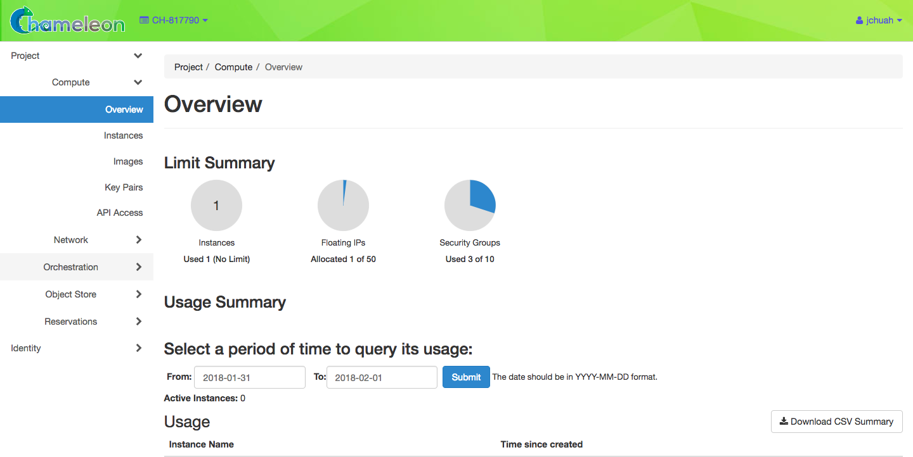
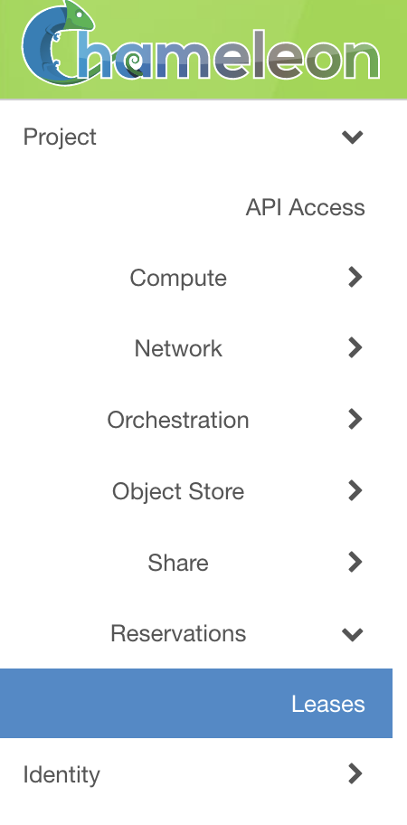
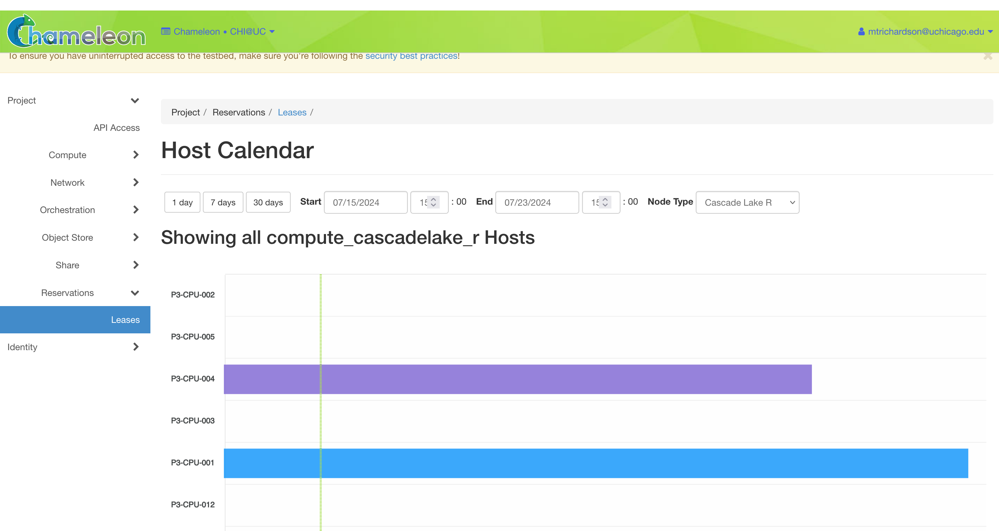
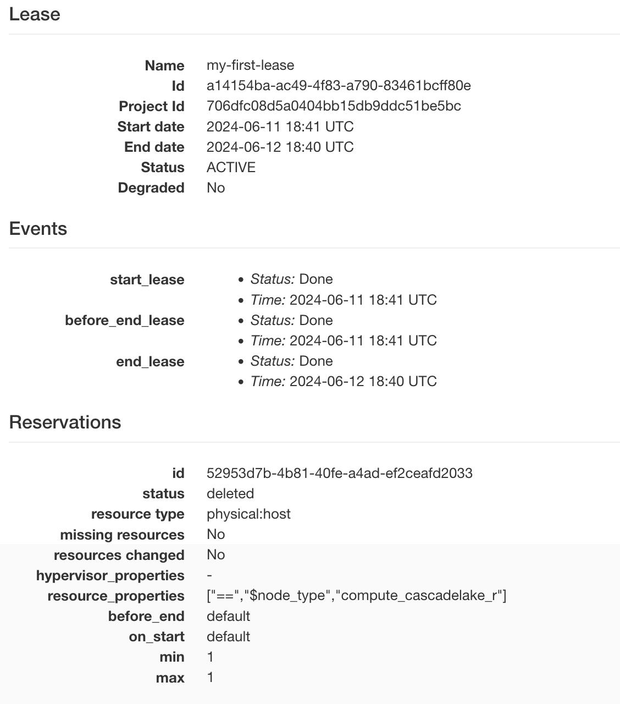

.. _`service hours`: https://chameleoncloud.org/learn/frequently-asked-questions/#toc-what-are-the-units-of-an-allocation-and-how-am-i-charged-

.. _`Hardware Discovery`: https://chameleoncloud.org/hardware/

.. _globus: https://www.globus.org/

.. _Chameleon: https://chameleoncloud.org/

.. _InCommon: https://incommon.org/federation

.. _`User Dashboard`: https://chameleoncloud.org/user/dashboard/

.. _`Projects Dashboard`: https://chameleoncloud.org/user/projects/

.. _python-chi: https://python-chi.readthedocs.io/en/latest/

.. _`GPU v100`: https://chameleoncloud.org/hardware/node/sites/uc/clusters/chameleon/nodes/24401231-4587-4377-a5ff-cc8b51ab99ac/

.. _`Bare Metal Experiment Pattern`: https://trovi.chameleoncloud.org/dashboard/artifacts/370ce99a-3e03-43e9-83e3-b61fd9692dc0

.. _`Appliances Catalog`: https://trovi.chameleoncloud.org/dashboard/artifacts?tags=appliance

.. _getting-started:

.. image:: ../_static/imgs/Chameleon_background_transparent.png
   :align: center

----

================
Getting Started
================

**Welcome to the Chameleon testbed! We're excited you're here.**

In this guide, we walk through the core steps to begin using Chameleon
resources: discovering hardware, making a reservation, and launching and
connecting to your first instance.

.. important::

   **Before you begin**, make sure you have the following:

   - A **Chameleon user account** — see our :doc:`federated authentication
     guide <../user/federation>` to create one
   - Membership in an **active Chameleon project** — see our :doc:`project
     guide <../user/project>` to create a project or join an existing one

   Project setup can take time due to review and approval processes. Complete
   these steps before continuing with this guide.

At the end of this tutorial, you'll have learned how to:

- Find compute resources using the `Hardware Discovery`_ page and check availability via
  the :ref:`Resource Calendars <the-lease-calendars>`
- Make :doc:`advanced reservations<../technical/reservations/index>` for
  Chameleon resources
- Configure, launch, and connect to an instance running on a bare metal server
- Orchestrate a Chameleon experiment using Jupyter and python-chi_ *(advanced — see our* :doc:`companion guide <jupyter-python-chi>` *)*

.. contents:: :local:

.. _start-using-chameleon:

Introduction to Chameleon
==========================

You can deploy instances on Chameleon bare metal nodes - our original
specialization - at |CHI@TACC| (Austin, TX), |CHI@UC| (Chicago, IL), and
|CHI@NCAR| (Boulder, CO) or on virtual machines through the |KVM@TACC| site. In
this quick start, we will work through launching your first instance on a **bare
metal** node. However, you can apply most of the same steps below to launch both
virtual instances on |KVM@TACC| and containers on |CHI@Edge| as well.

.. important::
   **Bare metal** instances are physical servers that you have exclusive access to
   during your reservation. This is different from virtualized clouds, where
   multiple users share the same physical hardware through virtualization
   technologies. Chameleon's bare metal approach provides users with direct access     
   to the underlying hardware, allowing for greater customization, performance, and power monitoring.

   Chameleon also offers a multi-tenant, virtualized cloud, with KVM-based
   configurations. See :ref:`kvm` for more details as well as our blog
   explaining the `differences between bare metal and virtualized instances
   <https://chameleoncloud.org/blog/2025/10/21/bare-metal-or-kvm-which-should-you-choose-and-when/>`_.

Below, we will walk through the steps on how to launch a bare metal instance
using the graphical user interface (GUI) on the Chameleon_ portal.

Once you've completed this guide, our :doc:`companion guide
<jupyter-python-chi>` walks through the same steps using Jupyter and
python-chi_, Chameleon's Python library for programmatic experiment
orchestration.

Pick Your Hardware
-------------------

Start at the `Hardware Discovery`_ page on the Chameleon Portal. The **Chameleon Resource
Browser** lets you filter nodes by type and view detailed specifications for
each node, including CPU, memory, storage, and networking. See
:doc:`../technical/discovery/index` for a full walkthrough of the discovery
tools.

.. image:: ../_static/imgs/getting_started/hardware-discovery.png

The **Availability** section of each node type links directly to the Lease
Calendars at each site, so you can check whether hardware is free before making
a reservation.

.. important::
   Chameleon resources are available *per site*, which means you **must** select
   the correct site to access specific hardware.

   The main Chameleon Infrastructure (CHI) sites are:

   - **Texas Advanced Computing Center (TACC)**: Austin, TX — ``CHI@TACC``
   - **University of Chicago (UC)**: Chicago, IL — ``CHI@UC``
   - **National Center for Atmospheric Research (NCAR)**: Boulder, CO — ``CHI@NCAR``

   For example, the `GPU v100`_ node is only available at |CHI@UC|. Always
   confirm which site hosts your preferred hardware before making a reservation.

For this guide we'll use ``Compute Cascadelake R`` nodes, available at both
|CHI@UC| and |CHI@TACC|. They're plentiful and typically available on demand,
which makes them a good choice for a first experiment. You can follow the same
steps below for any hardware on Chameleon.

Now that we have the hardware we want to use and the site where it is located,
we can make our first reservation.

My First Reservation: Reserving a Node
---------------------------------------

On Chameleon, you must reserve your resources before you can launch an instance
on them. Chameleon supports both *on-demand* and *advanced* reservations. We
will use an on-demand reservation for this guide, but note that you can reserve
resources in advance, which is often necessary to get access to popular, scarce
hardware like GPUs.

Step 1: Access a Testbed Site
~~~~~~~~~~~~~~~~~~~~~~~~~~~~~

As mentioned above, different Chameleon sites have different hardware. To log
in to a Chameleon site from the main Chameleon_ portal page, click on the
"Experiment" tab on the nav bar at the top. From the dropdown, select a
Chameleon site. We will be working with nodes available in either |CHI@UC|
or |CHI@TACC|, so you can select one of those.

.. figure:: ../_static/imgs/getting_started/experiment-dropdown.png
   :align: center
   :figwidth: 50 %
   :figclass: screenshot

   Select a site to use.

When you access one of the sites, you are first taken to a site dashboard,
which shows a summary of your project's current resource usage. The dashboard
looks something like this:

   An overview of your project's current resource usage

Once on your dashboard on the site, notice that the URL has changed to a
specific domain for the testbed site we chose. You can also see which site you
are currently on by clicking on the dropdown next to the Chameleon logo at the
top left of the window.

.. figure:: ../_static/imgs/getting_started/change-site-project-menu.png
   :figwidth: 80 %
   :align: center

This section tells you which project you are currently using and which site. By
clicking on the dropdown menu, you can change to another Chameleon site or
change to another project.

.. important::
   Projects will only appear as an option in this menu if they have a current
   active allocation of compute resources.

Step 2: Go to the Reservations Dashboard
~~~~~~~~~~~~~~~~~~~~~~~~~~~~~~~~~~~~~~~~

We need to reserve a ``Cascadelake R`` node for our use. From the main page of
our testbed site, we can select the "Reservations" menu item on the side nav
bar and then click "Leases." Doing so will open a new page showing a table of
your lease activity. If you are a first-time user of Chameleon, the table will
be blank. Let's change that now!

Step 3: Creating a New Lease
~~~~~~~~~~~~~~~~~~~~~~~~~~~~

Before we create a lease, it is a good idea to check the :ref:`Host Calendars
<the-lease-calendars>` available on the Leases page to see if another user has
the hardware reserved.

.. figure:: ../_static/imgs/getting_started/host-calendar-button.png

Click the "Host Calendar" button now. You will be taken to a new page with a
Gnatt chart.

Each row in the chart represents a node of the specific "Node Type" specified
at the top of the calendar. You can change this to display the calendar for
different node types.

.. attention::
   "Node Types" available in the filter menu will be restricted by site. You will 
   only see node types available for the specific site that you are currently 
   using.

Our preferred node type is available on demand, so let's navigate back to our
Leases ("Reservations -> Leases") page to create a new lease. Click the "Create
Lease" button in the top right corner of the page.

Clicking this button will then open a web form. Let's go through the web form
step by step.

**General**

.. figure:: ../_static/imgs/getting_started/create-lease-form-general.png
   :figwidth: 80 %
   :align: center

   Specify your lease name and duration.

In this section, add a name for your lease (`my-first-lease`). To
create an on-demand lease, we can click next, because the form will
auto-populate with defaults for the duration of the lease (the default is a
one-day lease that starts immediately). If you want to change the duration of
your lease or to make an advanced reservation, you can input the start date and
time, number of days (maximum 7 days), and the end time.

**Hosts**

.. figure:: ../_static/imgs/getting_started/create-lease-form-hosts.png
   :figwidth: 80 %
   :align: center

   Specify the number and type of host.

On the next section, you can specify the hardware that you want to
include in your lease. You must check the box "Reserve Hosts" and fill out the
required fields. We will start with just one node and will set the minimum and
maximum number of hosts to 1. In the Resource Property field, we can use
different attributes of Chameleon resources (such as "node type") to specify
the exact kind of hardware we want to reserve with this lease. We can add
multiple filters with different properties, but we only care about the node
type right now.

.. important::
   If you specify resource properties that return more than one node matching the filter that is available for your specified duration, the system will automatically select a node for you. If you want to specify the precise node that you want to use, you will need to refer to the Node ID and use the Resource Property filter to specify that node ID.

**Networks**

.. figure:: ../_static/imgs/getting_started/create-lease-form-networks.png
   :figwidth: 80 %
   :align: center

   Finally, select your network reservation options.

On the final section of the lease form, you can reserve network
resources. If your research requires setting up an isolated network for a
cluster of nodes, you may want to reserve a network by clicking the "Reserve
Network" box. You will almost certainly want to reserve a Floating IP for your
reservation. Floating IP addresses are used to connect to an instance over the
internet. There is typically no need to reserve more than one per-project for a
given site. If there are no floating IPs available, try taking an ad-hoc IP (no
reservation required)

.. note::
   Floating IPs can also be allocated to your project after creating a lease.
   However, the pool of allocable IPs can occasionally dry up. We encourage users
   to reserve floating IPs when making their hardware reservations, as it ensures
   that you will receive an IP.

**SUBMIT!**

.. image:: ../_static/imgs/getting_started/leases-pending.png

Click "**Create**". Chameleon provides bare metal access to nodes. When you create
a reservation for one or more nodes, only you and other users on your project
will be able to use those nodes for the time specified.

The reservation will start shortly, at which point you can launch an instance
on a bare metal node.

When the lease is created, it will appear on your Leases page with a status of
"PENDING." Once the lease is active, the status will change to "ACTIVE" and you
will then be able to start using the lease. You can click on the lease name to
view more details about your lease.

.. important::

   Do not attempt to stack reservations to circumvent the 7-day lease
   limitation. Your leases may be deleted. Please refer to our `best practices
   <https://www.chameleoncloud.org/learn/frequently-asked-questions/#toc-what-are-the-best-practices-of-chameleon-usage->`_
   if you require a longer reservation.

My First Instance: Launching an Instance
----------------------------------------

Once the lease that you created becomes "ACTIVE," you can launch a bare metal
instance on the node that has been leased to you. In the following steps, we
will walk through how to configure and launch an instance on the reserved
hardware. In the GUI, this process will feel similar to the process we just
followed to create a new lease. You will specify your instance details in a
form and submit it to the system. Chameleon will then automatically configure,
build, and launch your instance.

.. note::
   Building and launching an instance on bare metal (especially when using beefy appliances and images) can take a long time. After creating your instance, you may need to wait for 10 to 20 minutes before the instance will be running.

To create a new instance, follow the steps below:

Step 1: Go to the Instances Dashboard
~~~~~~~~~~~~~~~~~~~~~~~~~~~~~~~~~~~~~

In the sidebar from your site dasboard, click *Compute*, then click *Instances*

.. image:: ../_static/imgs/getting_started/instances-dashboard.png

Step 2: Create a New Instance
~~~~~~~~~~~~~~~~~~~~~~~~~~~~~

Click on the *Launch Instance* button in the toolbar and the *Launch
Instance* wizard will load.

**Details**

.. figure:: ../_static/imgs/getting_started/launch-instance-details.png
   :figwidth: 80 %
   :align: center
   
   Enter the main details about your instance, including which reservation to use.

Give your instance a descriptive name (`my-first-instance`) and a short
description (optional). You will also need to specify the lease that you
will use for this instance. You can select the reservation that you just
created from the dropdown. We can also specify how many instances we want to
launch. The default is one and we have one node so we'll stick with that.

**Source**

.. figure:: ../_static/imgs/getting_started/launch-instance-source.png
   :figwidth: 80 %
   :align: center
   
   Select your image source.

In the next section, we can configure a source that we will use for our
instance. This can be an image, a snapshotted image, a volume, or some other
appliance. Chameleon staff maintain some images for users (identified with a
Chameleon badge). There are also user-uploaded images and appliances. For
our demo, we'll use the supported `CC-Ubuntu22.04` image. We can see a list
of all available images below on this section. If we scroll down, we can
find the image and click the up arrow icon next to our desired image. This
will tell the system to use that image for the instance source.

**Networks**

.. figure:: ../_static/imgs/getting_started/launch-instance-networks.png
   :figwidth: 80 %
   :align: center

   Allocate a network.

On the next section, we can allocate a network to provide communication
channels for instances in the cloud. Chameleon currently offers two
public networks, `sharednet1` and `fabnetv4`. We will use the `sharednet1`, which
is the default network for providing connectivity to a Chameleon instance.
The `fabnetv4 <https://www.chameleoncloud.org/blog/2024/03/18/tips-and-tricks-understanding-the-fabric-layer-3-connection/>`_ network is specifically for accessing the FABRIC testbed
resources from Chameleon sites and from cross-site stitching. Read more
here! We will use the `sharednet1` since we aren't doing any fancy
networking right now.

**Key Pairs**

.. figure:: ../_static/imgs/getting_started/launch-instance-key-pair.png
   :figwidth: 80 %
   :align: center

   Add a key pair to the instance.

As a final step to create our instance, we can set up a key pair. We absolutely
need to add a key pair if we want to remotely access the instance after it is
running.

.. figure:: ../_static/imgs/getting_started/instance-details.png
   :figwidth: 50 %
   :align: right

To add a key pair, we can either add a new one using "Create Key Pair" and
storing the credentials on our local machine, or import an existing key using
the "Import Key Pair". If you have previously uploaded a key pair to Chameleon,
this key pair will appear in the "Available" section below. You can then reuse
that key pair.

Finally, we are ready to click **"Launch Instance"**. Doing so will take us back
to our Instances page, where we should see a new row for the instance that
we just created. We can see most of the important information about our
instance from here. However, we can also click on the instance name (like
with a lease) to view more details.

The detailed page gives you an overview of the instance. There are also other
options to view logs, open a console (once the instance is running), and more.

First Contact: Associating an IP Address & SSH
----------------------------------------------

Your instance may take approximately ten to fifteen minutes to launch depending
on the node type. The launch process includes powering up, loading the
operating system over the network, and booting up for the first time on a rack
located either at the University of Chicago or the Texas Advanced Computing
Center, depending on where you chose to launch your instance. Before you can
access your instance, you need to first assign a floating IP address - an IP
address that is accessible over the public Internet.

Step 1: Associate an IP
~~~~~~~~~~~~~~~~~~~~~~~

To associate an IP address with your instance, follow these steps. Note, it is
best to wait until your instance is running before doing this step to ensure no
issues.

#. Go to the *Floating IP* dashboard by clicking on *Network* and *Floating IPs*
   in the sidebar.

    .. figure:: floating_ip_overview.png
       :alt: The Floating IP dashboard
       :figclass: screenshot

#. If you have a Floating IP not currently associated to an instance, click the
   *Associate* button for the IP. A dialog will load that allows you to assign a
   publicly accessible IP to your instance. Click the *Associate* button in the
   dialog to complete the process of associating the public IP to your instance.

   .. figure:: associate_ip.png
      :alt: The Manage Floating IP Associations dialog
      :figclass: screenshot

      Here you can assign a floating IP address

#. If you didn't already have a Floating IP available, you may allocate one to
   your project by clicking on the *Allocate IP to Project* button along the top
   row in the Floating IP dashboard. A new dialog will open for allocating the
   floating IP.

   .. figure:: associate_pool.png
      :alt: The Allocate Floating IP dialog
      :figclass: screenshot

      This dialog allows you to allocate an IP address from Chameleon's public
      IP pool

   Click the *Allocate IP* button. The Floating IP dashboard will reload and you
   should see your new Floating IP appear in the list. You can now go back to
   step 2.

Step 2: Accessing Your Instance
~~~~~~~~~~~~~~~~~~~~~~~~~~~~~~~

Once your instance has launched with an associated floating IP address, it can
be accessed via SSH using the private key that you added when creating an
instance.

.. note::

   The following instructions assume that you are using a macOS or Linux
   terminal equivalent. You may view our `YouTube video on how to login via SSH
   on Windows <https://youtu.be/MDK5D2ptJiQ>`_.

To log in to your instance with SSH, follow these steps:

#. Open a terminal window and find the path of your identify file. My key is
   named ``chamkey``.

#. Run the command below from your terminal and specify the path to your key
   pair file. You must use the private key to connect. Log in to your Chameleon
   instance via SSH using the ``cc`` user account and your floating IP address.
   If your floating IP address was ``129.114.108.102``, you would use the
   command:

   .. code-block:: bash

      $ ssh -i <path/to/chamkey> cc@<floating.i.p.address>

   .. note::

      Change the IP address in this command to match your instance's floating
      IP address! **New to SSH keys?** Check out this guide `here
      <https://www.sectigo.com/resource-library/what-is-an-ssh-key>`__.

Once you connect successfully, you will then be able to run commands on your
instance.

.. code-block:: bash

   cc@my-first-instance:~$ ls
   openrc
   cc@my-first-instance:~$ lscpu
   Architecture:                       x86_64
   CPU op-mode(s):                     32-bit, 64-bit
   Byte Order:                         Little Endian
   Address sizes:                      46 bits physical, 48 bits virtual
   CPU(s):                             96
   On-line CPU(s) list:                0-95
   Thread(s) per core:                 2
   Core(s) per socket:                 24
   Socket(s):                          2
   NUMA node(s):                       2
   Vendor ID:                          GenuineIntel
   CPU family:                         6
   Model:                              85
   Model name:                         Intel(R) Xeon(R) Gold 6240R CPU @ 2.40GHz
   Stepping:                           7
   CPU MHz:                            1001.056
   CPU max MHz:                        4000.0000
   CPU min MHz:                        1000.0000
   BogoMIPS:                           4800.00
   Virtualization:                     VT-x
   L1d cache:                          1.5 MiB
   L1i cache:                          1.5 MiB
   L2 cache:                           48 MiB
   L3 cache:                           71.5 MiB
   NUMA node0 CPU(s):                  0,2,4,6,8,10,12,14,16,18,20,22,24,26,28,30,32,34,36,38,40,42,44,46,48,50,52,54,56,58,60,62,64,66,68,70,72,74,76,78,80,82,84,86,88,90,92,94
   NUMA node1 CPU(s):                  1,3,5,7,9,11,13,15,17,19,21,23,25,27,29,31,33,35,37,39,41,43,45,47,49,51,53,55,57,59,61,63,65,67,69,71,73,75,77,79,81,83,85,87,89,91,93,95
   Vulnerability Gather data sampling: Mitigation; Microcode
   Vulnerability Itlb multihit:        KVM: Mitigation: Split huge pages
   Vulnerability L1tf:                 Not affected
   Vulnerability Mds:                  Not affected
   Vulnerability Meltdown:             Not affected
   Vulnerability Mmio stale data:      Mitigation; Clear CPU buffers; SMT vulnerable
   Vulnerability Retbleed:             Mitigation; Enhanced IBRS
   Vulnerability Spec store bypass:    Mitigation; Speculative Store Bypass disabled via prctl and seccomp
   Vulnerability Spectre v1:           Mitigation; usercopy/swapgs barriers and __user pointer sanitization
   Vulnerability Spectre v2:           Mitigation; Enhanced IBRS, IBPB conditional, RSB filling, PBRSB-eIBRS SW sequence
   Vulnerability Srbds:                Not affected
   Vulnerability Tsx async abort:      Mitigation; TSX disabled
   Flags:                              fpu vme de pse tsc msr pae mce cx8 apic sep mtrr pge mca cmov pat pse36 clflush dts acpi mmx fxsr sse sse2 ss ht tm pbe syscall nx pdpe1gb rdtscp lm constant_tsc art arch_perfmon pebs bts rep_good nopl xtopology nonstop_tsc cpuid aperfmperf pni pclmulqdq dtes64 monitor ds_cpl vmx s
                                       mx est tm2 ssse3 sdbg fma cx16 xtpr pdcm pcid dca sse4_1 sse4_2 x2apic movbe popcnt tsc_deadline_timer aes xsave avx f16c rdrand lahf_lm abm 3dnowprefetch cpuid_fault epb cat_l3 cdp_l3 invpcid_single intel_ppin ssbd mba ibrs ibpb stibp ibrs_enhanced tpr_shadow vnmi flexpriority ept
                                       vpid ept_ad fsgsbase tsc_adjust bmi1 avx2 smep bmi2 erms invpcid cqm mpx rdt_a avx512f avx512dq rdseed adx smap clflushopt clwb intel_pt avx512cd avx512bw avx512vl xsaveopt xsavec xgetbv1 xsaves cqm_llc cqm_occup_llc cqm_mbm_total cqm_mbm_local dtherm ida arat pln pts pku ospke av
                                       x512_vnni md_clear flush_l1d arch_capabilities

Congratulations! You just created your first Chameleon instance!

What's Next?
============

Now that you've reserved a node, launched an instance, and connected via SSH,
you're ready to start running experiments on Chameleon.

- **Go programmatic**: Our :doc:`JupyterHub and python-chi guide
  <jupyter-python-chi>` walks through the same workflow using Chameleon's
  Python library inside a Jupyter Notebook — no GUI required.
- **Explore more hardware**: Browse `Hardware Discovery`_ and the :doc:`reservations guide
  <../technical/reservations/index>` to learn about advanced reservation
  options.
- **Browse experiment templates**: Check out `tutorials on Trovi
  <https://trovi.chameleoncloud.org/dashboard/artifacts?tags=experiment+pattern>`_
  for ready-made experiment patterns you can launch and adapt.
- **Watch and learn**: Visit our `webinar page
  <https://chameleoncloud.org/learn/webinars/>`_ for live tutorials and
  recorded walkthroughs.

If you have questions, :ref:`see our documentation on getting help <help>`.
For feedback on this guide, reach out at contact@chameleoncloud.org.
