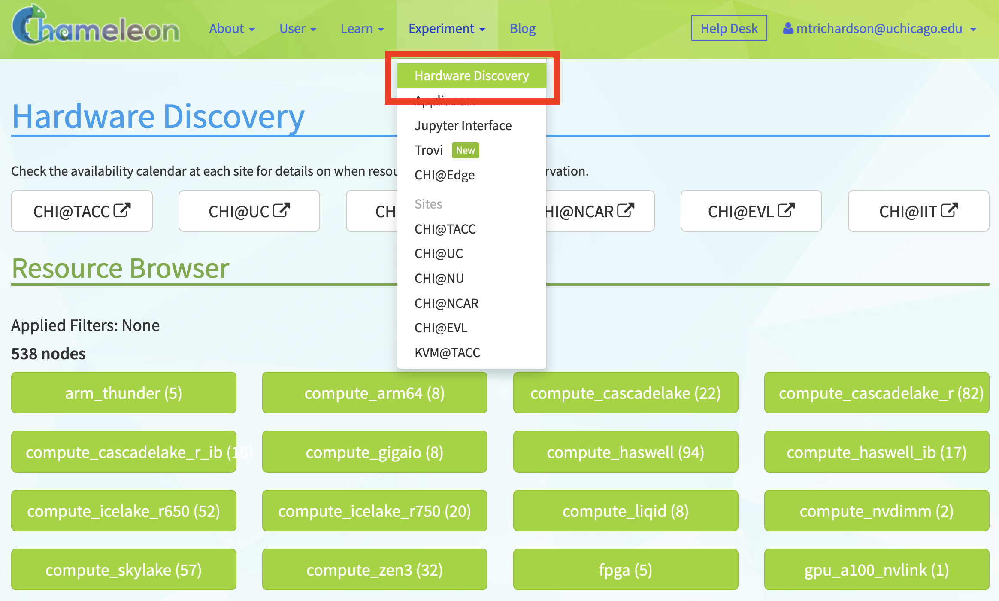
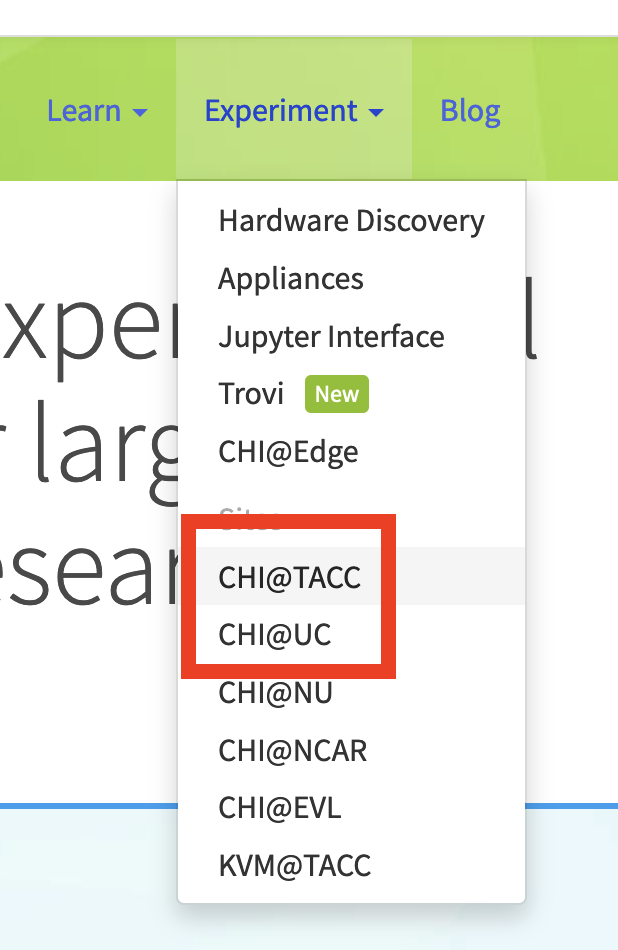
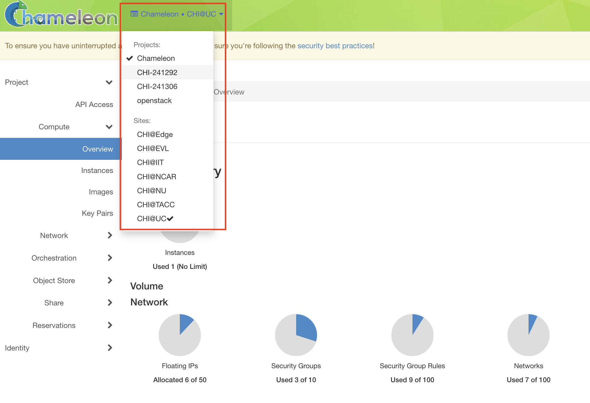
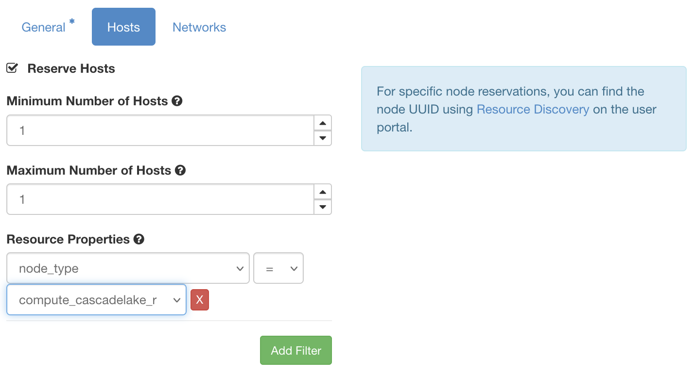
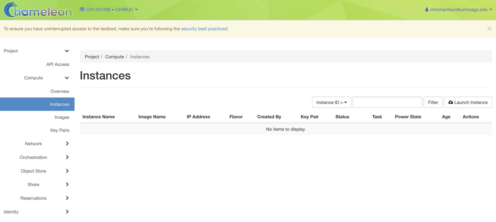
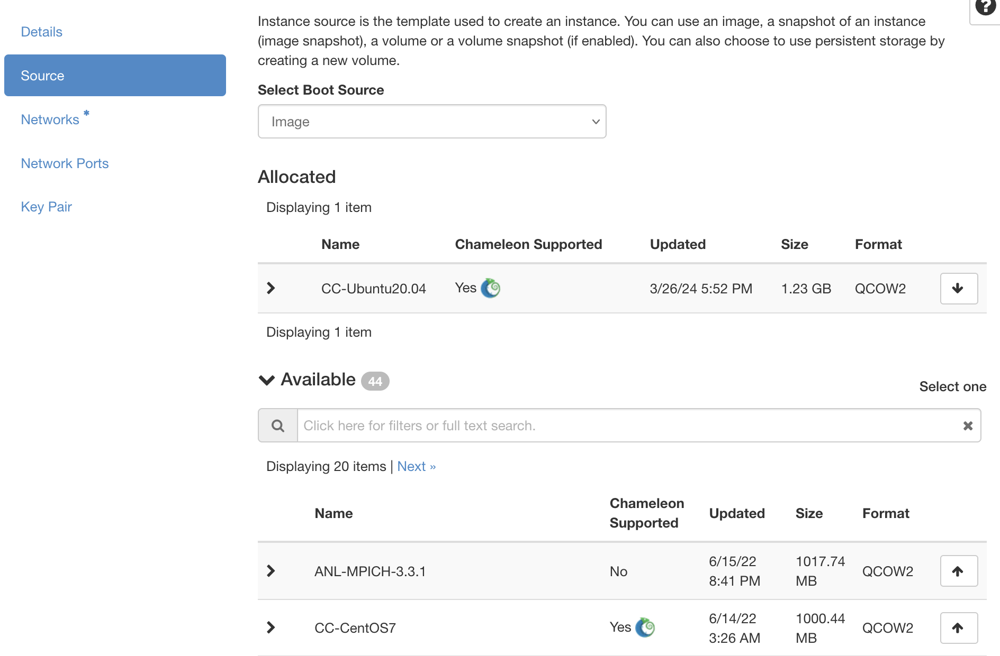
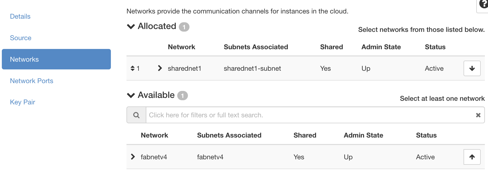
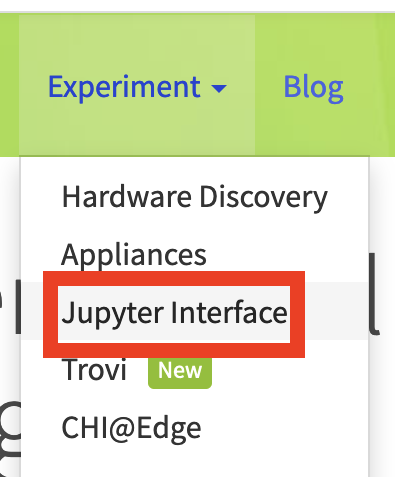
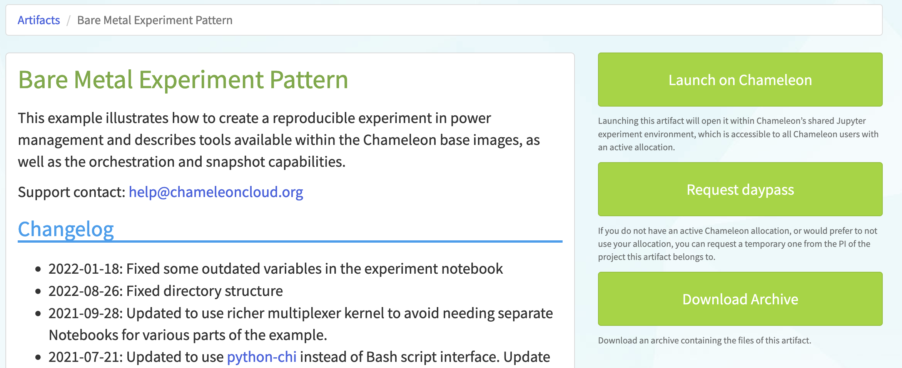
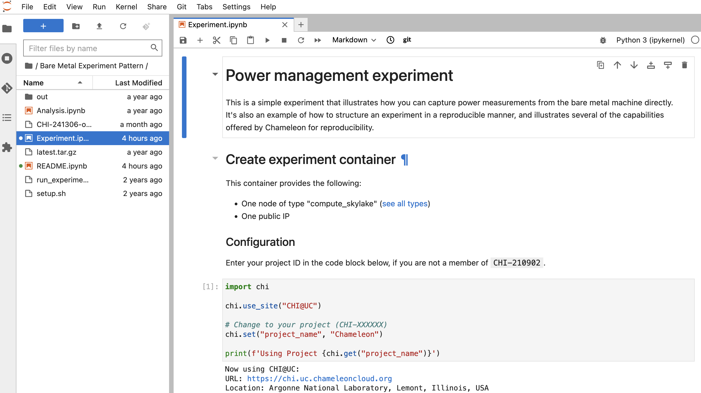

.. _`service hours`: https://chameleoncloud.org/learn/frequently-asked-questions/#toc-what-are-the-units-of-an-allocation-and-how-am-i-charged-

.. _`Hardware Discovery Catalog`: https://chameleoncloud.org/hardware/

.. _globus: https://www.globus.org/

.. _Chameleon: https://chameleoncloud.org/

.. _InCommon: https://incommon.org/federation

.. _`User Dashboard`: https://chameleoncloud.org/user/dashboard/

.. _`Projects Dashboard`: https://chameleoncloud.org/user/projects/

.. _python-chi: https://python-chi.readthedocs.io/en/latest/

.. _`GPU v100`: https://chameleoncloud.org/hardware/node/sites/uc/clusters/chameleon/nodes/24401231-4587-4377-a5ff-cc8b51ab99ac/

.. _`Bare Metal Experiment Pattern`: https://chameleoncloud.org/experiment/share/370ce99a-3e03-43e9-83e3-b61fd9692dc0

.. _`Appliances Catalog`: https://chameleoncloud.org/appliances/

.. _getting-started:

================
Getting Started
================

**Welcome to the Chameleon testbed! We're excited your here.**

Get a head start on leveraging the power of Chameleon for your research
projects by following our guide below.

At the end of this tutorial, you will have learned how to:

- Create a free user account on Chameleon and link it with your own
  institution Single Sign-On (SSO) through the Globus_ Auth service.
- Apply for a project on Chameleon_ and add users to projects.
- Use Chameleon's `Hardware Discovery Catalog`_ and the :ref:`Host Calendars
  <the-lease-calendars>` to search for available hardware that meets your
  research needs.
- Reserve Chameleon resources using leases.
- Configure, launch, and connect to an instance running on a bare metal server.

Let's get started!

.. note::
   If you already have a Chameleon account and project, you can skip the pre-reqs 
   to :ref:`this section below <start-using-chameleon>`.

.. contents:: :local:

.. _getting-started-user:

Pre-Req: Creating a Chameleon Account
=====================================

Before you can use Chameleon, you need to create a free **user account**. 

Creating an account is easy! Simply go to the Chameleon_ home page and click 
**"Log In"** at the top right corner. You'll be redirected to our authentication 
page where you can sign up using your institution credentials, Google account, 
or other federated identity options.

.. image:: ../_static/imgs/getting_started/chameleon-login.png

**We recommend using federated login** (sign in via your institution) as it's the 
fastest way to get started and helps with PI eligibility verification if you plan 
to create projects later.

.. note::
   **Need detailed login help?** See our comprehensive :doc:`federated authentication guide <../user/federation>` 
   for step-by-step instructions, authentication options, and troubleshooting tips.

Once you log in, you can :ref:`edit your Chameleon profile <profile-page>` and 
participate in our community. However, to actually use the testbed you'll first 
need to **join or create a project**. Let's learn how!

.. _getting-started-project:

Pre-Req: Create or Join a Project
=================================

To use Chameleon resources, you need to be a member of an active **project**. Projects are 
workspaces that provide compute allocations and manage team access to testbed resources.

There are two ways to get project access:

**Option 1: Create a New Project** (if you're eligible to be a PI)
  - Requires PI eligibility status on Chameleon
  - See our :doc:`PI eligibility guide <../user/pi_eligibility>` for requirements
  - Graduate students typically need their advisor to create the project

**Option 2: Join an Existing Project** (most common for new users)  
  - Ask a current project member to add you
  - Provide your Chameleon username (found in your `profile <https://www.chameleoncloud.org/user/profile/>`_)

.. note::
   **New to projects?** Read our comprehensive :doc:`project management guide <../user/project>` 
   for details on project concepts, user roles, allocations, and management.

.. _start-using-chameleon:

Start Using Chameleon Hardware
===============================

Congratulations, you are now ready to launch your first instance! Instances are
much like what you may expect to find in a virtual machine, except here the
instances are on bare metal nodes - the core feature of Chameleon 😎. A bare
metal node is a whole physical server to which you, and you alone, have
exclusive root access.

.. note::

   Chameleon also offers a multi-tenant, virtualized cloud, with fewer
   functionalities and a smaller scale. See :ref:`kvm` for more details.

Below, we will walk through the steps on how to launch a bare metal instance using the
graphical user interface (GUI) or web application on the Chameleon_ portal.

See the :ref:`final section <remix>` to complete the same steps using Jupyter
and python-chi_, Chameleon's Python library with custom utilities to help with
experiment orchestration.

Warm Up: Pick Your Hardware
---------------------------

Chameleon resources are available at multiple sites, e.g., |CHI@TACC| and
|CHI@UC|. Check out our `Hardware Discovery Catalog`_, where you can search and
filter for hardware across all Chameleon sites based on multiple criteria,
including memory, thread count, CPUs, GPUs, and more. This catalog is the best
place to start your hardware discovery.

.. important::
   Chameleon resources are available *per site*, which means that you **must**
   use a specific site to access certain hardware.

   Chameleon Infrastructure (CHI) is offered at the following main sites:

   - **Texas Advanced Computing Center (TACC)**: Austin, TX - ``CHI@TACC``
   - **University of Chicago (UC)**: Chicago, IL - ``CHI@UC``
   
   For example, if you want to use a `GPU v100`_ node, you must use the |CHI@UC| 
   site, which is the only site where the node is available. Some hardware is 
   available at multiple sites, but it is always a good idea to check where 
   your preferred hardware is located to save yourself some confusion or 
   trouble later down the line.

In this getting started demo, we will work with the ``Compute Cascadelake R``
nodes (see, e.g. `here
<https://www.chameleoncloud.org/hardware/node/sites/tacc/clusters/chameleon/nodes/05e4d546-6c73-4d66-8b83-3fad392d149a/>`_)
available through both the |CHI@UC| and |CHI@TACC| sites. These nodes are
plentiful on the platform and tend to be available on demand (which is
convenient for a demo!). However, bear in mind that you can follow this same
guide to reserve any hardware on Chameleon.

Once we have found the hardware we want to use and the site where it is
located, we are now ready to make our first reservation!

My First Reservation: Reseving a Node
-------------------------------------

On Chameleon, as opposed to other testbeds or commerical clouds, you must
reserve your resources before you can launch an instance on them. Chameleon
supports both *on-demand* and *advanced* reservations. We will use an on-demand
reservation for this guide, but note that you can reserve resources in advance,
which is often necessary to get access to popular, scarce hardware like GPUs.

Step 1: Access a Testbed Site
~~~~~~~~~~~~~~~~~~~~~~~~~~~~~

As mentioned above, different Chameleon sites have different hardware. To log
in to a Chameleon site from the main Chameleon_ portal page, click on the
"Experiment" tab on the nav bar at the top. From the dropdown, select a
Chameleon site. We will be working with nodes available in either |CHI@UC|
or |CHI@TACC|, so you can select one of those.

   Select a site to use.

When you access one of the sites, you are first taken to a site dashboard,
which shows a summary of your project's current resource usage. The dashboard
looks something like this:

.. figure:: dashboard.png
   :alt: The Chameleon Dashboard's resource usage summary
   :figclass: screenshot

   An overview of your project's current resource usage

Once on your dashboard on the site, notice that the URL has changed to a
specific domain for the testbed site we chose. You can also see which site you
are currently on by clicking on the dropdown next to the Chameleon logo at the
top left of the window.

This section tells you which project you are currently using and which site. By
clicking on the dropdown menu, you can change to another Chameleon site or
change to another project.

.. important::
   Projects will only appear as an option in this menu if they have a current
   active allocation of compute resources.

Step 2: Go to the Reservations Dashboard
~~~~~~~~~~~~~~~~~~~~~~~~~~~~~~~~~~~~~~~~

We need to reserve a ``Cascadelake R`` node for our use. From the main page of
our testbed site, we can select the "Reservations" menu item on the side nav
bar and then click "Leases." Doing so will open a new page showing a table of
your lease activity. If you are a first-time user of Chameleon, the table will
be blank. Let's change that now!

Step 3: Creating a New Lease
~~~~~~~~~~~~~~~~~~~~~~~~~~~~

Before we create a lease, it is a good idea to check the :ref:`Host Calendars
<the-lease-calendars>` available on the Leases page to see if another user has
the hardware reserved.

Click the "Host Calendar" button now. You will be taken to a new page with a
Gnatt chart.

Each row in the chart represents a node of the specific "Node Type" specified
at the top of the calendar. You can change this to display the calendar for
different node types.

.. attention::
   "Node Types" available in the filter menu will be restricted by site. You will 
   only see node types available for the specific site that you are currently 
   using.

Our preferred node type is available on demand, so let's navigate back to our
Leases ("Reservations -> Leases") page to create a new lease. Click the "Create
Lease" button in the top right corner of the page.

Clicking this button will then open a web form. Let's go through the web form
step by step.

**General**

   Specify your lease name and duration.

In this section, add a name for your lease (`my-first-lease`). To
create an on-demand lease, we can click next, because the form will
auto-populate with defaults for the duration of the lease (the default is a
one-day lease that starts immediately). If you want to change the duration of
your lease or to make an advanced reservation, you can input the start date and
time, number of days (maximum 7 days), and the end time.

**Hosts**

   Specify the number and type of host.

On the next section, you can specify the hardware that you want to
include in your lease. You must check the box "Reserve Hosts" and fill out the
required fields. We will start with just one node and will set the minimum and
maximum number of hosts to 1. In the Resource Property field, we can use
different attributes of Chameleon resources (such as "node type") to specify
the exact kind of hardware we want to reserve with this lease. We can add
multiple fitlers with different properties, but we only care about the node
type right now.

.. important::
   If you specify resource properties that return more than one node matching the filter that is available for your specified duration, the system will automatically select a node for you. If you want to specify the precise node that you want to use, you will need to refer to the Node ID and use the Resource Property filter to specify that node ID.

**Networks**

   Finally, select your network reservation options.

On the final section of the lease form, you can reserve network
resources. If your research requires setting up an isolated network for a
cluster of nodes, you may want to reserve a network by clicking the "Reserve
Network" box. You will almost certainly want to reserve a Floating IP for your
reservation. Floating IP addresses are used to connect to an instance over the
internet. There is typically no need to reserve more than one per-project for a
given site. If there are no floating IPs available, try taking an ad-hoc IP (no
reservation required)

.. note::
   Floating IPs can also be allocated to your project after creating a lease.
   However, the pool of allocable IPs can occasionally dry up. We encourage users
   to reserve floating IPs when making their hardware reservations, as it ensures
   that you will receive an IP.

**SUBMIT!**

Click "**Create**". Chameleon provides bare metal access to nodes. When you create
a reservation for one or more nodes, only you and other users on your project
will be able to use those nodes for the time specified.

The reservation will start shortly, at which point you can launch an instance
on a bare metal node.

When the lease is created, it will appear on your Leases page with a status of
"PENDING." Once the lease is active, the status will change to "ACTIVE" and you
will then be able to start using the lease. You can click on the lease name to
view more details about your lease.

.. figure:: ../_static/imgs/getting_started/lease-details.png
   :figwidth: 50 %
   :align: left

.. important::

   Do not attempt to stack reservations to circumvent the 7-day lease
   limitation. Your leases may be deleted. Please refer to our `best practices
   <https://www.chameleoncloud.org/learn/frequently-asked-questions/#toc-what-are-the-best-practices-of-chameleon-usage->`_
   if you require a longer reservation.

My First Instance: Launching an Instance
----------------------------------------

Once the lease that you created becomes "ACTIVE," you can launch a bare metal
instance on the node that has been leased to you. In the following steps, we
will walk through how to configure and launch an instance on the reserved
hardware. In the GUI, this process will feel similar to the process we just
followed to create a new lease. You will specify your instance details in a
form and submit it to the system. Chameleon will then automatically configure,
build, and launch your instance.

.. note::
   Building and launching an instance on bare metal (especially when using beefy appliances and images) can take a long time. After creating your instance, you may need to wait for 10 to 20 minutes before the instance will be running.

To create a new instance, follow the steps below:

Step 1: Go to the Instances Dashboard
~~~~~~~~~~~~~~~~~~~~~~~~~~~~~~~~~~~~~

In the sidebar from your site dasboard, click *Compute*, then click *Instances*

Step 2: Create a New Instance
~~~~~~~~~~~~~~~~~~~~~~~~~~~~~

Click on the *Launch Instance* button in the toolbar and the *Launch
Instance* wizard will load.

**Details**

   
   Enter the main details about your instance, including which reservation to use.

Give your instance a descriptive name (`my-first-instance`) and a short
description (optional). You will also need to specify the lease that you
will use for this instance. You can select the reservation that you just
created from the dropdown. We can also specify how many instances we want to
launch. The default is one and we have one node so we'll stick with that.

**Source**

   
   Select your image source.

In the next section, we can configure a source that we will use for our
instance. This can be an image, a snapshotted image, a volume, or some other
appliance. Chameleon staff maintain some images for users (identified with a
Chameleon badge). There are also user-uploaded images and appliances. For
our demo, we'll use the supported `CC-Ubuntu20.04` image. We can see a list
of all available images below on this section. If we scroll down, we can
find the image and click the up arrow icon next to our desired image. This
will tell the system to use them image for the instance source.

**Networks**

   Allocate a network.

On the next section, we can allocate a network to provide communication
channels for instances in the cloud. Chameleon currently offers two
public networks, `sharednet1` and `fabnetv4`. We will use the `sharednet1`, which
is the default network for providing connectivity to a Chameleon instance.
The `fabnetv4 <https://www.chameleoncloud.org/blog/2024/03/18/tips-and-tricks-understanding-the-fabric-layer-3-connection/>`_ network is specifically for accessing the FABRIC testbed
resources from Chameleon sites and from cross-site stitching. Read more
here! We will use the `sharednet1` since we aren't doing any fancy
networking right now.

**Key Pairs**

   Add a key pair to the instance.

As a final step to create our instance, we can set up a key pair. We absolutely
need to add a key pair if we want to remotely access the instance after it is
running.

To add a key pair, we can either add a new one using "Create Key Pair" and
storing the credentials on our local machine, or import an existing key using
the "Import Key Pair". If you have previously uploaded a key pair to Chameleon,
this key pair will appear in the "Available" section below. You can then reuse
that key pair.

Finally, we are ready to click **"Launch Instance"**. Doing so will take us back
to our Instances page, where we should see a new row for the instance that
we just created. We can see most of the important information about our
instance from here. However, we can also click on the instance name (like
with a lease) to view more details.

The detailed page gives you an overview of the instance. There are also other
options to view logs, open a console (once the instance is running), and more.

First Contact: Associating an IP Address & SSH
----------------------------------------------

Your instance may take approximately ten to fifteen minutes to launch depending
on the node type. The launch process includes powering up, loading the
operating system over the network, and booting up for the first time on a rack
located either at the University of Chicago or the Texas Advanced Computing
Center, depending on where you chose to launch your instance. Before you can
access your instance, you need to first assign a floating IP address - an IP
address that is accessible over the public Internet.

Step 1: Associate an IP
~~~~~~~~~~~~~~~~~~~~~~~

To associate an IP address with your instance, follow these steps. Note, it is
best to wait until your instance is running before doing this step to ensure no
issues.

#. Go to the *Floating IP* dashboard by clicking on *Network* and *Floating IPs*
   in the sidebar.

    .. figure:: floating_ip_overview.png
       :alt: The Floating IP dashboard
       :figclass: screenshot

#. If you have a Floating IP not currently associated to an instance, click the
   *Associate* button for the IP. A dialog will load that allows you to assign a
   publicly accessible IP to your instance. Click the *Associate* button in the
   dialog to complete the process of associating the public IP to your instance.

   .. figure:: associate_ip.png
      :alt: The Manage Floating IP Associations dialog
      :figclass: screenshot

      Here you can assign a floating IP address

#. If you didn't already have a Floating IP available, you may allocate one to
   your project by clicking on the *Allocate IP to Project* button along the top
   row in the Floating IP dashboard. A new dialog will open for allocating the
   floating IP.

   .. figure:: associate_pool.png
      :alt: The Allocate Floating IP dialog
      :figclass: screenshot

      This dialog allows you to allocate an IP address from Chameleon's public
      IP pool

   Click the *Allocate IP* button. The Floating IP dashboard will reload and you
   should see your new Floating IP appear in the list. You can now go back to
   step 2.

Step 2: Accessing Your Instance
~~~~~~~~~~~~~~~~~~~~~~~~~~~~~~~

Once your instance has launched with an associated floating IP address, it can
be accessed via SSH using the private key that you added when creating an
instance.

.. note::

   The following instructions assume that you are using a macOS or Linux
   terminal equivalent. You may view our `YouTube video on how to login via SSH
   on Windows <https://youtu.be/MDK5D2ptJiQ>`_.

To log in to your instance with SSH, follow these steps:

#. Open a terminal window and find the path of your identify file. My key is
   named ``chamkey``.

#. Run the command below from your terminal and specify the path to your key
   pair file. You must use the private key to connect. Log in to your Chameleon
   instance via SSH using the ``cc`` user account and your floating IP address.
   If your floating IP address was ``129.114.108.102``, you would use the
   command:

   .. code-block:: bash

      $ ssh -i <path/to/chamkey> cc@<floating.i.p.address>

   .. note::

      Change the IP address in this command to match your instance's floating
      IP address! **New to SSH keys?** Check out this guide `here
      <https://www.sectigo.com/resource-library/what-is-an-ssh-key>`_.

Once you connect successfully, you will then be able to run commands on your
instance.

.. code-block:: bash

   cc@my-first-instance:~$ ls
   openrc
   cc@my-first-instance:~$ lscpu
   Architecture:                       x86_64
   CPU op-mode(s):                     32-bit, 64-bit
   Byte Order:                         Little Endian
   Address sizes:                      46 bits physical, 48 bits virtual
   CPU(s):                             96
   On-line CPU(s) list:                0-95
   Thread(s) per core:                 2
   Core(s) per socket:                 24
   Socket(s):                          2
   NUMA node(s):                       2
   Vendor ID:                          GenuineIntel
   CPU family:                         6
   Model:                              85
   Model name:                         Intel(R) Xeon(R) Gold 6240R CPU @ 2.40GHz
   Stepping:                           7
   CPU MHz:                            1001.056
   CPU max MHz:                        4000.0000
   CPU min MHz:                        1000.0000
   BogoMIPS:                           4800.00
   Virtualization:                     VT-x
   L1d cache:                          1.5 MiB
   L1i cache:                          1.5 MiB
   L2 cache:                           48 MiB
   L3 cache:                           71.5 MiB
   NUMA node0 CPU(s):                  0,2,4,6,8,10,12,14,16,18,20,22,24,26,28,30,32,34,36,38,40,42,44,46,48,50,52,54,56,58,60,62,64,66,68,70,72,74,76,78,80,82,84,86,88,90,92,94
   NUMA node1 CPU(s):                  1,3,5,7,9,11,13,15,17,19,21,23,25,27,29,31,33,35,37,39,41,43,45,47,49,51,53,55,57,59,61,63,65,67,69,71,73,75,77,79,81,83,85,87,89,91,93,95
   Vulnerability Gather data sampling: Mitigation; Microcode
   Vulnerability Itlb multihit:        KVM: Mitigation: Split huge pages
   Vulnerability L1tf:                 Not affected
   Vulnerability Mds:                  Not affected
   Vulnerability Meltdown:             Not affected
   Vulnerability Mmio stale data:      Mitigation; Clear CPU buffers; SMT vulnerable
   Vulnerability Retbleed:             Mitigation; Enhanced IBRS
   Vulnerability Spec store bypass:    Mitigation; Speculative Store Bypass disabled via prctl and seccomp
   Vulnerability Spectre v1:           Mitigation; usercopy/swapgs barriers and __user pointer sanitization
   Vulnerability Spectre v2:           Mitigation; Enhanced IBRS, IBPB conditional, RSB filling, PBRSB-eIBRS SW sequence
   Vulnerability Srbds:                Not affected
   Vulnerability Tsx async abort:      Mitigation; TSX disabled
   Flags:                              fpu vme de pse tsc msr pae mce cx8 apic sep mtrr pge mca cmov pat pse36 clflush dts acpi mmx fxsr sse sse2 ss ht tm pbe syscall nx pdpe1gb rdtscp lm constant_tsc art arch_perfmon pebs bts rep_good nopl xtopology nonstop_tsc cpuid aperfmperf pni pclmulqdq dtes64 monitor ds_cpl vmx s
                                       mx est tm2 ssse3 sdbg fma cx16 xtpr pdcm pcid dca sse4_1 sse4_2 x2apic movbe popcnt tsc_deadline_timer aes xsave avx f16c rdrand lahf_lm abm 3dnowprefetch cpuid_fault epb cat_l3 cdp_l3 invpcid_single intel_ppin ssbd mba ibrs ibpb stibp ibrs_enhanced tpr_shadow vnmi flexpriority ept
                                       vpid ept_ad fsgsbase tsc_adjust bmi1 avx2 smep bmi2 erms invpcid cqm mpx rdt_a avx512f avx512dq rdseed adx smap clflushopt clwb intel_pt avx512cd avx512bw avx512vl xsaveopt xsavec xgetbv1 xsaves cqm_llc cqm_occup_llc cqm_mbm_total cqm_mbm_local dtherm ida arat pln pts pku ospke av
                                       x512_vnni md_clear flush_l1d arch_capabilities

Congratulations! You just created your first Chameleon instance!

.. _remix:

Remix: JupyterHub and ``python-chi``
====================================

We just walked through how to find hardware, reserve resources, and configure
our instances on Chameleon. We did all of this through the web application
interface or GUI that you can access through the Chameleon_ portal. This
interface is a great place to start, as it provides lots of context and helpful
hints to guide you through the core features of Chameleon.

However, you might find the process a bit tedious. Perhaps, you wonder, there
is a way to do all this programatically without needing to touch the web
application. Well, you're in luck! Because Chameleon offers just such an
development environment along with a trusty tool to accommodate!

In this last section of our Getting Started guide, we will briefly touch on how
to do the exact same thing we did above through a Jupyter Notebook connected to
the testbed compute environment.

Jupyter on Chameleon
--------------------

Chameleon is integrated with :ref:`JupyterHub <jupyter>`, so you can launch a
Jupyter server (on KVM) with an environment pre-configured with python-chi_ and
authentication to the testbed. JupyterHub on Chameleon allows you to create
Jupyter Notebooks with your experiment and analysis code, collaborate with
other project members in a common testbed workspace, and share files as Trovi
artifacts with the Chameleon community.

To read more about the Jupyter interface, see :ref:`our docs <jupyter>` on the
interface.

To launch the Jupyter interface on Chameleon, go to the Chameleon_ home page,
click on the "Experiment" tab, and select the "Jupyter Interface" item. This
will launch a new window which will begin loading the Jupyter server. It will
then launch the JupyterHub interface. This interface should be familiar if
you've ever worked with Jupyter tools before. From the launch page, we can
create new notebooks, open consoles, and even open a terminal.

The work that you do in this space is persistent, so if you create a new
notebook and then exit the interface and relaunch it, the notebook will still
appear in your file system.

   
   Jupyter Interface will start a server.

You can also download and import files from Jupyter as well as integrate with
git.

.. figure:: ../_static/imgs/getting_started/trovi-button.png
   :figwidth: 20 %
   :width: 100 %
   :align: left

Trovi
-----

One benefit of having an interface like Jupyter available is that users can use
it to package their project materials, scripts, code, and datasets as artifacts
that others can replicate and extend. So, how does Chameleon facilitate this
sharing?

Chameleon provides the :ref:`Trovi <trovi>` service as a repository to share and access
artifacts from other users on the testbed. Trovi is integrated with the Jupyter
Interface, so you can launch Trovi artfacts directly onto the Jupyter Interface
and start using them. You can also take your Jupyter artfacts and upload them
to Trovi from Jupyter, allowing others to see and use them.

To get to the Trovi repository from the Chameleon_ home page, go to the
"Experiment" tab and click the "Trovi" menu item. Here, you can see all the
public artifacts available on the testbed.

.. image:: ../_static/imgs/getting_started/trovi-main.png

Chameleon offers tutorials and experimental pattern notebooks on Trovi. We'll
use one now to see how we can accomplish the same basic set up on Chameleon
that we achieved in our previous section.

Go to the Trovi repository (after logging in to the site if you aren't
already). The artifact we will use today is called the `Bare Metal Experiment
Pattern`_. You can type "Bare Metal" in the search bar to filter the results.
You can also filter for this artifact by selecting the Chameleon badge icon
(|chameleon badge|) on the side bar to view all of the Chameleon-supported
artifacts. We can also filter by tag, for example the "experiment pattern" tag.

.. note::
   There are additional artifacts to check out that will help you with more
   advanced topics. And the best part about these templates is that we can easily
   reuse the code to start our own artifacts.

To launch the artifact, click on the title. On the next page, you will see the following:

Click on the "**Launch on Chameleon**" button to start Jupyter. This loading page
should look familiar to the loading page when we launched the Jupyter Interface
above.

Once Jupyter has loaded, we will have the artifact directory available in our
workspace. Your directory should include the following files:

.. code-block:: bash

   $ ls
   Analysis.ipynb             Experiment.ipynb   out            run_experiment.sh
   latest.tar.gz      README.ipynb   setup.sh

We can click on the directory and open the ``README.ipynb`` file, which
provides some documentation on this artifact, including approximately how long
it takes to run and any additional requirements.

Let's now open the ``Experiment.ipynb`` file.

Getting Started with ``python-chi``: Bare Metal Experiment Pattern
-----------------------------------

Jupyter Notebook allows developers to mix text (rendered as Markdown) and code
in one file. This mixture of content enhances the experience of running code,
because documentation can be provided to clarify the code blocks that run. We
can see at the start of the notebook a few blocks of text. If we scroll down to
the "Configuration" section, we will see our first block of code. Let's dive
in!

**Setting the Site and Project**

As required when working through the Chameleon GUI, we need to set our active
project and pick a testbed site to use before we can continue. This requires a
Chameleon account and membership to an active project.

Once we have our project and site, we can use python-chi_ to set these parameters.

.. code-block:: python

   import chi

   chi.use_site("CHI@UC")

   # Change to your project (CHI-XXXXXX)
   chi.set("project_name", "Chameleon")

This code imports the python-chi_ module, calls the ``use_site`` method with
the desired site (|CHI@UC|) inputted as a string, and calls the ``set`` method
to update the configuration to use our project code. (Note: this is necessary
so that the system knows which project to reference when creating leases and
launching instances.) Replace ``Chameleon`` with your project code.

**Create a Reservation**

.. note::
   python-chi_ does not currently support hardware discovery, but we are 
   working to fix that soon. Stay tuned!

After we set our site and project code, we can now create a lease. The code
below uses the ``lease`` utility to create a reservation for one floating IP
and one bare metal host with the node type ``compute_cascadelake_r``. Notice
that we are setting the same parameters that we had to include in the form we
used to create a lease on the GUI.

.. code-block:: python

   from chi import lease

   reservations = []
   lease_node_type = "compute_cascadelake_r"

   try:
      print("Creating lease...")
      lease.add_fip_reservation(reservations, count=1)
      lease.add_node_reservation(reservations, node_type=lease_node_type, count=1)

      start_date, end_date = lease.lease_duration(hours=3)

      l = lease.create_lease(
         f"{os.getenv('USER')}-power-management", 
         reservations, 
         start_date=start_date, 
         end_date=end_date
      )

We can use the ``wait_for_active`` method to pause until our lease is active
before running further code cells in the notebook.

.. code-block:: python

   lease_id = l["id"]
   print("Waiting for lease to start ...")
   lease.wait_for_active(lease_id)
   print("Lease is now active!")

**Create an Instance**

We can now configure and launch our instance on the node that we reserved.

.. code-block:: python

   from chi import server

   image = "CC-CentOS8-stream"

   s = server.create_server(
      f"{os.getenv('USER')}-power-management", 
      image_name=image,
      reservation_id=lease.get_node_reservation(lease_id)
   )

   print("Waiting for server to start ...")
   server.wait_for_active(s.id)
   print("Done")

This code uses the ``server`` utility to spin up an instance. We can specify
which image we want to use by referring to it's name (in this case
``CC-CentOS8-stream``). (To see the name of an image, you can look it up in the
`Appliances Catalog`_.) We also need to provide the reservation ID from our
lease, which we can grab using the ``get_node_reservation`` method.

.. note::
   We are *not* specifying a key pair here, because when you use Chameleon through
   the Jupyter Interface, a key pair is automatically generated in the Jupyter
   environment and associated with your Chameleon account. By default, the
   ``create_server`` method will include this key pair in any instance you create
   from the Jupyter Interface and will use it in other methods that allow you to
   SSH to the instance. You can specify a different key pair using the ``key_name
   (str)`` parameter.

**SSHing and Running Scripts on the Instance**

After our server is running (remember, this can take up to 20 minutes in some
cases; now is a good time to take a coffee ☕️ break), we can use the ``ssh``
utility to connect to the instance.

.. code-block:: python

   floating_ip = lease.get_reserved_floating_ips(lease_id)[0]
   server.associate_floating_ip(s.id, floating_ip_address=floating_ip)

   print(f"Waiting for SSH connectivity on {floating_ip} ...")
   timeout = 60*2
   import socket
   import time
   # Repeatedly try to connect via SSH.
   start_time = time.perf_counter()
   while True:
      try:
         with socket.create_connection((floating_ip, 22), timeout=timeout):
               print("Connection successful")
               break
      except OSError as ex:
         time.sleep(10)
         if time.perf_counter() - start_time >= timeout:
               print(f"After {timeout} seconds, could not connect via SSH. Please try again.")

   from chi import ssh

   with ssh.Remote(floating_ip) as conn:
      # Upload the script
      conn.put("setup.sh")
      # Run the script
      conn.run("bash setup.sh")

We have now associated our floating IP and verified our connection to the
instance via the floating IP. We can then use our SSH connection to upload
scripts to set up our experiment, run it, and transfer the results back to our
local environment for processing and analysis. (See the ``Analysis.ipynb``
notebook to see the results of this experiment! Better yet, see if you can
replicate the experiment in this tutorial on a different Node Type.)

Congratulations! You just created your **second** lease and instance on
Chameleon - without ever leaving the comforts of your Jupyter Notebook!

Be sure to `check out our additional tutorials on Trovi
<https://chameleoncloud.org/experiment/share/?filter=tag%3Aexperiment+pattern>`_
to continue your learning!

Conclusion
==========

Thank you so much for completing our quickstart guide! We hope that you found
the guide helpful and producitive as you begin your researching journey on the
testbed. If you have questions for us, :ref:`please see our documentation on seeking
help <help>`. If you have any feedback on this guide or would like to share some
suggestions with us, reach out at contact@chameleoncloud.org.

As mentioned above, check out our `tutorials
<https://chameleoncloud.org/experiment/share/?filter=tag%3Aexperiment+pattern>`_
on Trovi for more experiment patterns that you can use in your research. You
can also find more live tutorials and webinars on our `webinar page
<https://chameleoncloud.org/learn/webinars/>`_.