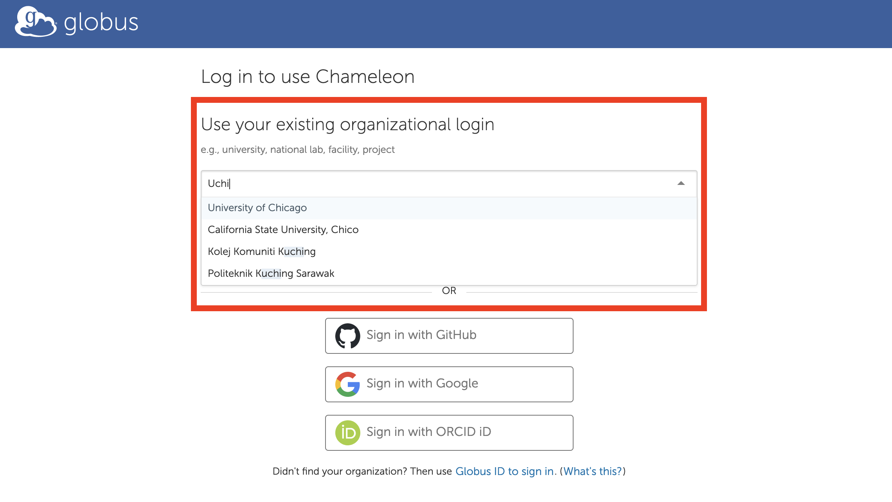
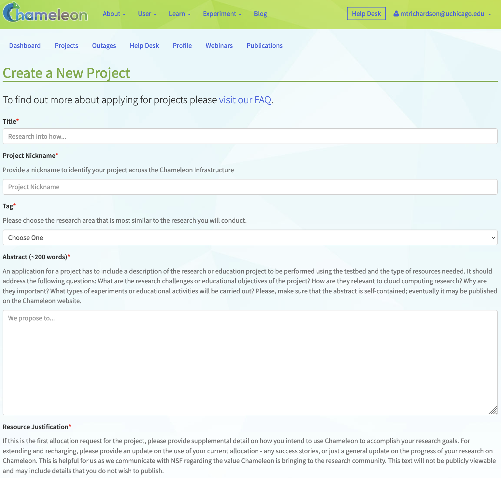
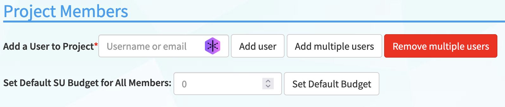

.. _globus: https://www.globus.org/

.. _Chameleon: https://chameleoncloud.org/

.. _InCommon: https://incommon.org/federation

.. _`User Dashboard`: https://chameleoncloud.org/user/dashboard/

.. _`Projects Dashboard`: https://chameleoncloud.org/user/projects/

.. _getting-started:

================
Getting started
================

**Welcome to the Chameleon testbed! We're excited your here.**

To get a quick start on leveraging the power of Chameleon for your research
projects, follow our guide below. At the end of the guide, you will have
learned how to:

- Create a free user account on Chameleon and link it with your own
  institution Single Sign-On (SSO) through the Globus Auth service.
- Apply for a project on Chameleon and add users to projects.
- Use Chameleon's Hardware Discovery Catalog and the Host Calendars to
  search for available hardware that meets your research needs.
- Reserve Chameleon resources with using resource leases.
- Configure, launch, and connect to an instance running on a bare metal server.

Let's get started!

.. note:: If you already have a Chameleon account and project, you can skip to XXX.

.. contents:: :local:

.. _getting-started-user:

Pre-Req: Creating a Chameleon Account
=====================================

Before you can get started using Chameleon, you will need to create a user
account. Don't worry! Creating an account is easy and free. We use Globus, a
platform for secure and reliable data transfer, sharingn, and management across
various stroage systems and computing environments, to enable SSO on Chameleon.

To create an account (and to log in for future sessions), go to the Chameleon_
home page and click on the "Log In" button at the top right corner of the
window.

You will then be redirected to separate authentication page, with an option to
"Sign in via federated login." We recommend using this option to create your
account.

Clicking on the federated login button will then take you to the Globus website
where you can enter your institution details. You will then be prompted to sign
in through your institution as you would normally.

.. warning:: You may not find your institution on Globus. If so, you can still create an account with another identity, such as GitHub, Google, or ORCID iD. However, we encourage users to sign up using their institution, as it helps the Chameleon operators verify user identity, which is an essential step to getting Principal Investigator status on the testbed. More on this below! (:ref:`Read more about logging into Chameleon via federated login <federation>`.)

On your first Chameleon login you will be asked to accept `terms and conditions
<https://auth.chameleoncloud.org/auth/realms/chameleon/terms>`_ of use. Please,
note that as part of those terms and conditions you are requested to acknowledge
Chameleon in publications produced using the testbed. See our FAQ for
information on `how to reference Chameleon in your publications
<https://www.chameleoncloud.org/learn/frequently-asked-questions/#toc-how-should-i-cite-chameleon->`_
and the suggested `acknowledgement text
<https://www.chameleoncloud.org/learn/frequently-asked-questions/#toc-how-should-i-acknowledge-chameleon->`_.

Once you log in, you will be able to :ref:`edit your Chameleon profile
<profile-page>` and participate in our community. However, to actually use the
testbed you will first need to **join or create a project**. Let's learn how!

.. _getting-started-project:

Pre-Req: Create or Join a Project
================================

To get access to Chameleon resources, you will need create or join with a
**project**. Projects are user-created workspaces on Chameleon that allow you
to manage project resources and members, create hardware and network
reservations, and share project outcomes (like publications). All Chameleon
projects have an assigned ID (CHI-XXXXXX), a project leader (what we call a
Principal Investigator (PI) on Chameleon), and an **allocation** of compute
resources. First-time projects are automatically granted six months of compute
(20,000 service hours). Projects can request renewals after the first
allocation to receive more compute.

There are two ways to join a project:

1. Create a new project (requires PI status)
2. Join a new project (requires project invitation from current project member)

**Creating a new project**

To create a new project on Chameleon, you will need to apply for and receive PI
status on Chameleon. To determine if you can obtain PI status, please see a
:ref:`list of PI eligibility criteria <pi-eligibility>`. If you do not meet
these criteria (e.g., students generally do not), you will need to ask your
advisor or other scientist supervising your research to create the project for
you.

You can request PI status by checking a box in `your Chameleon profile
<https://www.chameleoncloud.org/user/profile/>`_. Once on your profile page,
click the "Edit Profile" action. You can then click on the checkbox "Request PI
Eligibility" and save your profile. Chameleon PI status requests are typically
reviewed within one business day.

Once you have PI status, you may apply for a new project with an initial
allocation. Create a new project by going to the `Projects Dashboard`_ and
click the "Create a Project" in the right corner of the window. Complete the
form and click "Create Project." Once your project has been approved, you will
be able to utilize the testbed sites.

Read more about :ref:`creating projects <creating-a-project>` on Chameleon.

**Joining an existing project**

If you want to **join an existing Chameleon project**, you will need to ask the
PI or a manager of the project to add your username. You can find your username
in `your Chameleon profile <https://www.chameleoncloud.org/user/profile/>`_ - it
is also displayed in the top-right corner when you are logged in. You will
receive an email with an invitation link to join the project. Once you have
joined the project, you will then be able to use the compute allocation to make
resource reservations.

Read more about :ref:`user management <manage-users>` on Chameleon.

Step 3: Start using Chameleon!
==============================

Congratulations, you are now ready to launch your first instance! Instances are
much like what you may expect to find in a virtual machine, except here the
instances are on bare metal nodes - the core feature of Chameleon. A bare metal
node is a whole physical server that you have exclusive access to. An instance
is going to be a bare metal node that has been launched with an operating system
image. Follow these steps to make a reservation for a node, launch an instance
and log in to it.

.. note::

   Chameleon also offers a multi-tenant, virtualized cloud, with fewer
   functionalities and a smaller scale. See :ref:`kvm` for more details.

The Chameleon dashboard
-----------------------

Chameleon resources are available at multiple sites, e.g., |CHI@TACC| and
|CHI@UC|. When you access one of the sites, you are first taken to a dashboard,
which shows a summary of your project's current resource usage and get quick
access to each of the sites. The dashboard looks something like this:

.. figure:: dashboard.png
   :alt: The Chameleon Dashboard's resource usage summary
   :figclass: screenshot

   An overview of your project's current resource usage

Reserving a node
----------------

First, we need to reserve a node for our use. Chameleon provides bare metal
access to nodes. When you create a reservation for one or more nodes, only you
and other users on your project will be able to use those nodes for the time
specified. We will create a single day reservation for a compute node, which are
the most common types of nodes available on Chameleon.

#. In the sidebar, click *Reservations*, then click *Leases*
#. Click on the *+ Create Lease* button in the toolbar
#. Type *my_first_lease* for the lease name
#. Find the *Resource Properties* section. In the dropdown below *node_type*, select *compute_skylake*
#. Click the *Create* button

.. figure:: create_lease.png
  :alt: The Create Lease dialog
  :figclass: screenshot

  The Create Lease dialog - be sure to select compute_skylake in the dropdown below node_type

The reservation will start shortly, at which point you can launch an instance on
a bare metal node.

.. note::

   You have created an "on demand" reservation. When you do not specify a start
   date or time in the future, the reservation will start as soon as possible
   and will last one day.

.. important::

   Do not attempt to stack reservations to circumvent the 7-day lease
   limitation. Your leases may be deleted. Please refer to our `best practices
   <https://www.chameleoncloud.org/learn/frequently-asked-questions/#toc-what-are-the-best-practices-of-chameleon-usage->`_
   if you require a longer reservation.

Launching an instance
---------------------

Once the reservation starts, you can launch a bare metal instance on the node
that has been leased to you.

#. In the sidebar, click *Compute*, then click *Instances*

#. Click on the *Launch Instance* button in the toolbar and the *Launch
   Instance* wizard will load

#. Type *my_first_instance* for the instance name and select your
   *my_first_lease* reservation

   .. figure:: launch_details.png
      :alt: Launch details
      :figclass: screenshot

      Enter an instance name and select your reservation

#. Click *Source* in sidebar. Then, find *CC-CentOS8* in the image list and
   click the *Up* arrow to select it.

   .. figure:: launch_source.png
      :alt: Selecting an image
      :figclass: screenshot

      Select the CC-CentOS8 image

#. Click *Keypair* in sidebar. Click the *+ Create Key Pair* button and enter
   ``mychameleonkey`` for the key name. This will automatically start a download
   for a file named ``mychameleonkey.pem``. This is your private key pair that
   you will use to access your instance.

   .. figure:: launch_keypair.png
      :alt: Create a keypair to secure your instance
      :figclass: screenshot

      You can create or import a public/private keypair for accessing your
      instance.

#. Click the *Launch Instance* button.

Congratulations, you have launched an instance on a bare metal node!

.. _associating-an_ip:

Associating an IP address
-------------------------

Your instance may take approximately ten minutes to launch. The launch process
includes powering up, loading the operating system over the network, and booting
up for the first time on a rack located either at the University of Chicago or
the Texas Advanced Computing Center, depending on where you chose to launch your
instance. Before you can access your instance, you need to first assign a
floating IP address - an IP address that is accessible over the public Internet.

#. Go to the *Floating IP* dashboard by clicking on *Network* and *Floating IPs*
   in the sidebar.

    .. figure:: floating_ip_overview.png
       :alt: The Floating IP dashboard
       :figclass: screenshot

#. If you have a Floating IP not currently associated to an instance, click the
   *Associate* button for the IP. A dialog will load that allows you to assign a
   publicly accessible IP to your instance. Click the *Associate* button in the
   dialog to complete the process of associating the public IP to your instance.

   .. figure:: associate_ip.png
      :alt: The Manage Floating IP Associations dialog
      :figclass: screenshot

      Here you can assign a floating IP address

#. If you didn't already have a Floating IP available, you may allocate one to
   your project by clicking on the *Allocate IP to Project* button along the top
   row in the Floating IP dashboard. A new dialog will open for allocating the
   floating IP.

   .. figure:: associate_pool.png
      :alt: The Allocate Floating IP dialog
      :figclass: screenshot

      This dialog allows you to allocate an IP address from Chameleon's public
      IP pool

   Click the *Allocate IP* button. The Floating IP dashboard will reload and you
   should see your new Floating IP appear in the list. You can now go back to
   step 2.

Accessing Your Instance
-----------------------

Once your instance has launched with an associated floating IP address, it can
be accessed via SSH using the private key that you downloaded during the
`Launching an Instance`_ step.

.. note::

   The following instructions assume that you are using a macOS or Linux
   terminal equivalent. You may view our `YouTube video on how to login via SSH
   on Windows <https://youtu.be/MDK5D2ptJiQ>`_.

To log in to your instance, follow these steps:

#. Open a terminal window and navigate to where you downloaded the
   ``mychameleonkey.pem`` file. Change the permissions on the file to user
   read/write only:

   .. code-block:: bash

      chmod 600 mychameleonkey.pem

#. Add the key to your current SSH identity:

   .. code-block:: bash

      ssh-add mychameleonkey.pem

#. Log in to your Chameleon instance via SSH using the ``cc`` user account and
   your floating IP address. If your floating IP address was
   ``129.114.108.102``, you would use the command:

   .. code-block:: bash

      ssh cc@129.114.108.102

   .. note::

      Change the IP address in this command to match your instance's floating IP
      address!
