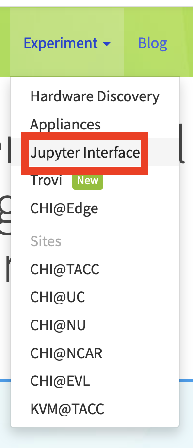
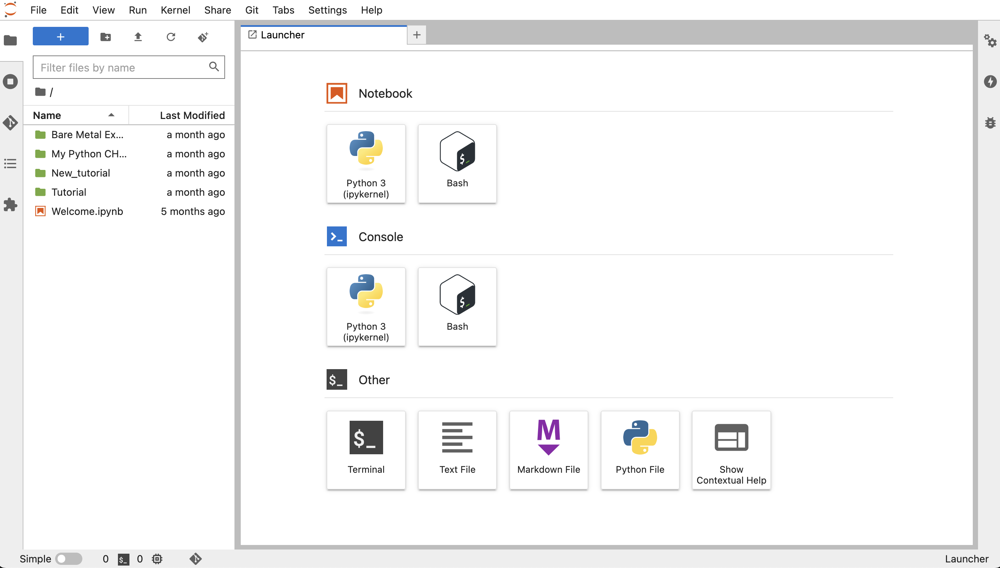
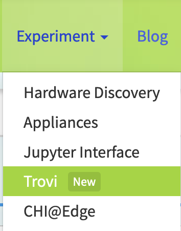
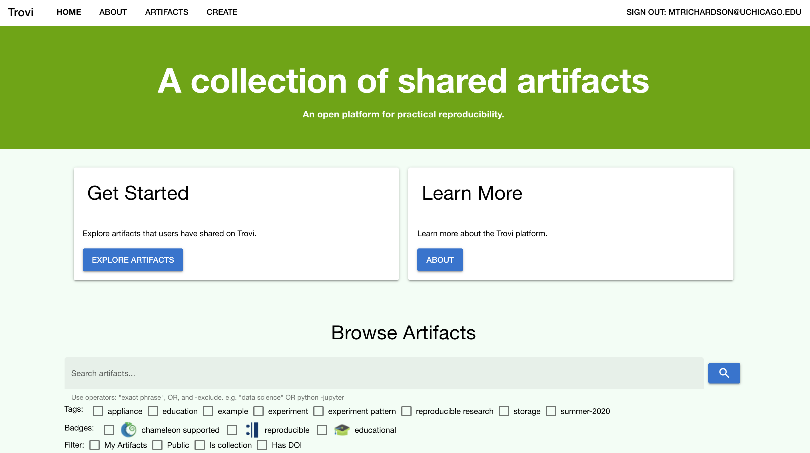
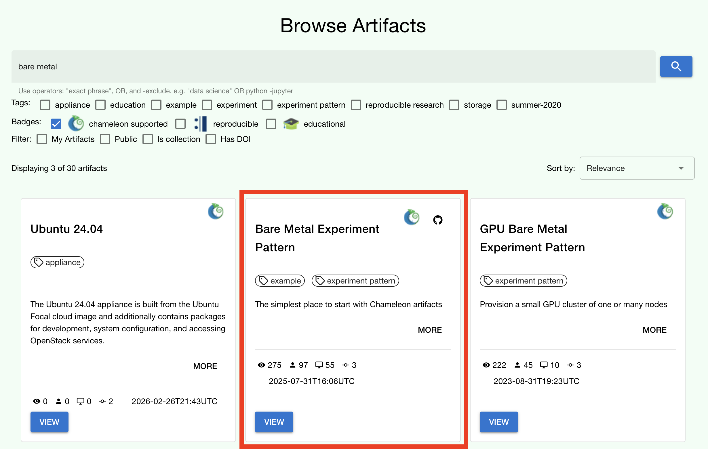
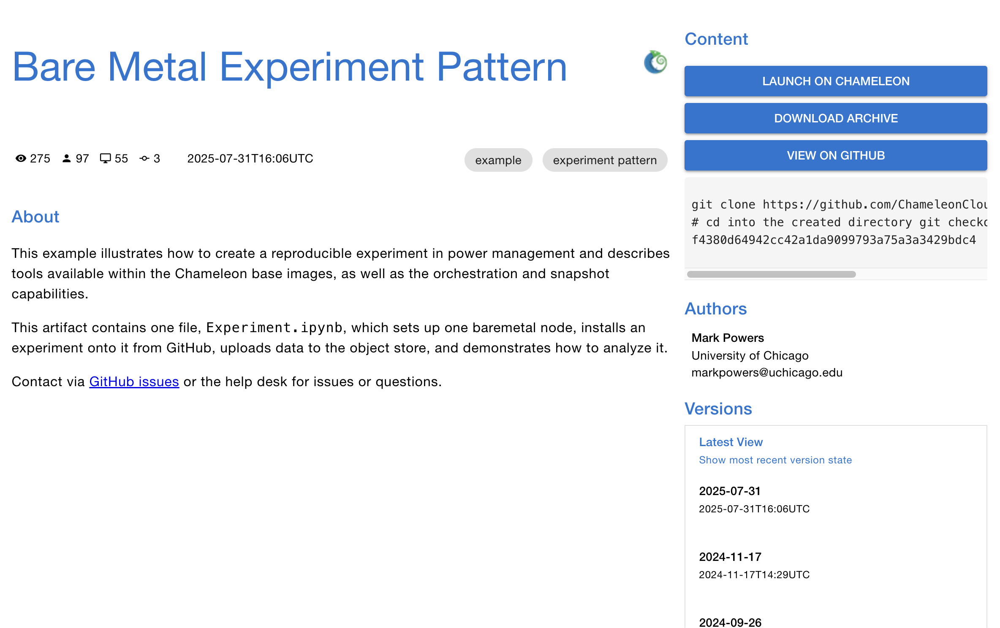
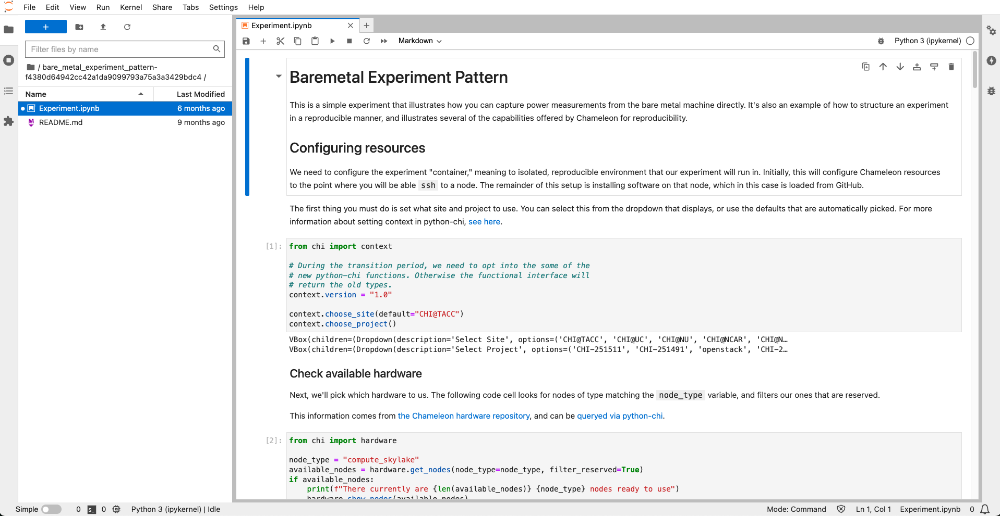

.. _python-chi: https://python-chi.readthedocs.io/en/latest/

.. _Chameleon: https://chameleoncloud.org/

.. _`Hardware Discovery`: https://chameleoncloud.org/hardware/

.. _`Bare Metal Experiment Pattern`: https://trovi.chameleoncloud.org/dashboard/artifacts/50692573-4094-466c-b4fe-0ed3471f8993

.. _`Appliances Catalog`: https://trovi.chameleoncloud.org/dashboard/artifacts?tags=appliance

.. _`chi.context module`: https://python-chi.readthedocs.io/en/latest/modules/context.html

.. _`chi.hardware module`: https://python-chi.readthedocs.io/en/latest/modules/hardware.html

.. _`chi.lease module`: https://python-chi.readthedocs.io/en/latest/modules/lease.html

.. _`chi.server module`: https://python-chi.readthedocs.io/en/latest/modules/server.html

.. _`python-chi 1.0 blog post`: https://blog.chameleoncloud.org/posts/packaging-your-experiments-on-chameleon-with-python-chi-1-0

.. _`Trovi tips blog post`: https://blog.chameleoncloud.org/posts/from-github-to-publication-using-trovi-effectively/

.. _remix:

=============================================
Next Steps: JupyterHub and ``python-chi``
=============================================

In the :doc:`getting started guide <index>`, we walked through how to find
hardware, reserve resources, and launch an instance using the Chameleon web
interface. In this guide, we'll accomplish the same thing programmatically
using a Jupyter Notebook connected to the testbed.

Jupyter on Chameleon
--------------------

Chameleon is integrated with :ref:`JupyterHub <jupyter>`, so you can launch a
Jupyter server (on KVM) with an environment pre-configured with python-chi_ and
authentication to the testbed. JupyterHub on Chameleon allows you to create
Jupyter Notebooks with your experiment and analysis code, collaborate with
other project members in a common testbed workspace, and share files as Trovi
artifacts with the Chameleon community.

To read more about the Jupyter interface, see :ref:`our docs <jupyter>` on the
interface.

To launch the Jupyter interface on Chameleon, go to the Chameleon_ home page,
click on the "Experiment" tab, and select the "Jupyter Interface" item. This
will launch a new window which will begin loading the Jupyter server. It will
then launch the JupyterHub interface. This interface should be familiar if
you've ever worked with Jupyter tools before. From the launch page, we can
create new notebooks, open consoles, and even open a terminal.

The work that you do in this space is persistent, so if you create a new
notebook and then exit the interface and relaunch it, the notebook will still
appear in your file system.

   Jupyter Interface will start a server.

You can also download and import files from Jupyter as well as integrate with
git.

Trovi
-----

One benefit of having an interface like Jupyter available is that users can use
it to package their project materials, scripts, code, and datasets as artifacts
that others can replicate and extend. So, how does Chameleon facilitate this
sharing?

Chameleon provides the :ref:`Trovi <trovi>` service as a repository to share and access
artifacts from other users on the testbed. Trovi is integrated with the Jupyter
Interface, so you can launch Trovi artifacts directly onto the Jupyter Interface
and start using them. You can also take your Jupyter artifacts and upload them
to Trovi from Jupyter, allowing others to see and use them.

To get to the Trovi repository from the Chameleon_ home page, go to the
"Experiment" tab and click the "Trovi" menu item. Here, you can see all the
public artifacts available on the testbed.

.. TODO: Update the prose above and below to match the new Trovi dashboard UI
   (launched September 2025). The redesign includes improved search and filtering,
   a new layout, and an "Import" button for GitHub repositories. Verify that the
   navigation path ("Experiment" tab → "Trovi") is still accurate.

.. TODO: Replace trovi-main.png with a screenshot of the new Trovi dashboard.

Chameleon offers tutorials and experimental pattern notebooks on Trovi (see
collection `here
<https://trovi.chameleoncloud.org/dashboard/artifacts?badges=chameleon+supported&tags=experiment+pattern>`_).
We'll use one now to see how we can accomplish the same basic set up on
Chameleon that we achieved in our previous section.

Go to the Trovi repository (after logging in to the site if you aren't
already). The artifact we will use today is called the `Bare Metal Experiment
Pattern`_. You can type "Bare Metal" in the search bar to filter the results.
You can also filter for this artifact by selecting the Chameleon badge icon
(|chameleon badge|) on the side bar to view all of the Chameleon-supported
artifacts. We can also filter by tag, for example the "experiment pattern" tag.

.. tip::
   Want to publish your own experiment on Trovi or import an existing GitHub
   repository? See our `Trovi tips blog post`_ for a **step-by-step walkthrough of
   the full artifact lifecycle, from packaging to publication**.
   
   Be sure to **check out our additional templates** `with more advanced topics on Trovi
   <https://trovi.chameleoncloud.org/dashboard/artifacts?tags=experiment+pattern>`_.
   The best part about these templates is that you can easily reuse the code
   to start writing your own artifacts.
   
To launch the artifact, click on the title. On the next page, you will see the following:

.. TODO: Replace bare-metal-pattern.png with a screenshot of the artifact detail
   page in the new Trovi dashboard. Verify that the "Launch on Chameleon" button
   name and placement are still accurate.

Click on the "**Launch on Chameleon**" button to start Jupyter. This loading page
should look familiar to the loading page when we launched the Jupyter Interface
above.

Once Jupyter has loaded, we will have the artifact directory available in our
workspace. Your directory should include the following files:

.. code-block:: bash

   $ ls
   README.md             Experiment.ipynb            scrips

We can click on the directory and open the ``README.md`` file, which
provides some documentation on this artifact, including approximately how long
it takes to run and any additional requirements.

Let's now open the ``Experiment.ipynb`` file.

Getting Started with ``python-chi``: Bare Metal Experiment Pattern
------------------------------------------------------------------

Jupyter Notebook allows developers to mix text (rendered as Markdown) and code
in one file. This mixture of content enhances the experience of running code,
because documentation can be provided to clarify the code blocks that run. We
can see at the start of the notebook a few blocks of text. If we scroll down to
the "Configuration" section, we will see our first block of code. Let's dive
in!

**Setting the Site and Project**

As required when working through the Chameleon GUI, we need to set our active
project and pick a testbed site to use before we can continue. This requires a
Chameleon account and membership to an active project.

Once we have our project and site, we can use python-chi_ to set these
parameters via the ``chi.context`` module.

.. code-block:: python

   import chi

   chi.use_site("CHI@UC")
   chi.use_project("CHI-XXXXXX")  # Replace with your project name

This code imports the python-chi_ module, calls ``use_site`` to target a
Chameleon site, and ``use_project`` to set the active project. All subsequent
API calls — leases, instances, networks — will be sent to that site and billed
to that project. You can call these again at any point to switch context.

.. tip::
   In a Jupyter Notebook, you can use ``chi.context.choose_site()`` and
   ``chi.context.choose_project()`` for interactive dropdown menus instead
   of hard-coding the values. See the `chi.context module`_ docs for the
   full API, and our `python-chi 1.0 blog post`_ for a walkthrough of all
   the new Jupyter widget features introduced in that release.

**Discover Hardware**

python-chi_ now supports hardware discovery via the ``chi.hardware`` module,
mirroring what you can do on the `Hardware Discovery`_ web page. This is
useful for finding available nodes and checking when specific hardware is free
before committing to a reservation.

.. code-block:: python

   from chi import hardware

   # Display an interactive, filterable table of all nodes at the current site
   hardware.show_nodes()

   # Or filter programmatically — e.g. only GPU nodes with at least 32 CPUs
   nodes = hardware.get_nodes(gpu=True, min_number_cpu=32)

To check when a specific node is next available, use ``next_free_timeslot``:

.. code-block:: python

   node = hardware.get_nodes(node_type="compute_cascadelake_r")[0]
   start, end = node.next_free_timeslot(minimum_hours=3)
   print(f"Next free slot: {start} → {end}")

See the `chi.hardware module`_ docs for the full list of filter options and
methods available on ``Node`` objects.

**Create a Reservation**

After we set our site and project code, we can now create a lease. The code
below uses the ``Lease`` class to create a reservation for one floating IP
and one bare metal host with the node type ``compute_cascadelake_r``. Notice
that we are setting the same parameters that we had to include in the form we
used to create a lease on the GUI.

.. code-block:: python

   import os
   from chi import lease
   from datetime import timedelta

   l = lease.Lease(
      name=f"{os.getenv('USER')}-power-management",
      duration=timedelta(hours=3)
   )
   l.add_node_reservation(node_type="compute_cascadelake_r", amount=1)
   l.add_fip_reservation(amount=1)
   l.submit(wait_for_active=True)

See the `chi.lease module`_ docs for advanced options, including network
reservations, KVM flavor reservations, and setting explicit start/end times
for advanced scheduling.

**Create an Instance**

We can now configure and launch our instance on the node that we reserved.

.. code-block:: python

   from chi import server

   s = server.Server(
      name=f"{os.getenv('USER')}-power-management",
      reservation_id=l.node_reservations[0]["id"],
      image_name="CC-Ubuntu24.04"
   )
   s.submit(wait_for_active=True)

This code uses the ``Server`` class to spin up an instance. We can specify
which image we want to use by referring to its name (in this case
``CC-Ubuntu24.04``). (To see the name of an image, you can look it up in the
`Appliances Catalog`_ on Trovi by filtering for the **appliance** tag.) We
also need to provide the reservation ID from our lease, which we can access
from the lease's ``node_reservations`` list. See the `chi.server module`_ docs
for the full ``Server`` class API, including ``flavor_name``, ``network_name``,
and ``keypair`` parameters.

.. note::
   We are *not* specifying a key pair here, because when you use Chameleon through
   the Jupyter Interface, a key pair is automatically generated in the Jupyter
   environment and associated with your Chameleon account. By default, the
   ``Server`` class will include this key pair in any instance you create
   from the Jupyter Interface and will use it in other methods that allow you to
   SSH to the instance. You can specify a different key pair using the ``key_name``
   parameter.

**Connecting to and Running Scripts on the Instance**

After our server is running (remember, this can take up to 20 minutes in some
cases; now is a good time to take a coffee break), we will association our
instance with the reserved floating IP and then check our connectivity to the
node based using the Server class ``check_connectivity`` method.

.. code-block:: python

   floating_ip = l.get_reserved_floating_ips()[0]
   s.associate_floating_ip(floating_ip)
   s.check_connectivity(host=floating_ip)

We have now associated our floating IP and verified our connection to the
instance via the floating IP. We can then use ``execute`` method to upload
scripts to our instance for setting up our experiment, running it, and storing
the results in Chameleon `object storage <#>`_.

.. code-block:: python

   # Clone git repo with experiment source code
   my_server.execute("git clone https://github.com/ChameleonCloud/bare_metal_experiment_pattern")

   # Run setup script
   my_server.execute("bash bare_metal_experiment_pattern/scripts/setup.sh")
   # Run experiment script for N iterations
   iterations = 1
   for i in range(iterations):
      my_server.execute("bash bare_metal_experiment_pattern/scripts/run_experiment.sh 10")

From this point, the remaining code blocks in this notebook will download the
data locally from object storage and then plot figures using the experiment
data. As an exercise, try to see if you can replicate the experiment in this
tutorial on a different node type like a ``skylake`` or one of our many nodes
with a GPU!

----

Congratulations! You just created your first lease and instance on Chameleon
without ever leaving the comforts of your Jupyter Notebook!

Be sure to `check out our additional tutorials on Trovi
<https://trovi.chameleoncloud.org/dashboard/artifacts?tags=experiment+pattern>`_
to continue your learning!
