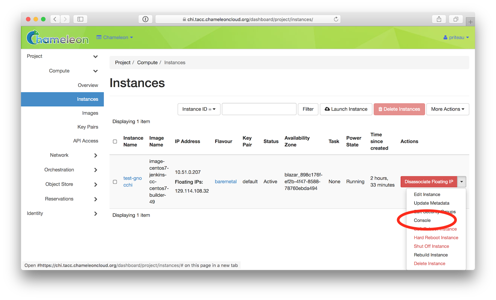
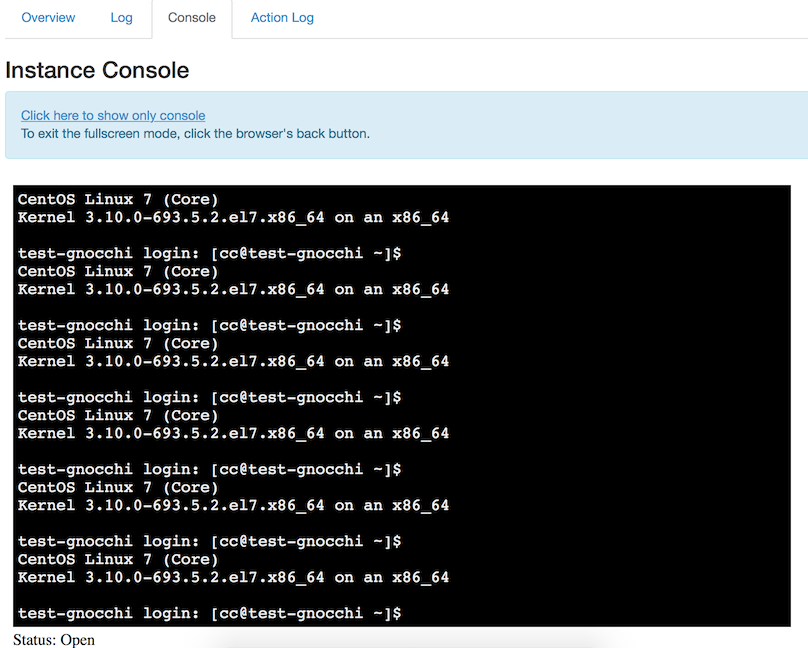

Interacting with instances
==========================

Once your bare metal instance has launched, you may interact with it by using
SSH if you have associated a *Floating IP* to it or by using the *Serial
Console* from the GUI.

.. _connecting-via-ssh:

Connecting via SSH
------------------

If you have associated a *Floating IP* with the instance and you have the
private key in place, you should be able to connect to the instance via SSH
using the ``cc`` account.

To access the instance using SSH, type the command in your terminal:

   .. code-block:: bash

      ssh cc@<floating_ip>

.. error::
   If you get errors:

   .. code-block:: shell

      @@@@@@@@@@@@@@@@@@@@@@@@@@@@@@@@@@@@@@@@@@@@@@@@@@@@@@@@@@@
      @    WARNING: REMOTE HOST IDENTIFICATION HAS CHANGED!     @
      @@@@@@@@@@@@@@@@@@@@@@@@@@@@@@@@@@@@@@@@@@@@@@@@@@@@@@@@@@@
      IT IS POSSIBLE THAT SOMEONE IS DOING SOMETHING NASTY!
      ...

   It is likely that you have saved a previous entry for the instance's
   *Floating IP* in your ``~/.ssh/known_hosts`` file on your computer. Simply
   removing the entry from the file should solve the issue.

   You can remove the entry from the ``~/.ssh/known_hosts`` file by using the
   command:

   .. code-block:: shell

      ssh-keygen -R <floating_ip>

You may receive the response below. Type ``yes`` and hit enter:

   .. code::

      The authenticity of host '130.202.88.241 (130.202.88.241)' can't be established.
      RSA key fingerprint is 5b:ca:f0:63:6f:22:c6:96:9f:c0:4a:d8:5e:dd:fd:eb.
      Are you sure you want to continue connecting (yes/no)?

When logged in, your prompt may appear like this:

   .. code::

      [cc@my-first-instance ~]$

.. note::

   If you notice SSH errors such as connection refused, password requests, or
   failures to accept your key, it is likely that the physical node is still
   going through the boot process. In that case, wait before retrying.
   Also make sure that you use the ``cc`` account. If after 10 minutes you still
   cannot connect to the machine, open a ticket with our |Help Desk|.

You can now check whether the resource matches its known description in the
resource registry. For this, simply run:

   .. code-block:: bash

      sudo cc-checks -v

The ``cc-checks`` program prints the result of each check in green if it is
successful and red if it failed. You can now run your experiment directly on the
machine via SSH. You can run commands with root privileges by prefixing them
with ``sudo``. To completely switch user and become root, use the ``sudo su -
root`` command.

.. attention:: ``cc-checks`` is only available on legacy CentOS7 images!

Connecting via serial console
-----------------------------

Chameleon now allows you to connect to the serial console of your bare metal
nodes via the GUI. Once your instance is deployed, click on the *Console* button
in the instance contextual menu.

   The serial console button

This should open a screen showing an interactive serial console (it could take
some time to show up, give it 30 seconds or so).

   An open console

Our latest images are configured to auto-login into the ``cc`` account. Other
images may show you a login prompt. You can set a password on the ``cc`` account
by accessing it via SSH, using the command ``sudo passwd cc``, and then using
this password to connect to the console.