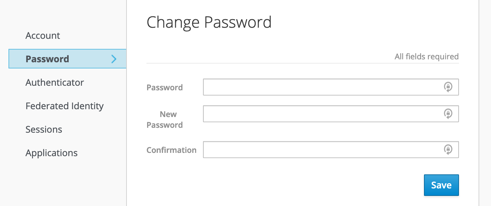
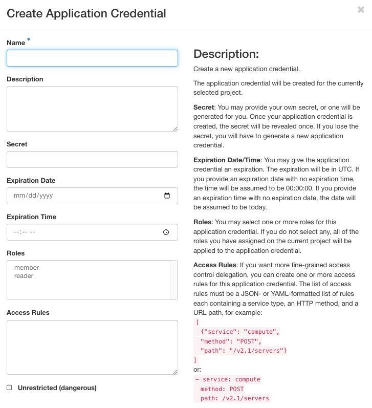

.. _cli:

=============================
Command Line Interface (CLI)
=============================

Introduction
============

The Command Line Interface (CLI) provides a way to interact with Chameleon
resources using shell and scripting tools. Chameleon uses the `OpenStack Client
<https://docs.openstack.org/python-openstackclient/latest/>`_ to provide CLI
functionality. This documentation section provides an overview on how to install
the client and configure your shell environment to access Chameleon features.

.. attention::

   Some of the Chameleon features are **only** accessable via the CLI, such as
   the Gnocchi metrics and the advanced networking features.

.. note::

   Chameleon Cloud is primarily designed to support Unix-like environments.
   Threfore, it is highly recommended using CLI in a Unix-like system. For
   Windows 10 users, you may want to enable `Windows Subsystem for Linux
   <https://docs.microsoft.com/en-us/windows/wsl/install-win10>`_ to get better
   experience with the Chameleon CLI.

.. _cli-installing:

Installing the CLI
==================

Prerequisites
-------------

#. **Python** - Check if you have Python installed.

#. **pip** - If you’re using Python 3.4 (or greater), then pip comes installed
   with Python by default.

OpenStack Client Installation
-----------------------------

#. Install the CLI by typing ``pip install python-openstackclient`` in the
   terminal.

#. Verify that it has installed correctly by typing ``openstack``. You will
   enter the Openstack Client in interactive mode and your prompt should change
   to ``(openstack)``.

#. Exit the client by typing ``exit``.

#. There are some clients with new features or bugfixes not yet in the upstream
   release branches, notably the Blazar CLI client. If you want to make
   reservations via the CLI, you should install that here:

   .. code-block:: shell

      pip install git+https://github.com/chameleoncloud/python-blazarclient@chameleoncloud/xena

.. _cli-authentication:

CLI authentication
==================

When using the CLI, you have to provide some credentials so the system trusts
that the operations are really being executed by your user account. There are
two ways of doing this.

Setting a CLI password
----------------------

You can set a CLI password via the `Chameleon Authentication Portal
<https://auth.chameleoncloud.org/auth/realms/chameleon/account/#/security/signingin>`_. The
password you associate with your account can not be used to log in to the GUI or
Jupyter interfaces and can only be used to authenticate a command-line client.

   Setting a password in the Chameleon Authentication Portal

The benefit of this method is that this password will work on any Chameleon
site.

.. note::

   You should set a strong password for your CLI password, and it should not be
   a password you use elsewhere. Otherwise, your account risks being compromised
   by an attacker who has possibly obtained your password from another breached
   service. We **highly** recommend using a password manager e.g., `BitWarden
   <https://bitwarden.com/>`_, `LastPass
   <https://www.lastpass.com/password-manager>`, or `1Password
   <https://1password.com/>`_ to assist.

.. _cli-application-credential:

Creating an application credential
----------------------------------

You can also generate *application credentials*, which act as dedicated one-off
passwords that are authorized with the same permissions as your user account,
within a single project. If you work on multiple projects simultaneously, you
will need to generate one application credential for each project.

To create an application credential, navigate to the "Identity" dashboard in the
:ref:`gui`, and go to the "Application Credentials" panel. Create a new
application credential and name it something meaningful (such as "CLI access for
project CH-XXX"). **You will also need to check the "unrestricted" checkbox in
order to use the CLI to make leases in Blazar**. If you do not need to make
reservations via the CLI, you can leave the box unchecked, as it is the safer
option.

Once the system generates the credential, you will be given the option to
download an :ref:`RC file <cli-rc-script>` that configures the CLI to use the
application credential for authentication. You will only see the secret
credentials once, so make sure to save the RC file or the secret somewhere, as
if it's lost, you will have to delete the credential and create a new one.

.. _cli-rc-script:

The OpenStack RC Script
=======================

You must use the *OpenStack RC Scripts* to configure the environment variables
for accessing Chameleon features. You can downloaded the script from the
Chameleon GUI at the :ref:`gui-api-access`.

.. hint::
   
   If you use the Chameleon supported (CC) images, you'll find an ``openrc`` 
   file with a service token in the home directory for the ``cc`` user. The file 
   will be auto-sourced when you login, so you can use the 
   :ref:`openstack <using-cli>` and the :ref:`swift <object-store-cli>` CLI 
   directly, as well as the 
   :ref:`cc-snapshot <cc-snapshot-utility>` and the 
   :ref:`cc-cloudfuse <cc-cloudfuse>` tools.

#. Log in to the GUI at |CHI@TACC| or |CHI@UC|.

   .. important::

       Download the RC file from the site you would like to interact with. The
       RC files are different for each site.

#. Select the project you wish to access via :ref:`gui-project-menu`.

   .. figure:: gui/project_dropdown.png
      :alt: The Project Dropdown

      The Project Dropdown

#. Download *OpenStack RC Script* using :ref:`gui-user-menu` by clicking on
   *Openstack RC File v3*.

   .. figure:: cli/userdropdown.png
      :alt: The OpenStack RC File v3 link in the User Dropdown

      The OpenStack RC File v3 link in the User Dropdown

#. Run the following command in the terminal:

   .. code-block:: shell

       source <path/to/openstack_rc_file>

   .. note::

       The command **will not** work for Windows users. Skip this step and the
       next step if you are using Windows system.

#. Enter your password when prompted.

#. For macOS/Linux users, your current terminal session has been configured to
   access your project. Now type ``openstack`` in your terminal session.

   For Windows users, you have to provide the environment variables in the
   *OpenStack RC* script as ``openstack`` command parameters. Run the following
   command in your Windows prompt:

   .. code-block:: shell

       openstack --os-auth-url <OS_AUTH_URL> \
       --os-project-id <OS_PROJECT_ID> \
       --os-project-name <OS_PROJECT_NAME> \
       --os-user-domain-name <OS_USER_DOMAIN_NAME> \
       --os-username <OS_USERNAME> \
       --os-password <OS_PASSWORD> \
       --os-region-name <OS_REGION_NAME> \
       --os-interface <OS_INTERFACE> \
       --os-identity-api-version <OS_IDENTITY_API_VERSION>

   Replace values of the parameters by reading from the *OpenStack RC* script.

   Another way to configure the OpenStack client for Windows users is to
   add/edit environment variables manually via *System Properties* window. Then,
   click on *Environment Variables...* button and manually add/edit the
   environment variables in *OpenStack RC Script*  to *Environment Variable*
   window.

   .. figure:: cli/systemproperties.png
      :alt: System Properties Window of Windows System

      System Properties Window of Windows System

   .. note::

      For macOS/Linux users, every time when open a new terminal, you have to
      run the ``source`` command to access the OpenStack client.

   .. error::

      If you get authentication error, check if you input your password
      correctly.

#. Type ``project list`` at the ``(openstack)`` prompt. You should see a list of
   the projects you belong to.

   .. error::

      If you get permission error at this step, please check that:

      - the terminal session has been configured correctly with the environment
        variables

      - the *OpenStack RC* script you ``source`` is **v3**

      - the OpenStack client version is the latest. To check the OpenStack
        client version, use ``openstack --version`` command. Some older versions
        may cause errors.

   .. error::

      If you get the ``Missing value`` error when using a command, it is likely
      that your terminal session has not been configured correctly and
      completely with the environment variables. The error may be fixed by
      re-running the ``source`` command over the OpenStack RC Script or using
      the command line switches.

.. _using-cli:

Using the CLI
=============

You can use the CLI in either Interactive Mode or Shell Mode. In either mode,
the OpenStack client has to be configured by using the *OpenStack RC Script* or
by providing the command line switches. For more information about the usage of
the OpenStack client, run ``openstack --help``.

Interactive Mode
----------------

The Interactive Mode allows you to use the ``openstack`` commands through an
interactive prompt. To start the Interactive Mode, type ``openstack`` in the
configured terminal. Once entering the Interactive Mode, you will see a
``(openstack)`` prompt. Type the command you would like to run at the prompt. To
find out the commands, type ``help``.

Shell Mode
----------

Each CLI command can be used in your terminal exactly the same way that it
appears in the Interactive Mode, simply by preceding the command with
``openstack``. For example, the command ``image list`` in the Interactive Mode
is equivalent to the command ``openstack image list`` in the Shell Mode.
