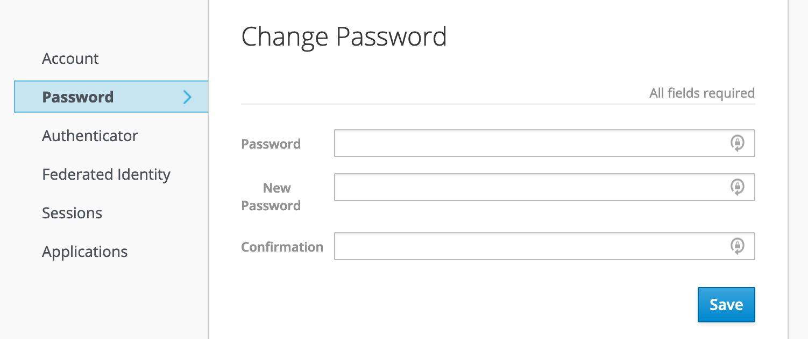
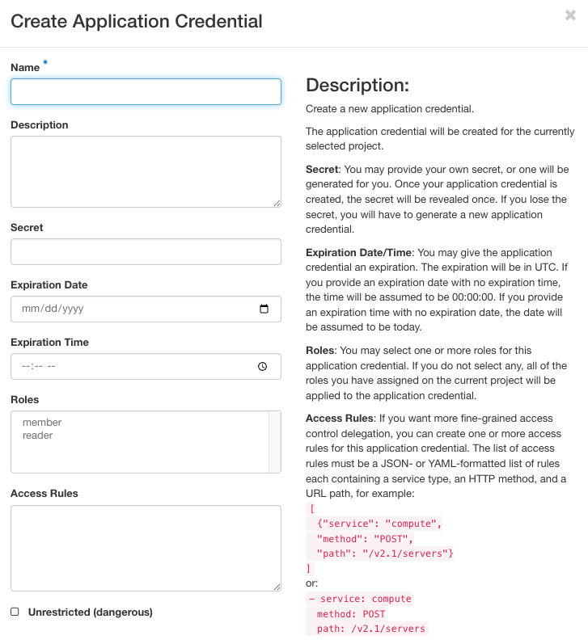

.. _cli-authentication:

CLI authentication
==================

When using the CLI, you have to provide some credentials so the system trusts
that the operations are really being executed by your user account. This page
covers two such ways of doing this: a CLI password and application
credentials. Both require manually creating and downloading credential files.

.. note::

   For most users, :ref:`ccauth <cli-ccauth>` or :ref:`cc-login
   <cli-cc-login>` are easier than the methods on this page — they
   authenticate via your browser and generate credential files for you, with
   no manual password or application credential setup required. See
   :ref:`which authentication method should I use? <cli-which-auth-method>`
   for guidance on choosing between them. Use a CLI password or application
   credential only if neither of those tools fits your workflow.

Setting a CLI password
----------------------

You can set a CLI password via the `Chameleon Authentication Portal
<https://auth.chameleoncloud.org/auth/realms/chameleon/account/#/security/signingin>`_. The
password you associate with your account can not be used to log in to the GUI or
Jupyter interfaces and can only be used to authenticate a command-line client.

   Setting a password in the Chameleon Authentication Portal

The benefit of this method is that this password will work on any Chameleon
site.

.. note::

   You should set a strong password for your CLI password, and it should not be
   a password you use elsewhere. Otherwise, your account risks being compromised
   by an attacker who has possibly obtained your password from another breached
   service. We **highly** recommend using a password manager e.g., `BitWarden
   <https://bitwarden.com/>`_, `LastPass
   <https://www.lastpass.com/password-manager>`_, or `1Password
   <https://1password.com/>`_ to assist.

.. _cli-application-credential:

Creating an application credential
----------------------------------

You can also generate *application credentials*, which act as dedicated one-off
passwords that are authorized with a scoped set of your user account's
permissions, within a single project. If you work on multiple projects
simultaneously, you will need to generate one application credential for each
project.

To create an application credential, navigate to the "Identity" dashboard in the
:ref:`gui`, and go to the "Application Credentials" panel. Create a new
application credential and name it something meaningful (such as "CLI access for
project CH-XXX"). **You will also need to check the "unrestricted" checkbox in
order to use the CLI to make leases in Blazar**. If you do not need to make
reservations via the CLI, you can leave the box unchecked, as it is the safer
option.

.. note::

   If a credential scoped only to the ``member`` role gets a ``403
   Forbidden`` error on commands such as ``openstack image list`` or
   ``openstack server create``, try creating a new application credential
   that also includes the ``reader`` role alongside ``member``. This is a
   known issue with role scoping for application credentials; including
   ``reader`` resolves it for most operations while a permanent fix is in
   progress.

Once the system generates the credential, you will be given the option to
download an :ref:`RC file <cli-rc-script>` that configures the CLI to use the
application credential for authentication. You will only see the secret
credentials once, so make sure to save the RC file or the secret somewhere, as
if it's lost, you will have to delete the credential and create a new one.