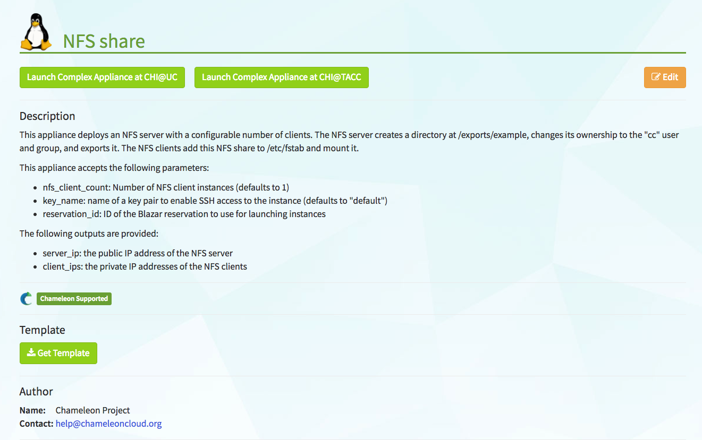
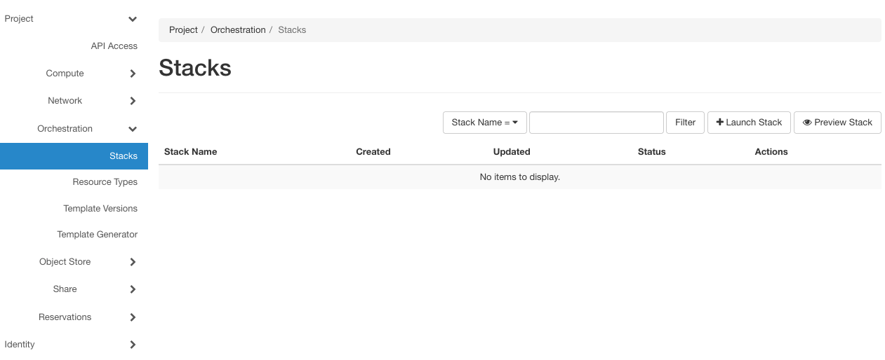
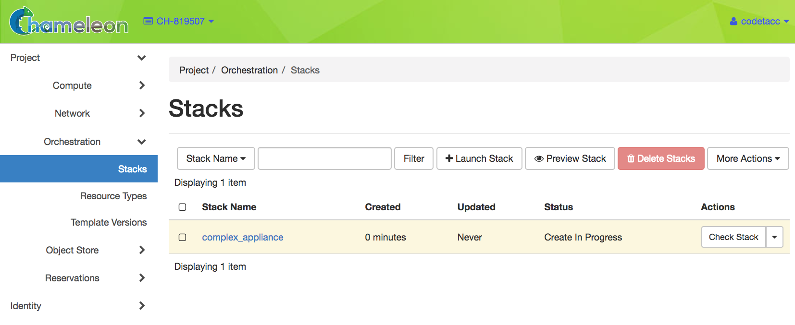

.. _complex:

Complex appliances
==================

Introduction
------------

Deploying an MPI cluster, an OpenStack installation, or any other type of cluster in which nodes can take on multiple roles can be complex: you have to provision potentially hundreds of nodes, configure them to take on various roles, and make them share information that is generated or assigned only at deployment time, such as hostnames, IP addresses, or security keys. When you want to run a different experiment later you have to redo all this work. When you want to reproduce the experiment, or allow somebody else to reproduce it, you have to take very precise notes and pay great attention to their execution.

To help solve this problem and facilitate reproducibility and sharing, the Chameleon team configured a tool that allows you to deploy complex clusters with “one click”. This tool requires not just a simple *image* (i.e., appliance) but also a document, called a *template*, that contains the information needed to orchestrate the deployment and configuration of such clusters. We call this *image + template* combination **Complex Appliances** because it consists of more than just the image (i.e., appliance).

In a nutshell, *Complex Appliances* allow you to specify not only what image you want to deploy but also on how many nodes you want to deploy that image, what roles the deployed instances should boot into (such as e.g., head node and worker node in a cluster), what information from a specific instance should be passed to another instance in that *Complex Appliance*, and what scripts should be executed on boot so that this information is properly used for configuring the “one click” cluster.

This guide will tell you all you need to know in order to use and configure *Complex Appliances* on Chameleon.

.. hint::
   Since *Complex Appliances* in Chameleon are currently implemented using the `OpenStack Heat <https://docs.openstack.org/heat/latest/>`_ orchestration service, we will be using OpenStack terminology and features to work with them. The templates described above are YAML files using the `Heat Orchestration Template (HOT) <https://docs.openstack.org/heat/latest/template_guide/hot_spec.html>`_ format (Heat also supports the AWS CloudFormation template format, but this is not covered here). A deployed complex appliance is referred to as a “stack” – just as a deployed single appliance is typically referred to as an “instance”.

Complex Appliances in the Catalog
---------------------------------

The `Chameleon Appliance Catalog <https://www.chameleoncloud.org/appliances/>`_ has several *Complex Appliances* for popular technologies that people want to deploy such as OpenStack or MPI or even more advanced deployments such as efficient SR-IOV enabled MPI in KVM virtual machines. We also provide common building blocks for cluster architectures, such as an NFS share. *Complex Appliances* are identified by a badge in their top-right corner representing a group of machines, as in the screenshot below:

.. figure:: complex/nfsappliance.png
   :alt: A Complex Appliance with a badge in the upper right

   A Complex Appliance with a badge in the upper right

To view the details of a *Complex Appliance*, simply click on it.

   A Complex Appliance page

.. tip:: You may download the *Template* file or copy the *Template* file URL to clipboard by clicking the *Get Template* button. The *Template* file or it's URL is required when launching a *Complex Appliance*.

Managing Complex Appliances using the GUI
-----------------------------------------

Before launching a *Complex Appliance*, please make sure that you have a reservation for the appropriate node types and a key pair configured. Since most *Complex Appliances* will consist of multiple nodes, make sure you have set the *Minimum Number of Hosts* in your Lease. You will also need a *Template* file or the URL for a *Template* file from the `Appliance Catalog <https://www.chameleoncloud.org/appliances/>`_. At |CHI@TACC| site or |CHI@UC| site, go to *Project* > *Orchestration* > *Stacks* use the navigation side bar.

   The Stacks page

.. tip::
   You can go to *Stacks* page directly from the `Appliance Catalog <https://www.chameleoncloud.org/appliances/>`_.

   #. Go to the `Appliance Catalog <https://www.chameleoncloud.org/appliances/>`_ and identify the appliance you want to launch. Click on it to open its details page.

   #. Click on the "Launch Complex Appliance at ``CHI\@TACC``" or "Launch Complex Appliance at ``CHI\@UC``" button depending on where your reservation is created.

Launching a Complex Appliance
~~~~~~~~~~~~~~~~~~~~~~~~~~~~~

To launch a stack, click the *Launch Stack* button in the upper right of the *Stacks* page. Then follow the steps:

#. Start setting up a *Template* by choosing a *Template Source* in the dropdown. You may either select the *File* option as *Template Source* and upload the *Template* file, or select the *URL* option and provide the URL of the *Template* file.

   .. figure:: complex/selecttemplate.png
      :alt: The Select Template step

      The Select Template step

   .. important:: **Do not** change the environment source settings!

#. Once you have provided a Template, click the *Next* button. Chameleon will validate the Template file and proceed to the *Launch Stack* step.

   .. figure:: complex/launchstack.png
      :alt: The Launch Stack step

      The Launch Stack step

#. Choose a name for your stack. Ignore the “Creation Timeout” and “Rollback On Failure” settings. You also need to enter your Chameleon password. Then, you need to select a value for the parameters of the template. Finally, click the *Launch* button.
#. Your stack should be in status "Create In Progress" for several minutes while it first launches the server instance, followed by the client instances. It will then move to the status "Create Complete".

   A Complex Appliance with the Create in Progress status

Monitoring a Complex Appliance
~~~~~~~~~~~~~~~~~~~~~~~~~~~~~~

To monitor and get more details about your *Complex Appliance*, click on it in the *Stacks* page.

- The *Topology* tab displays a topology graph of the stack. The rack of machine represents the client instance group. The server’s floating IP (the public IP assigned to a resource) is represented by an IP in a circle; while an IP in a circle is also used to represent the association of the IP with the server instance (not the greatest idea to use the same symbol for both the IP and the association -- we agree but can’t do much about it at the moment). Blow off some steam by dragging the visualization across the screen, it can be rather fun!

  .. note:: Blinking nodes indicates that they are still provisioning.

  .. figure:: complex/topology.png
     :alt: The Topology tab

     The Topology tab

- The *Overview* tab displays various parameters, including the *ID* of the stack and *Outputs* such as IP addresses assigned to each node. If you have a floating IP associated to the server, you can now ``ssh`` to the server using the floating IP just as you do with regular instances. The client may not have a floating IP attached to it, but you can connect to it via the server node with the client’s private IP.

  .. tip:: To talk to the client without an associated floating IP, connect to the server with ``ssh -A`` to enable the SSH agent forwarding after loading your key to your SSH agent with ``ssh-add <path-to-your-key>``.

  .. figure:: complex/overview.png
     :alt: The Overview tab

     The Overview tab

- Under the *Resources* tab you will see the resources of the stack (the server, clients, server’s public/floating IP, and its the association) and information about them.

  .. figure:: complex/resources.png
     :alt: The Resources tab

     The Resources tab

- In the *Events* tab you will see information about the history of the deployment so far.

  .. figure:: complex/events.png
     :alt: The Events tab

     The Events tab

- In *Template* tab, you will see the template that was used to deploy this stack.

  .. figure:: complex/template.png
     :alt: The Template tab

     The Template tab

Deleting a Complex Appliance
~~~~~~~~~~~~~~~~~~~~~~~~~~~~

To delete a *Complex Appliance*, select it in the *Stacks* page and click the *Delete Stacks* button. This will delete all resources of the stack, such as nodes and floating IP addresses.

Managing Complex Appliances using the CLI
-----------------------------------------

.. tip:: Reading :ref:`cli` is highly recommanded before continuing on the following sections.

In addition to :ref:`cli-installing`, you will need to install the ``python-heatclient`` package using the command:

.. code-block:: bash

   pip install python-heatclient

Then, set up your environment for OpenStack command line usage, as described in :ref:`cli-rc-script`. You can get a list of your *Complex Appliances* in your project using the command:

.. code-block:: bash

   openstack stack list

The output should look like the following:

.. code::

   +--------------------------------------+---------------+-------------------+----------------------+----------------------+
   | ID                                   | Stack Name    | Stack Status      | Creation Time        | Updated Time         |
   +--------------------------------------+---------------+-------------------+----------------------+----------------------+
   | e5df33b5-5282-4935-8097-973328ca71e5 | my_stack      | CREATE_COMPLETE   | 2018-01-23T22:45:12Z | None                 |
   +--------------------------------------+---------------+-------------------+----------------------+----------------------+

Launching a Complex Appliance
~~~~~~~~~~~~~~~~~~~~~~~~~~~~~

To launch a *Complex Appliance* using *Template*, run the command on your local machine:

.. code-block:: bash

   openstack stack create --template <template_file> --parameter <parameter>=<value> <stack_name>

Provide the path to and the name of the *Template* file in your local file system via the ``template`` switch.  The ``<stack_name>`` is the name of the *Complex Appliance*. In addition, you may provide the parameters required in the *Template* file with their values by ``parameter`` switch. For example, the `NFS Server Template <https://www.chameleoncloud.org/appliances/api/appliances/25/template>`_ lists the following ``parameters`` section:

.. code::

   parameters:
     nfs_client_count:
       type: number
       description: Number of NFS client instances
       default: 1
       constraints:
         - range: { min: 1 }
           description: There must be at least one client.
     key_name:
       type: string
       description: Name of a KeyPair to enable SSH access to the instance
       default: default
       constraints:
       - custom_constraint: nova.keypair
     reservation_id:
       type: string
       description: ID of the Blazar reservation to use for launching instances.
       constraints:
       - custom_constraint: blazar.reservation

Therefore, in order to use this *Template*, you must provide values for ``nfs_client_count``, ``key_name`` and ``reservation_id``.

Monitoring a Complex Appliance
~~~~~~~~~~~~~~~~~~~~~~~~~~~~~~

You can get details about your *Complex Appliance*, such as *Outputs*, *Events* and *Resources*, via the CLI. You will need the *UUID* of the *Complex Appliance*.

.. tip:: To get the *UUID* of your *Complex Appliance*, use the *Stacks* page on the GUI or retrieve it by ``openstack stack list`` command.

- To view the *Outputs*, run:

  .. code-block:: bash

     openstack stack output list <uuid>

  For example, the list of the outputs for the `NFS Share <https://www.chameleoncloud.org/appliances/25/>`_ stack is:

  .. code::

     +------------+-----------------------------------------+
     | output_key | description                             |
     +------------+-----------------------------------------+
     | client_ips | Private IP addresses of the NFS clients |
     | server_ip  | Public IP address of the NFS server     |
     +------------+-----------------------------------------+

  You can get more details about the outputs by using the following command:

  .. code-block:: bash

     openstack stack output show --all <uuid>

- To view the *Events*, run:

  .. code-block:: bash

     openstack stack event list <uuid>

- To view the *Resources*, run:

  .. code-block:: bash

     openstack stack resource list <uuid>

  Your output may look like this:

  .. code::

     +---------------------------+--------------------------------------+---------------------------------+-----------------+----------------------+
     | resource_name             | physical_resource_id                 | resource_type                   | resource_status | updated_time         |
     +---------------------------+--------------------------------------+---------------------------------+-----------------+----------------------+
     | nfs_server_ip_association |                                      | OS::Neutron::FloatingIPAssociation | INIT_COMPLETE   | 2018-03-19T18:38:05Z |
     | nfs_server                | 0ab0169c-f762-4d27-8724-b359caa50f1f | OS::Nova::Server                | CREATE_FAILED   | 2018-03-19T18:38:05Z |
     | nfs_server_floating_ip    | ecb391f8-4653-43a6-b2c6-bb93a6d89115 | OS::Nova::FloatingIP            | CREATE_COMPLETE | 2018-03-19T18:38:05Z |
     | nfs_clients               |                                      | OS::Heat::ResourceGroup         | INIT_COMPLETE   | 2018-03-19T18:38:05Z |
     +---------------------------+--------------------------------------+---------------------------------+-----------------+----------------------+

  Then, you may retrieve information about a specific resource using the command:

  .. code-block:: bash

     openstack stack resource show <stack_uuid> <resource_name>

Deleting a Complex Appliance
~~~~~~~~~~~~~~~~~~~~~~~~~~~~

Use the following command to delete a stack:

.. code-block:: bash

   openstack stack delete <uuid>

It will remove all the resources attached to the stack.

Heat Orchestration Templates
----------------------------

A *Heat Orchestration Template* is a YAML file that specifies how resources are used and configured in a *Complex Appliance*.

A Case Example: NFS Share
~~~~~~~~~~~~~~~~~~~~~~~~~

Let's look at the `NFS Share Template <https://www.chameleoncloud.org/appliances/api/appliances/25/template>`_. The NFS share appliance deploys:

- An NFS server instance, that exports the directory ``/exports/example`` to any instance running on Chameleon bare metal,
- One or several NFS client instances, which configure ``/etc/fstab`` to mount this NFS share to ``/mnt`` (and can subsequently read from and write to it).

This template is reproduced further below, and includes inline comments starting with the ``#`` character. There are three main sections:

- resources
- parameters
- outputs

The ``resources`` section is the most important part of the template: it defines which OpenStack *Resources* to create and configure. Inside this section you can see four resources defined:

- ``nfs_server_floating_ip``: creates a *Floating IP* on the ``ext-net`` public network. It is not attached to any instance yet.
- ``nfs_server``: creates the NFS server instance (an instance is defined with the type ``OS::Nova::Server`` in *Heat*). It is a bare metal instance (``flavor: baremetal``) using the ``CC-CentOS7`` image and connected to the private network named ``sharednet1``. We set the key pair to use the value of the parameter defined earlier, using the ``get_param`` function. Similarly, the reservation to use is passed to the scheduler. Finally, a ``user_data`` script is given to the instance, which configures it as an NFS server exporting ``/exports/example`` to Chameleon instances.
- ``nfs_server_ip_association``: associates the floating IP created earlier with the NFS server instance.
- ``nfs_clients``: defines a resource group containing instance configured to be NFS clients and mount the directory exported by the NFS server defined earlier. The IP of the NFS server is gathered using the ``get_attr`` function, and placed into ``user_data`` using the ``str_replace`` function.

Once a Resource has been specified, you may provide it as a value for another Resource's property using the ``get_resource`` function.

The ``parameters`` section defines inputs to be used on *Complex Appliance* launch. Parameters all have the same data structure: each one has a name (``key_name`` or ``reservation_id`` in this case), a data type (``number`` or ``string``), a comment field called ``description``, optionally a ``default value``, and a list of ``constraints`` (in this case only one per parameter). Constraints tell *Heat* to match a parameter to a specific type of OpenStack resource. *Complex appliances* on Chameleon require users to customize at least the key pair name and reservation ID, and will generally provide additional parameters to customize other properties of the cluster, such as its size, as in this example. The values of Parameters can be used in the ``resources`` section using the ``get_param`` function.

The ``outputs`` section defines what values are returned to the user. *Outputs* are declared similarly to *Parameters*: they each have a name, an optional description, and a value. They allow to return information from the stack to the user. You may use the ``get_attr`` function to retrieve a resource's attribute for output.

Heat Template Customization
~~~~~~~~~~~~~~~~~~~~~~~~~~~

Customizing an existing template is a good way to start developing your own. We will use a simpler template than the previous example to start with: it is the `Hello World complex appliance <https://www.chameleoncloud.org/appliances/26/>`_.

First, delete the stack you launched, because we will need all three nodes to be free. To do this, go back to the *Project* > *Orchestration* > *Stacks* page, select your stack, and then click on the *Delete Stacks* button. You will be asked to confirm, so click on the *Delete Stacks* button.

   .. figure:: complex/deletestacks.png
      :alt: Confirm deleting stack dialog

      Confirm deleting stack dialog

The template for the `Hello World complex appliance <https://www.chameleoncloud.org/appliances/26/>`_ is reproduced below. It is similar to the NFS share appliance, except that it deploys only a single client. You can see that it has four resources defined:

-  ``nfs_server_floating_ip``
-  ``nfs_server``
-  ``nfs_server_ip_association``
-  ``nfs_client``

The ``nfs_client`` instance mounts the NFS directory shared by the ``nfs_server`` instance, just like in our earlier example.

::

    # This describes what is deployed by this template.
    description: NFS server and client deployed with Heat on Chameleon

    # This defines the minimum Heat version required by this template.
    heat_template_version: 2015-10-15

    # The resources section defines what OpenStack resources are to be deployed and
    # how they should be configured.
    resources:
      nfs_server_floating_ip:
        type: OS::Nova::FloatingIP
        properties:
          pool: ext-net

      nfs_server:
        type: OS::Nova::Server
        properties:
          flavor: baremetal
          image: CC-CentOS7
          key_name: { get_param: key_name }
          networks:
             - network: sharednet1
          scheduler_hints: { reservation: { get_param: reservation_id } }
          user_data: |
            #!/bin/bash
            yum install -y nfs-utils
            mkdir -p /exports/example
            chown -R cc:cc /exports
            echo '/exports/example 10.140.80.0/22(rw,async) 10.40.0.0/23(rw,async)' >> /etc/exports
            systemctl enable rpcbind && systemctl start rpcbind
            systemctl enable nfs-server && systemctl start nfs-server

      nfs_server_ip_association:
        type: OS::Neutron::FloatingIPAssociation
        properties:
          floatingip_id: {get_resource: nfs_server_floating_ip}
          port_id: {get_attr: [nfs_server, addresses, sharednet1, 0, port]}

      nfs_client:
        type: OS::Nova::Server
        properties:
          flavor: baremetal
          image: CC-CentOS7
          key_name: { get_param: key_name }
          networks:
             - network: sharednet1
          scheduler_hints: { reservation: { get_param: reservation_id } }
          user_data:
            str_replace:
              template: |
                #!/bin/bash
                yum install -y nfs-utils
                echo "$nfs_server_ip:/exports/example    /mnt/    nfs" > /etc/fstab
                mount -a
              params:
                $nfs_server_ip: { get_attr: [nfs_server, first_address] }

    # The parameters section gathers configuration from the user.
    parameters:
      key_name:
        type: string
        description: Name of a KeyPair to enable SSH access to the instance
        default: default
        constraints:
        - custom_constraint: nova.keypair
      reservation_id:
        type: string
        description: ID of the Blazar reservation to use for launching instances.
        constraints:
        - custom_constraint: blazar.reservation

Download `this template <https://www.chameleoncloud.org/appliances/api/appliances/26/template>`_ to your local machine, and open it in your favorite text editor.

We will customize the template to add a second NFS client by creating a new resource called ``another_nfs_client``. Add the following text to your template inside the resources section. Make sure to respect the level of indentation, which is important in YAML.

::

      another_nfs_client:
        type: OS::Nova::Server
        properties:
          flavor: baremetal
          image: CC-CentOS7
          key_name: { get_param: key_name }
          networks:
             - network: sharednet1
          scheduler_hints: { reservation: { get_param: reservation_id } }
          user_data:
            str_replace:
              template: |
                #!/bin/bash
                yum install -y nfs-utils
                echo "$nfs_server_ip:/exports/example    /mnt/    nfs" > /etc/fstab
                mount -a
              params:
                $nfs_server_ip: { get_attr: [nfs_server, first_address] }

Now, launch a new stack with this template. Since the customized template is only on your computer and cannot be addressed by a URL, use the *Direct Input* method instead and copy/paste the content of the customized template. The resulting topology view is shown below: as you can see, the two client instances are shown separately since each one is defined as a separate resource in the template.

   .. figure:: complex/topologycustomhelloworld.png
      :alt: Topology of the customized Hello World Appliance

      Topology of the customized Hello World Appliance

You may have realized already that while adding just one additional client instance was easy, launching more of them would require to copy / paste blocks of YAML many times while ensuring that the total count is correct. This would be easy to get wrong, especially when dealing with tens or hundreds of instances.

So instead, we leverage another construct from *Heat*: resource groups. Resource groups allow to define one kind of resource and request it to be created any number of times.

Remove the ``nfs_client`` and ``another_client`` resources from your customized template, and replace them with the following:

::

      nfs_clients:
        type: OS::Heat::ResourceGroup
        properties:
          count: 2
          resource_def:
            type: OS::Nova::Server
            properties:
              flavor: baremetal
              image: CC-CentOS7
              key_name: { get_param: key_name }
              networks:
                 - network: sharednet1
              scheduler_hints: { reservation: { get_param: reservation_id } }
              user_data:
                str_replace:
                  template: |
                    #!/bin/bash
                    yum install -y nfs-utils
                    echo "$nfs_server_ip:/exports/example    /mnt/    nfs" > /etc/fstab
                    mount -a
                  params:
                    $nfs_server_ip: { get_attr: [nfs_server, first_address] }

A resource group is configured with a properties field, containing the definition of the resource to launch (``resource_def``) and the number of resources to launch (``count``). Once launched, you will notice that the topology view groups all client instances under a single *Resource Group* icon. We use the same ``resource_def`` than when defining separate instances earlier.

Another way we can customize this template is by adding outputs to the template. Outputs allow a *Heat* template to return data to the user. This can be useful to return values like IP addresses or credentials that the user must know to use the system.

We will create an output returning the floating IP address used by the NFS server. We define an outputs section, and one output with the name ``server_ip`` and a description. The value of the output is gathered using the ``get_attr`` function which obtains the IP address of the server instance.

::

    outputs:
      server_ip:
        description: Public IP address of the NFS server
        value: { get_attr: [nfs_server_floating_ip, ip] }

You can get outputs in the *Overview* tab of the *Stack Details* page. If you want to use the command line, install ``python-heatclient`` and use the ``heat output-list`` and ``heat output-show`` commands, or get a full list in the information returned by ``heat stack-show``.

Multiple outputs can be defined in the outputs section. Each of them needs to have a unique name. For example, we can add another output to list the private IPs assigned to client instances:

::

      client_ips:
        description: Private IP addresses of the NFS clients
        value: { get_attr: [nfs_clients, first_address] }

The image below shows the resulting outputs as viewed from the web interface. Of course IP addresses will be specific to each deployment.

   .. figure:: complex/helloworldoutputs.png
      :alt: The Outputs of customized Hello World appliance

      The Outputs of customized Hello World appliance

Finally, we can add a new parameter to replace the hard-coded number of client instances by a value passed to the template. Add the following text to the parameters section:

::

      nfs_client_count:
        type: number
        description: Number of NFS client instances
        default: 1
        constraints:
          - range: { min: 1 }
            description: There must be at least one client.

Inside the resource group definition, change ``count: 2`` to ``count: { get_param: nfs_client_count }`` to retrieve and use the parameter we just defined. When you launch this template, you will see that an additional parameter allows you to define the number of client instances, like in the NFS share appliance.

At this stage, we have fully recreated the *NFS share* appliance starting from the *Hello World* one! The next section will explain how to write a new template from scratch.

Writing a New Template
~~~~~~~~~~~~~~~~~~~~~~

You may want to write a whole new template, rather than customizing an existing one. Each template should follow the same layout and be composed of the following sections:

-  Heat template version
-  Description
-  Resources
-  Parameters
-  Outputs

Heat template version
^^^^^^^^^^^^^^^^^^^^^

Each Heat template has to include the ``heat_template_version`` key with a valid version of `HOT (Heat Orchestration Template) <https://docs.openstack.org/heat/latest/template_guide/hot_guide.html>`_. Chameleon bare metal supports any HOT version up to **2015-10-15**, which corresponds to OpenStack Liberty.
The `Heat documentation <https://docs.openstack.org/heat/latest/template_guide/hot_spec.html#hot-spec-template-version>`_ lists all available versions and their features. We recommended that you always use the latest Chameleon supported version to have access to all supported features:

``heat_template_version: 2015-10-15``

Description
^^^^^^^^^^^

While not mandatory, it is good practice to describe what is deployed and configured by your template. It can be on a single line:

::

    description: This describes what this Heat template deploys on Chameleon.

If a longer description is needed, you can provide multi-line text in YAML, for example:

::

    description: >
      This describes what this Heat
      template deploys on Chameleon.

Resources
^^^^^^^^^

The resources section is required and must contain at least one resource definition. A `complete list of resources types known to Heat <https://docs.openstack.org/heat/latest/template_guide/openstack.html>`_ is
available.

However, only a subset of them are supported by Chameleon, and some are limited to administrative use. We recommend that you only use:

-  OS::Glance::Image
-  OS::Heat::ResourceGroup
-  OS::Heat::SoftwareConfig
-  OS::Heat::SoftwareDeployment
-  OS::Heat::SoftwareDeploymentGroup
-  OS::Neutron::FloatingIP
-  OS::Neutron::FloatingIPAssociation
-  OS::Neutron::Port (advanced users only)
-  OS::Nova::Keypair
-  OS::Nova::Server

If you know of another resource that you would like to use and think it should be supported by the OpenStack services on Chameleon bare metal, please let us know via our |Help Desk|.

Parameters
^^^^^^^^^^

Parameters allow users to customize the template with necessary or optional values.
For example, they can customize which Chameleon appliance they want to deploy, or which key pair to install.
Default values can be provided with the ``default`` key, as well as constraints to ensure that only valid OpenStack resources can be selected.
For example, ``custom_constraint: glance.image`` restricts the image selection to an available OpenStack image, while providing a pre-filled selection box in the web interface.
`More details about constraints <https://docs.openstack.org/heat/latest/template_guide/hot_spec.html#parameter-constraints>`_ are available in the *Heat* documentation.

Outputs
^^^^^^^

Outputs allow template to give information from the deployment to users. This can include usernames, passwords, IP addresses, hostnames, paths, etc. The outputs declaration is using the following format:

::

    outputs:
      first_output_name:
        description: Description of the first output
        value: first_output_value
      second_output_name:
        description: Description of the second output
        value: second_output_value

Generally values will be calls to ``get_attr``, ``get_param``, or some other function to get information from parameters or resources deployed by the
template and return them in the proper format to the user.

Reserved Networks and Floating IPs
~~~~~~~~~~~~~~~~~~~~~~~~~~~~~~~~~~

Chameleon's reservation service allows users to reserve VLAN segments and floating ips. In order to make use of these
reserved resources in a (HOT) template, follow the guidelines below. For more information on VLAN and floating ip reservations,
see documentaiton on :ref:`reservation-cli-vlan` and :ref:`reservation-cli-fip`

When you reserve a VLAN segment via blazar, it will automatically create a network for you. However, this network
is not usable in your template unless a subnet and router have been associated with the network. Once this is done, you can simply
add the network name as the network parameter for your server as you would ``sharednet1``. The below cli commands
provides an example of how to complete the setup for your reserved network.

::

    openstack subnet create --subnet-range 192.168.100.0/24 \
        --allocation-pool start=192.168.100.100,end=192.168.100.108 \
        --dns-nameserver 8.8.8.8 --dhcp \
        --network <my_reserved_network_name> \
        my_subnet_name
    openstack router create my_router_name
    openstack router add subnet my_router_name my_subnet_name
    openstack router set --external-gateway public my_router_name

For reserved floating ips, you need to associate the floating ip with a server using the ``OS::Neutron::FloatingIPAssociation`` object type.
Many of our older complex appliance templates use the ``OS::Nova::FloatingIPAssociation`` object, but this has since been deprecated. See example below
for proper usage:

::

    my_server_ip_association:
      type: OS::Neutron::FloatingIPAssociation
      properties:
        floatingip_id: <my_reserved_floating_ip_uuid>
        port_id: {get_attr: [my_server, addresses, <my_network_name>, 0, port]}

If you are having trouble finding the ``uuid`` of the floating ip address then the below command will help you.

::

    openstack floating ip list -c ID -c "Floating IP Address" -c Tags --long

The output should look like the sample output below with the `uuid` listed under the `ID` column. You can check your lease in
the reservation section of the GUI to find the `reservation id` associated with the floating ip in the `Tags` section of the output.

::

    +--------------------------------------+---------------------+------------------------------------------------------------------+
    | ID                                   | Floating IP Address | Tags                                                             |
    +--------------------------------------+---------------------+------------------------------------------------------------------+
    | 0fe31fad-60ac-462f-bb6c-4d40c1506621 | 192.5.87.206        | [u'reservation:d90ad917-300a-4cf7-a836-083534244f56', u'blazar'] |
    | 92a347a9-31a5-43c1-80e2-9cdb38ebf66f | 192.5.87.224        | [u'reservation:5f470c97-0166-4934-a813-509b743e2d62', u'blazar'] |
    | c8480d67-533d-4f55-a197-8271da6d9344 | 192.5.87.71         | []                                                               |
    +--------------------------------------+---------------------+------------------------------------------------------------------+

Sharing Complex Appliances
--------------------------

If you have written your own *Complex Appliance* or substantially customized an existing one, we would love if you shared them with our user community! The process is very similar to regular appliances: log into the Chameleon portal, go to the appliance catalog, and click on the button in the top-right corner: *Add an appliance* (you need to be logged in to see it).

.. figure:: complex/addappliance.png
   :alt: The Add an Appliance button

   The Add an Appliance button

You will be prompted to enter a name, description, and documentation. Instead of providing appliance IDs, copy your template to the dedicated field. Finally, share your contact information and assign a version string to your appliance. Once submitted, your appliance will be reviewed. We will get in touch if a change is needed, but if it's all good we will publish it right away!

Advanced Topics
---------------

.. _all-to-all-info-exchange:

All-to-All Information Exchange
~~~~~~~~~~~~~~~~~~~~~~~~~~~~~~~

The previous examples have all used ``user_data`` scripts to provide instances with contextualization information. While it is easy to use, this contextualization method has a major drawback: because it is given to the instance as part of its launch request, it cannot use any context information that is not yet known at this time. In practice, this means that in a client-server deployment, only one of these pattern will be possible:

- The server has to be deployed first, and once it is deployed, the clients can be launched and contextualized with information from the server. The server won’t know about the clients unless there is a mechanism (not managed by *Heat*) for the client to contact the server.
- The clients have to be deployed first, and once they are deployed, the server can be launched and contextualized with information from the clients. The clients won’t know about the server unless there is a mechanism (not managed by *Heat*) for the server to contact the clients.

This limitation was already apparent in our `NFS share <https://www.chameleoncloud.org/appliances/25/>`_ appliance: this is why the server instance exports the file system to all bare metal instances on Chameleon, because it doesn’t know which specific IP addresses are allocated to the clients.

This limitation is even more important if the deployment is not hierarchical, i.e. all instances need to know about all others. For example, a cluster with IP and hostnames populated in ``/etc/hosts`` required each instance to be known by every other instance.

This section presents a more advanced form of contextualization that can perform this kind of information exchange.
This is implemented by *Heat* agents running inside instances and communicating with the *Heat* service to send and receive information.
This means you will need to use an image bundling these agents.
Currently, all Chameleon-supported images (CC) are supporting this mode of contextualization.
If you build your own images using the `CC-CentOS7 <https://github.com/ChameleonCloud/CC-CentOS7>`_ builder, `CC-CentOS <https://github.com/ChameleonCloud/CC-CentOS>`_ builder or `CC-Ubuntu <https://github.com/ChameleonCloud/CC-Ubuntu>`_ builder, you will automatically have these agents installed. This contextualization is performed with several Heat resources:

- ``OS::Heat::SoftwareConfig``: This resource describes code to run on an instance. It can be configured with inputs and provide outputs.
- ``OS::Heat::SoftwareDeployment``: This resource applies a SoftwareConfig to a specific instance.
- ``OS::Heat::SoftwareDeploymentGroup``: This resource applies a SoftwareConfig to a specific group of instances.

The template below illustrates how it works. It launches a group of instances that will automatically populates their ``/etc/hosts`` file with IP and hostnames from other instances in the deployment.

.. code::

   heat_template_version: 2015-10-15

   description: >
     This template demonstrates how to exchange hostnames and IP addresses to populate /etc/hosts.

   parameters:
     flavor:
       type: string
       default: baremetal
       constraints:
       - custom_constraint: nova.flavor
     image:
       type: string
       default: CC-CentOS8
       constraints:
       - custom_constraint: glance.image
     key_name:
       type: string
       default: default
       constraints:
       - custom_constraint: nova.keypair
     instance_count:
       type: number
       default: 2
     reservation_id:
       type: string
       description: ID of the Blazar reservation to use for launching instances.
       constraints:
       - custom_constraint: blazar.reservation

   resources:
     export_hosts:
       type: OS::Heat::SoftwareConfig
       properties:
         outputs:
           - name: hosts
         group: script
         config: |
           #!/bin/sh
           (echo -n $(facter ipaddress); echo -n ' '; echo $(facter hostname)) > ${heat_outputs_path}.hosts

     export_hosts_sdg:
       type: OS::Heat::SoftwareDeploymentGroup
       properties:
         config: { get_resource: export_hosts }
         servers: { get_attr: [server_group, refs_map] }
         signal_transport: HEAT_SIGNAL

     populate_hosts:
       type: OS::Heat::SoftwareConfig
       properties:
         inputs:
           - name: hosts
         group: script
         config: |
           #!/usr/bin/env python
           import ast
           import os
           import string
           import subprocess
           hosts = os.getenv('hosts')
           if hosts is not None:
               hosts = ast.literal_eval(string.replace(hosts, '\n', '\\n'))
           with open('/etc/hosts', 'a') as hosts_file:
             for ip_host in hosts.values():
                 hosts_file.write(ip_host.rstrip() + '\n')

     populate_hosts_sdg:
       type: OS::Heat::SoftwareDeploymentGroup
       depends_on: export_hosts_sdg
       properties:
         config: { get_resource: populate_hosts }
         servers: { get_attr: [server_group, refs_map] }
         signal_transport: HEAT_SIGNAL
         input_values:
           hosts: { get_attr: [ export_hosts_sdg, hosts ] }

     server_group:
       type: OS::Heat::ResourceGroup
       properties:
         count: { get_param: instance_count }
         resource_def:
           type: OS::Nova::Server
           properties:
             flavor: { get_param: flavor }
             image: { get_param: image }
             key_name: { get_param: key_name }
             networks:
                - network: sharednet1
             scheduler_hints: { reservation: { get_param: reservation_id } }
             user_data_format: SOFTWARE_CONFIG
             software_config_transport: POLL_SERVER_HEAT

   outputs:
     deployment_results:
       value: { get_attr: [export_hosts_sdg, hosts] }

There are two ``SoftwareConfig`` resources:

- The first ``SoftwareConfig``, ``export_hosts``, uses the ``facter`` tool to extract IP address and hostname into a single line (in the format expected for ``/etc/hosts``) and writes it to a special path (``${heat_outputs_path}.hosts``). This prompts Heat to assign the content of this file to the output with the name hosts.
- The second ``SoftwareConfig``, ``populate_hosts``, takes as input a variable named hosts, and applies a script that reads the variable from the environment, parses it with ``ast.literal_eval`` (as it is formatted as a Python dict), and writes each value of the dictionary to ``/etc/hosts``.

The ``SoftwareDeploymentGroup`` resources ``export_hosts_sdg`` and ``populate_hosts_sdg`` apply each ``SoftwareConfig`` to the instance ``ResourceGroup`` with the correct configuration.

Finally, the instance ``ResourceGroup`` is configured so that each instance uses the following contextualization method instead of a ``user_data`` script:

.. code::

   user_data_format: SOFTWARE_CONFIG
   software_config_transport: POLL_SERVER_HEAT

You can follow the same template pattern to configure your own deployment requiring all-to-all information exchange.

.. _automated-deployemnt:

Automated Deployment
~~~~~~~~~~~~~~~~~~~~

On Chameleon you can configure a Heat Stack to launch as soon as your lease begins. Whether your experiments require a large cluster or a single node, automated deployment saves you time configuring your environment and even allows you to run your entire experiment automatically when the necessary resources become available.

At present, you will need to use our customized versions of the Heat and Blazar CLI tools to implement this feature.

Install Custom CLI
^^^^^^^^^^^^^^^^^^

You can install Chameleon's ``python-heatclient`` and ``python-blazarclient`` packages via ``pip`` by running the following commands:

.. code::

    pip install git+https://github.com/ChameleonCloud/python-heatclient.git
    pip install git+https://github.com/ChameleonCloud/python-blazarclient.git

Initialize Stack
^^^^^^^^^^^^^^^^

Next you will need to configure a Heat stack with the ``--initialize`` flag on the CLI and a dummy ``reservation_id`` parameter. The ``dummy`` id can be anything (even an empty string) so long as the ``reservation_id`` parameter is specified so that Blazar can overwrite it once your advanced reservation is scheduled and the stack is ready to launch. Once your stack is initialized, the status should read ``INIT_COMPLETE``. This indicates that your template was validated and all the data required to launch a stack has been stored. See example command below:

.. code::

    openstack stack create -t <template_file> --initialize --parameter reservation_id=dummy <stack_name>

Create Reservation with Stack_ID
^^^^^^^^^^^^^^^^^^^^^^^^^^^^^^^^

Finally, for a stack to launch when your reservation begins, we need to let Blazar know which stack to notify Heat to update. This is done via the command line by specifying ``orchestration`` as an ``on_start`` action with a stack_id (e.g. ``on_start=orchestration:<stack_id>``) under the ``--reservation`` flag. Under the hood, Blazar will update your initialized Heat stack with the reservation_id assigned to the lease. See example below:

.. code::

    openstack reservation lease create --start-date "<start_date>" --end-date "<end_date>" \
      --reservation min=<min>,max=<max>,resource_type=physical:host,on_start=orchestration:<stack_id> \
      <lease_name>
