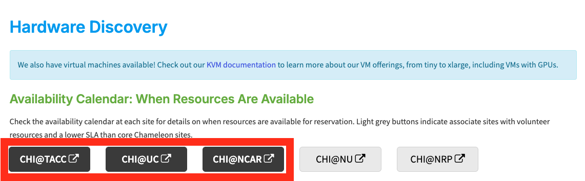
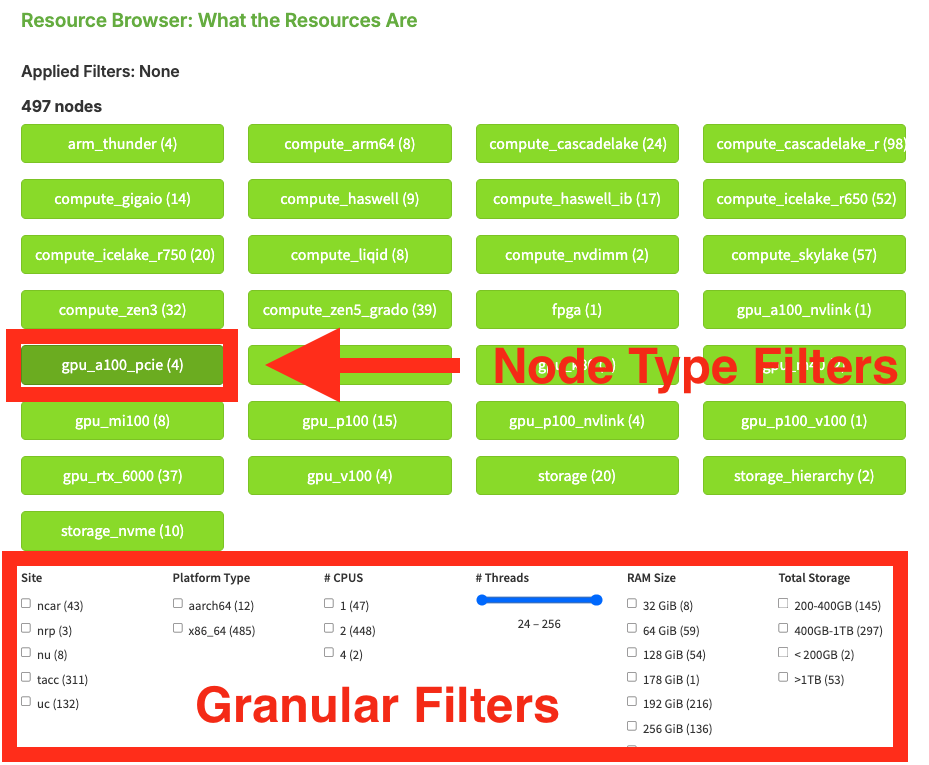
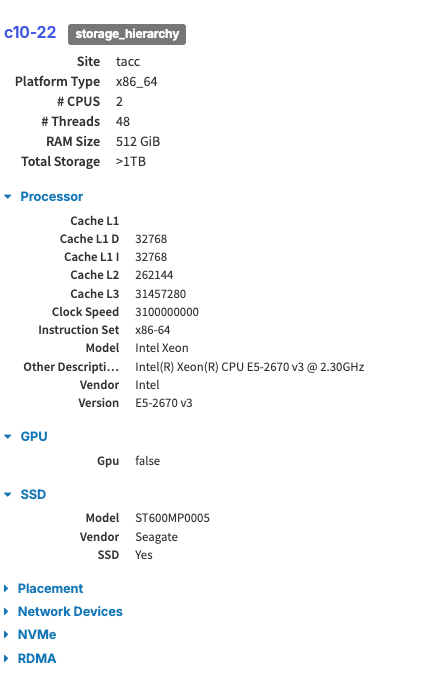
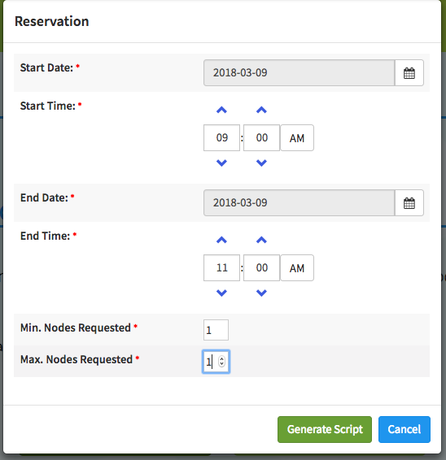
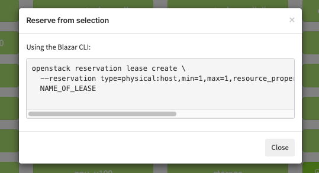

.. _resource-discovery:

===================
Resource discovery
===================

Introduction
============

Chameleon supports fine-grained resource discovery for experimentation, which means that you can identify a specific node, view the node's hardware maintenance history and reserve it for repeated use.

All physical resources available in Chameleon are described in the Chameleon resource registry. The resource registry is based on the `Reference API from the Grid'5000 project <https://www.grid5000.fr/mediawiki/index.php/API>`_. Users can consult the registry via the resource discovery web interface or directly via REST APIs.

.. note:: Some resource discovery features are available through the `Chameleon Portal <https://chameleoncloud.org>`_, while others are available **only** through the REST APIs.

The Hardware Catalog on the Chameleon Portal
============================================

You may use the `Hardware <https://chameleoncloud.org/hardware/>`_ page at the `Chameleon Portal <https://chameleoncloud.org>`_ to see the different hardware resource types available at each Chameleon site.

Availability
____________

The *CHI\@TACC* and *CHI\@UC* buttons in the *Availability* section of the Resource Browser allow you to open the Lease Calendars at the Chameleon sites. You must login using your Chameleon account to view these lease calendars.

   Resource availability links to the lease calendars

Chameleon Resource Browser
__________________________

The Chameleon Resource Browser allows you to filter Chameleon resources by node type and view details of each node.

   The Chameleon Resource Browser

You may filter for specific node types by selecting the checkboxes that match your filter criteria or by clicking the buttons such as *Compute* and *Infiniband Support*. The numbers printed next to the node types indicate the total number of nodes of that certain type. After you have selected filter criteria, you can click the *View* button to see details of individual nodes that match your filtering criteria.

   Node details

.. tip:: To get more precise characteristics of the selected node, search the node at `Intel's CPU database <https://ark.intel.com/>`_.

.. note::
   All the nodes in Chameleon is identified by their *UUIDs*. You will need the *UUID* of a node for making reservations and identifying metrics collected from the node using Gnocchi. In addition, each node also has a *Version UUID*, which is used for retrieving its maintenance history.

.. attention::
   When we replace faulty hardware on a node, the replacement part typically has the same hardware characteristics. For example, a node with a faulty 250 GB hard drive would be replaced with the same 250 GB hard drive model. However, it may be important for your experimental reproducibility to know about those hardware replacement events, in case it affects your metrics.

Generating a Reservation Script
_______________________________

The `Chameleon Portal <https://chameleoncloud.org>`_  does not support a direct reservation from the `Hardware <https://chameleoncloud.org/hardware/>`_ page. However, you may generate a script for reserving the selected nodes by clicking on the *Reserve* button and use the auto-generated script later for the reservation.

   Generating a reservation script

After the form is submitted by clicking the *Generate Script* button, a new dialog that contains the auto-generated command line will show.

   An auto-generated reservation script

For node reservation using auto-generated command, please see :ref:`reservation-cli`.

Using the REST APIs for Resource Discovery
===================================================

The API is designed for users who want to programmatically discover Chameleon resources. It uses a REST architecture on top of the HTTP protocol. As a consequence, any HTTP client can be used to query the API: command-line tools (cURL), browsers, and the numerous HTTP libraries available in your favorite programming language.

It also implements the concept of "Hypermedia as the Engine of Application State" (HATEOAS), by specifying a set of hyperlinks in all responses returned by the API, which allow a user agent to discover at runtime the set of available resources as well as their semantics and content types, and transition from one resource to another.

Prerequisites
___________________________

Chameleon uses `cURL <https://curl.haxx.se/>`_ to interact with the API.  The User-Agent `cURL <https://curl.haxx.se/>`_ is a command line tool for transferring data with URL syntax, supporting many protocols including HTTP and HTTPS.

To install `cURL <https://curl.haxx.se/>`_, follow the instructions below:

**OS X**

cURL is installed by default on OS X. Nothing to do for you!

**Linux**

Use your package manager to install cURL. Either (Debian/Ubuntu-based distributions):

.. code-block:: shell

   $ sudo apt-get install curl

or (RedHat-based distributions):

.. code-block:: shell

   $ sudo yum install curl

**Windows**

Download and install the cURL package from `the website <https://curl.haxx.se/download.html>`_.

Your First Requests
___________________________

The API entry-point for the resource discovery API is located at https://api.chameleoncloud.org/. Open your Terminal program (or the cURL executable if you're on Windows), and use cURL to fetch the resource located at that URL:

.. code-block:: shell

   curl -i https://api.chameleoncloud.org/

.. tip:: The ``-i`` flag tells cURL to display the HTTP header in addition to the HTTP  body.

Below is what you should see in response:

.. code-block:: javascript

   HTTP/1.1 200 OK
   Server: nginx/1.6.2
   Date: Thu, 19 Apr 2018 14:34:01 GMT
   Content-Type: application/vnd.grid5000.item+json; charset=utf-8
   Content-Length: 757
   Connection: keep-alive
   Allow: GET
   Vary: accept
   Last-Modified: Wed, 14 Mar 2018 15:05:58 GMT
   ETag: "cc990a75afbc3aed5979c5cad2358b14"
   Cache-Control: max-age=60, public, must-revalidate=true, proxy-revalidate=true, s-maxage=60
   X-Info: Use `?pretty=yes` or add the HTTP header `X-Rack-PrettyJSON: yes` if you want pretty output.
   X-UA-Compatible: IE=Edge,chrome=1
   X-Runtime: 0.034541

   {"type":"grid","uid":"chameleoncloud","version":"ee0253a05223dd0f5b88df7f78fb988e67f7b039","release":"3.5.7","timestamp":1524148441,"links":[{"rel":"sites","href":"/sites","type":"application/vnd.grid5000.collection+json"},{"rel":"self","type":"application/vnd.grid5000.item+json","href":"/"},{"rel":"parent","type":"application/vnd.grid5000.item+json","href":"/"},{"rel":"version","type":"application/vnd.grid5000.item+json","href":"/versions/ee0253a05223dd0f5b88df7f78fb988e67f7b039"},{"rel":"versions","type":"application/vnd.grid5000.collection+json","href":"/versions"},{"rel":"users","type":"application/vnd.grid5000.collection+json","href":"/users"},{"rel":"notifications","type":"application/vnd.grid5000.collection+json","href":"/notifications"}]}

.. note:: The HTTP status of ``200 OK`` indicates that the server is able to process your request and that everything is fine.

.. tip:: By default the response body is not displayed in a pretty format. You must add the pretty query parameter to the end of the URI if you want the API to display it in a prettier way. ``curl -i https://api.chameleoncloud.org/?pretty``

.. attention:: **Do not** use the pretty query parameter in your scripts, since it requires a bit more processing power to generate.

You may notice that the response contains a number of link elements, which advertise other resources that you can access. For example, let's fetch the ``/sites`` resource.

.. code-block:: shell

   curl https://api.chameleoncloud.org/sites?pretty

The response should look like:

.. code-block:: json

   {
     "total": 2,
     "offset": 0,
     "items": [
       {
         "description": "Texas Advanced Computing Center",
         "email_contact": "help@chameleoncloud.org",
         "latitude": 30.390223,
         "location": "Austin, Texas, USA",
         "longitude": -97.72563,
         "name": "TACC",
         "security_contact": "help@chameleoncloud.org",
         "sys_admin_contact": "help@chameleoncloud.org",
         "type": "site",
         "uid": "tacc",
         "user_support_contact": "help@chameleoncloud.org",
         "web": "https://www.chameleoncloud.org",
         "version": "ee0253a05223dd0f5b88df7f78fb988e67f7b039",
         "links": [
           {
             "rel": "clusters",
             "href": "/sites/tacc/clusters",
             "type": "application/vnd.grid5000.collection+json"
           },
           {
             "rel": "self",
             "type": "application/vnd.grid5000.item+json",
             "href": "/sites/tacc"
           },
           {
             "rel": "parent",
             "type": "application/vnd.grid5000.item+json",
              "href": "/"
           },
           {
             "rel": "version",
             "type": "application/vnd.grid5000.item+json",
             "href": "/sites/tacc/versions/ee0253a05223dd0f5b88df7f78fb988e67f7b039"
           },
           {
             "rel": "versions",
             "type": "application/vnd.grid5000.collection+json",
             "href": "/sites/tacc/versions"
           },
           {
             "rel": "jobs",
             "type": "application/vnd.grid5000.collection+json",
             "href": "/sites/tacc/jobs"
           },
           {
             "rel": "deployments",
             "type": "application/vnd.grid5000.collection+json",
             "href": "/sites/tacc/deployments"
           },
           {
             "rel": "vlans",
             "type": "application/vnd.grid5000.collection+json",
             "href": "/sites/tacc/vlans"
           },
           {
             "rel": "metrics",
             "type": "application/vnd.grid5000.collection+json",
             "href": "/sites/tacc/metrics"
           },
           {
             "rel": "status",
             "type": "application/vnd.grid5000.item+json",
             "href": "/sites/tacc/status"
           }
         ]
       },
       {
         "description": "University of Chicago",
         "email_contact": "help@chameleoncloud.org",
         "latitude": 41.718002,
         "location": "Argonne National Laboratory, Lemont, Illinois, USA",
         "longitude": -87.982952,
         "name": "UC",
         "security_contact": "help@chameleoncloud.org",
         "sys_admin_contact": "help@chameleoncloud.org",
         "type": "site",
         "uid": "uc",
         "user_support_contact": "help@chameleoncloud.org",
         "web": "https://www.chameleoncloud.org",
         "version": "ee0253a05223dd0f5b88df7f78fb988e67f7b039",
         "links": [
           {
             "rel": "clusters",
             "href": "/sites/uc/clusters",
             "type": "application/vnd.grid5000.collection+json"
           },
           {
             "rel": "self",
             "type": "application/vnd.grid5000.item+json",
             "href": "/sites/uc"
           },
           {
             "rel": "parent",
             "type": "application/vnd.grid5000.item+json",
             "href": "/"
           },
           {
             "rel": "version",
             "type": "application/vnd.grid5000.item+json",
             "href": "/sites/uc/versions/ee0253a05223dd0f5b88df7f78fb988e67f7b039"
           },
           {
             "rel": "versions",
             "type": "application/vnd.grid5000.collection+json",
             "href": "/sites/uc/versions"
           },
           {
             "rel": "jobs",
             "type": "application/vnd.grid5000.collection+json",
             "href": "/sites/uc/jobs"
           },
           {
             "rel": "deployments",
             "type": "application/vnd.grid5000.collection+json",
             "href": "/sites/uc/deployments"
           },
           {
             "rel": "vlans",
             "type": "application/vnd.grid5000.collection+json",
             "href": "/sites/uc/vlans"
           },
           {
             "rel": "metrics",
             "type": "application/vnd.grid5000.collection+json",
             "href": "/sites/uc/metrics"
           },
           {
             "rel": "status",
             "type": "application/vnd.grid5000.item+json",
             "href": "/sites/uc/status"
           }
         ]
       }
     ],
     "version": "ee0253a05223dd0f5b88df7f78fb988e67f7b039",
     "links": [
       {
         "rel": "self",
         "type": "application/vnd.grid5000.collection+json",
         "href": "/sites"
       }
     ]
   }

Discover Resources
___________________________

It is easy to discover resources using REST APIs when you chase down the ``links`` in the responses.

As seen in the previous section, when you fetch the API root resource, you can find the link to the collection of sites. If you look at the site description, you will find a list of links to other resources. For example, each site has a link named ``clusters``. When you fetch this link, it returns the list of clusters on that site.

For example, to get clusters at *TACC*:

.. code-block:: shell

   curl https://api.chameleoncloud.org/sites/tacc/clusters/?pretty

Again, you will find ``links`` in each cluster description. There is a link named ``nodes`` for each cluster, which as its name indicates, returns the list of nodes for the specific cluster.

For example, to get nodes on the *Alamo* cluster at *TACC* site:

.. code-block:: shell

   curl https://api.chameleoncloud.org/sites/tacc/clusters/alamo/nodes/?pretty

You should get back a big collection of nodes. Each node is described in great details, so that you can programmatically find the cluster and nodes that are most suitable for your experiments.

The following command examples allow you to see that some of the nodes on the *Alamo* cluster at *TACC* have a different disk configuration:

.. code-block:: shell

   curl https://api.chameleoncloud.org/sites/tacc/clusters/alamo/nodes/45f0fc6a-a21b-4461-8414-ebf765143aad?pretty | grep -A 10 storage_devices
   curl -s https://api.chameleoncloud.org/sites/tacc/clusters/alamo/nodes/0a5b61b2-dc1c-4bee-86f7-247c9689ea88?pretty | grep -A 10 storage_devices

Fetch the Latest Changes
___________________________

Let's go back to the site's description. In Chameleon, resources are added, updated, or removed over time. If you want to keep an eye on those changes, you can fetch the latest changes that occurred on a specific site:

.. code-block:: shell

   curl https://api.chameleoncloud.org/sites/tacc/versions/?pretty

Each version listed in the response represents a change to some resources of the Chameleon testbed.
