The resource discovery page
===========================

You can browse all resources available on Chameleon using the `Resource
Discovery <https://discover.chameleoncloud.org>`_ page.
The page lets you filter by hardware characteristics, check current and future
availability, and generate reservation commands.

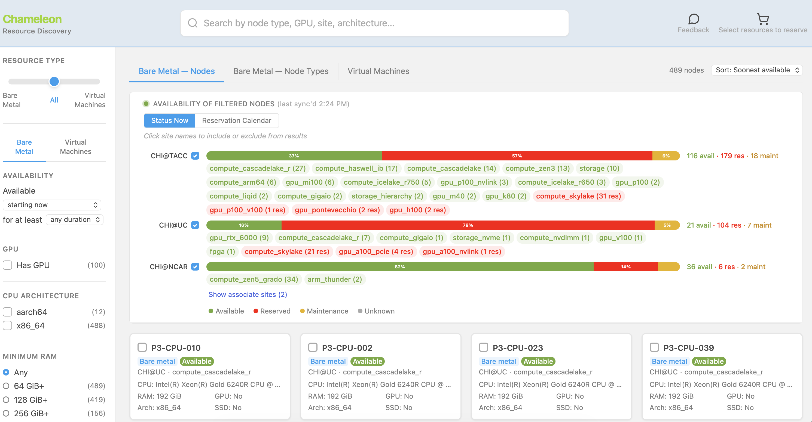

   The Chameleon resource discovery page

Filtering resources
___________________

The search bar at the top of the page filters across all resource types by
keyword — node type name, GPU model, site, architecture, and more. When a
search matches resources in a tab other than the one you are viewing, a notice
appears below the availability panel with a link to switch to that tab.

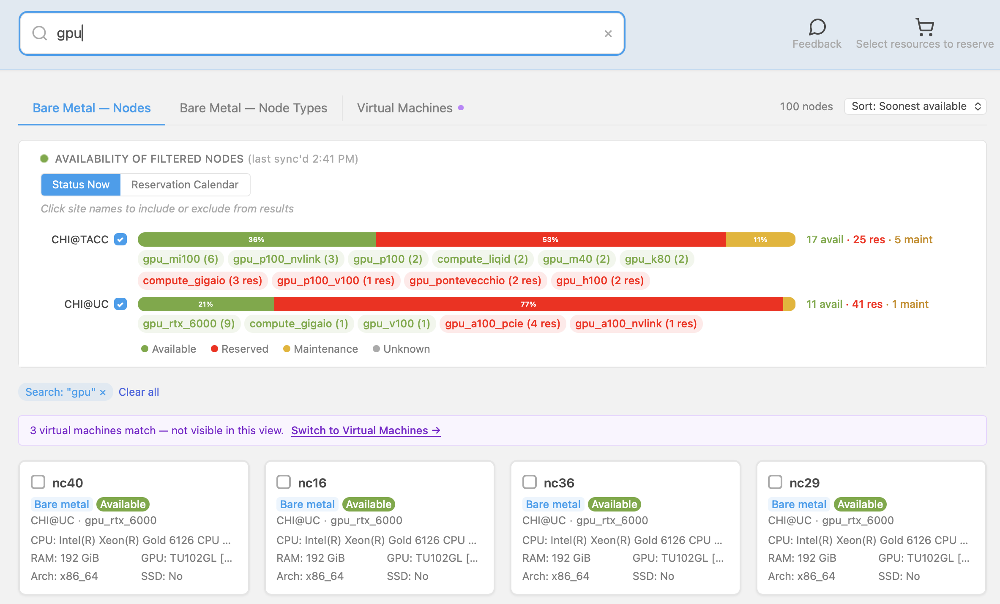

   Search filtering nodes — with a cross-tab match notice

The left sidebar filters the results. Use the **Resource Type** slider to show
bare metal nodes, virtual machine flavors, or both. The **Availability** filters
narrow results to resources free starting at a specific time and for at least a
given duration. Additional quick filters cover GPU presence, CPU architecture,
and minimum RAM.

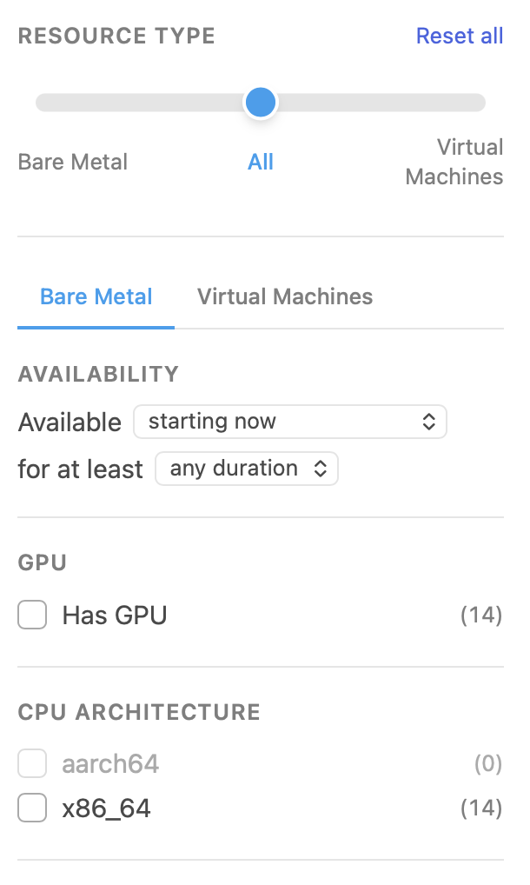

Expand **Advanced Filters** to filter on more specific hardware attributes
including processor model, GPU count and vendor, placement, network, storage,
and RDMA. Click **Reset all** in the sidebar to clear all active filters.

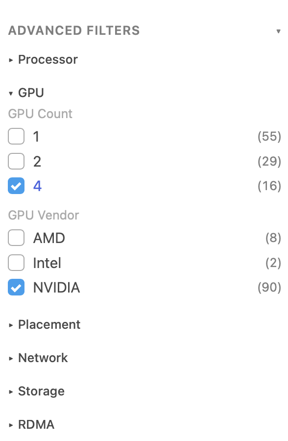

Availability panel
__________________

The **Availability of Filtered Nodes** panel shows current availability across
sites. Each site has a color-coded bar where green is available, red is reserved,
and yellow is under maintenance, with raw counts on the right. Click a site name
to include or exclude it from results.

Node type tags appear under each site. Clicking a tag filters the node list to
that type and shows an active-filter pill below the panel. Tags shown in red
indicate all nodes of that type are currently reserved.

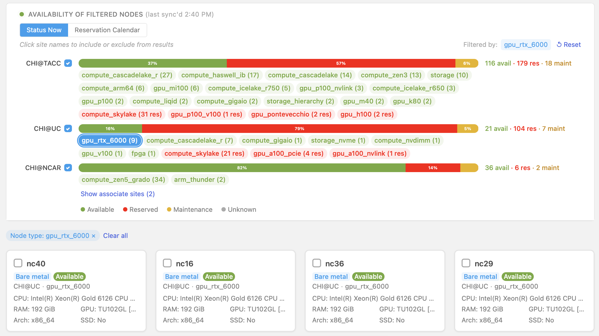

   Status Now — node type tag selected

Switch to **Reservation Calendar** to see upcoming reservations. On the **Bare
Metal — Nodes** tab each node appears as its own row with red bars marking
reserved windows. On the **Bare Metal — Node Types** tab nodes are collapsed to
one row per type — overlapping bars show how many nodes of that type are
simultaneously reserved, making it easy to spot when capacity opens up.

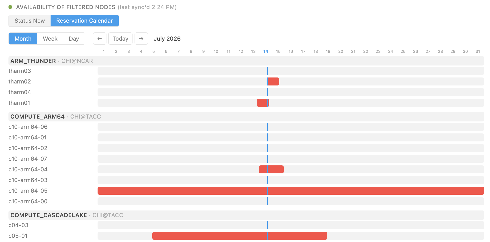

   Reservation calendar — individual nodes

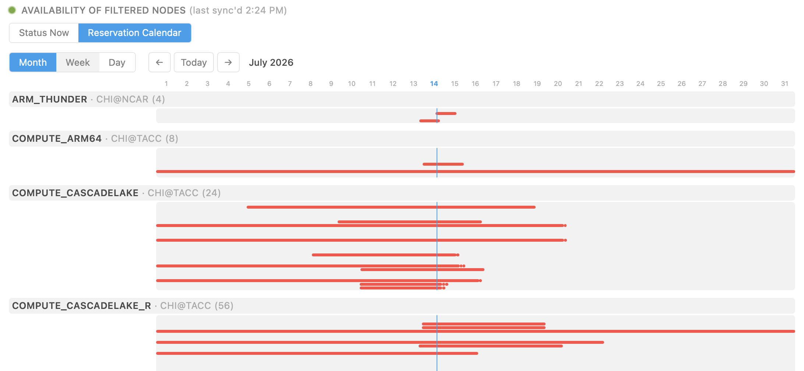

   Reservation calendar — by node type

Bare Metal — Nodes
__________________

The **Bare Metal — Nodes** tab lists individual nodes matching your filters,
sorted by soonest availability. Each card shows the node name, site, node type,
current availability, and key hardware specs. Check the checkbox on a card to
add that node to the reservation cart.

Bare Metal — Node Types
_______________________

The **Bare Metal — Node Types** tab shows one card per node type with aggregated
availability counts across all nodes of that type. Use this view when you need
any available node of a given type rather than a specific one.

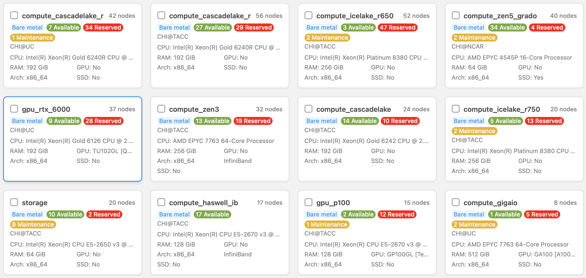

   Bare Metal — Node Types

Node details
____________

Click any node card to open its detail panel. The **Node Info** tab shows the
node's full specifications including its UUID, physical location, CPU, RAM, GPU,
and architecture. Some nodes display an **Admin note** with important information
about hardware capabilities or configuration requirements for that node. An
inline availability chart lets you toggle between a Gantt view for this specific
node and a line graph showing how many nodes of the same type will be free over
the coming weeks at that site.

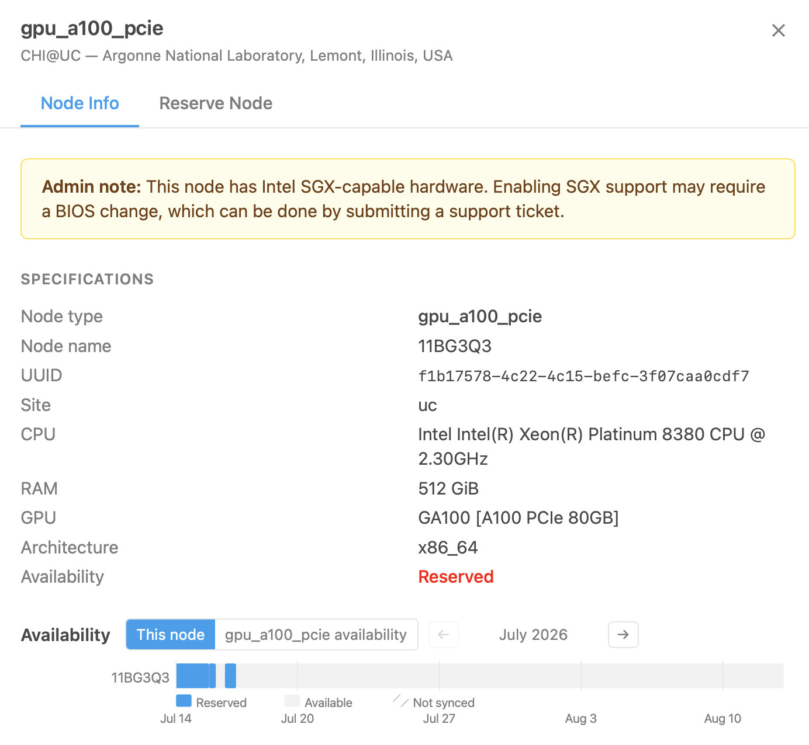

   Node detail — Node Info tab

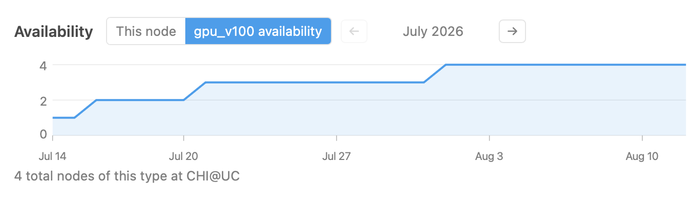

   Node type availability over time

.. note::
   Each node's UUID is shown in the Node Info panel. You will need the UUID
   when reserving a specific node by name or for power monitoring.

.. attention::
   When Chameleon replaces faulty hardware the replacement typically has the
   same specifications. If hardware-level reproducibility matters for your
   experiment, take note of any hardware replacement events that may have
   occurred during your reservation window.

The **Reserve Node** tab generates a ready-to-use reservation command. Choose
**Reserve by node type** to reserve any available node of this type, or
**Reserve by node name** to reserve this exact node. Select a duration and copy
the command for your preferred tool.

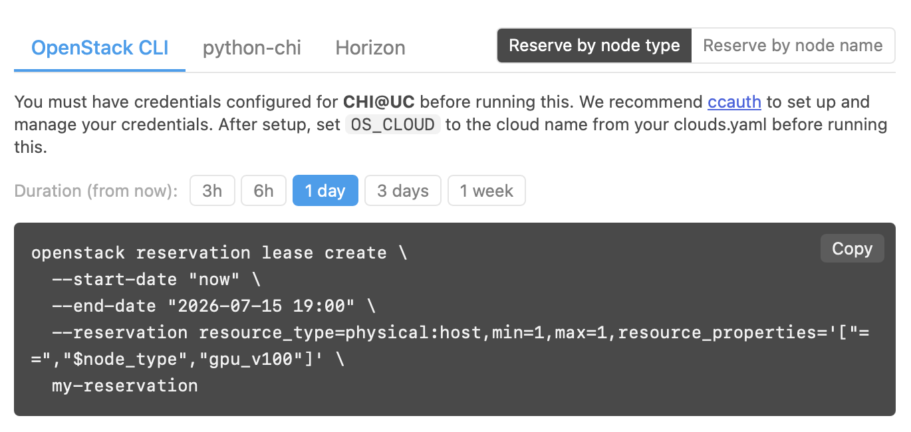

   Reserve Node — OpenStack CLI

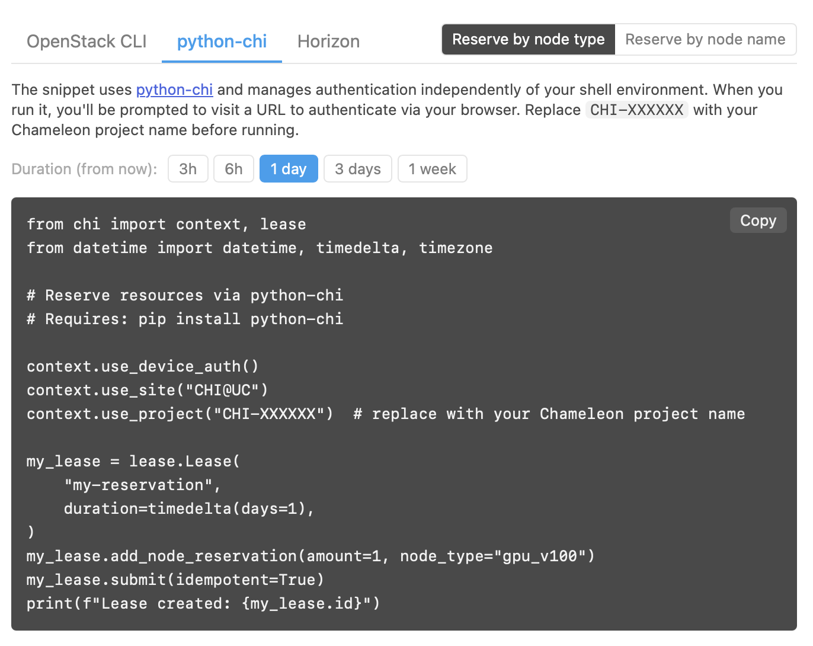

   Reserve Node — python-chi

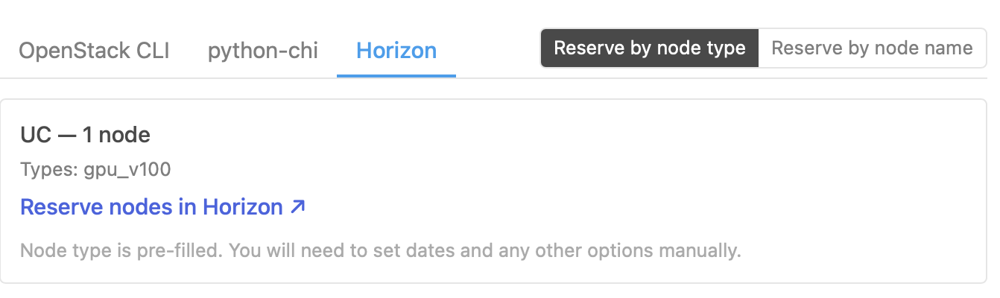

   Reserve Node — Horizon

.. _reserving-from-the-cart:

Reserving from the cart
_______________________

Checking the checkbox on any node or node type card adds it to the reservation
cart. When resources are selected a floating bar appears at the bottom of the
page — click **Reserve selected** to proceed to the cart.

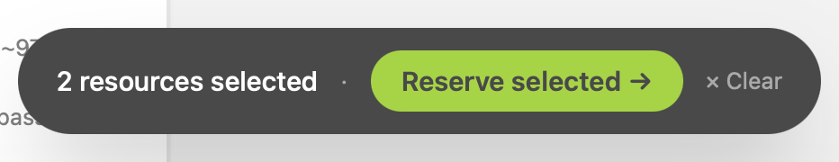

The cart page groups your selections by site and generates reservation
instructions for each group. Resources from different sites or of different
types (bare metal nodes and VM flavors) can be combined in the same cart, and
each site gets its own set of tool tabs, duration picker, and generated command.

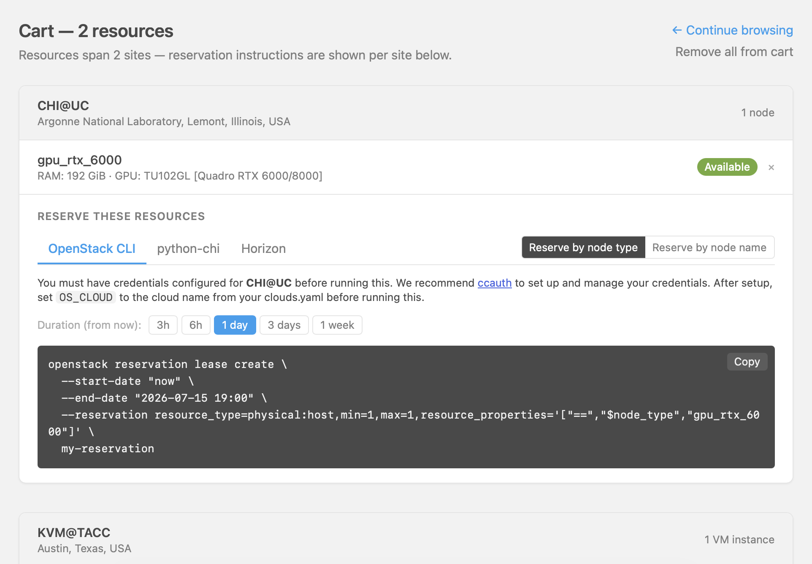

   Cart page — resources from two sites

Use **Continue browsing** to return to the discovery page without losing your
cart, or **Remove all from cart** to clear it. Individual resources can be
removed with the × next to each entry.
