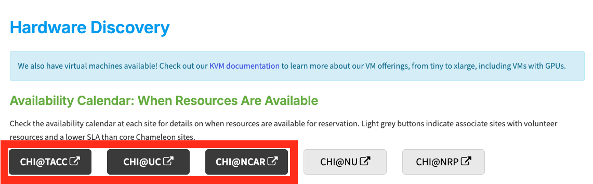
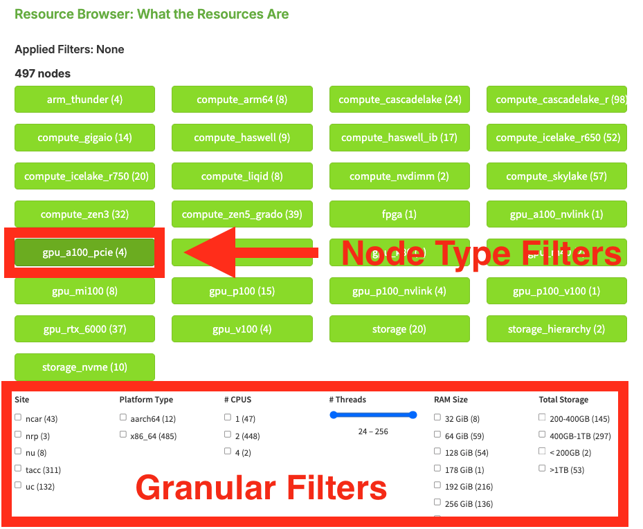
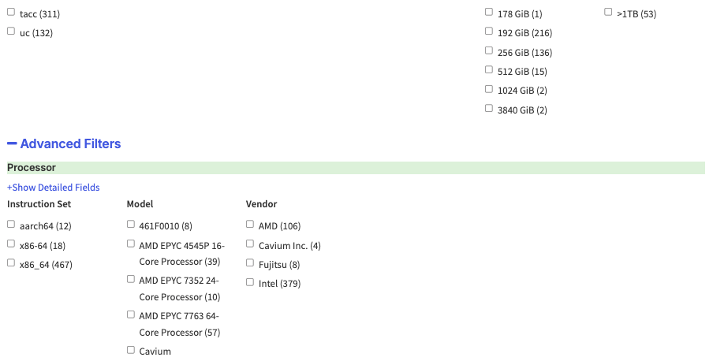
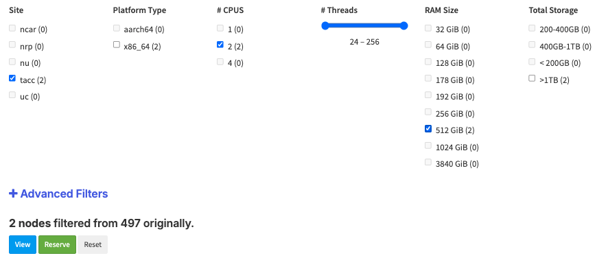
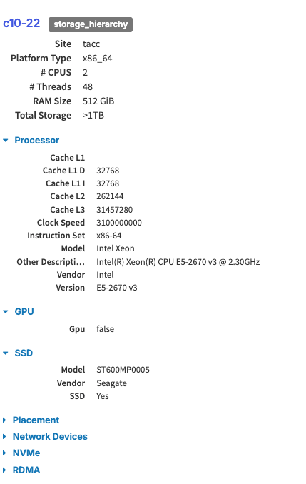
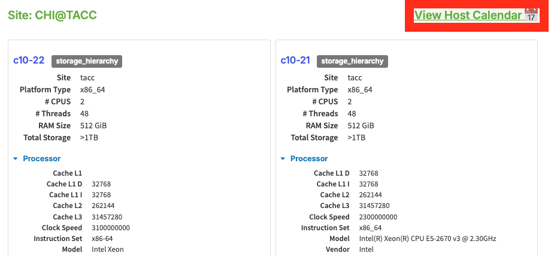
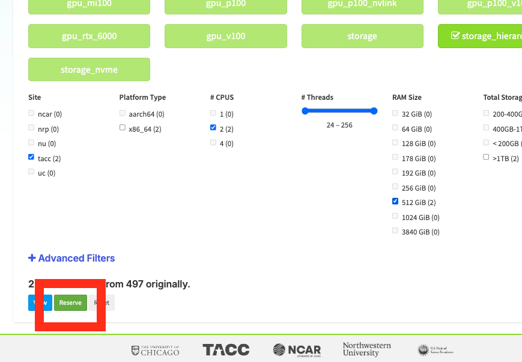
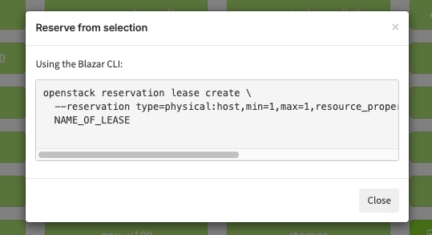

The Hardware Catalog on the Chameleon Portal
============================================

You may use the `Hardware Discovery <https://chameleoncloud.org/hardware/>`_
page at the `Chameleon Portal <https://chameleoncloud.org>`_ to see the
different hardware resource types available at each Chameleon site.

Availability Calendars
______________________

The CHI site buttons in the **Availability Calendar** section of the Resource
Browser allow you to open the :ref:`the-lease-calendars` at the Chameleon
sites. You must log in using your Chameleon account to view these lease
calendars.

   Resource availability links to the lease calendars

Chameleon Resource Browser
__________________________

The Resource Browser allows you to **filter Chameleon resources** by node
type and view details of each node.

You can filter for specific node features by selecting the checkboxes that
match your filter criteria in the menu at the bottom or by clicking on a node
type such as *compute_gigaio* or *gpu_a100_pcie*. The numbers printed next to
the node types indicate the total number of nodes that we have in our capacity.

   The Chameleon Resource Browser

You can also click the **Advanced Filters** dropdown to view even more node
parameters.

After you have selected filter criteria, you can click the **View** button at
the bottom of the page to see details of individual nodes that match your
filtering criteria.

   Node details

.. note::
   All the nodes in Chameleon is identified by their *UUIDs*. You will need the
   *UUID* of a node for making reservations and for power monitoring. In addition,
   each node also has a *Version UUID*, which is used for retrieving its
   maintenance history.

.. attention::
   When we replace faulty hardware on a node, the replacement part typically has
   the same hardware characteristics. For example, a node with a faulty 250 GB
   hard drive would be replaced with the same 250 GB hard drive model. However, it
   may be important for your experimental reproducibility to know about those
   hardware replacement events, in case it affects your metrics.

Checking Availability for Node Types
____________________________________

From the node detail view, you can click the **View Host Calendar** button to
open the site lease calendar for that node. The calendar shows when the node is
reserved, letting you identify open windows before making a reservation.
For instructions on creating a lease, see :ref:`reservations-create-lease-gui`.

If you have filtered the resource browser down to a single node type, clicking
**View Host Calendar** will open the calendar with that node type pre-selected,
saving you from having to filter manually after landing on the calendar page.
If your current filters produce results spanning multiple node types, the
calendar will open in its default view with a default node type loaded instead.

   Node detail view with availability and reserve buttons

.. note::
   You must be logged in to a Chameleon site to view its lease calendar. If you
   follow a direct link to a site calendar while logged out, you will be
   redirected to log in and then returned to the calendar automatically.

Generating a Reservation Script
_______________________________

From the filter page of the Hardware Resource Browser, you can also generate a
reservation script by clicking the **Reserve** button at the bottom of the
page. The generated command varies depending on your current filter state:

- If you have filtered down to a **single node type**, the command will reserve
  one node of that type by node type name.
- If your filters produce a list of **nodes across multiple types**, the command
  will reserve each of those exact nodes by their individual UUIDs.

When clicking the **Reserve** button, a dialog containing the auto-generated
command will appear for you to copy and paste.

   An auto-generated reservation script

.. seealso::

   `Streamlining Resource Discovery and Reservations
   <https://blog.chameleoncloud.org/posts/streamlining-resource-discovery-and-reservations/>`_
   — A Tips&Tricks post walking through the hardware browser's filtering,
   calendar, and reservation workflow end-to-end with a practical example.