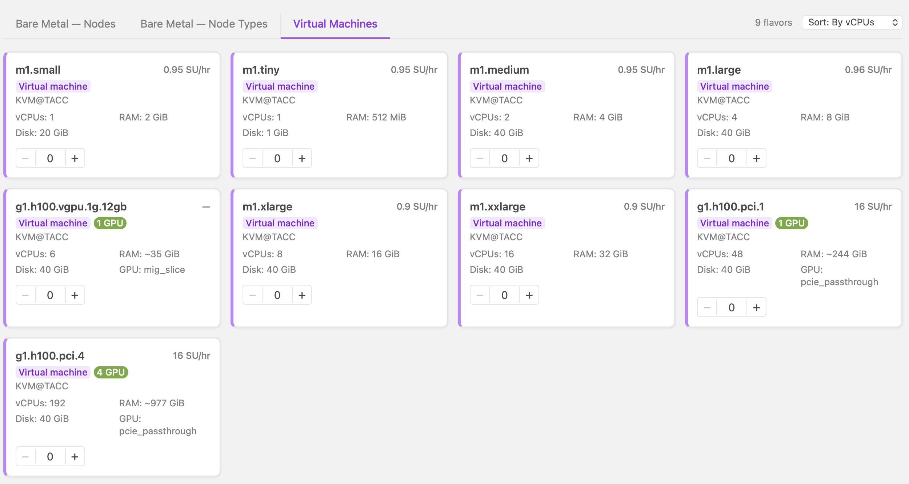
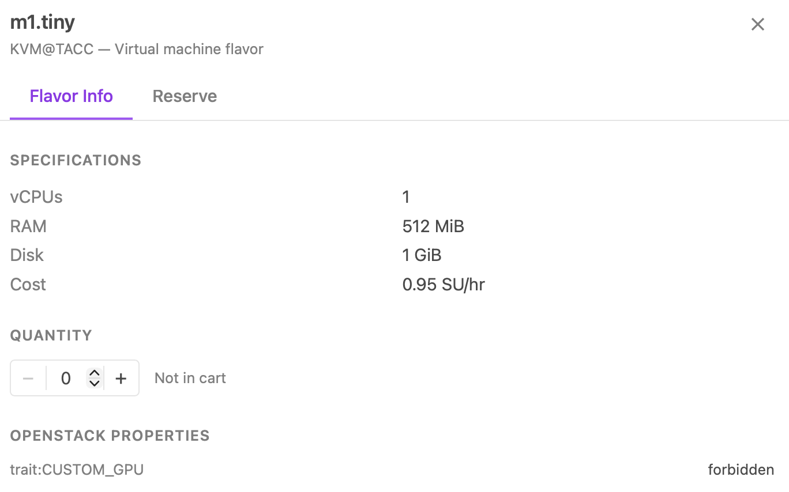
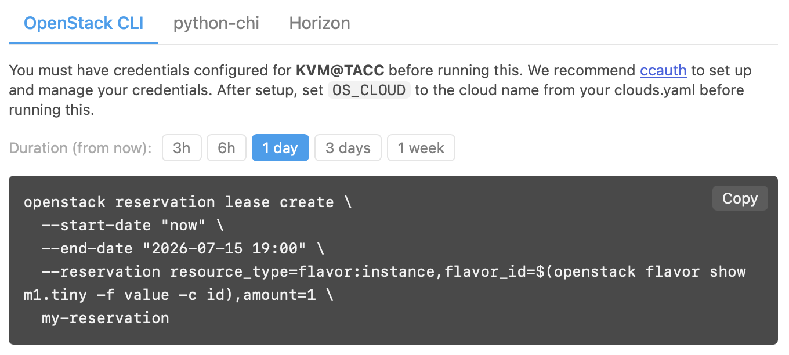
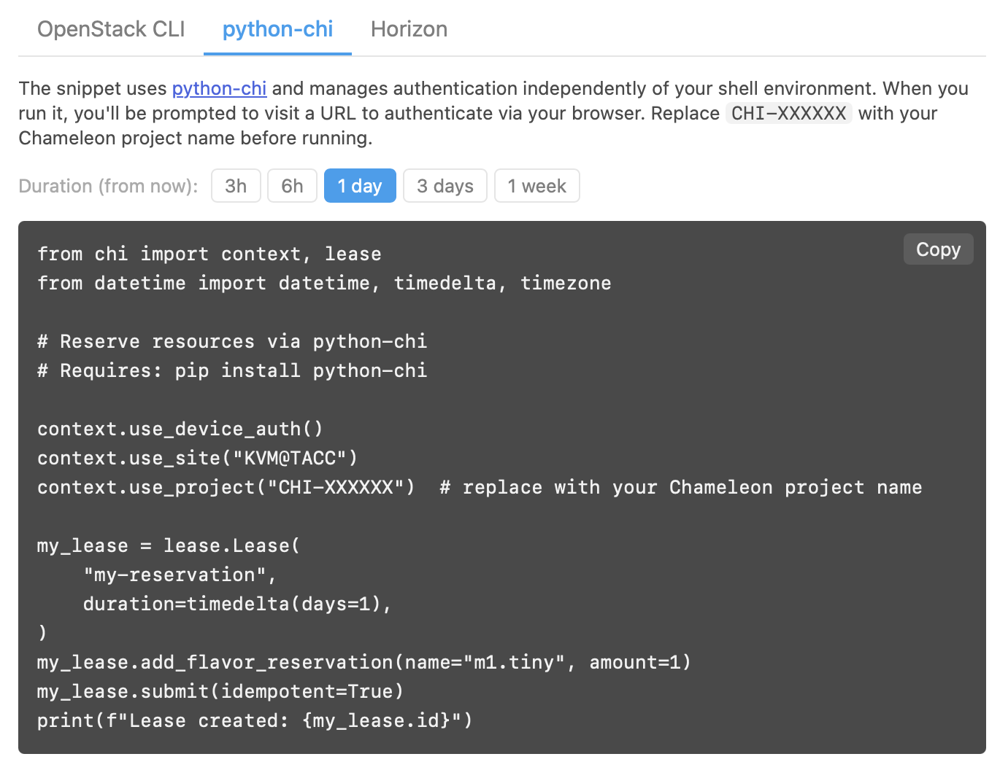
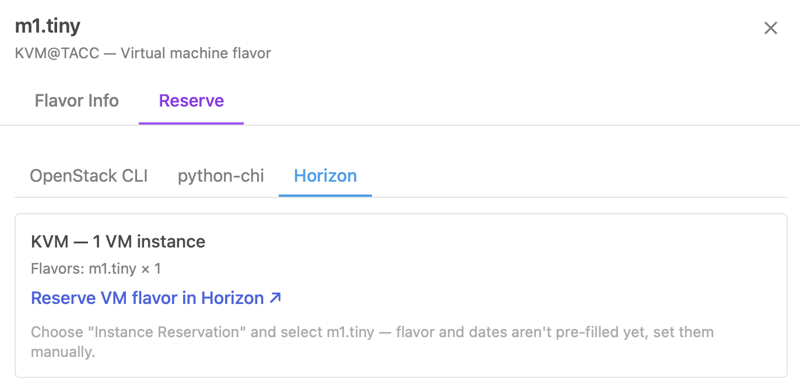

Virtual machine flavors
=======================

Chameleon offers virtual machine (VM) flavors through KVM@TACC. You can browse
and reserve VM flavors from the **Virtual Machines** tab on the `Resource
Discovery <https://discover.chameleoncloud.org>`_ page.

   Virtual machine flavor cards

Each flavor card shows its vCPUs, RAM, disk size, and cost in Service Units per
hour. GPU flavors are labeled with their GPU count and come in MIG slice
(``vgpu``) and PCIe passthrough (``pci``) variants. Set a quantity directly on
the card or click the card to open the detail panel.

The **Flavor Info** tab shows full specifications and the flavor's OpenStack
properties.

   VM flavor detail panel — Flavor Info tab

Reserving a VM flavor
_____________________

The **Reserve** tab generates a ready-to-use reservation command for the
selected flavor. Choose a duration and copy the command for your preferred tool.

   Reserve VM flavor — OpenStack CLI

   Reserve VM flavor — python-chi

   Reserve VM flavor — Horizon

.. note::
   When reserving via Horizon, the flavor is not pre-filled — select it and
   set the dates manually after following the link.

To reserve VM flavors together with bare metal nodes in a single operation, add
them to the cart and proceed to checkout — see :ref:`reserving-from-the-cart`.
