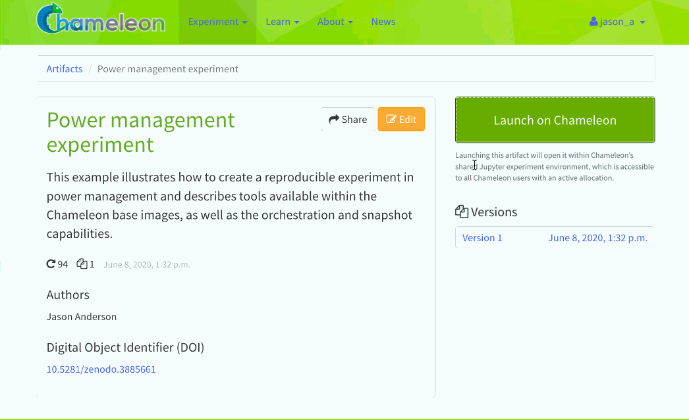

.. _trovi-browsing:

Browsing & Launching Artifacts
==============================

Trovi allows you to browse artifacts, presented in a scrolling list format, and
to search or filter to narrow down results. You can also see how many times
people have downloaded and launched an artifact via the icons in the bottom
left corner of each entry.

Searching & Filtering Artifacts
--------------------------------

On the Trovi homepage, the **Browse Artifacts** section provides a search bar
where you can type keywords to find relevant artifacts. The search supports a
few operators to refine your results:

- Wrap a phrase in quotes (e.g. ``"data science"``) to search for an exact
  match.
- Use ``OR`` to broaden the search across multiple terms.
- Prefix a word with ``-`` (e.g. ``-jupyter``) to exclude it from results.

Beyond keyword search, you can narrow results further using the options on the
right-hand side:

- **Tags**: filter by category, such as ``education``, ``experiment``,
  ``reproducible research``, or ``appliance``.
- **Badges**: filter by badge, such as ``chameleon supported``,
  ``reproducible``, or ``educational``. Artifacts supported by the Chameleon
  team display a small Chameleon logo; you can contact the |Help Desk| if you
  are using one of these artifacts and encounter issues.
- **Filters**: narrow results to only your own artifacts, only public
  artifacts, collections, or artifacts with a DOI.

Results can also be sorted by relevance or other criteria.

.. tip::

   Chameleon appliances — including Chameleon-supported OS images and heat
   templates — are published on Trovi and discoverable via the **appliance**
   tag. Whether you are looking for a Jupyter notebook or a bare-metal image,
   you can find either one via Trovi.

Viewing Artifact Details
------------------------

Click on an artifact of interest from the search results to open its detail
page. At the top you'll find the artifact's title and at-a-glance stats — total
launches, unique users, users who launched on Jupyter, versions, and last
updated date — followed by an **About** section describing generally what the
artifact does, how it works, hardware requirements, expected runtime, and
outputs. The right-hand sidebar includes a launch action (see below), an
**Authors** list with institutional affiliations and contact emails, a
**Versions** panel for browsing prior releases, a **Citation** section with
ready-to-copy standard and BibTeX citations, and a link to the artifact's
source repository (e.g., GitHub) if you want to explore the underlying files.

Launching an Artifact
-----------------------

The most powerful feature available via Trovi is the ability to re-launch the
available artifacts within Chameleon. Clicking "Launch with JupyterHub" will
open a new Jupyter Notebook server with the artifacts downloaded (we support
artifacts up to 500MB in total size, contact the |Help Desk| if you need
more space). The animation below shows how easy it is:

   Clicking the "Launch with JupyterHub" button to import a Trovi artifact into
   your own Jupyter server.