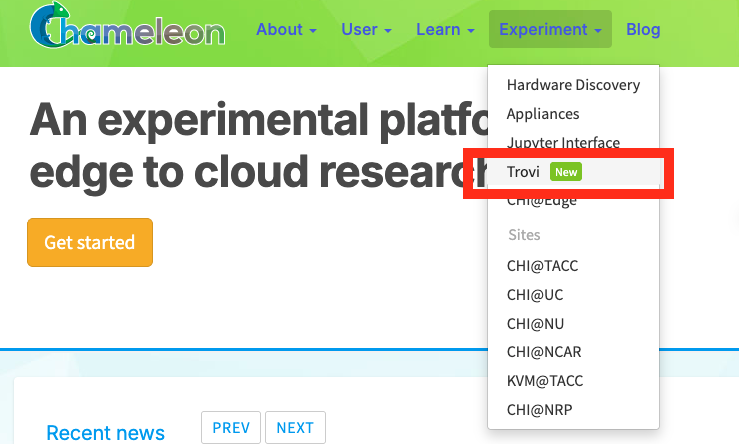

.. _trovi:
.. _experiments:

=================================
Packaging & Sharing Experiments
=================================

`Chameleon Trovi <https://trovi.chameleoncloud.org/dashboard/artifacts>`_ is a
sharing portal that allows you to share digital research and education
artifacts, such as images, complex appliances, packaged experiments, workshop
tutorials, or class materials. Each research artifact is represented as a
deposition (a remotely accessible folder) where a user can put Jupyter
notebooks, links to images, orchestration templates, data, software, and other
digital representations that together represent a focused contribution that can
be run on Chameleon. Users can use these artifacts to recreate and rerun
experiments or class exercises on a Jupyter Notebook within Chameleon. They can
also create their own artifacts and publish them directly to Trovi from within
:ref:`Chameleon's Jupyter server <jupyter>`.

.. note::
   Trovi is now the sole home for Chameleon appliances as well as user
   experiments. All Chameleon-supported OS :doc:`images <../images/index>` and
   :doc:`Complex Appliance <../complex/index>` heat templates are published
   and discovered on Trovi by filtering for the **appliance** tag — the
   legacy Appliance Catalog is deprecated and no longer used.

To get started, find the "Trovi" dropdown option under the "Experiment" section
of chameleoncloud.org. Once you're on the Trovi homepage, you'll see a list of
publicly available experiments and other digital artifacts. You can now browse
those artifacts or upload your own.

   The "Trovi" option under the "Experiment" section takes you to Trovi.

Once your artifact is packaged and shared, you may also want non-Chameleon
users to be able to reproduce it — see :doc:`daypass` for how to grant
reviewers and collaborators temporary access without a full Chameleon
allocation.

.. toctree::
   :maxdepth: 2
   :caption: Packaging & Sharing Topics

   browsing_artifacts
   packaging_artifacts
   daypass
