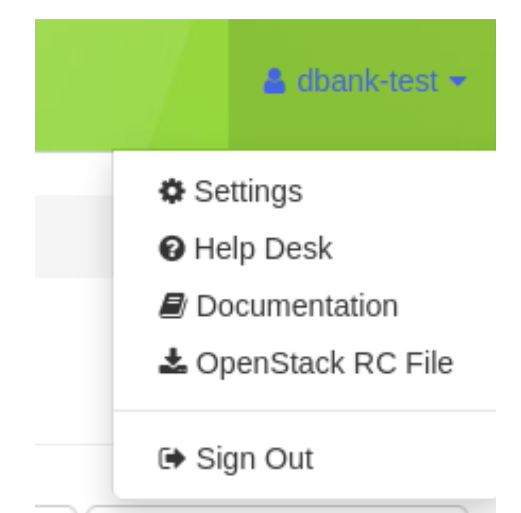

==============================
The Graphical User Interface
==============================

__________________________
Introduction
__________________________

The Graphical User Interface (GUI) provides a point-and-click interface for working with Chameleon resources. From the GUI, you may perform tasks such as manage and launch instances, and configure custom networking. Additionally, you may download an OpenStack RC file from the GUI if you wish to work with a Command Line Interface, instead. The Chameleon GUI is web-based, using OpenStack Horizon for its front end. There are two Chameleon resource sites, each with its own URL.

- Texas Advanced Computing Center resources are available at:
  
    https://chi.tacc.chameleoncloud.org

- University of Chicago resources are available at:
  
    https://chi.uc.chameleoncloud.org

Chameleon also hosts an OpenStack KVM implementation where you may work with virtual machines. This site does not have access to bare metal resources. It is available at:

    https://openstack.tacc.chameleoncloud.org

This document provides an overview of features available on GUIs for the bare metal sites at Texas Advanced Computing Center and University of Chicago. Documentaiton is also available for :doc:`kvm`.

You may login to either site using your Chameleon portal username and password.

.. note:: If you are a new user or have just changed your password on http://www.chameleoncloud.org it takes approximately 10 minutes for changes to propagate to each site.

Each Chameleon site shares user accounts, but snapshots, keypairs, Swift containers, Gnocchi statistics and other objects at each site are independent of each other. A keypair created at the Texas Advanced Computing Center site would not be available at the University of Chicago site. In addition, the bare metal resource types vary between Texas Advanced Computing Center and University of Chicago.

__________________________
GUI Features
__________________________

Upon logging in to the GUI at a Chameleon site, you will see your project's Overview page.

.. figure:: gui/gui.png
   :alt: The Chameleon GUI

   The Chameleon GUI

In the upper left of the screen next to the Chameleon logo, there is a dropdown where you may switch between any projects that your user account is a member of.

.. figure:: gui/project_dropdown.png
   :alt: Switching between projects

   Switching between projects

In the upper right of the screen, you will see your account name. You may click on it to view a dropdown that allows you to access user specific settings.

   The user dropdown menu

.. _gui-settings:

Settings
________

In the settings menu, you can change specific user settings such as your Timezone.

.. figure:: gui/user_settings.png
   :alt: User settings

   User settings

You may wish to change your Timezone. You current Timezone will be used when creating reservations for bare metal resources. UTC is the default Timezone. 

Help
____

Clicking on the Help menu item will take you to this documentation site.

OpenStack RC File v2 and OpenStack RC File v3
_____________________________________________

Clicking on either of these menu items will download a customized RC file for use with the OpenStack Command Line Interface. These RC files may be run in Linux/macOS shell environments with the terminal command ``source CH-XXXXXX-openrc.sh`` (where *XXXXXX* is your project number.) This will configure environment variables that allow you to easily log in using the Command Line Interface.

Themes
______

You may change the GUI theme by selecting any of these menu items.

Sign Out
________

This will sign you out of the GUI for your current site. If you do not sign out manually, your session will automatically sign out in 30 minutes.

_________________________
Navigating the GUI
_________________________

You may navigate between different sections of the GUI using the sidebar.

.. figure:: gui/sidebar.png
   :alt: The GUI sidebar

   The GUI sidebar

__________________________
Compute
__________________________

The Compute section contains many of the common tasks needed to work with single bare metal instances.

Overview
________

The Overview page provides a graphical summary of your project's current resource usage. 

.. figure:: gui/overview.png
   :alt: The Overview page

   The Overview page

At the bare metal sites, you may launch as many instances as you like. On the OpenStack KVM site, your project is limited to a certain number of virtual machines. By default, each project is allowed to allocate 50 Floating IP addresses and use 10 Security Groups. You may request additional resources by submitting a help ticket using the :ref:`help-desk`.

Instances
_________

The Instances page allows you to work with instances at your site. You may use this page to launch and terminate bare metal instances at Texas Advanced Computing Center and University of Chicago. 

.. figure:: gui/instances.png
   :alt: The Instances page

   The Instances page

Images
______

The Images page allows you to edit Snapshots and Images. You may use this page to launch Images. You may edit Images that you own. Additionally, this page features an interactive search bar for filtering which Images are displayed.

.. figure:: gui/images.png
   :alt: The Images page

   The Images page

.. _gui-key-pairs:

Key Pairs
_________

The Key Pairs page allows you to work with SSH key pairs associated with your user account on the site at which you are logged in.

.. figure:: gui/key_pairs.png
   :alt: The Key Pairs page

   The Key Pairs page

Your SSH key pairs are available to each project you are a member of. Chameleon stores the Public Key for each SSH key pair and does not retain the associated Private Key. You may delete Public Keys by clicking on the *Delete Key Pair* button next to it. You may delete multiple Public Keys by clicking on the checkbox next to each key and clicking the *Delete Key Pairs* button in the toolbar.

Creating a Key Pair
===================

You may generate a new Public/Private Key Pair on Chameleon using the GUI. Click the *+ Create Key Pair* button in the tool bar. This will open a dialog, prompting you to specify a name for your new Key Pair.

.. figure:: gui/create_key_pair_name.png
   :alt: Specifying a key pair name

   Specifying a key pair name

After entering aname for your Key Pair, a file will automatically be downloaded in your browser with the extension ``.pem``. This is the Private Key in ``PEM`` format. The Public Key associated with this Private Key is now stored at your current Chameleon site. Clicking on the *Regenerate and download Key Pair* button will generate a new random Public/Private Key Pair and initiate a new download for your new Private Key pair. This new Private Key will not match the previously generated file.

.. _importing-key-pair:

Importing a Key Pair
====================

Alternatively, you may import a Public Key for a Key Pair that you have generated on your computer. Click the *Import Key Pair* button in the tool bar. This will open a dialog that allows you to provide a name for the Key Pair and paste the contents of the Public Key file. This dialog also provides information on how to generate a key pair using the Linux/macOS terminal.

.. figure:: gui/import_key_pair.png
   :alt: Importing a public key

   Importing a public key

API Access
__________

This page allows you to view REST endpoints and ports for configuring the Command Line Interface.

.. figure:: gui/api_access.png
   :alt: The API Access page

   The API Access page

Each line displayed is a different environment variable that you may set using the Command Line Interface. Alternatively, you may click either of the *Download OpenStack RC* buttons in the toolbar to download a shell script that will configure these settings for you.

__________
Network
__________

The Network section of the GUI allows you to work with virtual network resources. You may configure routers and virtual networks. For more information, see :doc:`networks`.

Network Topology
________________

The Network Topology page displays your current virtual network topology in either the Topology or Graph formats. You may use this page to directly launch instances, create networks or create routers using the buttons in the tool bar.

.. figure:: gui/network_topology.png
   :alt: The Network Topology page

   The Network Topology page

Networks
________

The Networks page provides a tabular view of Virtual Networks. You may use this page to work with Virtual Networks and associated Subnets.

.. figure:: gui/networks.png
   :alt: The Networks page

   The Networks page

Routers
_______

The Routers page allows you to manipulate Routers within your project. 

.. figure:: gui/routers.png
   :alt: The Routers page

   The Routers page

Security Groups
_______________

The Security Groups page allows you to manipulate Security Groups within your project.

.. figure:: gui/security_groups.png
   :alt: The Security Groups page

   The Security Groups page

.. note:: Currently, bare metal sites do not implement security groups. All ports are open to the public Internet at each bare metal site.

Floating IPs
____________

The Floating IPs page allows you to work with Floating IP addresses allocated to your project.

.. figure:: gui/floating_ips.png
   :alt: The Floating IPs page

   The Floating IPs page

You may use this page to allocate Floating IP addresses to your project, associate them with instances or release them back to the general Floating IP pool for other Chameleon Users.

Releasing Floating IP Addresses
===============================

If your project is not currently using a Floating IP address that you have allocated, you should release the Floating IP address for other Chameleon users and projects to use. They are a shared, finite resource. Releasing Floating IP addresses allows you to be a "good citizen". You may release a single Floating IP address by selecting *Release Floating IP* in the *Actions* dropdown for that IP address. You may release multiple addresses by selecting them using their check boxes and clicking
the *Release Floating IPs* button in the tool bar.

   Releasing a Floating IP address

_____________
Orchestration
_____________

The Orchestration section allows you to work with Chameleon's Complex Appliance and Orchestration functionality. Complex Appliances, after launched, are referred to as Stacks. For more information, see :doc:`complex`.

Stacks
______

Complex Appliances in Chameleon are implemented using OpenStack Heat. Therefore, they are referred to in the GUI as *Stacks*. The Stacks page allows you to launch, rebuild, or terminate stacks. Stacks are separate from individually launched bare metal instances. When you terminate a Stack, all bare metal instances launched by the Stack are also termianted.

.. figure:: gui/stacks.png
   :alt: The Stacks page

   The Stacks page

Resource Types
______________

The Resource Types page allows you to view Orchestration Resource Types that are available on Chameleon. These are used when writing Heat Orchestration Templats.

.. figure:: gui/resource_types.png
   :alt: The Resource Types page

   The Resource Types page

You may filter for different Resource Types. You may also click on a Resource Type to view details about that Resource Type, such as Attributes and Properties.

Template Versions
_________________

The Template Versions page allows you to access information about supported features within each Heat Orchestration Template version implemented on Chameleon.

.. figure:: gui/template_versions.png
   :alt: The Template Versions page

   The Template Versions page

____________
Object Store
____________

The Object Store section contains only the Containers page, which allows you to work with the Swift object store system. A container may contain multiple objects, which are typically individual files. For more information, see :doc:`swift`.

.. figure:: gui/containers.png
   :alt: The Containers page

   The Containers page

____________
Reservations
____________

The Reservations section contains only the Leases page, which allows you to manage leases for bare metal nodes. For more information, see :doc:`reservations`.

.. figure:: gui/leases.png
   :alt: The Leases page

   The Leases page

___________
Identity
___________

The Identity section contains only the Projects page, which allows you to view which projects you are currently a member of.

.. figure:: gui/projects.png
   :alt: The Projets page

   The Projects page
