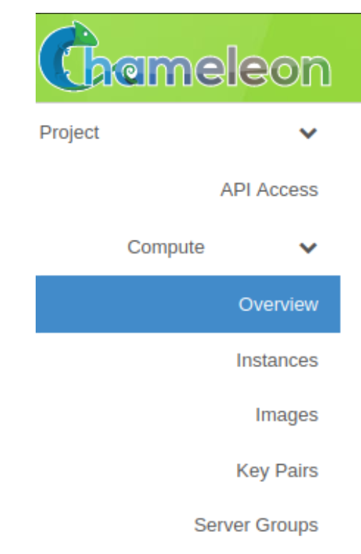
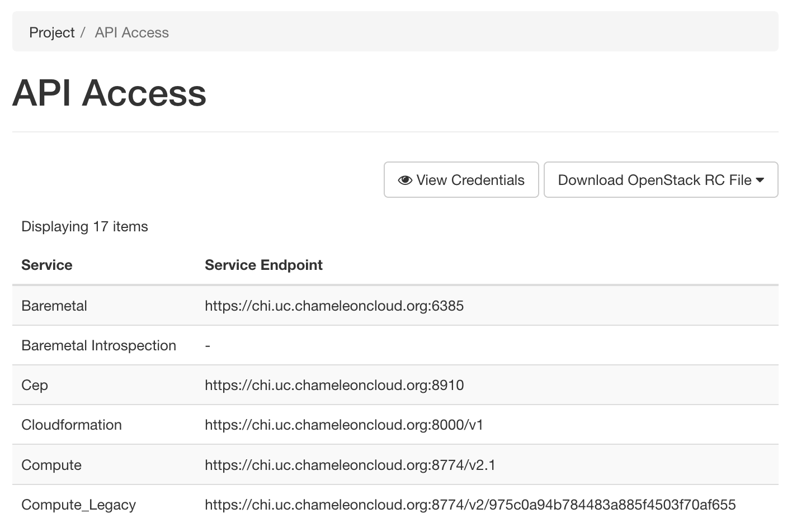

==============================
The Graphical User Interface
==============================

__________________________
Introduction
__________________________

The Graphical User Interface (GUI) provides a point-and-click experience for working with Chameleon resources. From the GUI, you may perform tasks such as manage and launch instances, and configure custom networking. Additionally, you may download an *OpenStack RC* file from the GUI if you wish to work with the :ref:`Command Line Interface <cli>`, instead. The Chameleon GUI is built on top of `OpenStack Horizon <https://docs.openstack.org/horizon/latest/>`_. There are two Chameleon resource sites, each with its own URL (though it is possible to easily switch from one to other, see :ref:`gui-project-menu`).

- The Texas Advanced Computing Center resources (CHI@TACC) are available at:

    https://chi.tacc.chameleoncloud.org

- The University of Chicago resources (CHI@UC) are available at:

    https://chi.uc.chameleoncloud.org

Chameleon also hosts an *OpenStack KVM* implementation where you may work with virtual machines. This site **does not** have access to bare metal resources. It is available at:

    https://openstack.tacc.chameleoncloud.org

This section provides an overview of features available on the GUI for the bare metal sites at the Texas Advanced Computing Center (`CHI@TACC <https://chi.tacc.chameleoncloud.org>`_) and the University of Chicago (`CHI@UC <https://chi.uc.chameleoncloud.org>`_). For information about *OpenStack KVM*, please see :doc:`kvm`.

You may login to either site using your Chameleon portal username and password.

.. note:: If you are a new user or have just changed your password on http://www.chameleoncloud.org, it takes approximately 10 minutes for changes to propagate to each site.

.. _bare-metal-sites-independent:
.. attention::
    These two Chameleon bare metal sites---`CHI@TACC <https://chi.tacc.chameleoncloud.org>`_ and `CHI@UC <https://chi.uc.chameleoncloud.org>`_---**only** share user accounts, but snapshots, keypairs, Swift containers, Gnocchi metrics and other objects at each site are **independent**. For example, a keypair created at the `CHI@TACC <https://chi.tacc.chameleoncloud.org>`_ site is **not** available at the `CHI@UC <https://chi.uc.chameleoncloud.org>`_ site. In addition, the bare metal resource types vary between `CHI@TACC <https://chi.tacc.chameleoncloud.org>`_ and `CHI@UC <https://chi.uc.chameleoncloud.org>`_.

__________________________
GUI Features
__________________________

Upon logging in to the GUI at a Chameleon site, you will see your project's Overview page.

.. figure:: gui/gui.png
   :alt: The Chameleon GUI

   The Chameleon GUI

.. _gui-project-menu:

Project and Region Menu
__________________________

To switch among the projects you belong to, use the project and region menu - the dropdown on the upper left of the screen next to the Chameleon logo. You can also use this menu to switch from one Chameleon site to the other (sites are called *regions* in OpenStack terminology). This allows you to easily perform multi-site experiments without logging in twice.

.. figure:: gui/project_dropdown.png
   :alt: Switching between projects

   Switching between projects

.. _gui-user-menu:

.. Attention::
   If you switch from one site to the other, make sure you have selected the site that you want to use before starting an experiment.

User Menu
__________________________

To access user specific settings and download *OpenStack RC* files, use the user menu - the dropdown on the upper right of the screen where you will see your account name.

.. figure:: gui/user_dropdown.png
   :alt: The user dropdown menu

   The user dropdown menu

.. _gui-settings:

Settings
________

In the settings menu, you can change user specific settings such as the Timezone.

.. figure:: gui/user_settings.png
   :alt: User settings

   User settings

.. Note::
   Updating your Timezone is **highly** recommended. When you make reservations for bare metal resources, your local time will be used. UTC is the default Timezone. 

Help
____

The *Help* menu item will take you to this documentation site.

OpenStack RC File v2 and OpenStack RC File v3
_____________________________________________

Clicking on either of these menu items will download a customized RC file for use with the OpenStack Command Line Interface. Source the RC file using ``source`` command to configure environment variables that allow you to easily log in using the :ref:`Command Line Interface <cli>`. For more information about *OpenStack RC* script, please see :ref:`cli-rc-script`.

Themes
______

You may change the GUI theme by selecting the provided menu items.

Sign Out
________

Use the *sign out* menu item to sign out from your current site. 

.. note::
    If you do not sign out manually, your session will expire in 30 minutes.

_________________________
Navigating the GUI
_________________________

The navigation sidebar allows you to access different sections.

   The GUI sidebar

.. _gui-compute:

__________________________
Compute
__________________________

Use *Compute* section for reserving, configuring and managing your instances. 

Overview
________

The Overview page provides a graphical summary of your project's current resource usage. 

.. figure:: gui/overview.png
   :alt: The Overview page

   The Overview page

.. note::
	At the bare metal sites, you may launch as many instances as you like, but bounded by the project :ref:`Service Unit <service-units>` allocation. However, at the OpenStack KVM site, your project is limited to a certain number of virtual machines. By default, each project is allowed to allocate 50 *Floating IP addresses* and use 10 *Security Groups*. You may request additional resources by submitting a ticket on the `help desk <https://www.chameleoncloud.org/user/help/>`_.

.. _gui-compute-instances:

Instances
_________

The Instances page allows you to work with your instances. You may launch, terminate, monitoring, associate/dissociate a floating IP to a instance. Clicking on the dropdown list in *Action* column to see what you are eligible to do to your instances.

.. figure:: gui/instances.png
   :alt: The Instances page

   The Instances page

Images
______

The Images page allows you to view, upload and edit the images. You may also use this page to launch instance using selected images.

.. note:: You can only edit the images you own.

.. figure:: gui/images.png
   :alt: The Images page

   The Images page
   
.. tip:: Search for images using the filter bar.

.. _gui-key-pairs:

Key Pairs
_________

The Key Pairs page allows you to create, import and manage SSH key pairs associated with your user account.

.. figure:: gui/key_pairs.png
   :alt: The Key Pairs page

   The Key Pairs page

.. note:: Chameleon **only** stores the *Publc Key* for each SSH key pair. **Do not** upload your *Private Key* to the portal!

To delete a SSH key pair, click on the *Delete Key Pair* button in the *Action* column. You may delete multiple key pairs by selecting them via the checkbox and clicking the *Delete Key Pairs* button.

Creating a Key Pair
===================

To create a key pair, click the *+ Create Key Pair* button. In the prompted dialog, provide a name for your new key pair and then click the *Create Key Pair* button.

.. figure:: gui/create_key_pair_name.png
   :alt: Specifying a key pair name

   Specifying a key pair name

A ``.pem`` file that contains the *Private Key* should be automatically downloaded. In addition, the *Public Key* associated with the *Private Key* should be saved automatically to Chameleon. Clicking on the *Regenerate and download Key Pair* button will generate a new *Public/Private Key Pair* and initiate a new download of the *Private Key*.

.. tip:: Save the *Private Key* to a location you will remember at your local file system. Your *home* directory is recommanded for macOS and Linux systems.

.. _importing-key-pair:

Importing a Key Pair
====================

Alternatively, you may import a key pair that you have generated on your computer. Clicking the *Import Key Pair* button to prompt the dialog. Then, provide a name for your imported key pair and paste the *Public Key*.

.. tip:: The prompted dialog contains the instructions on how to generate a key pair using the Linux/macOS command.

.. figure:: gui/import_key_pair.png
   :alt: Importing a public key

   Importing a public key
   
.. tip::
   Typically, the key generated from your computer will be at ``~/.ssh/id_rsa.pub``. On Mac OS X, you can run in a terminal: ``cat ~/.ssh/id_rsa.pub | pbcopy``. It copies the content of the public key to your copy/paste buffer. Then you can simply paste in the "Public Key" box.

.. _gui-api-access:

API Access
__________

The API Access page lists all the available REST APIs that are used for configuring the :ref:`Command Line Interface <cli>`. In addition, you may download :ref:`OpenStack RC <cli-rc-script>` scripts and view your Chameleon credentials via this page.

   The API Access page

__________
Network
__________

The Network section allows you to work with virtual network resources, such as configuring routers and virtual networks. For more information, please see :doc:`networks`.

Network Topology
________________

The Network Topology page displays your current virtual network topology in either the *Topology* or *Graph* formats. You may also use this section to directly launch instances, create networks or create routers.

.. figure:: gui/network_topology.png
   :alt: The Network Topology page

   The Network Topology page

Networks
________

The Networks page lists all the Virtual Networks of the selected project. You may use this section to create, delete and modify Virtual Networks. Clicking on the dropdown list (if shown) in *Action* column to see what you are eligible to do to your virtual networks.

.. figure:: gui/networks.png
   :alt: The Networks page

   The Networks page

Routers
_______

Same as the Networks page, the Routers page allows you to work on the Routers of the selected project. 

.. figure:: gui/routers.png
   :alt: The Routers page

   The Routers page

Security Groups
_______________

Use the Security Groups page to create, delete, and modify the Security Groups of the selected project.

.. figure:: gui/security_groups.png
   :alt: The Security Groups page

   The Security Groups page

.. attention:: Chameleon bare metal sites - `CHI@TACC <https://chi.tacc.chameleoncloud.org>`_ and `CHI@UC <https://chi.uc.chameleoncloud.org>`_ - **do not** support security groups (i.e. all ports are open to the public).

Floating IPs
____________

The Floating IPs page allows you to work with the Floating IP addresses allocated for the selected project, including associating with instances and releasing back to the pool. Clicking on the dropdown list (if shown) in *Action* column to see what you are eligible to do to your Floating IPs.

.. figure:: gui/floating_ips.png
   :alt: The Floating IPs page

   The Floating IPs page

Releasing Floating IP Addresses
===============================

.. important:: The Chameleon Floating IP address pool is a shared and finite resource. **Please be responsible and release the Floating IP addresses that are not used, so other Chameleon users and projects can use them!**

To release a single Floating IP address,  click on the dropdown in the *Actions* column and select *Release Floating IP* . You may also release multiple addresses by selecting them via checkboxes and clicking
the *Release Floating IPs* button.

.. figure:: gui/releasing.png
   :alt: Releasing a Floating IP address

   Releasing a Floating IP address

_____________
Orchestration
_____________

The Orchestration section allows you to work with the :ref:`Chameleon's Complex Appliances <complex>`.

Stacks
______

A deployed complex appliance is referred to as a “stack” – just as a deployed single appliance is typically referred to as an “instance”. The Stacks page allows you to launch, rebuild, or terminate stacks.

.. figure:: gui/stacks.png
   :alt: The Stacks page

   The Stacks page
   
.. tip:: After launching a stack, all the instances launched with the stack can be viewed at :ref:`Compute - Instances <gui-compute-instances>` section as well. 

.. note:: When you terminate a stack, all instances launched with the stack will be terminated.

Resource Types
______________

The Resource Types page lists the currently available Orchestration Resource Types of Chameleon. You may click on the resource types to get details. The Orchestration Resource Types are used when writing *OpenStack Heat Orchestration Template*. For more information about *OpenStack Heat*, please see `the OpenStack Heat documentation <https://docs.openstack.org/heat/latest/>`_.

.. figure:: gui/resource_types.png
   :alt: The Resource Types page

   The Resource Types page

Template Versions
_________________

The Template Versions are also used when writing *OpenStack Heat Orchestration Template*. Clicking on the version to get supported features of the specific version.

.. figure:: gui/template_versions.png
   :alt: The Template Versions page

   The Template Versions page

____________
Object Store
____________

The *Containers* section under *Object Store* gives an easy access to your Chameleon object/blob store. You may create, delete, upload objects to or remove objects from containers via this page. For more information about Chameleon Object Store, please see :doc:`swift`.

.. figure:: gui/containers.png
   :alt: The Containers page

   The Containers page
   
.. note:: Currently, **only** `CHI@TACC <https://chi.tacc.chameleoncloud.org>`_ maintains *Object Store*.

____________
Reservations
____________

The Reservations section allows you to manage your leases of the selected project, including creating and deleting leases. For more information, see :doc:`reservations`.

.. figure:: gui/leases.png
   :alt: The Leases page

   The Leases page

.. tip:: Check *Lease Calendar*, so you can schedule your experiments efficiently. 

___________
Identity
___________

The Project section under Identity allows you to check what projects you belong to. You can set your default project by clicking the *Set as Active Project* button in the *Actions* column.

.. figure:: gui/projects.png
   :alt: The Projets page

   The Projects page
