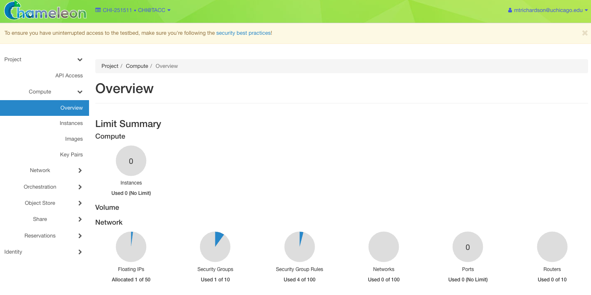
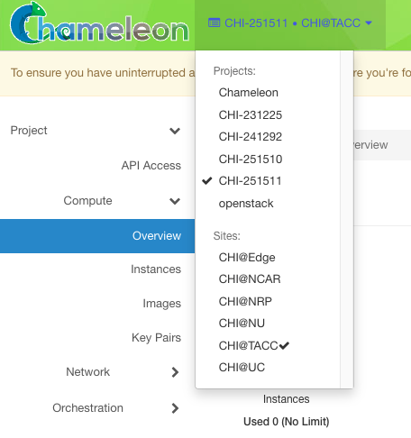
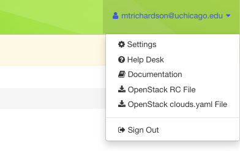
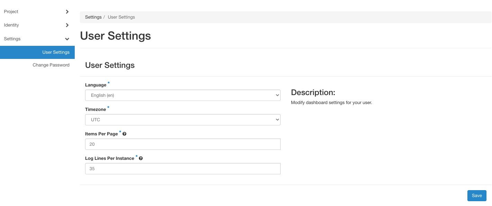

GUI Features
============

Upon logging in to the GUI at a Chameleon site, you will see your project's
Overview page.

   The Chameleon GUI

.. _gui-project-menu:

Project and Site Menu
---------------------

To switch among the projects you belong to, use the project and site menu---the
dropdown on the upper left of the screen next to the Chameleon logo. You can
also use this menu to switch from one Chameleon site to another. This allows you
to easily perform multi-site experiments.

   Switching between projects

.. _gui-user-menu:

User Menu
---------

To access user specific settings and download *OpenStack RC* files, use the user
menu---the dropdown on the upper right of the screen where you will see your
account name.

   The user dropdown menu

.. _gui-settings:

Settings
~~~~~~~~

In the settings menu, you can change user specific settings such as the
Timezone.

   User settings

.. note::

   Updating your timezone is **highly** recommended. When you make reservations
   for bare metal resources, your local time will be used. UTC is the default
   Timezone.

Documentation
~~~~~~~~~~~~~

The *Documentation* menu item will take you to this documentation site.

Help Desk
~~~~~~~~~

The *Help Desk* menu item will take you to the `Chameleon Help Desk
<https://chameleoncloud.org/user/help/>`_, where you can submit support tickets
and find answers to common questions.

OpenStack RC File
~~~~~~~~~~~~~~~~~

Clicking on this menu items will download a customized `RC file
<http://www.catb.org/jargon/html/R/rc-file.html>`_ for use with the OpenStack
Command Line Interface. Source the RC file using ``source`` command to configure
environment variables that allow you to easily log in using the :ref:`Command
Line Interface <cli>`. For more information about *OpenStack RC* script, please
see :ref:`cli-rc-script`.

OpenStack clouds.yaml File
~~~~~~~~~~~~~~~~~~~~~~~~~~

Clicking on this menu item will download a ``clouds.yaml`` configuration file
for use with the OpenStack Command Line Interface. This file can be used as an
alternative to the RC file and allows you to manage multiple OpenStack
environments in a single configuration file. See the `OpenStack clouds.yaml
documentation
<https://docs.openstack.org/python-openstackclient/latest/configuration/index.html#clouds-yaml>`_
for details on how to use it.

Sign Out
~~~~~~~~

Use the *sign out* menu item to sign out from your current site.

.. note::

   If you do not sign out manually, your session will expire in one hour.