GUI Navigation
==============

The navigation sidebar on the left allows you to access different sections
of the interface. The main navigation elements are described below.

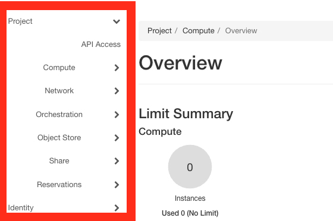

.. _gui-compute:

Compute
-------

The *Compute* section provides interfaces for managing instances, images, and SSH key pairs.
It is backed by `OpenStack Nova <https://docs.openstack.org/nova/latest/>`_.

Overview
~~~~~~~~

The Overview page provides a graphical summary of your project's current resource usage.

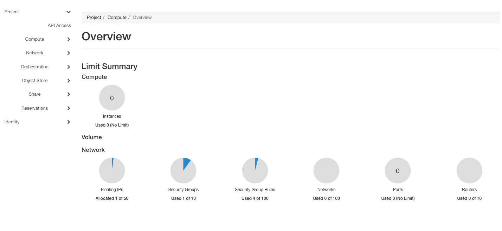

.. _gui-compute-instances:

Instances
~~~~~~~~~

The *Instances* page displays your running instances with options to launch, terminate, 
monitor, or reboot them. For detailed instructions on launching and managing instances, 
see :ref:`baremetal`.

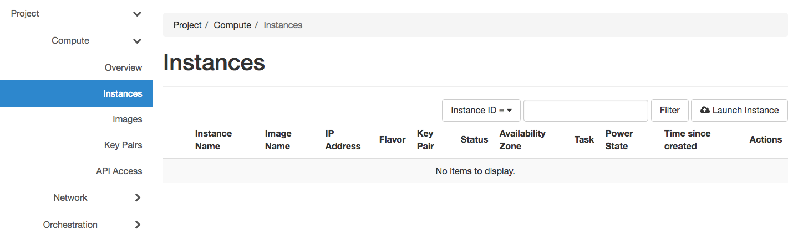

Images
~~~~~~

The *Images* page allows you to view available images and launch instances from them.
Images are managed by `OpenStack Glance <https://docs.openstack.org/glance/latest/>`_.
You can only edit images you own. For comprehensive image management including uploading
and sharing, see :ref:`images`.

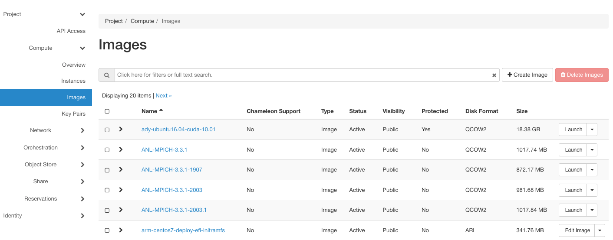

.. _gui-key-pairs:

Key Pairs
~~~~~~~~~

The *Key Pairs* page allows you to create, import and manage SSH key pairs for instance access.

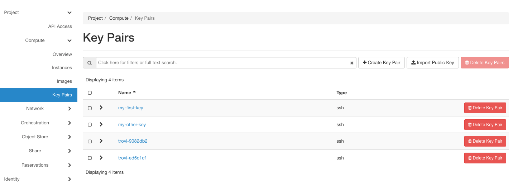

For detailed instructions on creating and importing key pairs, see the `guide here <https://teaching-on-testbeds.github.io/hello-chameleon/#exercise-create-ssh-keys>`_.

Network
-------

The *Network* section provides interfaces for managing virtual network resources.
It is backed by `OpenStack Neutron <https://docs.openstack.org/neutron/latest/>`_.
For comprehensive networking instructions, see :ref:`networking`.

Network Topology
~~~~~~~~~~~~~~~~

The *Network Topology* page displays your current virtual network topology in 
topology or graph formats.

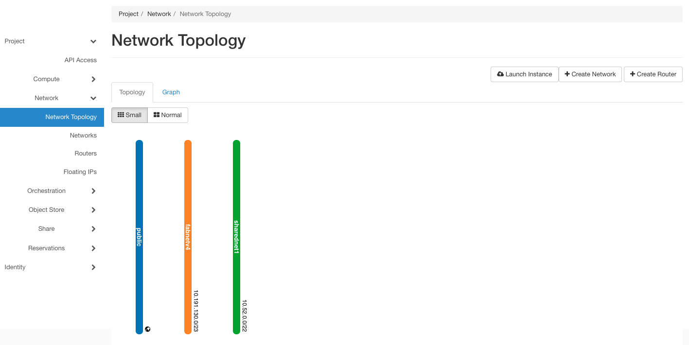

   The Network Topology page

Networks, Routers, and Floating IPs
~~~~~~~~~~~~~~~~~~~~~~~~~~~~~~~~~~~

The *Networks*, *Routers*, and *Floating IPs* pages allow you to create and manage 
these network resources for your project.

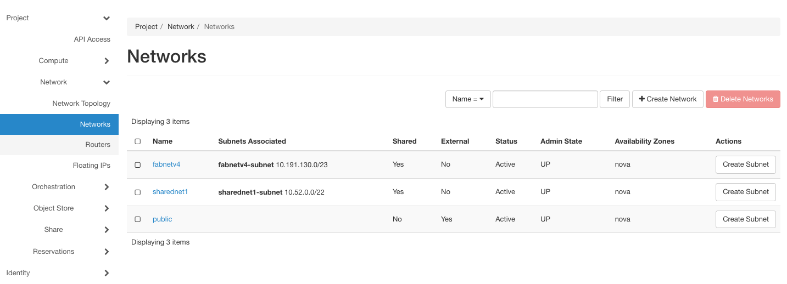

.. attention::
   Chameleon bare metal sites (|CHI@TACC|, |CHI@UC|, |CHI@NCAR|) **do not** support
   security groups - all ports are open to the public.

Orchestration
-------------

The *Orchestration* section provides interfaces for working with complex appliances
and Heat templates. It is backed by `OpenStack Heat <https://docs.openstack.org/heat/latest/>`_.
For comprehensive instructions, see :ref:`complex`.

Stacks
~~~~~~

A deployed complex appliance is referred to as a "stack" – just as a deployed
single appliance is typically referred to as an "instance". The Stacks page
allows you to launch, rebuild, or terminate stacks.

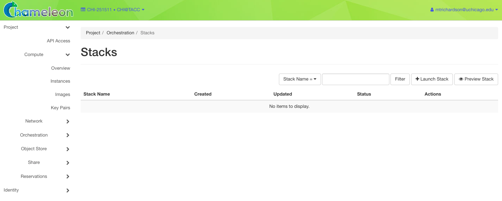

   The Stacks page

Resource Types
~~~~~~~~~~~~~~

The *Resource Types* page lists all Heat resource types available for use in
your templates, along with their properties and attributes.

Template Versions
~~~~~~~~~~~~~~~~~

The *Template Versions* page lists the supported Heat Orchestration Template
(HOT) versions and the features available in each. For more on writing
templates, see :ref:`heat-templates`.

Template Generator
~~~~~~~~~~~~~~~~~~

The *Template Generator* provides a graphical interface for building Heat
templates without writing YAML by hand.

Object Store
------------

The *Containers* section provides access to Chameleon's object/blob storage,
backed by `OpenStack Swift <https://docs.openstack.org/swift/latest/>`_.
For detailed object store instructions, see :ref:`object-store`.

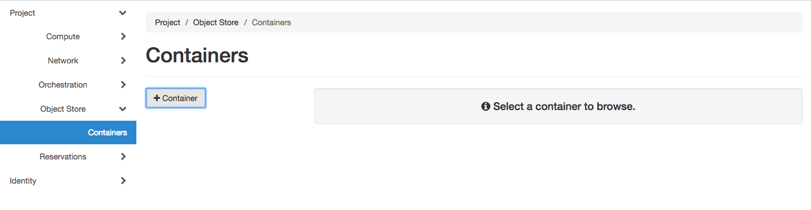

   The Containers page

Share
-----

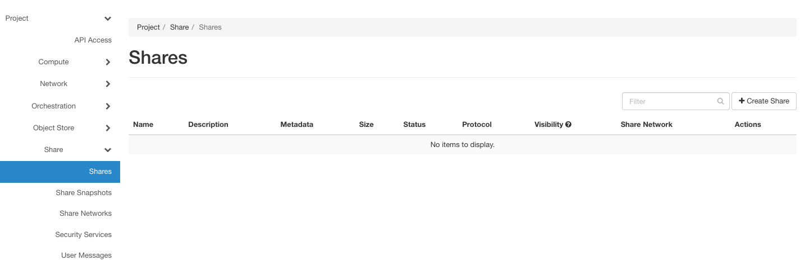

The *Share* section provides interfaces for managing shared file systems using
`OpenStack Manila <https://docs.openstack.org/manila/latest/>`_.
For detailed instructions, see :ref:`shares`.

Shares
~~~~~~

The *Shares* page allows you to create and manage shared file systems that can
be mounted by multiple instances simultaneously. For background on share concepts
and step-by-step procedures, see :ref:`shares-concepts` and :ref:`view-share-gui`.

Share Snapshots
~~~~~~~~~~~~~~~

The *Share Snapshots* page allows you to create point-in-time snapshots of
your shares for backup or cloning purposes.

Share Networks
~~~~~~~~~~~~~~

The *Share Networks* page allows you to configure the network settings that
shares use to communicate with instances.

Share Groups
~~~~~~~~~~~~

The *Share Groups* page allows you to group shares together so that consistent
snapshots can be taken across multiple shares at once.

Security Services
~~~~~~~~~~~~~~~~~

The *Security Services* page allows you to configure authentication services
(such as Active Directory or LDAP) that can be associated with share networks.

Reservations
------------

The *Reservations* section allows you to manage your resource leases.
It is backed by `OpenStack Blazar <https://docs.openstack.org/blazar/latest/>`_,
Chameleon's bare metal reservation service. For comprehensive instructions,
see :ref:`reservations`.

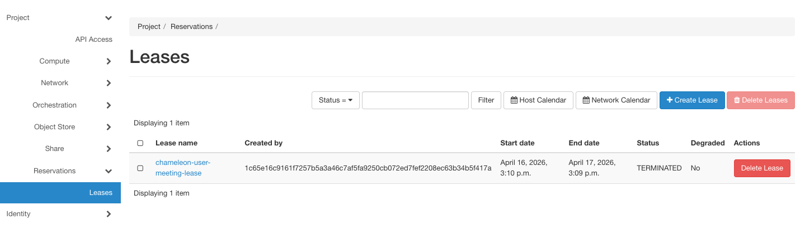

   The Leases page

Identity
--------

The *Identity* section provides interfaces for managing your account's projects,
users, and credentials. It is backed by `OpenStack Keystone <https://docs.openstack.org/keystone/latest/>`_.

Projects
~~~~~~~~

The *Projects* page shows projects you belong to and allows you to set your
default project. For more on managing project membership and allocations,
see :ref:`project-management`.

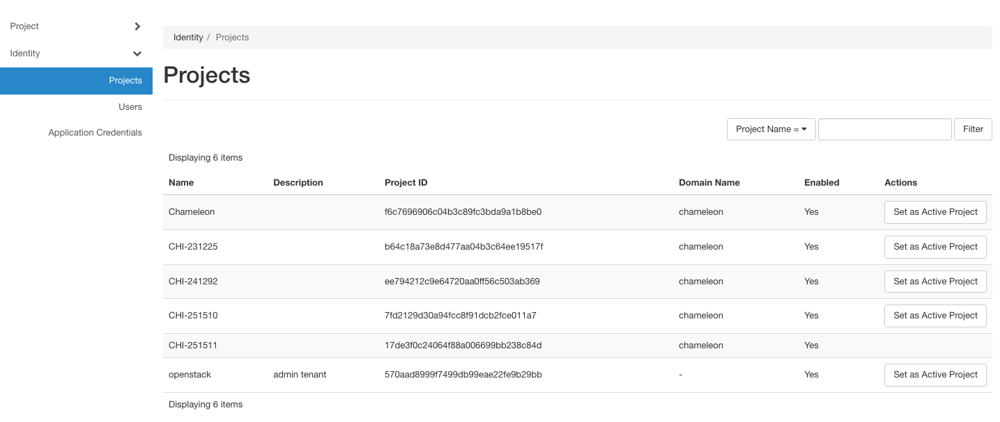

   The Projects page

Users
~~~~~

The *Users* page displays your account information. You can use this page to
view your user ID, which is sometimes required when managing project membership
or configuring access controls.

Application Credentials
~~~~~~~~~~~~~~~~~~~~~~~

The *Application Credentials* page allows you to create scoped credentials for
use by applications or scripts without exposing your primary account password.
Application credentials are tied to a specific project and can be given a
limited set of roles. For instructions on using application credentials with
the CLI, see :ref:`cli-application-credential`.