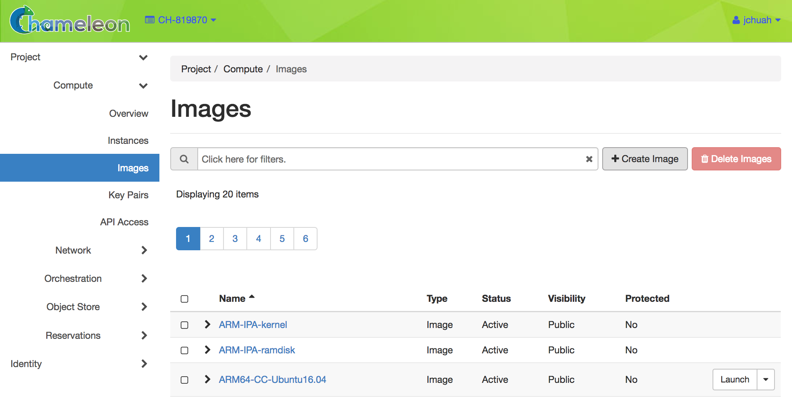

.. _images:

====================
Images
====================

When you are working with Chameleon instances, you may wish to make a new *Image* based on your instance. This allows you to preserve any configuration changes that you may have made when using an appliance from the `Appliance Catalog <https://www.chameleoncloud.org/appliances/>`_. Many appliances are based on the `CC-CentOS7 <https://www.chameleoncloud.org/appliances/1/>`_ and `CC-Ubuntu-16.04 <https://www.chameleoncloud.org/appliances/19/>`_ images, and come with the ``cc-snapshot`` utility pre-installed. In addition to making images, you can edit their visibility and transfer them using either the GUI or CLI.

Chameleon implements the Image functionality using `Glance <https://docs.openstack.org/glance/ocata/>`_. This documentation demonstrates how to accomplish common tasks with Images using either the GUI or the CLI.

.. _cc-snapshot-utility:

_________________________________________________
The ``cc-snapshot`` Utility
_________________________________________________

Making Images
_____________

When you are logged in to an instance using an image based on ``CC-CentOS7`` or ``CC-Ubuntu-16.04``, you may use the ``cc-snapshot`` utility. In the terminal, simply type:

.. code-block:: bash

   sudo cc-snapshot <image_name>

You will be prompted to enter your username and password. ``cc-snapshot`` will create an image within your project with ``shared`` visibility. Anyone with access to your project may access this image.

.. note:: If you choose an Image name that already exists, the previous one will not be overwritten. A new Image with a different UUID will be generated.

.. _updating-snapshot:

Updating ``cc-snapshot``
________________________

Older images may have an outdated copy of ``cc-snapshot`` installed. If you receive the following error:

.. code:: 

   public endpoint for image service in regionOne not found Unable to contact Glance, check username and password

You will need to update your copy of ``cc-snapshot``. Run the following commands from your instance:

.. code::

   curl -O https://raw.githubusercontent.com/ChameleonCloud/cc-snapshot/master/cc-snapshot
   sudo mv cc-snapshot /usr/bin/
   sudo chmod +x /usr/bin/cc-snapshot

__________________________________
Managing Images using the GUI
__________________________________

You can work with Images from within the GUI at `CHI@TACC <https://chi.tacc.chameleoncloud.org>`_ or `CHI@UC <https://chi.uc.chameleoncloud.org>`_. To manage your Images, click *Project* > *Compute* > *Images*. This will display a list of Images.

   The Images page

.. note:: Images at each site are stored independently of each other. An Image made at `CHI@TACC <https://chi.tacc.chameleoncloud.org>`_ will not be available at `CHI@UC <https://chi.uc.chameleoncloud.org>`_ (or vice versa) unless transferred manually.

Uploading an Image
__________________

You may upload an image from disk by clicking the *+ Create Image* button in the upper right. This will open the *Create Image* dialog.

.. figure:: images/createimage.png
   :alt: THe Create Image dialog

   The Create Image dialog

To upload an image, follow these steps:

#. Enter an *Image Name* and, optionally, a description.
#. Click *Browse* to select a file on your local machine to upload. 
#. Select a *Format* of the image. Images created by the ``cc-snapshot`` utility are *QCOW2* images.
#. Under *Image Requirements* choose *pxe_deploy_kernel* in the *Kernel* dropdown and *pxe_deploy_ramdisk* in the *Ramdisk* dropdown.
#. In the *Metadata* tab, you may add additional metadata for your Image.
#. Click the *Create Image* button. This will initiate an upload of your image.

Launching an Image
__________________

Your Images may be launched from the *Instances* page, included in :ref:`complex` or launched directly from the *Images* page if you have an active Reservation. Simply click the *Launch* button associated with the Image you wish to Launch.

Viewing Image Details
_____________________

You may view details of your Image simply by clicking on the name of the Image.

.. figure:: images/imagedetails.png
   :alt: Image details

   Image details

The details page also includes the image's *ID*, which is useful for working with the CLI. From this page, you may also use the dropdown in the upper right to perform actions, such as *Edit Image* and *Update Metadata*.

________________________________________________
Managing Images using the CLI
________________________________________________

You may also manage images using the CLI. This is particularly useful if you want to download an image from your project to transfer elsewhere, such as from one Chameleon site to another.

Uploading an Image
__________________

You can upload an image from your local machine. The ``openstack`` CLI will send your image to the project and site specified using the environment variables configured by :ref:`cli-rc-script`. Type the command:

.. code-block:: bash

   openstack image create --file <file> --disk-format <format> <image-name>

The ``file`` parameter is the local filename of your image. ``format`` should be your image format, such as ``QCOW2``. Finally, ``image-name`` is the name you would like it to appear as in your project.

Downloading an Image
____________________

The CLI has the ability to download an image from a Chameleon site to your local machine. This feature is only available from the CLI, and is useful for transferring images from one Chameleon site to the other. Type the command:

.. code-block:: bash

   openstack image save --file <filename> <image>

The ``filename`` parameter is the name you would like to save it as on your local machine. The ``image`` paramater is either the name of the image at your Chameleon site or the UUID of the image.

.. note:: If you do not provide the --file parameter, the CLI will return the image data directly to your terminal. This typically looks like garbage, since it is trying to represent the binary image data in your terminal window.

Retrieving a List of Images
___________________________

You may retrieve a list of Images and their UUIDs simply by typing:

.. code-block:: bash

   openstack image list

Optionally, you may add filters to the list such as ``--shared`` to display only Images shared within your project. You may type ``openstack image list --help`` to see all options available.

Viewing Image Details
_____________________

You may view details of an image with the command:

.. code-block:: bash

   openstack image show <image>

The ``image`` parameter is either an Image name or UUID.

Editing an Image
________________

You may edit an Image using the command:

.. code-block:: bash

   openstack image set <image>

The ``image`` parameter is either an Image name or UUID. You must provide additional flags to set on an image. These flags may be viewed with ``openstack image set --help``.
