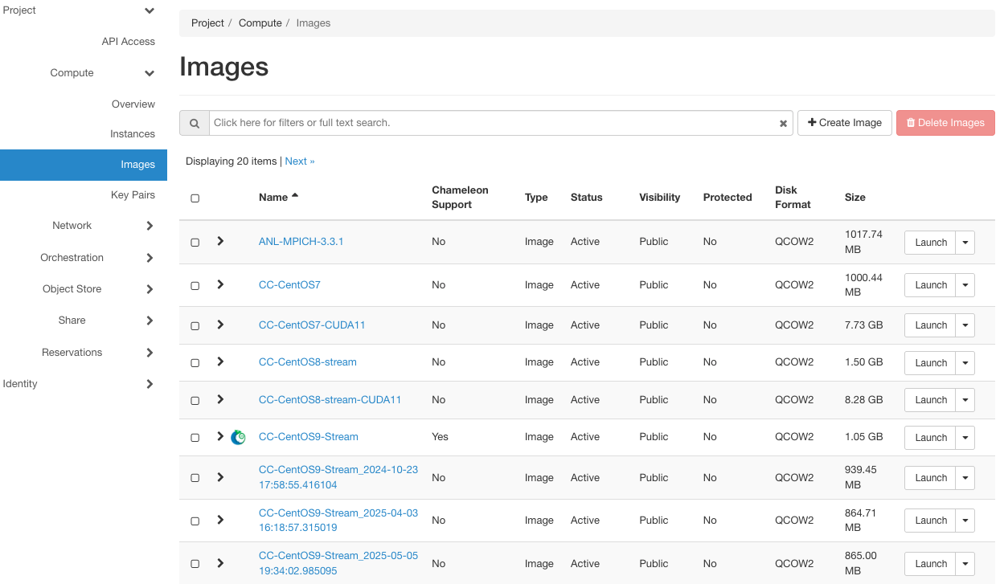
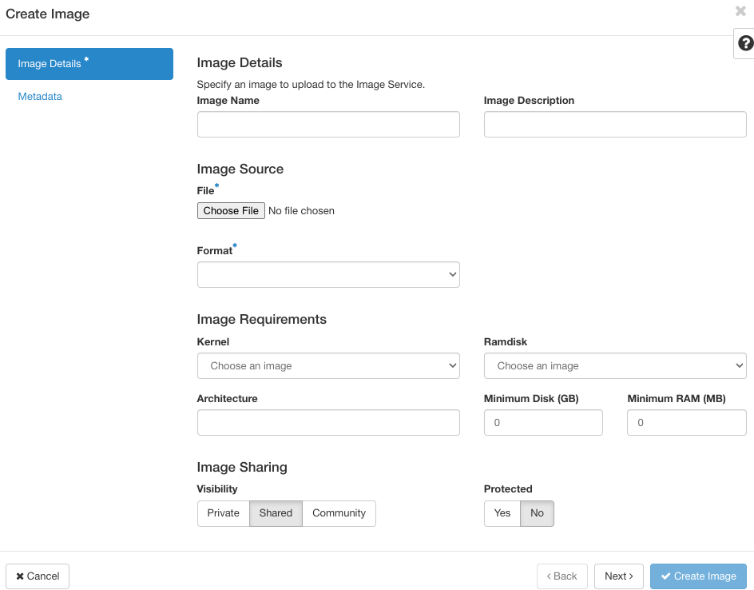
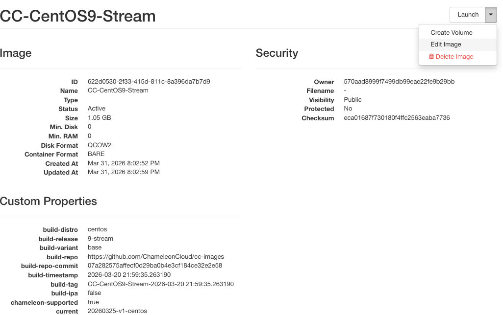
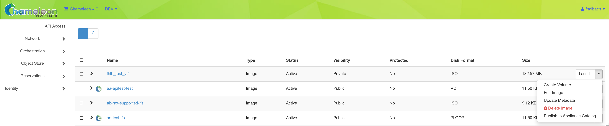

.. _images:

====================
Images
====================

All instances in Chameleon, whether KVM or bare metal, are running off disk images. The content of these disk images can be snapshotted at any point in time, which allows you to save your work and launch new instances from updated images later. While OpenStack KVM has built-in support for snapshotting in the Horizon web interface and via the command line, bare metal instances require a more complex process.

To work around this limitation, we provide the ``cc-snapshot`` utility that you can execute from inside your running instance. The ``cc-snapshot`` utility is pre-installed in all Chameleon supported appliances. You can find our appliances from the `Appliance Catalog <https://www.chameleoncloud.org/appliances/>`_.

The image service on Chameleon uses `OpenStack Glance <https://docs.openstack.org/glance/latest/>`_. This documentation demonstrates how to accomplish common tasks with *Images* using the GUI and the CLI.

.. _cc-snapshot-utility:

_________________________________________________
The ``cc-snapshot`` Utility
_________________________________________________

The ``cc-snapshot`` utility implements snapshotting a bare metal instance from command line and uploads it to `Glance <https://docs.openstack.org/glance/latest/>`_, so that it can be immediately used to boot a new bare metal instance. The snapshot images created with this tool are whole disk images.

For ease of use, ``cc-snapshot`` has been installed in all the appliances supported by the Chameleon project. If you would like to use it in a different setting, it can be downloaded and installed from the `github repository <https://github.com/ChameleonCloud/cc-snapshot>`_.

To make a snapshot of a bare metal instance, run the following command from inside the instance:

.. code-block:: bash

   sudo cc-snapshot <image_name>

.. tip::
   You may get warnings, such as "image too large", during snapshotting, and get prompted to confirm. If you are confident about what you are trying to do, you can skip all warnings by using the ``-f`` flag.

   .. code-block:: bash

      sudo cc-snapshot -f <image_name>

   In addition, you can exclude directories by using the ``-e`` flag.

   .. code-block:: bash

      sudo cc-snapshot -e <dir1> -e <dir2> <image_name>

   To see all available options for ``cc-snapshot``, run ``sudo cc-snapshot -h``.

You will be prompted to enter your username and password.

.. tip:: You can skip entering username and password by setting the ``OS_USERNAME`` and ``OS_PASSWORD`` environment variables. You can set those environment variables manually or using :ref:`cli-rc-script`.

.. note:: When using the ``cc-snapshot``, it will create an image within your project with the ``shared`` visibility. Anyone with access to your project can access this image.

.. note:: If you choose an *Image* name that already exists, the previous one **will not** be overwritten. A new *Image* with the same name but a different *UUID* will be generated.

.. note:: If you install a custom kernel, please make sure the size of your running kernel (``/lib/modules/<kernel_version>``) is less than 4GB. To find out which kernel version you're running, run ``uname -r``.

.. _updating-snapshot:

.. error::
   If you receive the following error:

   .. code::

      public endpoint for image service in regionOne not found Unable to contact Glance, check username and password

   it means that you have an outdated copy of ``cc-snapshot`` and you will need to update ``cc-snapshot``.
   This usually happens when you use an older images that contains an outdated version of ``cc-snapshot``.

   You may also want to get new functionalities added to the latest version of ``cc-snapshot``.

   Run the following commands from your instance:

   .. code::

      curl -O https://raw.githubusercontent.com/ChameleonCloud/cc-snapshot/master/cc-snapshot
      sudo mv cc-snapshot /usr/bin/
      sudo chmod +x /usr/bin/cc-snapshot

__________________________________
Managing Images using the GUI
__________________________________

To manage your images, use the *Images* page at |CHI@TACC| or |CHI@UC|, by clicking on *Project* > *Compute* > *Images*.

   The Images page

.. note:: The Chameleon logo next to an image's name indicates that this image is an appliance supported by the Chameleon project, and is part of the Appliance Catalog.

.. tip:: Select *Details* from the dropdown menu to the right of any Chameleon supported appliance to view the relevant entry from the `Chameleon Appliance Catalog <https://www.chameleoncloud.org/appliances/>`_.

.. note:: Images at each site are stored independently. An Image made at |CHI@TACC| **will not** be available at |CHI@UC| (or vice versa) unless transferred manually.

Uploading an Image
__________________

Use *+ Create Image* button to upload an image.

   The Create Image dialog

In the *Create Image* dialog:

#. Enter an *Image Name* and, optionally, a description.
#. Click *Browse* to select a file on your local machine to upload.
#. Select a *Format* of the image. Images created by the ``cc-snapshot`` utility are *QCOW2* images.
#. To add additional metadata for your image, use the *Metadata* section by clicking *Metadata* in the sidebar.
#. Click the *Create Image* button to upload your image.

Launching Instance using an Image
__________________________________

During the process of :ref:`launching instance <baremetal-gui-launch>` from the *Instance* page, it will ask you to select an image. Alternatively, you can launch instances with a selected image from the *Image* page by simply clicking on the *Launch* button located in the same row of the targeted image.

.. tip:: Other than *Launch*, there are other actions you may perfom on the image. Clicking on the dropdown to explore more on what you can do.

Viewing Image Details
_____________________

To view image details, click on the name of the Image.

   Image details

The dropdown list in the top right corner allows you to perform various actions on the selected image, such as *Launch*, *Edit Image*, and *Update Metadata*.

.. tip:: The *ID* on the image details' page is useful when you work on the image using the CLI.

.. _simple-publish:

Publishing Images to the Appliance Catalog
__________________________________________

The dropdown menu to the right of listed images allows their owners to publish an appliance to the `Appliance Catalog <https://www.chameleoncloud.org/appliances/>`_. Select *Publish to Appliance Catalog*.

The *Create Appliances* web form will open automatically with most fields pre-populated. Complete the form and select *Create an Appliance*.

Entering a descriptive name, author and support contact information, the version, and an informative description can be helpful and is encouraged. **The description is used by others to determine if an appliance contains the tools needed for their research.**

.. tip:: To make your description effective you may want to ask the following questions:

   - What does the appliance contain?

   - What are the specific packages and their versions?

   - What is it useful for?

   - Where can it be deployed and/or what restrictions/limitations does it have?

   - How should users connect to it and what accounts are enabled?

________________________________________________
Managing Images using the CLI
________________________________________________

.. tip:: Reading :ref:`cli` is highly recommanded before continuing on the following sections.

Uploading an Image
__________________

After configuring the environment variables using :ref:`cli-rc-script`, run the following command:

.. code-block:: bash

   openstack image create --file <file> --disk-format <format> <image-name>

Provide the path to and the name of your image file in your local file system as the value of the ``file`` parameter. Also, indicate the image format using the ``format`` switch, such as ``QCOW2``. Finally, name your image via the ``image-name`` switch.

Downloading an Image
____________________

Downloading an image file to your local machine is **only** available via the CLI. You may find it useful when transferring images from one Chameleon site to  another. To download an image file, run the following command:

.. code-block:: bash

   openstack image save --file <filename> <image>

Use ``filename`` to indicate where you would like to save the image in your local file system. Also, replace ``image`` with either the name or the *ID* of the image on Chameleon.

.. important::
   If you do not provide the ``--file`` parameter, it will print out the binary image data in your terminal.

Retrieving Images
___________________________

You may list all images of your project by typing:

.. code-block:: bash

   openstack image list

Optionally, you may add filters to the list, such as ``--shared`` to only display the images shared within your project. Use ``openstack image list --help`` to see all the available filters.

Viewing Image Details
_____________________

You may view details of an image with the command:

.. code-block:: bash

   openstack image show <image>

Replace ``image`` with either an image name or it's *UUID*.

Sharing an Image
________________

You may share images several ways.  If you wish to share an image with everyone, use:

.. code-block:: bash

   openstack image set --public <image>

Replace ``image`` with the image *UUID*.

If you would like to share an image with another project, first set the image visibility to shared:

.. code-block:: bash

   openstack image set --shared <image>

Next add the project you wish to share the image with:

.. code-block:: bash

   openstack image add project <image> <project>

Replace ``image`` and ``project`` with the corresponding *UUIDs*

Finally the project that the image is shared to must accept the shared image.  Run this command with a user in the second project:

.. code-block:: bash

   openstack image set --accept <image>

Replace ``image`` with the image *UUID* and the second project should now be able to use the image!

.. important::
   Only the owner of the image can modify it or any properties.  However a project who has an image shared to it can remove themselves from the list of image members.

Editing an Image
________________

You may edit an image using the command:

.. code-block:: bash

   openstack image set <image> ...

Replace ``image`` with either an image name or it's *UUID*. You must provide additional flags to update an image. Use ``openstack image set --help`` to see all the options.
