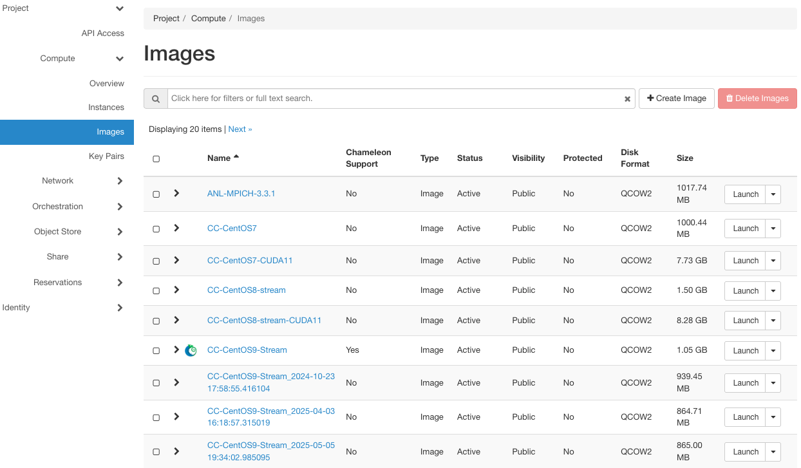
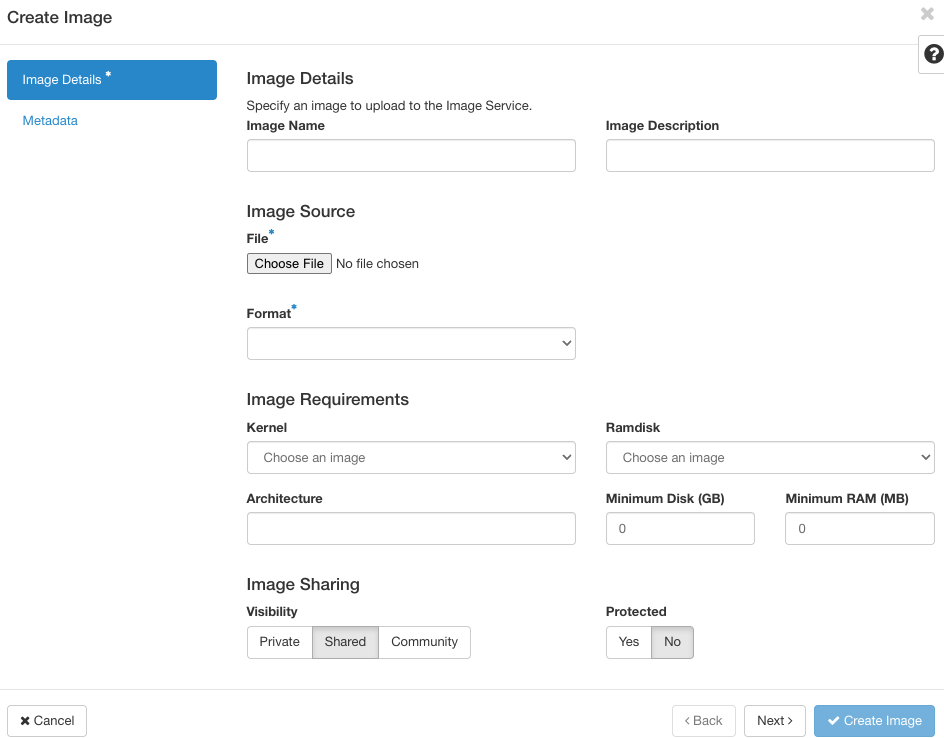
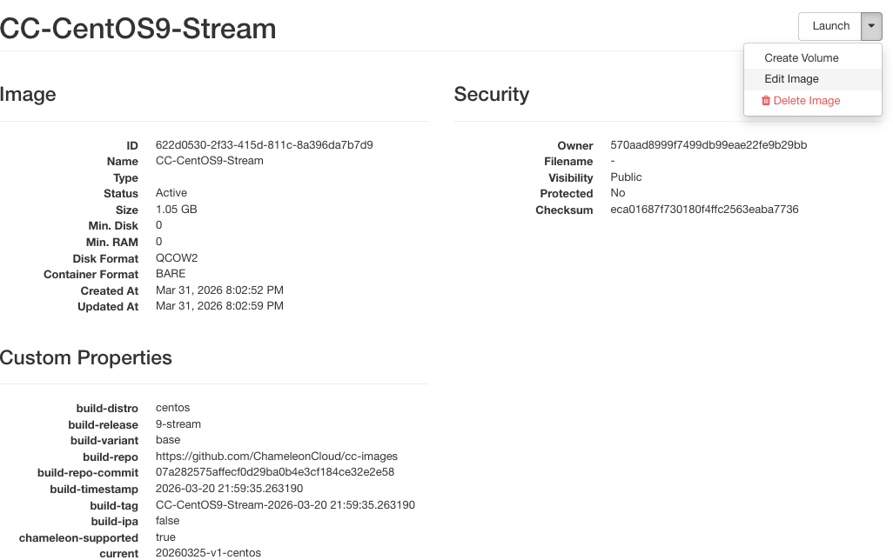

.. _images-gui-management:

=============================
Managing Images using the GUI
=============================

To manage your images, use the *Images* page at |CHI@TACC| or |CHI@UC|, by clicking on *Project* > *Compute* > *Images*.

   The Images page

.. note:: The Chameleon logo next to an image's name indicates that this image is an appliance supported by the Chameleon project. Chameleon-supported appliances can be found on `Trovi <https://www.trovi.chameleoncloud.org/dashboard/artifacts/>`_ by filtering for the **appliance** tag.

.. note:: Images at each site are stored independently. An Image made at |CHI@TACC| **will not** be available at |CHI@UC| (or vice versa) unless transferred manually.

Uploading an Image
==================

Use *+ Create Image* button to upload an image.

   The Create Image dialog

In the *Create Image* dialog:

#. Enter an *Image Name* and, optionally, a description.
#. Click *Browse* to select a file on your local machine to upload.
#. Select a *Format* of the image. Images created by the ``cc-snapshot`` utility are *QCOW2* images.
#. To add additional metadata for your image, use the *Metadata* section by clicking *Metadata* in the sidebar.
#. Click the *Create Image* button to upload your image.

Launching Instance using an Image
=================================

During the process of :ref:`launching instance <baremetal-gui-launch>` from the *Instance* page, it will ask you to select an image. Alternatively, you can launch instances with a selected image from the *Image* page by simply clicking on the *Launch* button located in the same row of the targeted image.

.. tip:: Other than *Launch*, there are other actions you may perform on the image. Clicking on the dropdown to explore more on what you can do.

Viewing Image Details
=====================

To view image details, click on the name of the Image.

   Image details

The dropdown list in the top right corner allows you to perform various actions on the selected image, such as *Launch*, *Edit Image*, and *Update Metadata*.

.. tip:: The *ID* on the image details' page is useful when you work on the image using the CLI.

.. _simple-publish:

Publishing Images as Appliances via Trovi
=========================================

.. note::
   New appliances can no longer be submitted to the Appliance Catalog.
   Appliances are now published through `Trovi <https://www.trovi.chameleoncloud.org/dashboard/artifacts/>`_.

To share an image as a Chameleon appliance, upload or locate your artifact in
Trovi and open its **Edit** menu. Add the **appliance** tag along with a
descriptive name, author and support contact information, version, and an
informative description. Once published, your appliance will be discoverable by
other Chameleon users when they filter Trovi by the **appliance** tag.

Entering a descriptive name and an informative description is encouraged. **The description is used by others to determine if an appliance contains the tools needed for their research.**

.. tip:: To make your description effective you may want to ask the following questions:

   - What does the appliance contain?

   - What are the specific packages and their versions?

   - What is it useful for?

   - Where can it be deployed and/or what restrictions/limitations does it have?

   - How should users connect to it and what accounts are enabled?