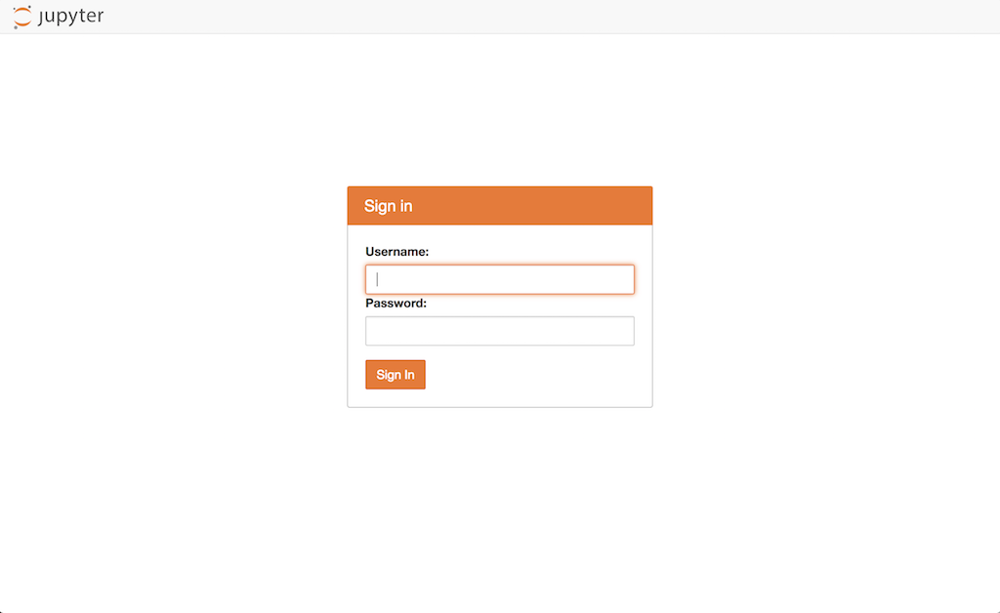

.. |python_chi| replace:: ``python-chi``
.. _python_chi: https://github.com/chameleoncloud/python-chi

.. _jupyter-notebook:

The Jupyter Notebook Interface
==============================

.. _introduction:

Introduction
------------

Chameleon users can get a Jupyter Notebook server automatically provisioned for them by logging in to the `JupyterHub server <https://jupyter.chameleoncloud.org>`_ managed by Chameleon. Use your Chameleon username and password to log in. Upon login, you will be redirected to your Jupyter Notebook server. If there is not yet a Notebook server allocated for your user, one will be created behind the scenes. This can take a few moments.

.. _jupyterlab:

JupyterLab interface overview
-----------------------------

When you are logged in, you will land in the JupyterLab application environment. For up-to-date documentation about the JupyterLab interface, please see the `official JupyterLab documentation <https://jupyterlab.readthedocs.io/en/stable/user/interface.html>`_. You will see a file browser on the left-hand side - this is your working directory. It's yours, so feel free to create and delete files as you see fit. Your working directory is initially populated with a few examples to help you get started, such as an example Notebook. Files that you save here will be persisted even if your server is torn down; the next time you log in the data will be restored. You should consider the rest of your server environment ephemeral, as updates to the Jupyter interface can cause your server to be re-built.

.. hint::
   Jupyter Notebooks do not deal well with large files, and you should avoid trying to edit large files in the interface as it can cause instability, slowness, or even crashes. If you need to deal with large files it is best to process them on a dedicated processing node, such as a baremetal node provisioned as part of your experiment.

.. figure:: jupyter/landing.png
  :alt: The JupyterLab interface

.. _shared_drive:

Shared Swift drive
^^^^^^^^^^^^^^^^^^

In addition to the default filesystem interface, which allows you to share Notebooks and other files (such as Python scripts or visualization figures), the Jupyter interface also includes a special file mount specific to your project on Chameleon. You can recognize this file system mount because it is indicated with a Chameleon icon. Clicking on this icon launches a view into a filesystem mounted via :ref:`Swift <object-store>`, which is by default shared with all members of your active Chameleon project.

This means that any Notebook or other files saved here can be seen and edited by collaborators on your project. This can be useful in particular if you wish to receive feedback on an experiment, or request some suggestions or changes from another project member.

.. figure:: jupyter/shared_drive.png
  :alt: The shared drive file system in the JupyterLab interface

.. warning::
   If changes are made to the same file concurrently, the last edit will take priority. You should try to coordinate with your project members to ensure you're not overwriting each other's work, or perhaps make a copy of the file you're working on to avoid conflicts during saving.

.. _notebooks:

Working with Notebooks
----------------------

Open the "Welcome.ipynb" Notebook to see some examples of how to interface with the Chameleon testbed from within a Notebook. All Notebook servers come with OpenStack python clients installed as well as the |python_chi|_ Chameleon testbed helper library. Other python modules you may want to use in your Notebook can be installed via the :ref:`console`.

.. figure:: jupyter/notebook.png
  :alt: An example Jupyter Notebook in JupyterLab

.. _notebook_collaboration:

Notebook collaboration
^^^^^^^^^^^^^^^^^^^^^^

It is often desirable to share your in-progress Notebooks with peers or supervisors for feedback. This can be accomplished in many different ways, each suiting different use-cases. We have identified a few current tools that offer the best range of functionality.

.. |shared_drive| replace:: **Shared Swift drive**

|shared_drive|_
_______________

The easiest way to share and collaborate on a Notebook is to store it in the Chameleon-provided Swift drive mounted into your JupyterLab environment. Files stored here are visible to anybody else associated with your Chameleon project. Currently these changes are not versioned and the last edit takes priority. This means that this method may be suitable for showing work and soliciting feedback without needing more advanced simultaneous and real-time collaboration requiring additional tools.

- **Pros**

  - Comes installed default in your JupyterLab server. Easiest option to get started with.
  - Integrates well with JupyterLab--you can move files between your personal server environment and the shared folder and vice-versa.
  - Notebooks by default shared only within your project and are kept private.

- **Cons**

  - Limited support for real-time collaboration; last edit wins.
  - No version history for edits.
  - No support (yet!) for sharing one-time or expiring links with collaborators outside of Chameleon.

.. |google_colaboratory| replace:: **Google Colaboratory**
.. _google_colaboratory: https://colab.research.google.com

|google_colaboratory|_
______________________

Google provides a free Jupyter Notebook execution environment that can run your Notebook files in a private VM on Google's cloud infrastructure. As it is a Google product, a Google account is required to use it. Notebooks can be edited by users concurrently, similar to functionality present in Google Docs. Notebooks are stored in Google Drive and as such can be easily shared using the existing Drive sharing mechanisms. Finally, and notably, hardware-accelerated computation via GPUs and TPUs is available for free exploration. For more details see the `FAQ <https://research.google.com/colaboratory/faq.html>`_.

- **Pros**

  - Supports rich real-time collaboration on Notebook files.
  - Notebooks easily sharable via Google Drive to others with Google accounts.
  - Can manage access to private Notebooks via ACLs.
  - Free to use.

- **Cons**

  - Not intended for long-running tasks. Your experiment may be terminated prematurely if it is deemed an invalid use of resources.
  - Chameleon libraries not pre-installed. You can however install the Python API client to your Notebook via the special ``!pip install python-chi`` syntax. See the `Importing Libraries <https://colab.research.google.com/notebooks/snippets/importing_libraries.ipynb>`_ example notebook for examples on how to install new libraries.
  - Requires Google account.

.. |github_nbviewer| replace:: **GitHub + Nbviewer**
.. _github_nbviewer: https://help.github.com/articles/working-with-jupyter-notebook-files-on-github/

|github_nbviewer|_
__________________

A common pattern that works for many use-cases is using GitHub as the backing store for your Notebooks. This is nice because you get version history for free due to Git VCS being used behind the scenes. GitHub Notebooks are easily sharable (you just send a link) and there is decent support in GitHub for viewing the current state of the Notebook and its rendered outputs. To allow others to actually run your Notebook, you can either import the Notebook files back in to your Chameleon JupyterLab instance, or use `Binder <https://mybinder.org/>`_, which allows spinning up a Jupyter instance for a given GitHub link.

- **Pros**

  - Supports version history via Git VCS.
  - Supports easily sharing rendered Notebooks (read-only) via GitHub links.
  - Can import the Notebook into a personal Jupyter server (such as the one provided by Chameleon) or via a hosted tool like Binder.
  - Changes can be proposed using Pull Request workflows you may already be familiar with.

- **Cons**

  - Running the Notebook requires getting it into a Jupyter server somehow.
  - Requires GitHub account if you want to keep your Notebooks private.
  - Services like Binder don't create Jupyter servers with Chameleon tools (like the |python_chi|_ Python API) built in by default.

.. _console:

Console interface
-----------------

You can open a web terminal console by going to File > New > Terminal. This works just like a remote shell, and you will also have `sudo` access so you can install additional software to support your needs.

.. hint::
   All Chameleon Notebook servers are built from a common base image. This means if your server is torn down (which can happen during an upgrade of the Jupyter server), you may have to re-do any changes to the underlying system you made since the server was created. For this reason it is a good idea to put this setup code in a script in your working directory. Your working directory is backed up and will persist across Jupyter server restarts.

.. figure:: jupyter/console.png
  :alt: The web terminal console in JupyterLab

Further reading
---------------

  - `Getting started with JupyterLab (Beginner Level) - SciPy 2018 Tutorial <https://www.youtube.com/watch?v=Gzun8PpyBCo>`_
  - `Reproducibility Research workshop: Jupyter Notebook for Open Science <https://reproducible-analysis-workshop.readthedocs.io/en/latest/4.Jupyter-Notebook.html>`_
  - `Gallery of interesting Jupyter Notebooks <https://github.com/jupyter/jupyter/wiki/A-gallery-of-interesting-Jupyter-Notebooks>`_
