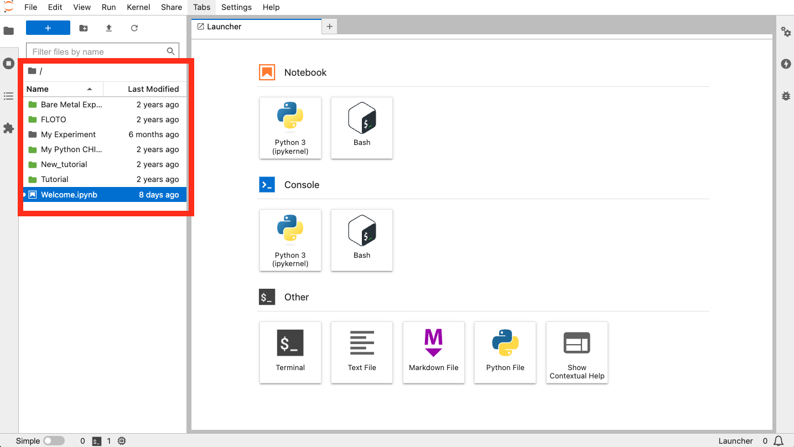
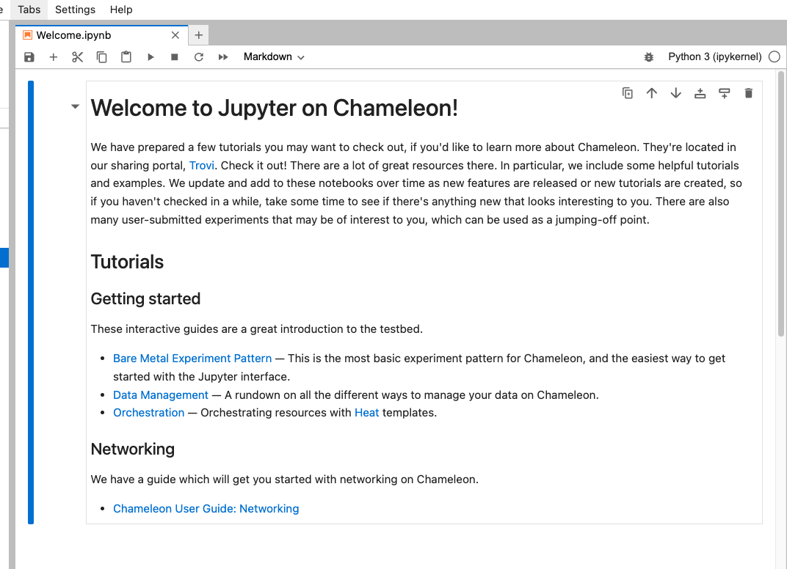
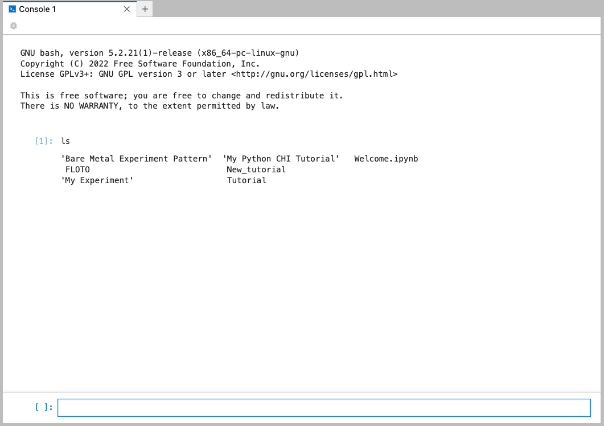

.. |python_chi| replace:: ``python-chi``
.. _python_chi: https://github.com/chameleoncloud/python-chi

.. _jupyter:

=================
Jupyter interface
=================

Jupyter Notebooks are an excellent tool for prototyping, exploring, and
ultimately documenting the entire experimental process. They combine the
benefits of explanatory text, executable code, and rich
visualization/interaction.

Chameleon users can get a Jupyter Notebook server automatically provisioned for
them by logging in to the `JupyterHub server
<https://jupyter.chameleoncloud.org>`_ managed by Chameleon. Upon login, you
will be redirected to your Jupyter Notebook server. If there is not yet a
Notebook server allocated for your user, one will be created behind the scenes.
This can take a few moments.

.. warning::
   The shared Jupyter environment places resource limits on your Jupyter server,
   notably limiting it to 1 CPU core and 1GB of memory. If you are doing
   computationally or memory-intensive work in a Notebook, it may be beneficial
   to look in to :ref:`provisioning your own dedicated JupyterHub
   <jupyter-dedicated>`.

.. _jupyterlab:

JupyterLab interface overview
-----------------------------

When you are logged in, you will land in the JupyterLab application environment.
For up-to-date documentation about the JupyterLab interface, please see the
`official JupyterLab documentation
<https://jupyterlab.readthedocs.io/en/stable/user/interface.html>`_. You will
see a file browser on the left-hand side - this is your working directory. It's
yours, so feel free to create and delete files as you see fit. Your working
directory is initially populated with a few examples to help you get started,
such as an example Notebook. Files that you save here will be persisted even if
your server is torn down; the next time you log in the data will be restored.
You should consider the rest of your server environment ephemeral, as updates to
the Jupyter interface can cause your server to be re-built.

.. hint::
   Jupyter Notebooks do not deal well with large files, and you should avoid
   trying to edit large files in the interface as it can cause instability,
   slowness, or even crashes. If you need to deal with large files it is best to
   process them on a :ref:`dedicated processing node <jupyter-dedicated>`, such
   as a baremetal node provisioned as part of your experiment.

.. _notebooks:

Working with Notebooks
----------------------

Open the "Welcome.ipynb" Notebook to see some examples of how to interface with
the Chameleon testbed from within a Notebook. All Notebook servers come with
OpenStack python clients installed as well as the |python_chi|_ Chameleon
testbed helper library. Other python modules you may want to use in your
Notebook can be installed via the :ref:`console`.

.. _console:

Console interface
-----------------

You can open a web terminal console by going to File > New > Terminal. This
works just like a remote shell, and you will also have `sudo` access so you can
install additional software to support your needs.

.. hint::
   All Chameleon Notebook servers are built from a common base image. This means
   if your server is torn down (which can happen during an upgrade of the
   Jupyter server), you may have to re-do any changes to the underlying system
   you made since the server was created. For this reason it is a good idea to
   put this setup code in a script in your working directory. Your working
   directory is backed up and will persist across Jupyter server restarts.

Advanced topics
---------------

.. toctree::
   :maxdepth: 1

   jupyter/jupyter_dedicated
   jupyter/jupyter_collaboration
