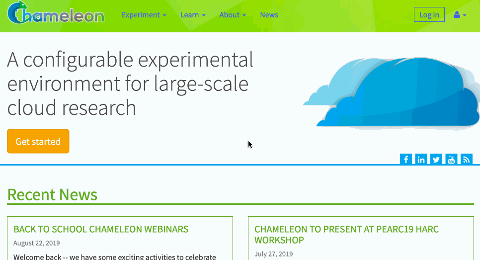
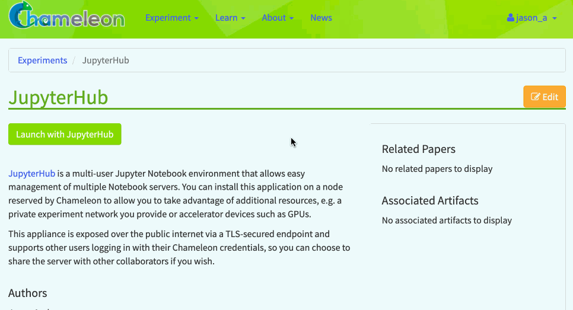
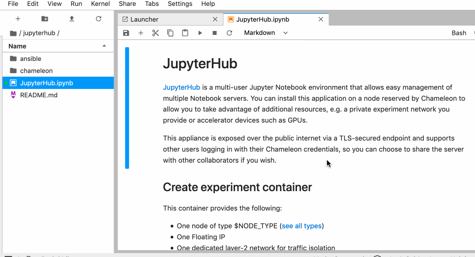

.. _jupyter-sharing:

Sharing Portal
==============

The Chameleon Sharing Portal allows you to re-create and re-run an experiment by following along with a Jupyter Notebook. Most importantly, you can publish your own Notebooks and experiment artifacts to the portal directly. To get started, find the "Sharing" link in the "Experiment" section of `chameleoncloud.org <https://chameleoncloud.org>`_.

Launching Shared Artifacts
--------------------------

Currently there are just a few examples to get you started, but we will be adding to this list soon. One thing you will notice is that we have partnered with `Zenodo <https://zenodo.org/>`_ for storage of your experiment artifacts--this means that your Jupyter Notebooks, supporting code, visualizations and more will be backed by `CERN's long-term artifact storage <https://about.zenodo.org/infrastructure/>`_. Zenodo comes with some other cool features such as automatic DOI assignment and the ability to see view/download counts for your artifact files.

The most powerful feature, though, is the ability to re-launch the artifacts within Chameleon. Clicking "Launch with JupyterHub" will open a new Jupyter Notebook server with the artifacts download (size permitting; currently we support artifacts up to 500MB in total size, but can work with you for bigger projects). The below animation shows how easy it is:

Publishing Your Artifact
------------------------

Whether you're making changes to an existing experiment or creating a new one, you can publish your own artifacts to the Sharing Portal. There is a "Share" menu item in the :ref:`Jupyter interface <jupyter-notebook>` that allows you to upload your artifact files straight to Zenodo and then create a new shared artifact on Chameleon. The shared artifact will be created under your Chameleon account and you will be able to edit its metadata directly within the Sharing Portal.

Publishing new versions
^^^^^^^^^^^^^^^^^^^^^^^

Once your artifact has been published to the sharing portal, it should be indicated in the Jupyter interface with a blue dot over the relevant directory in the file browser. If you make changes to the files in this directory and wish to "commit" those changes as a new published and citable version, you can click the folder and then click "Share"... "Create new version" from the top menu. This will upload the files in their entirety once more to Zenodo and create a new version, which will be semantically linked to the prior versions for posterity. You can also access this option by right-clicking the directory in the file browser and using the context menu.
