==============================
KVM
==============================

____________
Introduction
____________

OpenStack is an Infrastructure as a Service (IaaS) platform that allows you to create and manage virtual environments. Chameleon provides an installation of OpenStack version 2015.1 (Kilo) using the KVM virtualization technology at the `KVM@TACC <https://openstack.tacc.chameleoncloud.org>`_ site. Since the KVM hypervisor is used on this cloud, any virtual machines you upload must be compatible with KVM.

This documentation provide basic information about how to use the OpenStack web interface and provides some information specific to using OpenStack KVM on Chameleon. The interface is similar to the bare metal sites `CHI@TACC <https://chi.tacc.chameleoncloud.org>`_ and `CHI@UC <https://chi.uc.chameleoncloud.org>`_. However, the resources that you are using are virtual, rather than being tied to physical nodes. Familiarity with some concepts, such as :ref:`gui-key-pairs` are also required for KVM.

___________________________
Work with KVM using the GUI
___________________________

An easy way to use `KVM@TACC <https://openstack.tacc.chameleoncloud.org>`_ is via the GUI, which is similar to the GUIs for `CHI@TACC <https://chi.tacc.chameleoncloud.org>`_ and `CHI@UC <https://chi.uc.chameleoncloud.org>`_. You log into the web interface using your Chameleon username and password. If you change your Chameleon password in the portal, that change will propagate to the OpenStack KVM interface in about 5 minutes.

After a successful log in, you will see the Overview page as shown below. This page provides a summary of your current and recent usage and provides links to various other pages. Most of the tasks you will perform are done via the menu on the lower left and will be described below. One thing to note is that on the left, your current project is displayed. If you have multiple Chameleon projects, you can change which of them is your current project. All of the information displayed and actions that you take apply to your current project. So in the screen shot below, the quota and usage apply to the current project you have selected and no information about your other projects is shown.

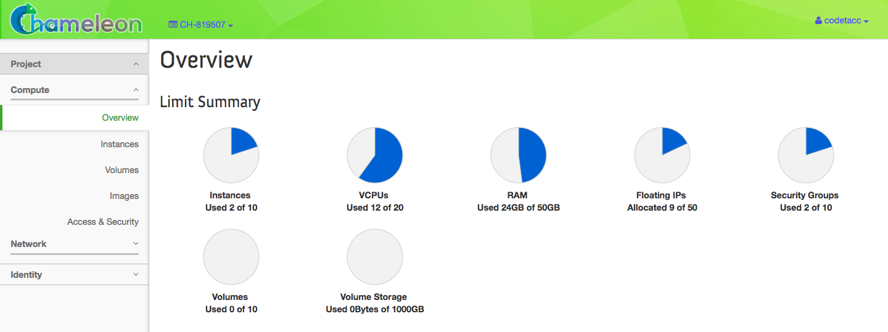

Managing Virtual Machine Instances
__________________________________

One of the main activities you’ll be performing in the GUI is management of virtual machines, or instances. Go to *Project* > *Compute* > *Instances* in the navigation sidebar. For instances that you have running, you can click on the name of the instance to get more information about it and to access the VNC interface to the console. The dropdown menu to the left of the instance lets you perform a variety of tasks such as suspending, terminating, or rebooting the instance.

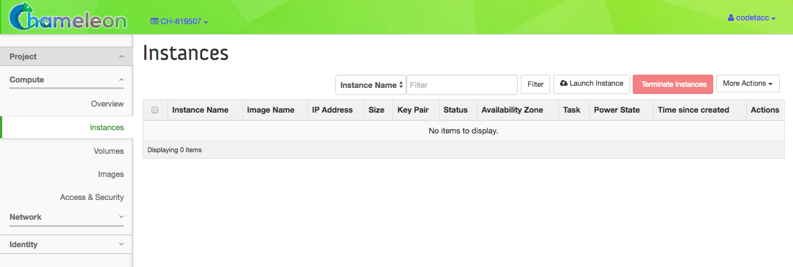

Launching Instances
___________________

To launch an *Instance*, click the *Launch Instance* button. This will open the *Launch Instance* dialog.

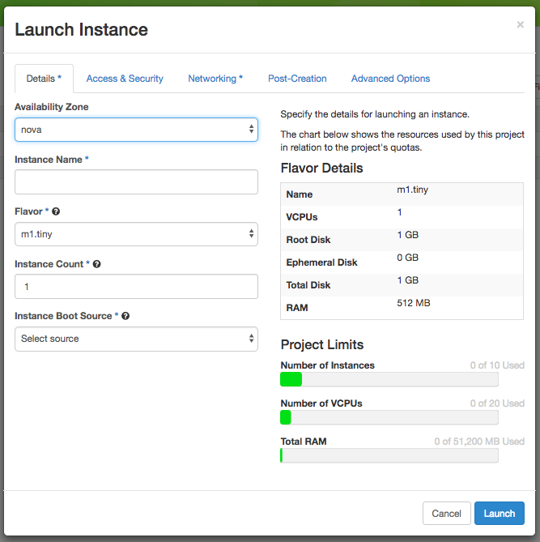

Follow these steps:

#. Enter an *Instance Name*
#. Choose a *Flavor* for the Instance. Flavors refer to the virtual machine's assigned memory and and disk size. Different images and snapshots may require a larger Flavor. For example, the ``CC-CentOS7`` image requires at least an ``m1.small`` flavor.
#. If you wish to launch more than one Instance, you may specify this in *Instance Count*.
#. Choose an *Instance Boot Source*. If you choose ``Boot from Image`` as a boot source, you will be presented a list of disk images. Alternatively, you may choose ``Boot from Snapshot`` if you have a previously saved Snapshot of a virtual machine. 

When you are finished with this step, go to the *Access and Security* Tab.

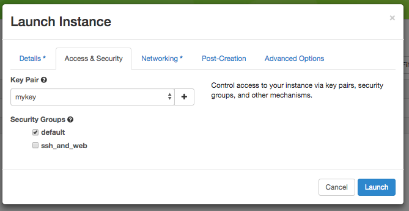

You may configure security using the following steps:

#. Select an SSH Key Pair for this Instance.
#. If you have previously defined *Security Groups*, you may select them here. Alternatively, you can configure them later.

You may now click the *Launch* button.

.. _kvm-associate-ip:

Associating a Floating IP Address
_________________________________

You may assign a Floating IP Address to your Instance by selecting *Associate Floating IP* in the dropdown menu next to your Instance on the *Instances* page.

.. figure:: kvm/associatemenu.png

This process is similar to the using the GUI to :ref:`baremetal-gui-associate-ip` on `CHI@TACC <https://chi.tacc.chameleoncloud.org>`_ and `CHI@UC <https://chi.uc.chameleoncloud.org>`_ bare metal sites.

Key Pairs
_________

You will need to import or create SSH :ref:`gui-key-pairs`. This process is similar on `CHI@TACC <https://chi.tacc.chameleoncloud.org>`_ and `CHI@UC <https://chi.uc.chameleoncloud.org>`_ bare metal sites.

Security Groups
_______________

*Security Groups* allow you to specify what inbound and outbound traffic is allowed or blocked to Instances. Unlike the `CHI@TACC <https://chi.tacc.chameleoncloud.org>`_ and `CHI@UC <https://chi.uc.chameleoncloud.org>`_ bare metal sites, `KVM@TACC <https://openstack.tacc.chameleoncloud.org>`_ observes Security Groups for Instances.

.. note:: By default, all inbound traffic is blocked to `KVM@TACC <https://openstack.tacc.chameleoncloud.org>`_ Instances, including SSH. You must apply a Security Group that allows TCP port 22 inbound to access your instance via SSH.

To create a Security Group, click *Projects* > *Compute* > *Access and Security* in the navigation side bar. 

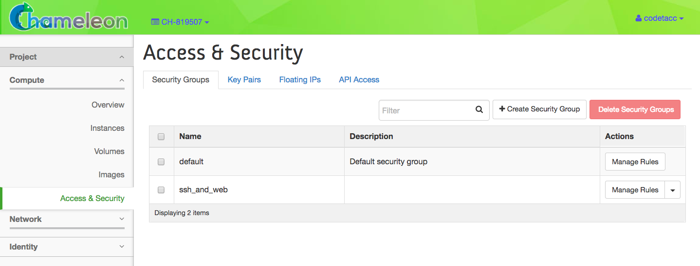

Click the *+Create Security Group* button. This will open the *Create Security Group* page.

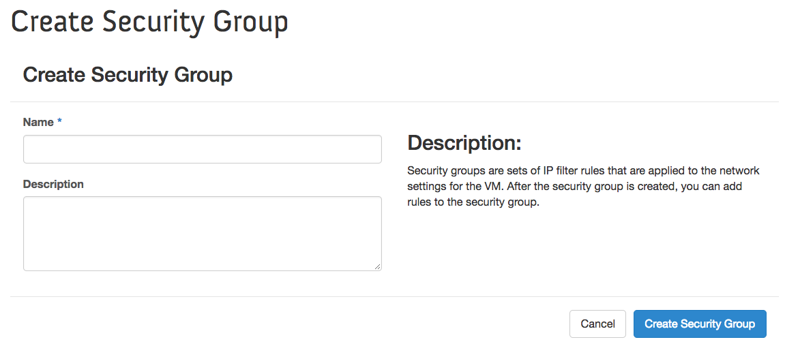

Enter a *Name* and an optional *Description*, then click the *Create Security Group* button. You will be returned to the *Security Groups* tab in the *Access and Security* page, where you will see your new Security Group.

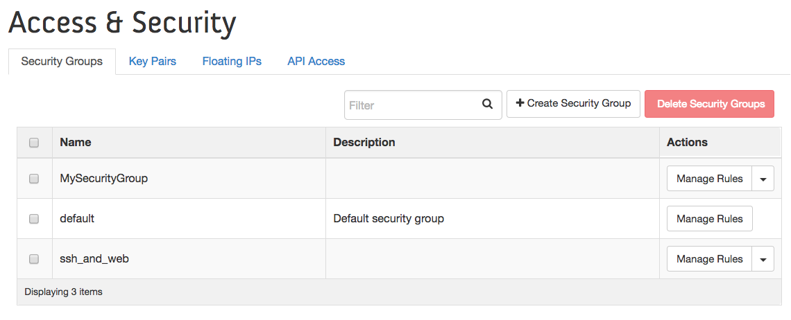

Click the *Manage Rules* button in the Action dropdown next to your Security Group. This will open the *Manage Security Group Rules* page for your Security Group.

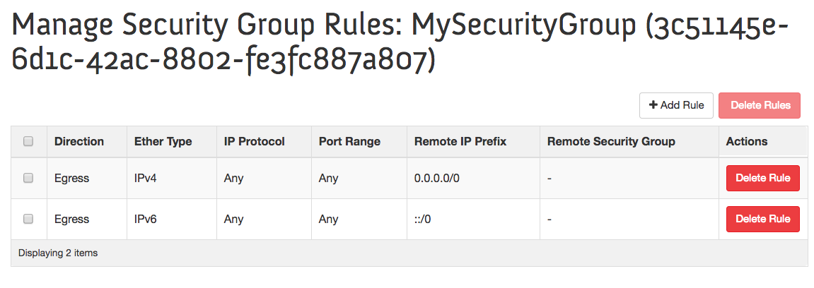

The default Security Group allows outbound IPv4 and IPv6 traffic, as seen by each entry that specifies *Egress* as the *Direction*, with *Any* as the *IP Protocol* and *Port Range*. If there are no entries specified *Ingress*, then no inbound traffic will be allowed. You may add an additional rule with *+Add Rule*. This will open the *Add Rule* dialog.

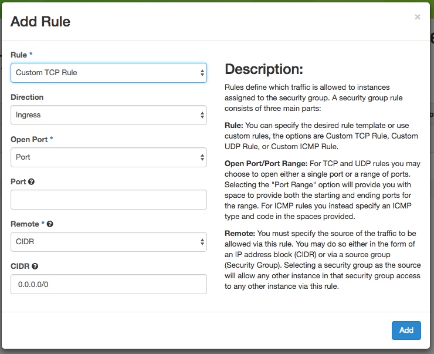

You may configure a custom rule by specifying *Custom TCP Rule* (or *Custom UDP Rule* or *Custom ICMP Rule*). You may specify a *Direction* (*Ingress* for inbound traffic to your Instance or *Egress* for outbound traffic) and a *Port*. Alternatively, you may specify a pre-defined, commonly used Rule in the *Rule* dropdown, such as *SSH*. when you are finished, click *Add*.

.. _kvm-security-group:

Adding a Security Group to an Instance
______________________________________

Once you have defined a Security Group, you may apply it to an Instance by clicking *Project* > *Compute* > *Instances* in the navigation sidebar and clicking the *Edit Security Groups* option in the *Actions* dropdown next to your Instance.

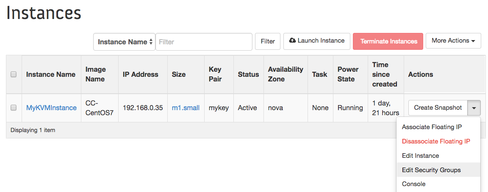

This will open the *Security Groups* tab in the *Edit Instance* dialog. 

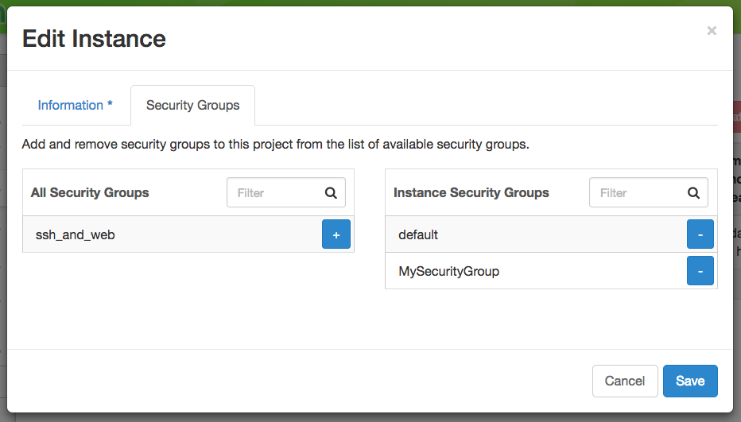

You may click the *+* button next to the Security Group you wish to apply in the *All Security Groups* list on the left. Once you are finished, click *Save*. You may now access services on any open Ingress ports on your Instance.

