.. _kvm:

KVM
===

Introduction
------------

OpenStack is an Infrastructure as a Service (IaaS) platform that allows you to
create and manage virtual environments. Chameleon provides an installation of
OpenStack `Xena <https://releases.openstack.org/xena/index.html>`_ using the
KVM virtualization technology at the `KVM\@TACC
<https://kvm.tacc.chameleoncloud.org>`_ site. Since the KVM hypervisor is used
on this cloud, any virtual machines you upload must be compatible with KVM.

This documentation provide basic information about how to use the OpenStack web
interface and provides some information specific to using OpenStack KVM on
Chameleon. The interface is similar to the bare metal sites |CHI@TACC| and
|CHI@UC|. However, the resources that you are using are virtual, rather than
being tied to physical nodes. Familiarity with some concepts, such as
:ref:`gui-key-pairs` are also required for KVM.

Work with KVM using the GUI
---------------------------

An easy way to use OpenStack KVM on Chameleon is via the GUI, which is similar
to the GUIs for |CHI@TACC| and |CHI@UC|. You log into the web interface using
your Chameleon username and password.

After a successful log in, you will see the *Overview* page as shown below. This
page provides a summary of your current and recent usage and provides links to
various other pages. Most of the tasks you will perform are done via the menu on
the lower left and will be described below. One thing to note is that on the
left, your current project is displayed. If you have multiple Chameleon
projects, you can change which of them is your current project. All of the
information displayed and actions that you take apply to your current project.
So in the screen shot below, the quota and usage apply to the current project
you have selected and no information about your other projects is shown.

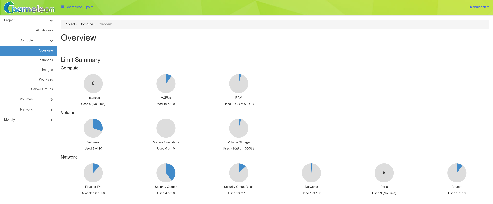

Managing Virtual Machine Instances
~~~~~~~~~~~~~~~~~~~~~~~~~~~~~~~~~~

One of the main activities you’ll be performing in the GUI is management of
virtual machines, or instances. Go to *Project* > *Compute* > *Instances* in the
navigation sidebar. For instances that you have running, you can click on the
name of the instance to get more information about it and to access the VNC
interface to the console. The dropdown menu to the right of the instance lets
you perform a variety of tasks such as suspending, terminating, or rebooting the
instance.

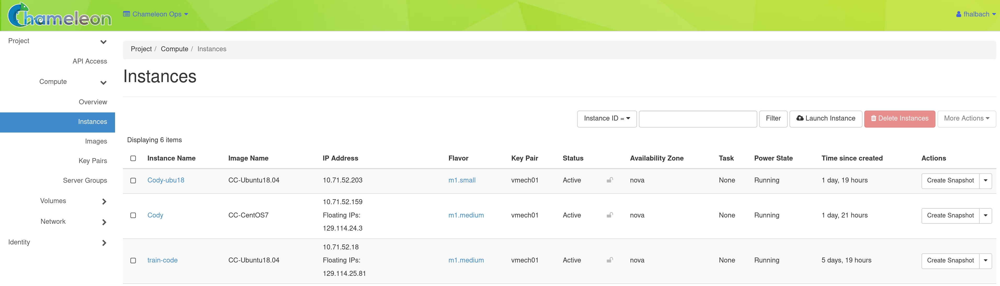

Launching Instances
~~~~~~~~~~~~~~~~~~~

To launch an *Instance*, click the *Launch Instance* button. This will open the
*Launch Instance* dialog.

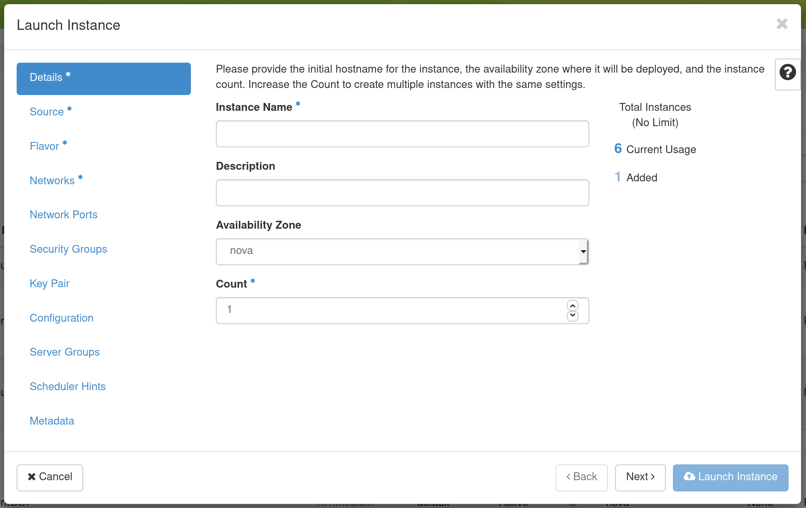

On the *Details* tab, provide a name for this instance (to help you identify
instances that you are running).

Next, go to the *Source* tab to select media to launch.

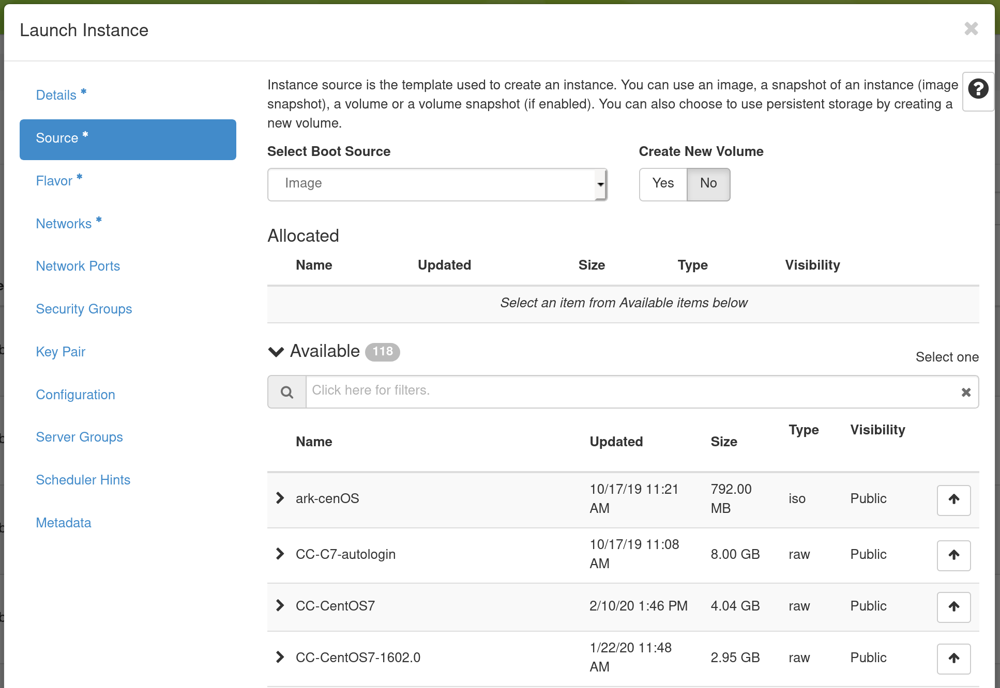

Select the *Boot Source* of the instance, which is either an *Image*, an
*Instance Snapshot* (an image created from a running virtual machine), a
*Volume* (a persistent virtual disk that can be attached to a virtual machine),
or a "Volume Snapshot". If you select "Image" as the *Boot Source*, the *Image
Name* dropdown presents a list of virtual machine images that we have provided,
that other Chameleon users have uploaded and made public, or images that you
have uploaded for yourself. If you select *Boot from snapshot*, the *Instance
Snapshot* dropdown presents a list of virtual machine images that you have
created from your running virtual machines.

Go to the *Flavor* Tab and select the amount of resources (Flavor) to allocate
to the instance.

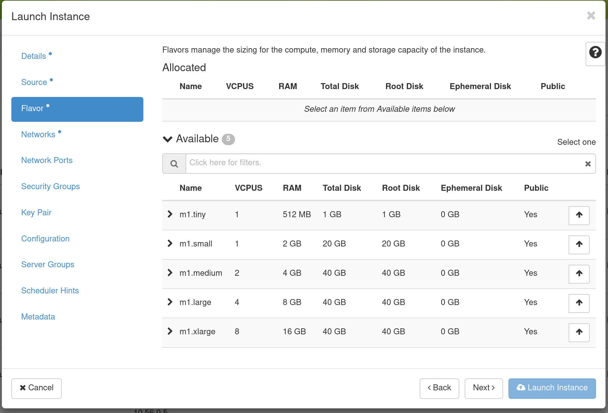

Flavors refer to the virtual machine's assigned memory and and disk size.
Different images and snapshots may require a larger Flavor. For example, the
``CC-CentOS7`` image requires at least an ``m1.small`` flavor.

   .. tip::
      If you select different flavors from the Flavor dropdown, their
      characteristics are displayed on the right.

When you are finished with this step, go to the *Key Pair* Tab.

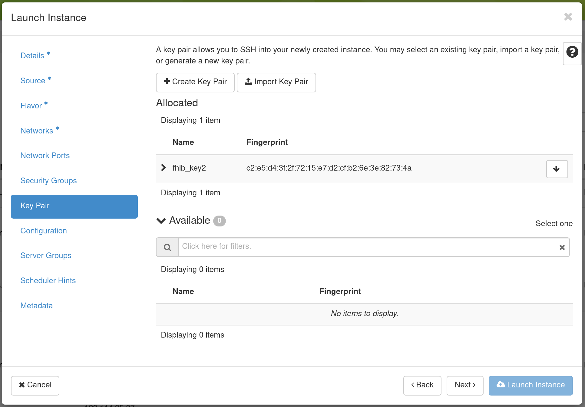

Select an SSH keypair that will be inserted into your virtual machine. You will
need to select a keypair here to be able to access an instance created from one
of the public images Chameleon provides. These images are not configured with a
default root password and you will not be able to log in to them without
configuring an SSH key.

Then, go to the *Security Groups* Tab.

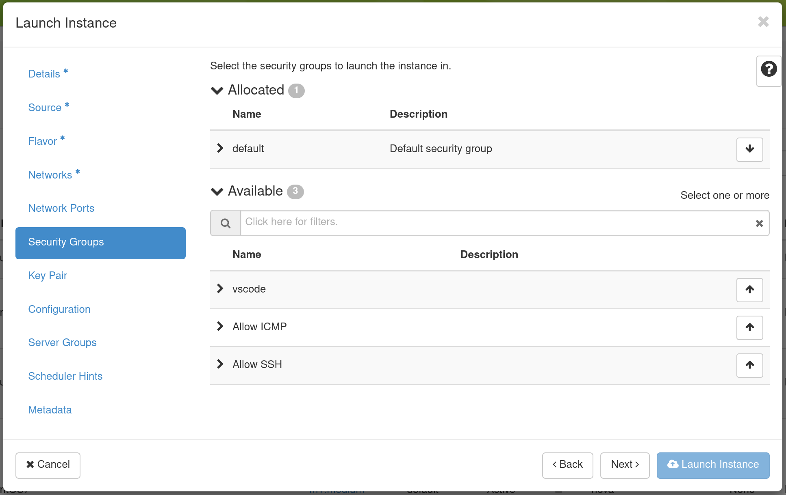

If you have previously defined *Security Groups*, you may select them here.
Alternatively, you can configure them later.

Set up network using *Network* tab.

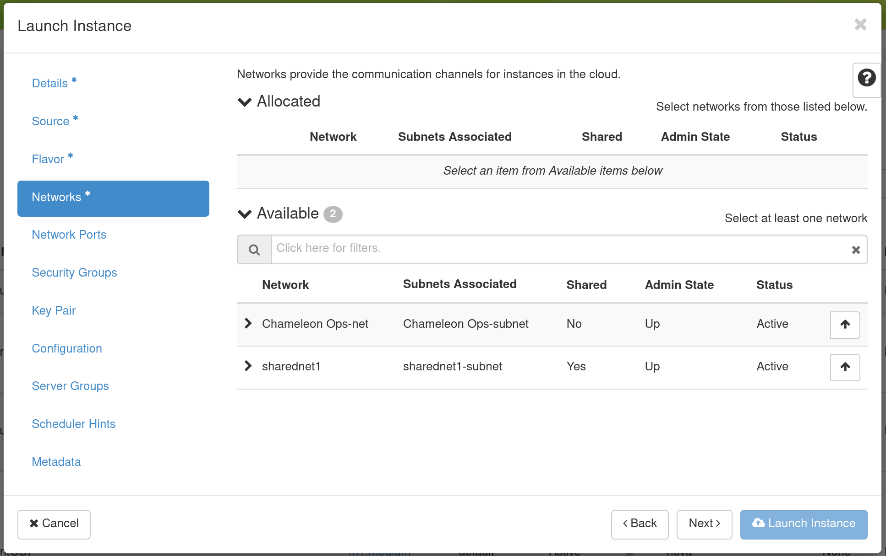

Select which network should be associated with the instance. Click the Up arrow
next to your project’s private network (PROJECT_NAME-net), not ``ext-net``.

Now you can launch your instance by clicking on the *Launch* button and the
*Instances* page will show progress as it starts.

.. _kvm-associate-ip:

Associating a Floating IP Address
~~~~~~~~~~~~~~~~~~~~~~~~~~~~~~~~~

You may assign a Floating IP Address to your Instance by selecting *Associate
Floating IP* in the dropdown menu next to your Instance on the *Instances* page.

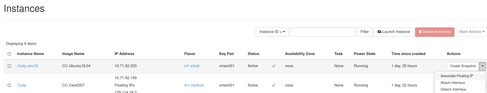

This process is similar to :ref:`baremetal-gui-associate-ip` on |CHI@TACC| and
|CHI@UC| bare metal sites.

Key Pairs
~~~~~~~~~

You will need to import or create SSH :ref:`gui-key-pairs`. This process is
similar to the process performed on |CHI@TACC| and |CHI@UC| bare metal sites.

.. _kvm-security-groups:

Security Groups
~~~~~~~~~~~~~~~

*Security Groups* allow you to specify what inbound and outbound traffic is
allowed or blocked to Instances. Unlike the |CHI@TACC| and |CHI@UC| bare metal
sites, `KVM\@TACC <https://kvm.tacc.chameleoncloud.org>`_ observes Security
Groups for Instances.

.. note::
   By default, all inbound traffic is blocked to `KVM\@TACC
   <https://kvm.tacc.chameleoncloud.org>`_ Instances, including SSH. You must
   apply a Security Group that allows TCP port 22 inbound to access your
   instance via SSH.

To create a Security Group, click *Projects* > *Network* > *Security Groups* in
the navigation side bar.

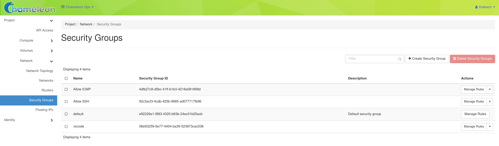

Click the *+Create Security Group* button to open the *Create Security Group*
page.

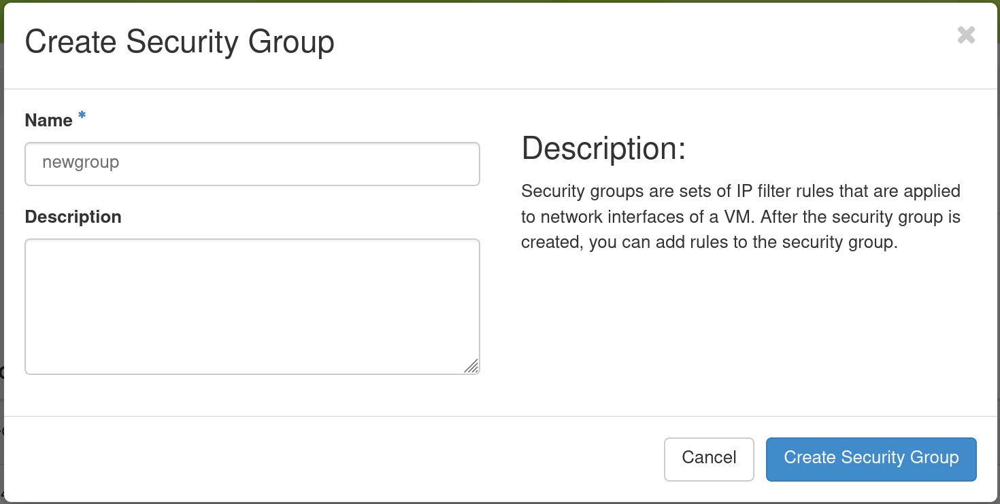

Enter a *Name* for your *Security Group*, and optionally provide a
*Description*. Then click the *Create Security Group* button. Now, you should
see your *Security Group* listed on the *Access and Security* page.

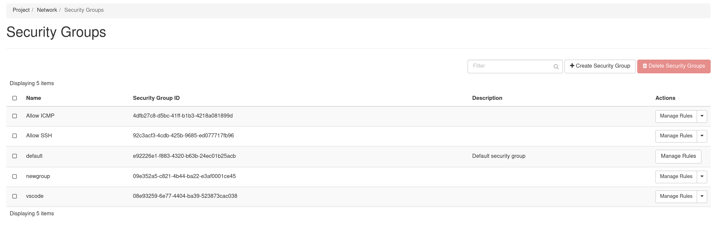

Click the *Manage Rules* button in the *Action* column to open the *Manage
Security Group Rules* page.

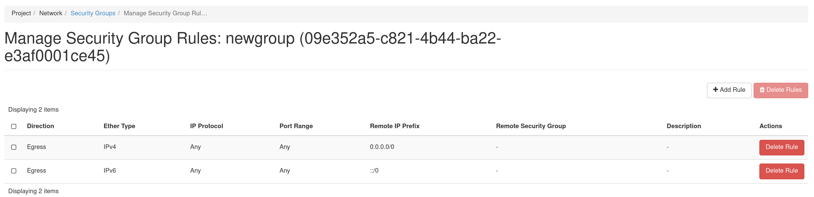

The default Security Group allows outbound IPv4 and IPv6 traffic for *Any IP
Protocol* and *Port Range*. If no entry for *Ingress*, no inbound traffic will
be allowed. You may add an additional rule by clicking on the *+Add Rule* to
open the *Add Rule* dialog.

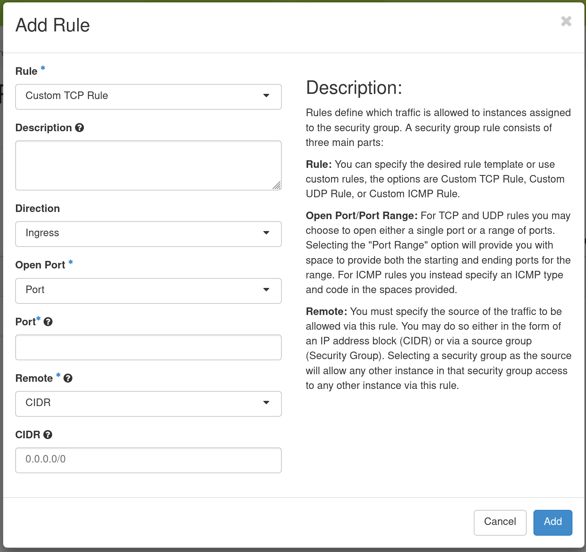

In this dialog, you can specify *Custom TCP Rule* (or *Custom UDP Rule* or
*Custom ICMP Rule*), a *Direction* (*Ingress* for inbound traffic to your
Instance or *Egress* for outbound traffic) and a *Port*. Alternatively, you can
use a pre-defined rule in the *Rule* dropdown, such as *SSH*. when you are
finished, click *Add*.

.. _kvm-security-group:

Adding a Security Group to an Instance
~~~~~~~~~~~~~~~~~~~~~~~~~~~~~~~~~~~~~~

Once you have defined a *Security Group*, you may apply it to an Instance by
clicking *Project* > *Compute* > *Instances* in the navigation sidebar and
clicking the *Edit Security Groups* option in the *Actions* dropdown.

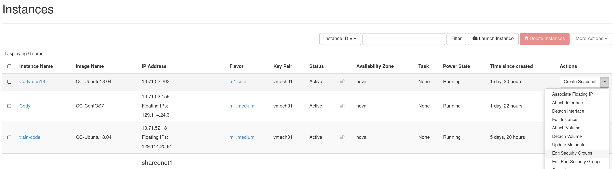

The *Security Groups* tab in the *Edit Instance* dialog will pop up.

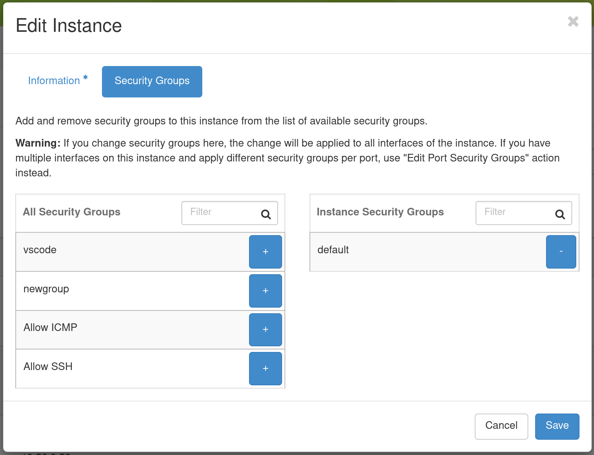

You may click the *+* button next to the Security Group you wish to apply in the
*All Security Groups* list on the left. Once you are finished, click *Save* to
finish the process.

Load Balancer as a Service
~~~~~~~~~~~~~~~~~~~~~~~~~~

Available on KVM@TACC is the OpenStack Octavia Load Balancer as a Service (LBaas). This service allows a single IP address to be used to distribute connections among a number of virtual machine instances.
For the following description, it is assumed that there are already several virtual machines running an HTTP server on port 80, serving a page at the root path.
To create a *Load Balancer*, click on *Project* > *Network* > *Load Balancers* in the navigation sidebar, then the *Create Load Balancer* button. This will open the *Create Load Balancer* dialog.

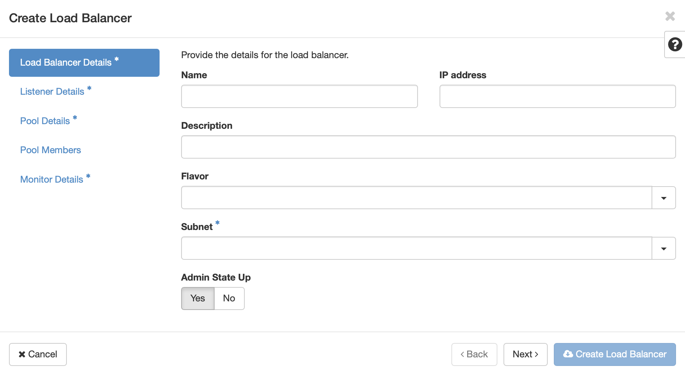

Give your load balancer a name, and select the subnet that corresponds to the one used by the virtual machines. Click *Next*, or *Listener Details*.

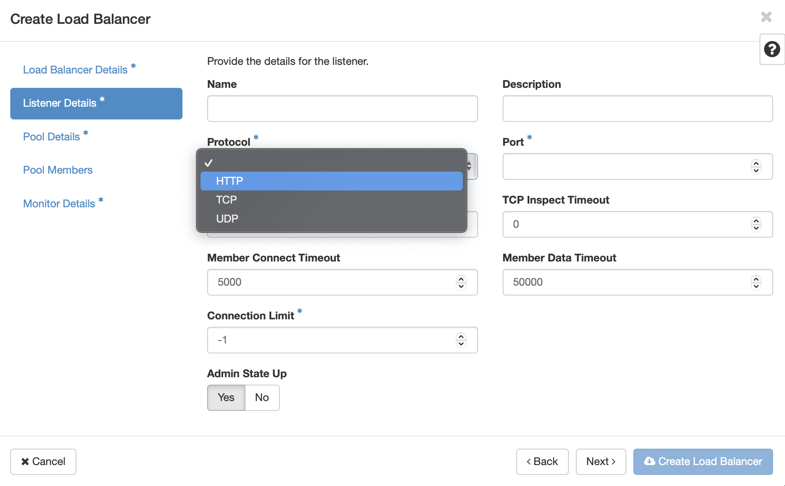

The listener is the port that will accept incoming connetions. Select the appropriate protocol for the service, in this case *HTTP*. If selecting *TCP* or *UDP* also provide the desired port. Click *Next* or *Pool Details*.

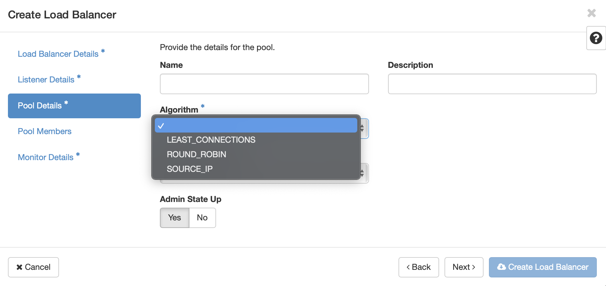

Choose the desired load balancing algorithm. This will determine the way in which the load balancer will select which VM receives incoming requests. Click *Next* or *Pool Members*.

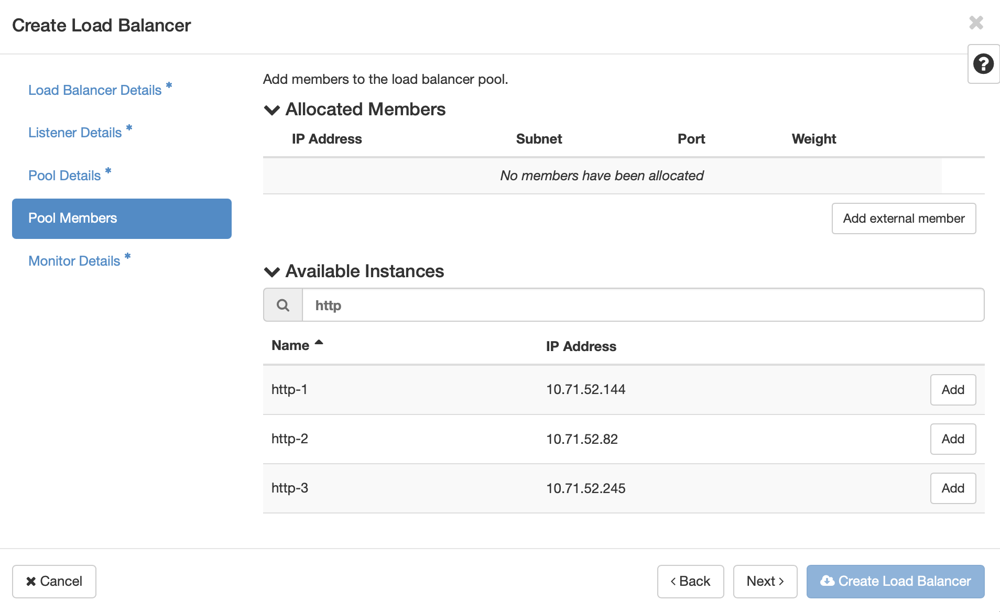

Here you will select the virtual machines that will participate in the load balacing. Click the *Add* button next to the instances, after which their IP address and subnet will be added to the *Allocated Members* list at the top.
You will need to provide the port number for the hosted service for each member. For our HTTP servers, it is port 80. This does not need to match the port of the load balancer's *listener*.

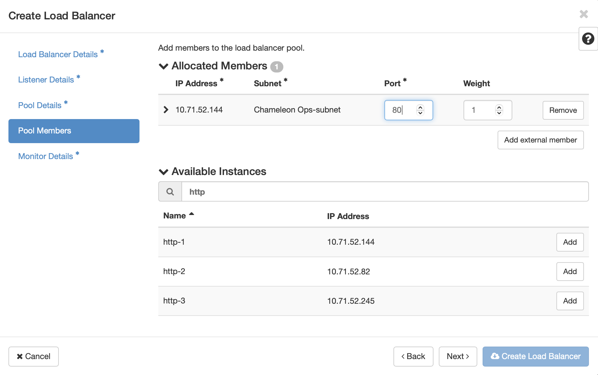

Once you've selected the pool members, click *Next* or *Monitor Details*. Here you will configure how the load balancer monitors the servies on the virtual machines to ensure that they are ready to receive traffic.
In our example, selecting *HTTP* adds configuration options for *HTTP Method*, *Expected Codes*, and *URL path*. Since the HTTP services on the VMs in the *pool members* are configured to serve a page on the root path, the default values will work.
Click *Create Load Balancer*

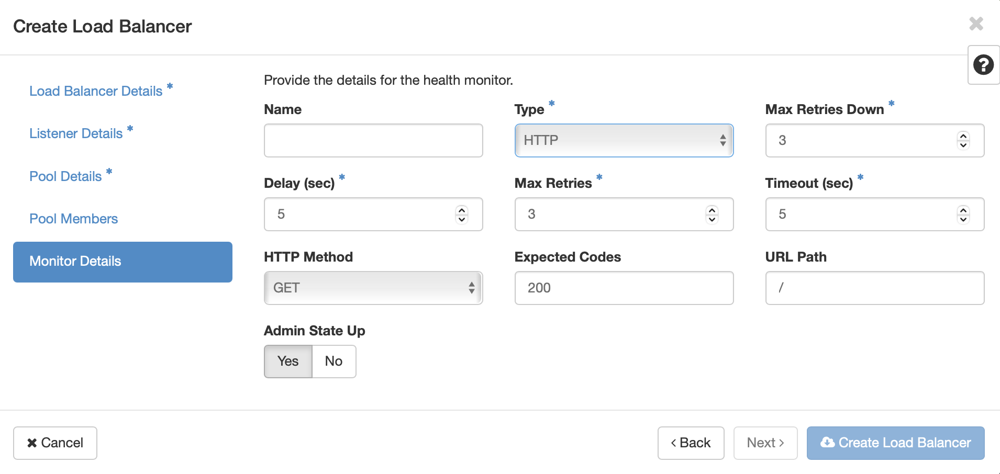

While the load balancer is being created, the dashboard will show a *Provisioning Status* of *Pending Create* . Once the process is complete, the status should be *Active*, and *Operating Status* should be *Online*.
An *Operating Status* of "*Offline*" or "*Error*" indicates that the load balancer cannot satisfy the service check specified in *Monitor Details*. Ensure that the services are running on each VM, and that they return the expected status.

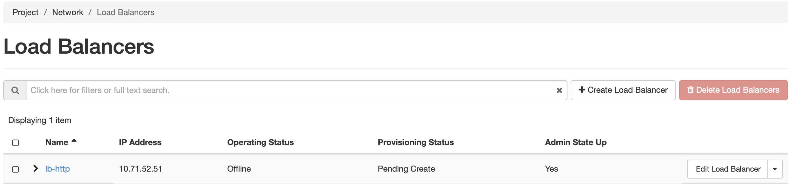

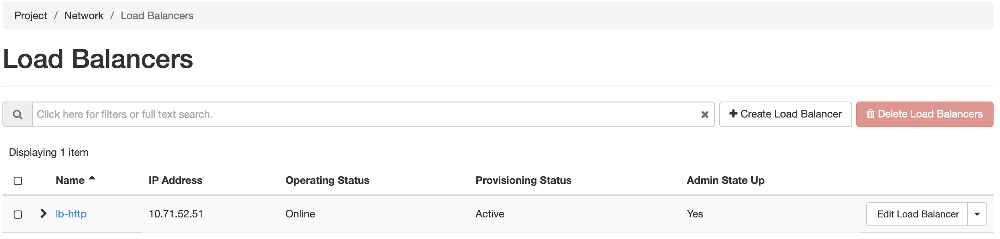

You can assign a Floating IP address to the load balancer by clicking on the down arrow button next to *Edit Load Balancer*, and selecting *Associate Floating IP*. This process is similar to associatig af Floating IP to a virtual machine instnace.
Making changes to the various components of the load balancer by clicking on the blue-colord name of the load balancer in the list. From here, the *listeners*, *pools*, and *health monitors* can be updated, if needed.

To learn more about how to use the Octavia Load Balancer, refer to the `Basic Load Balancing Cookbook <https://docs.openstack.org/octavia/latest/user/guides/basic-cookbook.html>`_ on the official OpenStack documentation

Work with KVM using the CLI
---------------------------

For general information on CLI authentication and use, please see the
`command-line-interface section
<https://chameleoncloud.readthedocs.io/en/latest/technical/cli.html#the-command-line-interface>`_.

Uploading qcow2 images to raw format for better instance launch performance
~~~~~~~~~~~~~~~~~~~~~~~~~~~~~~~~~~~~~~~~~~~~~~~~~~~~~~~~~~~~~~~~~~~~~~~~~~~

KVM images are stored on our Ceph cluster, which is able to serve raw images
much faster than qcow2 for instance launches. Openstack includes the
experimental command Glance image-create-via-import, which allows uploading of
images in various standard formats including qcow2 to then be automatically
converted to raw in the backend.

In order to use this method, authenticate to KVM using the OpenStack RC script
downloaded from the `KVM\@TACC <https://kvm.tacc.chameleoncloud.org>`_ site as
described in :ref:`cli-rc-script`.

Next, issue the following command:

   .. code-block:: shell

       glance image-create-via-import --container-format bare --disk-format qcow2 --file </path/to/image> --name <image name>

Details and other options for this command are available via the Glance
`image-create-via-import documentation
<https://docs.openstack.org/python-glanceclient/xena/cli/details.html#glance-image-create-via-import>`_.

.. attention::
   Glance image-create-via-import is currently unable to handle conversion of
   iso images to raw.

Alternatively, you may convert qcow2 images to raw format before upload.
qemu-img is one tool that is able to this with the following command:

   .. code-block:: shell

       qemu-img convert -f qcow2 -O raw <original.qcow2> <converted.img>

Once converted, use glance to upload the image:

   .. code-block:: shell

       openstack image create --file </path/to/converted.img> --disk-format raw <image-name>

Details and other options for this command are available within `Openstack
documentation <https://docs.openstack.org/image-guide/convert-images.html>`_.
