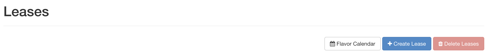
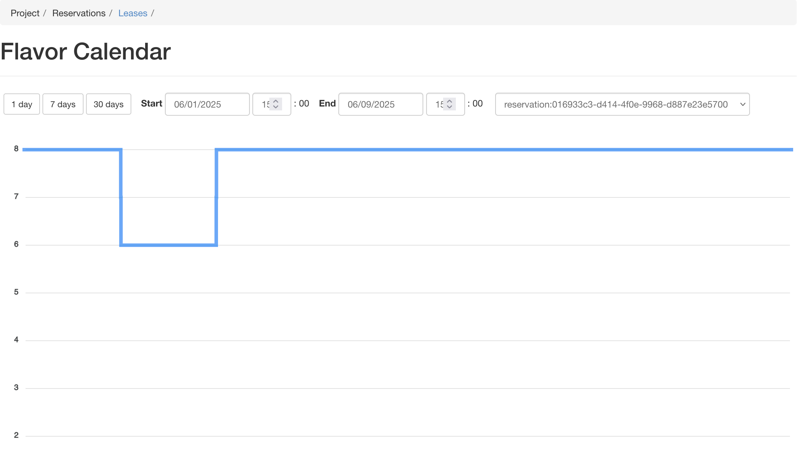
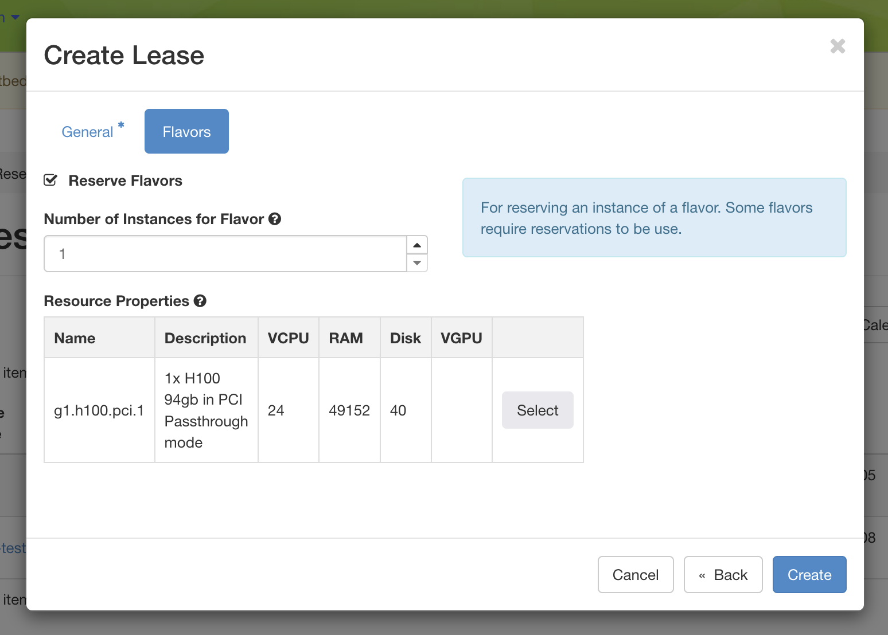
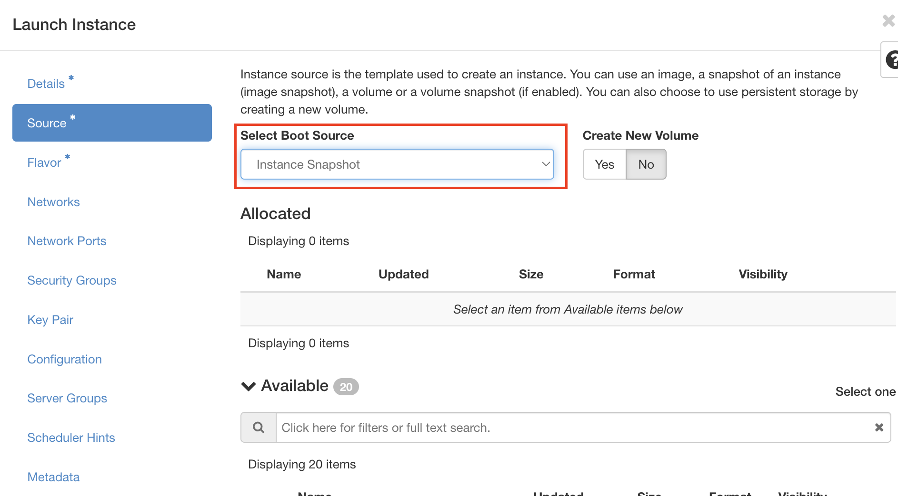

Work with KVM using the GUI
===========================

An easy way to use OpenStack KVM on Chameleon is via the GUI, which is similar
to the GUIs for |CHI@TACC| and |CHI@UC|. You log into the GUI using
your Chameleon username and password.

After a successful log in, you will see the *Overview* page as shown below. This
page provides a summary of your current and recent usage and provides links to
various other pages. Most of the tasks you will perform are done via the menu on
the lower left and will be described below. One thing to note is that on the
left, your current project is displayed. If you have multiple Chameleon
projects, you can change which of them is your current project. All of the
information displayed and actions that you take apply to your current project.
So in the screen shot below, the quota and usage apply to the current project
you have selected and no information about your other projects is shown.

.. figure:: new_overview.png

Creating Leases for VMs
-----------------------

Before launching an instance, you must have an active lease.

Checking Availability
~~~~~~~~~~~~~~~~~~~~~

Before creating a lease, you can check availability using the *Flavor Calendar*. To access the Flavor Calendar:

1. Navigate to *Project* > *Reservations* > *Leases* in the navigation sidebar.
2. Click the *Flavor Calendar* button in the top right of the Leases table.

   The Leases table with the Flavor Calendar button highlighted

The Flavor Calendar shows availability over time for flavors, allowing you to see when resources are available for reservation.

   The Flavor Calendar displaying flavor availability over time

.. _kvm-create-lease:

Creating a Lease
~~~~~~~~~~~~~~~~

Once you've confirmed availability, create a lease by navigating to the *Reservations* panel and clicking *Create Lease*. In the new lease form:
   
- Complete the *Lease Name* and *Description* fields.
- In the *flavor* tab, select a flavor.

   Selecting a GPU-enabled flavor during lease creation

- Confirm your reservation after submitting the lease request. If capacity is insufficient, the GUI will display an error message and the lease will not be created.

.. note::
   
   Use the Flavor Calendar to check availability before creating a lease. If
   you are unable to create a lease, you may need to wait for resources to become
   available.

.. _kvm-launch-instance:

Launching Instances
-------------------

To launch an *Instance*, click the *Launch Instance* button. This will open the
*Launch Instance* dialog.

.. figure:: new_launchdetails.png

On the *Details* tab, provide a name for this instance (to help you identify
instances that you are running).

Next, go to the *Source* tab to select media to launch.

.. figure:: new_launchsource.png

Select the *Boot Source* of the instance, which is either an *Image*, an
*Instance Snapshot* (an image created from a running virtual machine), a
*Volume* (a persistent virtual disk that can be attached to a virtual machine),
or a "Volume Snapshot". If you select "Image" as the *Boot Source*, the *Image
Name* dropdown presents a list of virtual machine images that we have provided,
that other Chameleon users have uploaded and made public, or images that you
have uploaded for yourself. If you select *Boot from snapshot*, the *Instance
Snapshot* dropdown presents a list of virtual machine images that you have
created from your running virtual machines.

Go to the *Flavor* Tab and select the amount of resources (Flavor) to allocate
to the instance.

.. figure:: new_launchflavor.png

Flavors refer to the virtual machine's assigned memory and and disk size.
Different images and snapshots may require a larger Flavor. For example, the
``CC-CentOS7`` image requires at least an ``m1.small`` flavor.

**If you have a lease for a GPU-enabled flavor**, you will see a special flavor
associated with your active lease in this menu. GPU-enabled flavors are displayed 
with the prefix ``reservation:`` followed by the lease identifier (e.g., 
``reservation:aa46132b-5d2a-4d13-b234-46684b02399f``). Select this flavor to launch
your GPU-enabled instance. See the section on `Creating Leases for VMs with
GPUs <#kvm-create-lease>`_ for more information.

   .. tip::
      If you select different flavors from the Flavor dropdown, their
      characteristics are displayed on the right.

      If your VM needs differ from our defaults, you can request a custom
      flavor for your project from the
      `help desk <https://www.chameleoncloud.org/user/help/>`__

When you are finished with this step, go to the *Key Pair* Tab.

.. figure:: new_launchaccess.png

Select an SSH key pair that will be inserted into your virtual machine. You will
need to select a key pair here to be able to access an instance created from one
of the public images Chameleon provides. These images are not configured with a
default root password and you will not be able to log in to them without
configuring an SSH key.

Then, go to the *Security Groups* Tab.

.. figure:: new_secgroups.png

If you have previously defined *Security Groups*, you may select them here.
Alternatively, you can configure them later.

Set up network using *Network* tab.

.. figure:: new_launchnetwork.png

Select which network should be associated with the instance. Click the Up arrow
next to your project's private network (PROJECT_NAME-net), not ``ext-net``.

Now you can launch your instance by clicking on the *Launch* button and the
*Instances* page will show progress as it starts.

Managing Virtual Machine Instances
----------------------------------

One of the main activities you'll be performing in the GUI is management of
virtual machines, or instances. Go to *Project* > *Compute* > *Instances* in the
navigation sidebar. For instances that you have running, you can click on the
name of the instance to get more information about it and to access the VNC
interface to the console. The dropdown menu to the right of the instance lets
you perform a variety of tasks such as suspending, terminating, or rebooting the
instance.

.. figure:: new_instances.png

.. _kvm-associate-ip:

Associating a Floating IP Address
---------------------------------

You may assign a Floating IP Address to your Instance by selecting *Associate
Floating IP* in the dropdown menu next to your Instance on the *Instances* page.

.. figure:: new_associatemenu.png

This process is similar to :ref:`baremetal-gui-associate-ip` on |CHI@TACC| and
|CHI@UC| bare metal sites.

Key Pairs
---------

You will need to import or create SSH :ref:`gui-key-pairs`. This process is
similar to the process performed on |CHI@TACC| and |CHI@UC| bare metal sites.

.. _kvm-security-groups:

Security Groups
---------------

*Security Groups* allow you to specify what inbound and outbound traffic is
allowed or blocked to Instances. Unlike the |CHI@TACC| and |CHI@UC| bare metal
sites, `KVM\@TACC <https://kvm.tacc.chameleoncloud.org>`_ observes Security
Groups for Instances.

.. note::
   By default, all inbound traffic is blocked to `KVM\@TACC
   <https://kvm.tacc.chameleoncloud.org>`_ Instances, including SSH. You must
   apply a Security Group that allows TCP port 22 inbound to access your
   instance via SSH.

To create a Security Group, click *Projects* > *Network* > *Security Groups* in
the navigation side bar.

.. figure:: new_securitytab.png

Click the *+Create Security Group* button to open the *Create Security Group*
page.

.. figure:: new_createsecurity.png

Enter a *Name* for your *Security Group*, and optionally provide a
*Description*. Then click the *Create Security Group* button. Now, you should
see your *Security Group* listed on the *Access and Security* page.

.. figure:: new_grouplist.png

Click the *Manage Rules* button in the *Action* column to open the *Manage
Security Group Rules* page.

.. figure:: new_managerules.png

The default Security Group allows outbound IPv4 and IPv6 traffic for *Any IP
Protocol* and *Port Range*. If no entry for *Ingress*, no inbound traffic will
be allowed. You may add an additional rule by clicking on the *+Add Rule* to
open the *Add Rule* dialog.

.. figure:: new_addrule.png

In this dialog, you can specify *Custom TCP Rule* (or *Custom UDP Rule* or
*Custom ICMP Rule*), a *Direction* (*Ingress* for inbound traffic to your
Instance or *Egress* for outbound traffic) and a *Port*. Alternatively, you can
use a pre-defined rule in the *Rule* dropdown, such as *SSH*. when you are
finished, click *Add*.

.. _kvm-security-group:

Adding a Security Group to an Instance
--------------------------------------

Once you have defined a *Security Group*, you may apply it to an Instance by
clicking *Project* > *Compute* > *Instances* in the navigation sidebar and
clicking the *Edit Security Groups* option in the *Actions* dropdown.

.. figure:: new_editaction.png

The *Security Groups* tab in the *Edit Instance* dialog will pop up.

.. figure:: new_editinstance.png

You may click the *+* button next to the Security Group you wish to apply in the
*All Security Groups* list on the left. Once you are finished, click *Save* to
finish the process.

.. _kvm-create-snapshot:

Creating a Instance Snapshot
----------------------------

Unlike the baremetal sites, where you must use the cc-snapshot tool inside your instance to create a snapshot, on KVM@TACC you can create a snapshot directly from the GUI.

First, navigate to the Instances page by clicking "Compute > Instances" in the navigation sidebar.
Click the "Create Snapshot" action next to your instance on the right size of the instance's row.
Enter a snapshot name that is meaningful to you.
On the Instances overview page, you'll now see a running task with the status of the snapshot job.
You can see a corresponding Image in the Images page by clicking "Compute > Images" in the navigation sidebar and searching for your snapshot's name.

It may some time for the snapshot to complete. Once you see the Image is "Active," it is safe to delete the instance if you no longer need it.

.. _kvm-launch-snapshot:

Launching an Instance from a Snapshot
-------------------------------------

To launch an instance from a snapshot, follow the instructions from the guide above, but under the "Source" tab, select "Instance Snapshot" instead of "Image" in the dropdown.
Then you can find the name of your snapshot in the table below and select it.

Alternatively, if you find your snapshot in the Images page (from "Compute > Images"), you can click "Launch" next to the snapshot's name.
This will open the "Launch Instance" dialog with the snapshot preselected.