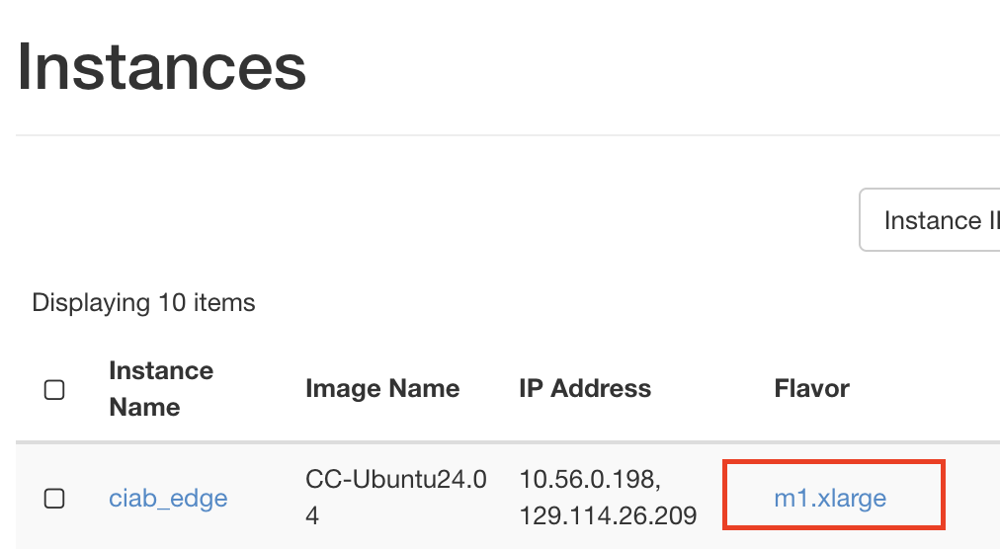
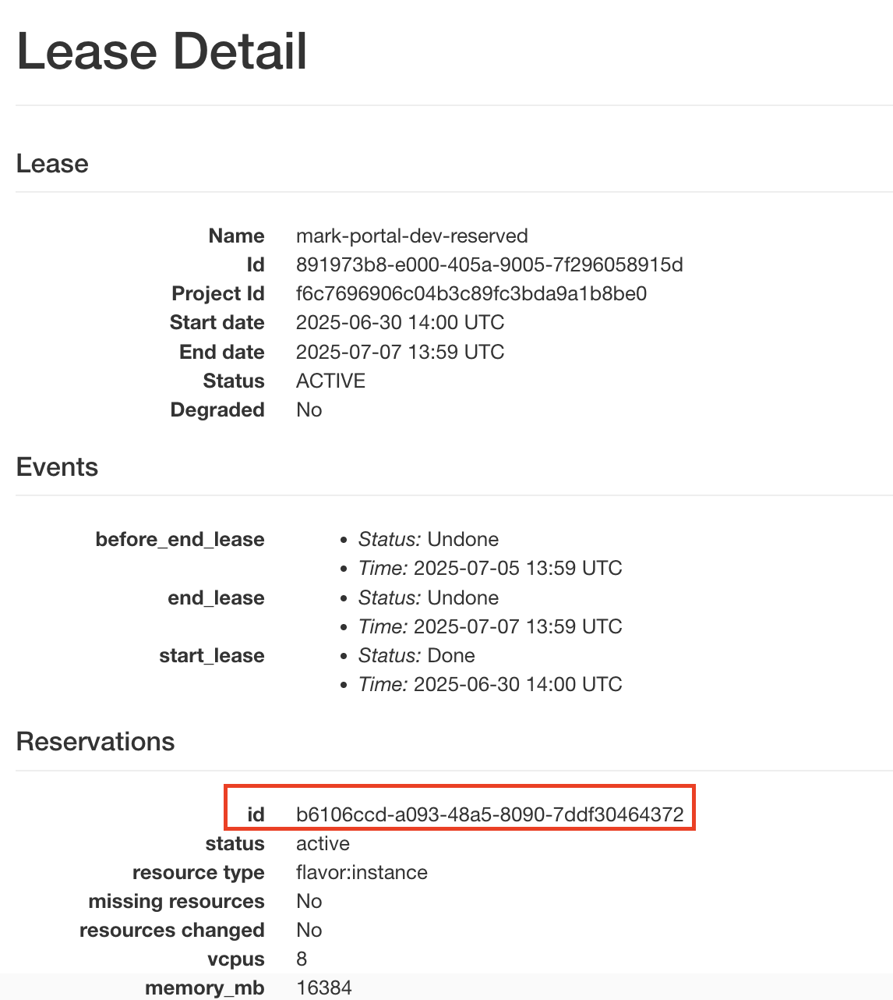
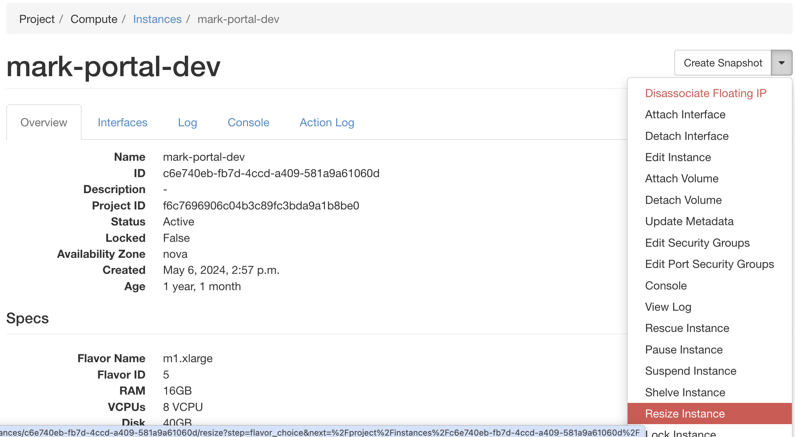
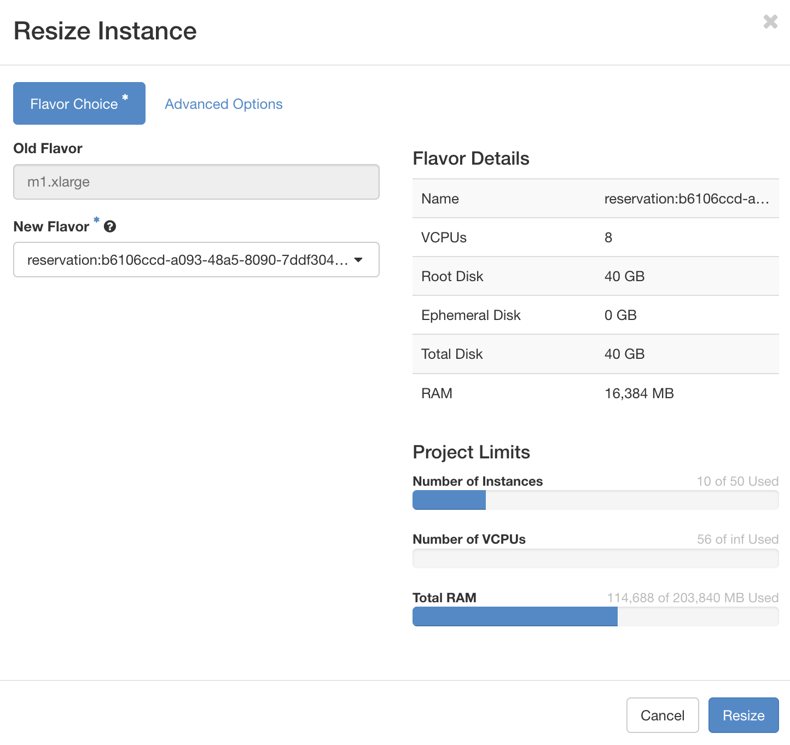
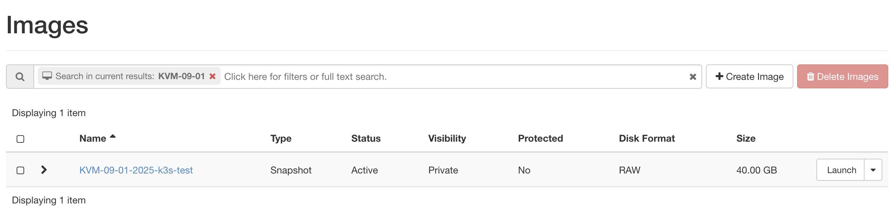

Migrating an "ad-hoc" KVM instance to a reservation
===================================================

Historically, KVM@TACC has allowed users to launch instances without a reservation.
This will no longer be the case starting August 1st, 2025, when all KVM instances must be launched with a reservation.

On September 1st, 2025, we will automatically shut down, snapshot, and delete all KVM instances that were launched without a reservation.
We recommend before that date that you migrate any "ad-hoc" KVM instances to a reservation via the following procedure to avoid downtime with your experiments.

Migration using the GUI
~~~~~~~~~~~~~~~~~~~~~~~

1. Login to `KVM@TACC <https://kvm.tacc.chameleoncloud.org/project/>`__ using your Chameleon account as normal.

2. Find the flavor of your existing instance by navigating to "Compute > Instances" in the sidebar.
   Under the flavor column, you'll see a string like "m1.XYZ" where "XYZ" is the size of the flavor (e.g., small, large).

3. Create a reservation for that flavor by navigating to "Reservations > Leases" in the sidebar (see :ref:`kvm-create-lease`).
   Click "Create Lease," and enter a lease name and adjust lease length as desired.
   Click "Next".
   Check "Reserve Flavors" and then click "Select" next to the corresponding flavor from the previous step (i.e. m1.small).

4. Wait for your lease to become "Active". This may take up to a minute.
   Click on the name of your lease, and under the "Reservations" heading, find the ID.

5. Navigate back to "Compute > Instances" in the sidebar.
   Click on the name of the instance you want to migrate.
   In the top right of the page, click the action arrow and select "Resize".

6. Select the "New Flavor" dropdown.
   You'll see a flavor with the name "reservation:ABC" where ABC is your reservation ID.
   Pick this option.
   Click "Resize" to begin the resize operation.

7. Navigate back to "Compute > Instances" in the sidebar.
   You'll see the status show the resize is running.
   Lastly, once the status is "Confirm or Revert Resize/Migrate" click on the button to "Confirm Resize".

Now your instance is tied to a lease!
You can confirm this by seeing the flavor is now "reservation:ABC" where ABC is your reservation ID.

Restoring from a snapshot
~~~~~~~~~~~~~~~~~~~~~~~~~

If you did not follow then steps above before September 1st, 2025, and your instance was automatically shut down and deleted, you can restore it from a snapshot.

Your instance data will be stored in a snapshot called "KVM-09-01-2025-INSTANCE_NAME" where "INSTANCE_NAME" is the name of your instance.

If you navigate to "Compute > Images" in the sidebar, you can search for "KVM-09-01-2025" which will show you all snapshots we took on that date from your project.

   Search for "KVM-09-01-2025" showing a snapshot for an instance titled "k3s-test"

See :ref:`kvm-launch-snapshot` for how to use this snapshot.
