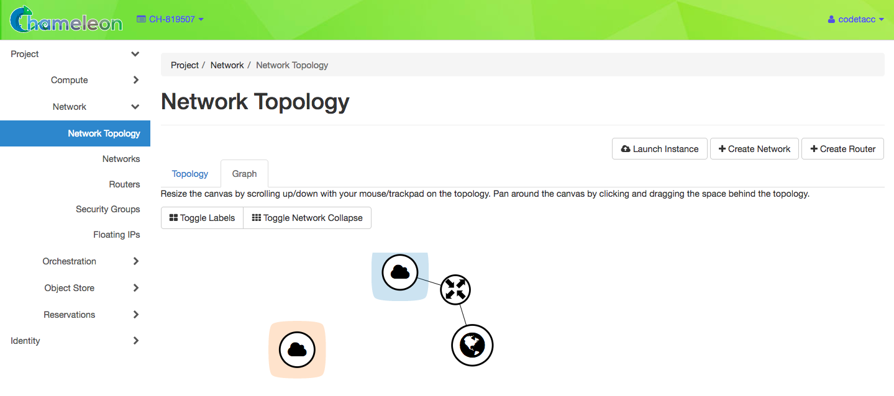

.. _networking:

=========================
Reconfigurable Networking 
=========================

Content from https://www.chameleoncloud.org/docs/bare-metal-user-guide/network-isolation-bare-metal/

__________________________________
Introduction
__________________________________

Chameleon supports Reconfigurable Networking. This allows your Instances to be attached to *Subnets* on Isolated *Networks*, joined by *Routers*. These features are achieved through Multi-Tenant Routing using Chameleon hardware resources, and can be configured through the GUI and CLI. Chameleon implements Reconfigurable Networking using OpenStack Neutron.

Networks
________

Networks are isolated logical Networks, with attached *Subnets*. *Subnets* are IP address spaces. Within a *Project*, Subnet addresses must not conflict. However, you do not have to worry about a Subnet address conflicting with other users or projects on Chameleon. Once you create a Network and Subnet, you may assign Instances to be attached to them. When creating a Subnet, you may allow the Subnet to provide *DHCP* services to Instances. This allows you to automatically assign IP Addresses to Instances on the Subnet, as well as *DNS* server addresses and static Routes.

Routers
_______

*Routers* provide routing between *Networks* within your Project or to the public Internet. A Router can have multiple *Interfaces* that are attached to Networks. These Interfaces can serve as the *Gateway* for the Network, and are assigned the first address on the Subnet. 

Chameleon Networks
__________________

All Chameleon Projects have access to two fixed networks - ``sharednet1`` and ``public``, which represents the *Public Internet*. ``sharednet1`` is a shared network between all Chameleon Projects. It has a Subnet address space of ``10.52.0.0/22``. ``public`` does not have an Subnet address space, but provides a logical Network that allows you to provide routing to the Internet.

Floating IP Addresses
_____________________

*Floating IP Addresses* are publicly accessible IPv4 addresses. CHI@TACC and CHI@UC each use a different Class B address block for Floating IP Addresses. These addresses can be bound to Instances to allow access over the Internet, and are shared between all Chameleon users. When not in use, you should be a good citizen by releasing them back to their respective IP Address pool, called ``ext-net``.

Security Groups
_______________

Currently, Security Groups are not implemented on CHI@TACC and CHI@UC. Therefore, all inbound and outbound port traffic is open to the Internet at these sites. KVM@TACC observes Security Groups, allowing inbound and outbound traffic to be filtered by port, with a default policy of denying inbound traffic.

Network Isolation
_________________

By default, bare metal nodes on each Chameleon site share the same local network (shared VLAN and IP subnet). However, some experiments may require more network isolation, which is now supported by Chameleon.

Our implementation of network isolation is based on dynamically managed VLANs (network layer 2) associated with user-configured private IP subnets (network layer 3). This means that all network communications local to the IP subnet or the broadcast domain (such as Ethernet broadcast, ARP, IP broadcast, DHCP, etc.) will be restricted to the user-configured network and its associated VLAN. This feature enables a range of experiments in networking and security. For example, this allows running your own DHCP server to configure virtual machines running on bare metal nodes, without impacting other users.

Please note the following:

- Network isolation is now available on both CHI@UC and CHI@TACC.
- Strong network isolation is provided at network layer 2 only. Even using separate IP subnetworks, any bare metal node can still communicate with each other and with the Internet through the network's router. We are investigating solutions to provide stronger isolation at network layer 3.
- Network isolation works on all nodes, including our low-power HP Moonshot nodes (low-power Xeon, Atom, ARM64).

The easiest way to launch an Isolated Network is to use the `Network Isolation HEAT Template <https://raw.githubusercontent.com/ChameleonCloud/heat-templates/master/network-isolation/network-isolation.yaml>`_ with Chameleon's :ref:`complex` feature.

____________________________________
Configuring Networking using the GUI
____________________________________

There are two GUI interfaces for working with Networks. The first interface is the *Network Topology* page, accessible clicking *Project* > *Network* > *Network Topology*. This provides a graphical representation of your Project's network configuration.

   The Topology View on the Network Topology page

Alternatively, you may configure Networks and Routers independently of each other using their respective pages in *Project* > *Network*. 

Creating a Network
__________________

To create a Network from either the *Network Toplogy* page or the *Networks* page (accessible by clicking *Project* > *Network* > *Networks*), click the *+Create Network* button. This will load the *Create Network* dialog.

.. figure:: networks/createnetwork.png
   :alt: The Create Network dialog

   The Create Network dialog

First, enter a *Network Name*. In general, you will also want to create a *Subnet* for your new Network. Click the *Next* button.

.. figure:: networks/createnetworksubnet.png
   :alt: The Subnet tab

   The Subnet tab

When creating a *Subnet*, you must specify a  *Subnet Name* and a *CIDR* consisting of a  *Network Address* using a private IP address space and a subnet mask length. For example, you may create a Class C subnet with a 24-bit mask by entering ``192.168.1.0/24``. Then you may click the *Next* button.

.. note:: Do not select the *Disable Gateway* checkbox.

.. figure:: networks/createnetworkdetails.png
   :alt: Subnet details

   Subnet details

You may specify *DHCP* and static *Route* information on this tab:

- *Allocation Pools* allow you to specify DHCP address ranges using a pair of addresses per line, with the first and last addresses in the range seperated by a comma. For example, entering ``192.168.1.2,192.168.1.100`` would create this range of available addresses to be automatically assigned to Instances on the Subnet.
- *DNS Name Servers* allow you to specify a list of DNS servers, one per line. At CHI@UC, you may use ``130.202.101.6`` and ``130.202.101.37``.
- *Host Routes* allow you to specify static routing information for the subnet. You may specify them as a Subnet CIDR and a Router IP address, separated by a comma. For example, ``192.168.3.0/24,10.56.1.254`` would cause all traffic from this Subnet destined for the ``192.168.3.0`` subnet to be forwarded to the Router Interface at ``10.56.1.254``.

When you are finished, click *Create*.

Creating a Router
_________________

You may create a *Router* by using the *+Create Router* button on either the *Network Topology* page or from the *Routers* page, accessed by clicking *Project* > *Network* > *Routers*. This will open the *Create Router* dialog.

.. figure:: networks/createrouter.png
   :alt: The Create Router dialog

   The Create Router dialog

In this dialog, specify a *Router Name*. Optionally, you may connect the Router to the internet by selecting ``public`` in the *External Network* dropdown. When you are finished, click *Create Router*.

Adding a Router Interface
_________________________

A Router may have multiple *Interfaces*, each connected to a *Network*. You may add an Interface to an existing Router by selecting the Router in the *Network Topology* page, or by selecting the Router in the *Routers* page and then clicking the *Interfaces* tab.

.. figure:: networks/topologyaddinterface.png
   :alt: The Router interface in the Network Topology page

   The Router interface in the Network Topology page

.. figure:: networks/networkaddinterface.png
   :alt: The Interfaces tab in the Router detail page

   The Interfaces tab in the Router detail page

In either location, clicking the *+Add Interface* button will open the *Add Interface* dialog.

.. figure:: networks/addinterface.png
   :alt: The Add Interface dialog

   The Add Interface dialog

First, select a *Subnet* to attach to the Interface. If you do not specify an *IP Address*, Chameeon will attempt to automatically assign an IP address. For custom *Subnets*, it will typically assign a *Gateway* address (the first address on the *Subnet*). 

Deleting Networking Objects
___________________________

Network Objects such as *Routers* and *Networks* must be deleted in reverse order of which they were created. Objects cannot be deleted while other objects are depending on them. For example, you must dissociate a *Floating IP* or delete its associated *Instance* before removing a *Router* it is dependent on.

________________________________________________________
Configuring Networking using the CLI
________________________________________________________

You may configure Networking using the CLI. Make sure you have configured environment variables for your Project and Chameleon site using :ref:`cli-rc-script`.

Creating a Network
__________________

You can create a Network using the command:

.. code-block:: bash

   openstack network create <network_name>

You may receive output that appears like this:

.. code::

   +---------------------------+--------------------------------------+
   | Field                     | Value                                |
   +---------------------------+--------------------------------------+
   | admin_state_up            | UP                                   |
   | availability_zone_hints   |                                      |
   | availability_zones        |                                      |
   | created_at                | 2018-03-23T23:45:19Z                 |
   | description               |                                      |
   | dns_domain                | None                                 |
   | id                        | 21ed933c-323d-4708-930c-d5f82c507430 |
   | ipv4_address_scope        | None                                 |
   | ipv6_address_scope        | None                                 |
   | is_default                | None                                 |
   | is_vlan_transparent       | None                                 |
   | mtu                       | 1500                                 |
   | name                      | MyNetwork                            |
   | port_security_enabled     | False                                |
   | project_id                | d5233415ee0b467baec14cbd2d0e1331     |
   | provider:network_type     | vlan                                 |
   | provider:physical_network | physnet1                             |
   | provider:segmentation_id  | 2018                                 |
   | qos_policy_id             | None                                 |
   | revision_number           | 2                                    |
   | router:external           | Internal                             |
   | segments                  | None                                 |
   | shared                    | False                                |
   | status                    | ACTIVE                               |
   | subnets                   |                                      |
   | tags                      |                                      |
   | updated_at                | 2018-03-23T23:45:19Z                 |
   +---------------------------+--------------------------------------+

Once you have created a Network, you may create a subnet with the command:

.. code-block::

   openstack subnet create --subnet-range <cidr> --dhcp --network <network_name> <subnet_name>

For example, the command:

.. code-block::

   openstack subnet create --subnet-range 192.168.1.0/24 --dhcp --network MyNetwork MySubnet

Will create a subnet with the following output:

.. code::

   +-------------------+--------------------------------------+
   | Field             | Value                                |
   +-------------------+--------------------------------------+
   | allocation_pools  | 192.168.1.2-192.168.1.254            |
   | cidr              | 192.168.1.0/24                       |
   | created_at        | 2018-03-23T23:50:11Z                 |
   | description       |                                      |
   | dns_nameservers   |                                      |
   | enable_dhcp       | True                                 |
   | gateway_ip        | 192.168.1.1                          |
   | host_routes       |                                      |
   | id                | 8be4e80d-ba49-4cdc-8480-ba43dd4724c2 |
   | ip_version        | 4                                    |
   | ipv6_address_mode | None                                 |
   | ipv6_ra_mode      | None                                 |
   | name              | MySubnet                             |
   | network_id        | 21ed933c-323d-4708-930c-d5f82c507430 |
   | project_id        | d5233415ee0b467baec14cbd2d0e1331     |
   | revision_number   | 2                                    |
   | segment_id        | None                                 |
   | service_types     |                                      |
   | subnetpool_id     | None                                 |
   | tags              |                                      |
   | updated_at        | 2018-03-23T23:50:11Z                 |
   +-------------------+--------------------------------------+

You may specify other Subnet options with the appropriate flags, which you may view by simply typing the command:

.. code-block::

   openstack subnet create

Creating a Router
_________________

You may create a Router by using the command:

.. code-block::

   openstack create router <router_name>

You may receive output that looks like this:

.. code::

   +-------------------------+--------------------------------------+
   | Field                   | Value                                |
   +-------------------------+--------------------------------------+
   | admin_state_up          | UP                                   |
   | availability_zone_hints |                                      |
   | availability_zones      |                                      |
   | created_at              | 2018-03-23T23:56:35Z                 |
   | description             |                                      |
   | distributed             | False                                |
   | external_gateway_info   | None                                 |
   | flavor_id               | None                                 |
   | ha                      | False                                |
   | id                      | 9b5d4516-804a-4c01-9016-3a27fc4197d1 |
   | name                    | MyRouter                             |
   | project_id              | d5233415ee0b467baec14cbd2d0e1331     |
   | revision_number         | None                                 |
   | routes                  |                                      |
   | status                  | ACTIVE                               |
   | tags                    |                                      |
   | updated_at              | 2018-03-23T23:56:35Z                 |
   +-------------------------+--------------------------------------+

Adding a Router Interface
_________________________

You can add a Router Interface with the command:

.. code-block:: bash

   openstack router add subnet <router_name> <subnet_name>

This automatically attaches a new Interface to the specified Subnet. You may also wish to specify an *External Gateway* for your router and connect it to the ``public`` Network with the following command:

.. code-block:: bash

   openstack router set --external-gateway public <router_name>

Deleting Networking Objects
___________________________

To delete a Router with an External Gateway and its associated Subnets, you may use the following commands:

.. code-block:: bash

   openstack router unset --external-gateway <router_name>
   openstack router remove subnet <router_name> <subnet_name>
   openstack router delete <subnet>
   openstack network delete <network_name>

____________________________
Advanced Networking Features
____________________________

Chameleon implements additional configurable *OpenStack Neutron* *Resource Types*, such as *Subnet Pools* for dynamic Network creation and rule-based *Metering* to measure traffic. These features may be configured through the CLI and through :ref:`complex`. To see a list of available list of Resource Types, use the GUI at either CHI@TACC or CHI@UC and navigate to *Project* > *Orchestration* > *Resource Types*. Networking Resource Types are listed as ``OS::Neutron`` Resources.
