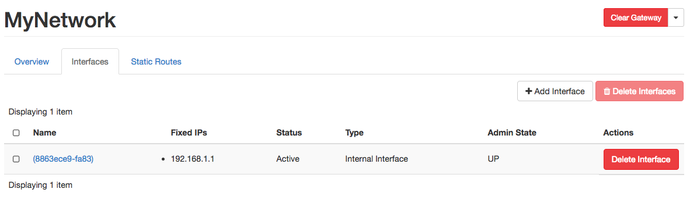
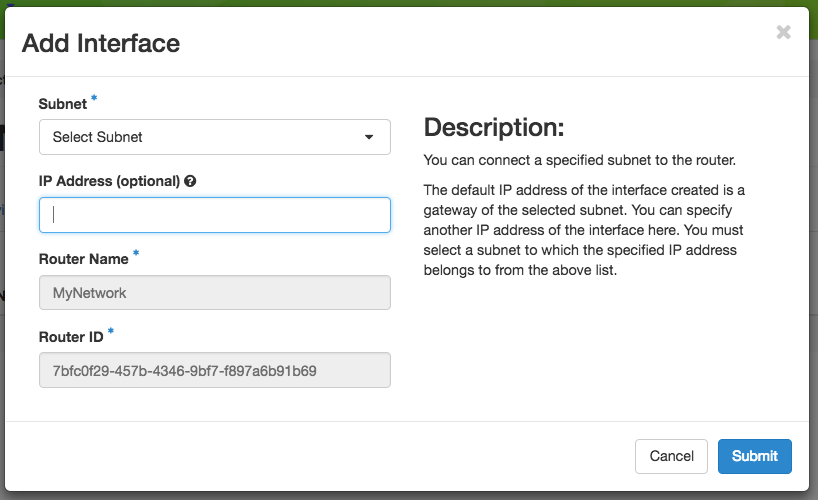
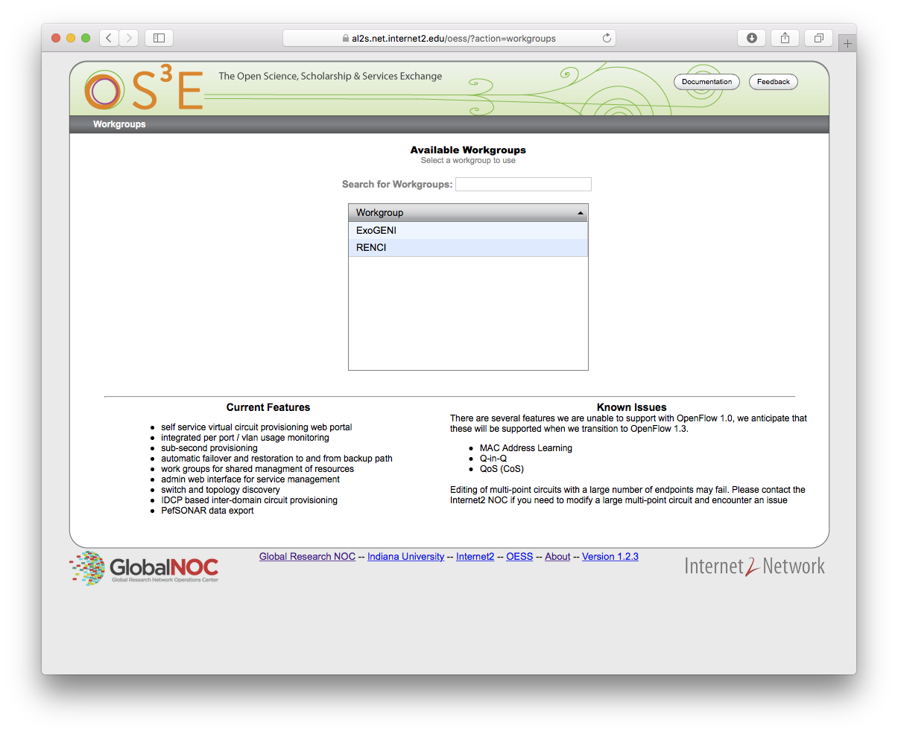

.. _networking:

==========
Networking
==========

Networking on Chameleon is implemented using `OpenStack Neutron <https://docs.openstack.org/neutron/pike/>`_.
Most experiments will require :ref:`basic-networking` functionality including Internet access and connectivity between nodes. Chameleon provides basic networking capabilities via a pre-configured shared network called ``sharednet1``. Many experiments require additional connectivity and control of the network.  Theses experiments can utilize Chameleon's advanced networking capabilities including :ref:`network-isolation`, :ref:`stitching`, and :ref:`sdn`.

.. _basic-networking:

________________
Basic Networking
________________

.. Note:: Step-by-step instructions for getting started with Chameleon are available in the :ref:`getting-started` section of this documentation. These instructions include using basic networking functionality.

Shared Network
_______________

All Chameleon Projects have access to the fixed network ``sharednet1`` which is used by most experiments. The ``sharednet1`` is a pre-configured network shared among all Chameleon Projects with a *Subnet* whose address space is ``10.52.0.0/22`` and includes a router providing NAT access to the public Internet. All instances using ``sharednet1`` can communicate directly.

Floating IP Addresses
_____________________

Instances on Chameleon are assigned a *fixed* IP address that can be used for local connectivity as well as NAT access to the public Internet. A publicly accessible IPv4 address (*Floating IP address*) is required in order to access Chameleon instances from the Internet or host public services. `CHI@TACC <https://chi.tacc.chameleoncloud.org>`_ and `CHI@UC <https://chi.uc.chameleoncloud.org>`_ each have a limited number of public IP addresses that can be allocated to your instances.

The :ref:`getting-started` guide shows how to allocate *Floating IP address* to your nodes.

.. important:: The Chameleon floating IP address pool is a shared and finite resource. **Please be responsible and release any unused floating IP address, so other Chameleon users and projects can use them!**

Security Groups
_______________

Currently, *Security Groups* are not implemented on `CHI@TACC <https://chi.tacc.chameleoncloud.org>`_ and `CHI@UC <https://chi.uc.chameleoncloud.org>`_. Therefore, all inbound and outbound port traffic is open to the Internet at these sites. `KVM@TACC <https://openstack.tacc.chameleoncloud.org>`_ observes *Security Groups*, which allows inbound and outbound traffic to be filtered by port with a default policy.

.. _network-isolation:

______________________
Isolated Network VLANs
______________________

By default, bare metal nodes on each Chameleon site share the same local network (shared VLAN and IP subnet). However, some experiments may require more network isolation, which is now supported by Chameleon.

Chameleon's implementation of network isolation is based on dynamically managed VLANs (network layer 2) associated with user-configured private IP subnets (network layer 3). This means that all network communications local to the IP subnet or the broadcast domain (such as Ethernet broadcast, ARP, IP broadcast, DHCP, etc.) will be restricted to the user-configured network and its associated VLAN. This feature enables a range of experiments in networking and security. For example, this allows running your own DHCP server to configure virtual machines running on bare metal nodes, without impacting other users.

.. note::

   - Network isolation is now available on both `CHI@UC <https://chi.uc.chameleoncloud.org>`_ and `CHI@TACC <https://chi.tacc.chameleoncloud.org>`_.
   - Strong network isolation is provided at network layer 2 only. Even using separate IP subnetworks, any bare metal node can still communicate with each other and with the Internet through the network's router. We are investigating solutions to provide stronger isolation at network layer 3.
   - Network isolation works on all nodes, including our low-power HP Moonshot nodes (low-power Xeon, Atom, ARM64).

To use this feature, you will need to create a dedicated network and router. You can use a *Heat* template or use the *Network* panel of the GUI. Network isolation using the *Heat* template procedure is explained in this section below. For creating networks and routers using the *Network* panel of the GUI, please continue reading the following sections.

#. To create networks and routers using a *Heat* template, go to *Project* > *Orchestration* > *Stacks*.
#. Click the *Launch Stack* button to open an interactive dialog.
#. Select *URL* as *Template Source* and paste https://raw.githubusercontent.com/ChameleonCloud/heat-templates/master/network-isolation/network-isolation.yaml to *Template URL*.
#. Click the *Next* button to navigate to the *Launch Stack* dialog.
#. Provide a name for your stack, enter your password, and set a private IP range, such as 192.168.1.0/24.
#. Set the first and the last IP addresses of *DHCP* range.

   .. important::
      The first IP adddress in the DHCP range should never be \*.1 and \*.2. The last IP address in the range must be less than \*.255.

#. Start creating the network and router by clicking the *Launch* button.

For more information about *Stack*, please read :ref:`complex`.

Creating a Network using the GUI
________________________________

To create a Network from either the *Network Topology* page or the *Networks* page, click the *+Create Network* button to open the *Create Network* dialog.

.. figure:: networks/createnetwork.png
   :alt: The Create Network dialog

   The Create Network dialog

In *Create Network* dialog, name your network. In general, you will also want to create a *Subnet* for your new Network, so make sure you have *Create Subnet* checked. Click the *Next* button.

.. figure:: networks/createnetworksubnet.png
   :alt: The Subnet tab

   The Subnet tab

When creating a *Subnet*, you must specify a  *Subnet Name* and a `CIDR <https://en.wikipedia.org/wiki/Classless_Inter-Domain_Routing>`_ *Network Address* that contains a private IP address and a subnet mask length. For example, you may create a `Class C <https://docs.microsoft.com/en-us/previous-versions/windows/it-pro/windows-2000-server/cc940018(v=technet.10)>`_ subnet with a 24-bit mask by entering ``192.168.1.0/24``. You may set a Gateway or leave it blank to use the default. Then, click the *Next* button.

.. attention:: **Do not** select the *Disable Gateway* checkbox!

.. figure:: networks/createnetworkdetails.png
   :alt: Subnet details

   Subnet details

You may specify *DHCP* and static *Route* information at *Subnet Details* section:

- *Allocation Pools* section allows you to specify *DHCP* address ranges in the format of ``<first address>,<last address>``. For example, entering ``192.168.1.2,192.168.1.100`` will create a *Subnet* with IP ranges from ``192.168.1.2`` to ``192.168.1.100``.
- *DNS Name Servers* section allows you to specify a list of DNS servers.

  .. note::
     At `CHI@TACC <https://chi.tacc.chameleoncloud.org>`_, use ``129.114.97.1`` and ``129.114.97.2`` for your DNS servers
     At `CHI@UC <https://chi.uc.chameleoncloud.org>`_, use ``130.202.101.6`` and ``130.202.101.37`` for your DNS servers
- *Host Routes* section allows you to specify static routing information for the subnet in the format of ``<subnet CIDR>,<router IP address>``. For example, ``192.168.3.0/24,10.56.1.254`` means all traffic from this Subnet to ``192.168.3.0`` will be forwarded to the Router Interface at ``10.56.1.254``.

.. note:: All three sections above are line separated.

Click *Create* button and a new Network will be created. Check if the network is created without error.

Creating a Router
_________________

To create a *Router* from either the *Network Topology* page or the *Routers* page, click the *+Create Router* button to open the *Create Router* dialog.

.. figure:: networks/createrouter.png
   :alt: The Create Router dialog

   The Create Router dialog

In this dialog, specify a *Router Name*. Optionally, you may select *public* as the *External Network* if you want to have external access.  Click *Create Router* to complete the process.

Adding a Router Interface
_________________________

A Router may have multiple *Interfaces*, each connected to a *Network*. You may add an *Interface* to an existing *Router* by clicking on *Add Interface* from either the *Network Topology* page or the *Routers* page to open the *Add Interface* dialog.

.. figure:: networks/topologyaddinterface.png
   :alt: The Router interface in the Network Topology page

   The Router interface in the Network Topology page

   The Interfaces tab in the Router detail page

   The Add Interface dialog

First, select a network and subnet you have created. You can specify an *IP address*; otherwise, Chameleon will attempt to assign an IP address automatically. The gateway IP you assigned to the subnet will be automatically picked.

Deleting Networking Objects
___________________________

.. attention::
   Network objects such as *Routers* and *Networks* must be deleted in the reverse order of which they were created. Objects **can not** be deleted while other objects are depending on them.

.. attention::
   **Before starting to delete network objects, make sure all instances using them are terminated!**

#. Go to *Project* > *Network* > *Routers*, and click on the router you would like to delete.
#. Go to *Static Routes* tab, and click on the *Delete Static Routes* button in the *Action* column. The *Static Routes* will be deleted after confirm.
#. Go to *Instances* tab, delete the Gateway interface by clicking on *Delete Interface* button in the *Action* column and confirm the deletion.
#. Now you can safely delete the router by clicking on the dropdown on the upper right corner. Then, click on *Delete Router*. Finally, confirm your deletion of the router.

   .. figure:: networks/deleterouterbutton.png
      :alt: Dropdown for deleting router

      Dropdown for deleting router

#. Go to *Project* > *Network* > *Networks*, and delete the network by using the dropdown in the *Action* column. Alternatively, you may delete the network by selecting the network using the checkbox and click on *Delete Networks* button on the upper right corner. Confirm your deletion to finish the process.

Configuring Networking using the CLI
________________________________________________________

.. tip:: Reading :doc:`cli` is highly recommanded before continuing on the following sections.

Before using the CLI, make sure you have configured environment variables using :ref:`cli-rc-script`.

.. _network-cli-create:

Creating a Network
__________________

You can create an *Isolated* VLAN Network using the command:

.. code-block:: bash

   openstack network create --provider-network-type vlan --provider-physical-network physnet1 <network_name>

The output should look like the following:

.. code::

   +---------------------------+--------------------------------------+
   | Field                     | Value                                |
   +---------------------------+--------------------------------------+
   | admin_state_up            | UP                                   |
   | availability_zone_hints   |                                      |
   | availability_zones        |                                      |
   | created_at                | 2018-03-23T23:45:19Z                 |
   | description               |                                      |
   | dns_domain                | None                                 |
   | id                        | 21ed933c-323d-4708-930c-d5f82c507430 |
   | ipv4_address_scope        | None                                 |
   | ipv6_address_scope        | None                                 |
   | is_default                | None                                 |
   | is_vlan_transparent       | None                                 |
   | mtu                       | 1500                                 |
   | name                      | MyNetwork                            |
   | port_security_enabled     | False                                |
   | project_id                | d5233415ee0b467baec14cbd2d0e1331     |
   | provider:network_type     | vlan                                 |
   | provider:physical_network | physnet1                             |
   | provider:segmentation_id  | 2018                                 |
   | qos_policy_id             | None                                 |
   | revision_number           | 2                                    |
   | router:external           | Internal                             |
   | segments                  | None                                 |
   | shared                    | False                                |
   | status                    | ACTIVE                               |
   | subnets                   |                                      |
   | tags                      |                                      |
   | updated_at                | 2018-03-23T23:45:19Z                 |
   +---------------------------+--------------------------------------+

Once you have created a Network, you may create a subnet with the command:

.. code-block:: bash

   openstack subnet create --subnet-range <cidr> --dhcp --network <network_name> <subnet_name>

For example, the command:

.. code-block:: bash

   openstack subnet create --subnet-range 192.168.1.0/24 --dhcp --network MyNetwork MySubnet

will create a subnet with the following output:

.. code::

   +-------------------+--------------------------------------+
   | Field             | Value                                |
   +-------------------+--------------------------------------+
   | allocation_pools  | 192.168.1.2-192.168.1.254            |
   | cidr              | 192.168.1.0/24                       |
   | created_at        | 2018-03-23T23:50:11Z                 |
   | description       |                                      |
   | dns_nameservers   |                                      |
   | enable_dhcp       | True                                 |
   | gateway_ip        | 192.168.1.1                          |
   | host_routes       |                                      |
   | id                | 8be4e80d-ba49-4cdc-8480-ba43dd4724c2 |
   | ip_version        | 4                                    |
   | ipv6_address_mode | None                                 |
   | ipv6_ra_mode      | None                                 |
   | name              | MySubnet                             |
   | network_id        | 21ed933c-323d-4708-930c-d5f82c507430 |
   | project_id        | d5233415ee0b467baec14cbd2d0e1331     |
   | revision_number   | 2                                    |
   | segment_id        | None                                 |
   | service_types     |                                      |
   | subnetpool_id     | None                                 |
   | tags              |                                      |
   | updated_at        | 2018-03-23T23:50:11Z                 |
   +-------------------+--------------------------------------+

To see more options when creating a subnet, use the following command:

.. code-block:: bash

   openstack subnet create --help

Creating a Router
_________________

To create a router, use the following command:

.. code-block:: bash

   openstack create router <router_name>

Your output should look like:

.. code::

   +-------------------------+--------------------------------------+
   | Field                   | Value                                |
   +-------------------------+--------------------------------------+
   | admin_state_up          | UP                                   |
   | availability_zone_hints |                                      |
   | availability_zones      |                                      |
   | created_at              | 2018-03-23T23:56:35Z                 |
   | description             |                                      |
   | distributed             | False                                |
   | external_gateway_info   | None                                 |
   | flavor_id               | None                                 |
   | ha                      | False                                |
   | id                      | 9b5d4516-804a-4c01-9016-3a27fc4197d1 |
   | name                    | MyRouter                             |
   | project_id              | d5233415ee0b467baec14cbd2d0e1331     |
   | revision_number         | None                                 |
   | routes                  |                                      |
   | status                  | ACTIVE                               |
   | tags                    |                                      |
   | updated_at              | 2018-03-23T23:56:35Z                 |
   +-------------------------+--------------------------------------+

Adding a Router Interface
_________________________

A Router Interface can be added and attached to a subnet with the command:

.. code-block:: bash

   openstack router add subnet <router_name> <subnet_name>

In addition, you can specify an *External Gateway* for your router and connect it to the ``public`` Network with the following command:

.. code-block:: bash

   openstack router set --external-gateway public <router_name>

Deleting Networking Objects
___________________________

To delete a router with an External Gateway and subnets associated to it, use the following commands:

.. code-block:: bash

   openstack router unset --external-gateway <router_name>
   openstack router remove subnet <router_name> <subnet_name>
   openstack router delete <subnet>
   openstack network delete <network_name>

.. _stitching:

_______________________________________
External Layer2 Connections (Stitching)
_______________________________________

Chameleon provides support for sophisticated networking experiments by providing `GENI-style stitching <http://groups.geni.net/geni/wiki/GeniNetworkStitchingSites>`_. This capability enables users to deploy networking experiments (layer 2 and layer 3) that extend across Chameleon, potentially other testbeds such as `GENI <http://www.geni.net/>`_, and into physical resources on their own campus networks. Users can create a dedicated network associated with a dynamic VLAN, subnet with own DHCP server, and router for external connections. 

Currently, it is possible to connect user-configured networks to other domains (e.g. GENI) over circuits created on Internet2’s Advanced Layer 2 Service (AL2S). In this setup, a pool of VLANs is extended from Chameleon racks to the AL2S endpoint at StarLight. Currently, 10 VLAN tags (3290-3299) are dedicated to this AL2S endpoint. A user-configured network that is associated with one of the dedicated AL2S VLAN tags (segmentation ID must be the same as AL2S VLAN tag) can be stitched to external domains (e.g. GENI). A circuit on AL2S needs to be created.

This document describes how to stitch Chameleon experiments to external resources including `ExoGENI <http://www.exogeni.net/>`_ and `Internet2 <https://www.internet2.edu/>`_ connected campuses. You will need to know how to create stitchable dynamic VLANs as described in the :doc:`networks` documentation. After you have created such VLAN this document will describe how to create a slice in three cases: connect to ExoGENI, connect to other domains using ExoGENI as an intermediary, or connect to other domains directly.

Chameleon has the capability to create dynamically managed VLANs associated with user-configured private IP subnets as described on :doc:`networks`. Users can create a dedicated network associated with a dynamic VLAN, subnet with own DHCP server, and router for external connections. These networks can be created through the web as well as command line interface. User-configured networks (isolated networks) are associated with VLANs by *Segmentation IDs*.

In the following sections, this workflow is described for different settings.

Configuring a Stitchable Network
________________________________

Follow the technical documentation for :ref:`network-cli-create` using the CLI, but replace the provider network with the appropriate external testbed (e.g. replace ``physnet1`` with ``exogeni``). 
In this documentation, we will describe how to stitch to the ExoGENI testbed:

.. code-block:: bash

   openstack network create --provider-physical-network exogeni <network_name>

Connecting Chameleon to ExoGENI
_______________________________

`ExoGENI <http://www.exogeni.net/>`_ is one of the two primary `GENI <http://www.geni.net/>`_ testbeds. ExoGENI allows users to create isolated experimental environments with compute and network resources distributed across 20 sites. ExoGENI has a special type of connection called “stitchport” which is a formally defined meeting point between VLANs dynamically provisioned within Chameleon and ExoGENI slices. Users can create slices on ExoGENI testbed, and connect these slices with Chameleon nodes by using a stitchport.

Stitchports that exist in ExoGENI topology are listed on ExoGENI Wiki (`ExoGENI Resource Types: Stitchport Identifiers <https://wiki.exogeni.net/doku.php?id=public:experimenters:resource_types:start#stitch_port_identifiers>`_). URLs for port locations and corresponding VLAN tags are used to create a stitchport connection. Stitchport information for Chameleon is listed as below:

- Port Location: ``ChameleonUC@ION``

    URL: http://geni-orca.renci.org/owl/ion.rdf#AL2S/Chameleon/Cisco/6509/GigabitEthernet/1/1

    Allowed VLANs: 3291-3299

- Port Location: ``ChameleonTACC@ION``

    URL: http://geni-orca.renci.org/owl/ion.rdf#AL2S/TACC/Cisco/6509/TenGigabitEthernet/1/1

    Allowed VLANs: 3501-3509

Layer 2 connections on ExoGENI are provisioned on AL2S by an agent that submits requests to OESS on behalf of the user slice. Users do not need to have an OESS account. An ExoGENI slice with a stitchport can be created as below. (Information for using ExoGENI and creating slices can be found at http://www.exogeni.net)

#. Connect the node to a stitchport:

   .. figure:: networks/connectstitchport.png

#. Supply the URL and VLAN tag to the stitchport properties. VLAN 3299 will be used for Chameleon connection. The user-configured network on Chameleon must have segmentation ID: 3299.

   .. figure:: networks/portdetails.png

#. Submit request. A manifest for the reservations will be returned.

   .. figure:: networks/submitrequest.png

#. After the slice creation is completed, nodes in the slice will be able to connect to the Chameleon nodes that are connected to the user-configured network with segmentation ID: 3299.

   .. figure:: networks/createcomplete.png

#. It is also possible to connect ExoGENI nodes to both `CHI@UC <https://chi.uc.chameleoncloud.org>`_ and `CHI@TACC <https://chi.tacc.chameleoncloud.org>`_ with multiple interfaces.

   .. figure:: networks/multipleinterfaces.png

Connecting Chameleon to user owned domains via ExoGENI
______________________________________________________

Using ExoGENI to connect to Chameleon can be further extended by using ExoGENI as an intermediary domain.

In this use case, a local site can be connected to ExoGENI via stitchports, and an ExoGENI slice can be created to route traffic to Chameleon. In the example below, a stitchport connects the local site (NCBI) to an ExoGENI slice which is connected to Chameleon. Nodes on the ExoGENI slice can be used to route traffic from NCBI nodes to Chameleon nodes. In this case, all layer 2 circuits will be provisioned by ExoGENI.

.. figure:: networks/provisionedbyexogeni.png

Connecting a local site to ExoGENI via stitchports is a process that requires multiple steps involving site owners, regional network providers, and ExoGENI.

ExoGENI racks are located on campuses across the US. Campuses are connected to Internet2 AL2S via regional provider networks. A set of VLAN tags is reserved for ExoGENI from the pool of available VLAN tags by the regional providers and campus administrations. These VLANs are plumbed on both regional provider and campus networks all the way from AL2S endpoint to the rack or server(s). Some campuses/institutions are directly connected to AL2S nodes without a regional provider (e.g. Pittsburgh Supercomputing Center, George Washington University (CAREEN)).

.. figure:: networks/al2s.jpg

Stitchports can be used to connect a specific location to ExoGENI racks.

#. VLAN(s) from the local site should be extended through the campus network all the way to the AL2S endpoint.
#. ExoGENI must update the topology to activate the stitchport.

ExoGENI administrators can provide assistance and can be contacted at geni-orca-users@googlegroups.com

Connecting Chameleon to user owned domains
__________________________________________

Users can connect their local domains to Chameleon over manually created layer-2 circuits on AL2S. Local domains need to be connected to the other AL2S endpoint of the circuit by users.

Circuits on AL2S are created through the Internet2 `AL2S OESS portal <https://al2s.net.internet2.edu/oess/>`_. The `OESS (Open Exchange Software Suite) <https://docs.globalnoc.iu.edu/sdn/oess.html>`_ is a set of software used to configure and control dynamic layer 2 virtual circuit (VLAN) networks on OpenFlow enabled switches. It includes a web-based user interface as well as a web services API.

Chameleon is connected to the AL2S endpoint at StarLight:

.. code::

   Node: sdn-sw.star.net.internet2.edu
   Interface: et-8/0/0
   VLAN range: 3290-3299

A user can log into the AL2S OESS portal and create a circuit connecting the Chameleon endpoint to the user-owned endpoint. The user should have an account to log in to the AL2S OESS portal. On OESS, users are members of workgroups. After logging in to the portal, a user can see the workgroups that he/she is a member of.

Network resources on AL2S are granted access to the workgroups. This access is granted by the owner of the AL2S network resource (campus network administrators or network engineers at regional providers). After granting access to the resources, they become available for the workgroup and start showing up in the “Available Resources” section. For the user to create such a circuit on AL2S with Chameleon endpoint, the workgroup that the user has membership should be granted access for this endpoint. This can be requested from Chameleon by opening a ticket with our help desk.

As an example, Chameleon resources can be seen in “Available Resources” section for a user in the “ExoGENI” workgroup after access to the workgroup is granted.

.. figure:: networks/available.png

The user in the ExoGENI workgroup can create a circuit with two endpoints to connect a local site to Chameleon.

.. code:: 

   Endpoint 1 (Local site):
   Node: sdn-sw.rale.net.internet2.edu
   Interface: et-9/0/0
   VLAN: 3998
   
   Endpoint 2 (`CHI@UC <https://chi.uc.chameleoncloud.org>`_):
   Node: sdn-sw.star.net.internet2.edu
   Interface: et-8/0/0
   VLAN: 3290

To create a circuit, follow these instructions:

#. Create a new VLAN

   .. figure:: networks/createvlan.png

#. Select endpoints

   .. figure:: networks/selectendpoints.png

#. Submit circuit request

   .. figure:: networks/submitcircuit.png

#. When the circuit is provisioned, you should see this:

   .. figure:: networks/circuitprovisioned.png

#. In addition, the Path can be seen on the map. Utilization data becomes available after 3 hours.

   .. figure:: networks/pathseen.png

At this point, a layer-2 circuit is created on AL2S. The user-configured network with segmentation ID 3290 can be connected to the local servers. The user needs to extend the VLANs at the local site (3998 in this case) to the AL2S endpoint.

To obtain an account to access AL2S OESS portal, users should contact Internet2. Information can be found from the links below:

- `AL2S Participants <https://www.internet2.edu/products-services/advanced-networks/layer-2-services/al2s-participants/>`_
- `AL2S Layer 2 Service Workgroups <https://www.internet2.edu/products-services/advanced-networking/layer-2-services/#service-participate>`_
- `AL2S FAQ <https://www.internet2.edu/products-services/advanced-networking/layer-2-services/#service-faq>`_
- `Using OESS <https://docs.globalnoc.iu.edu/sdn/oess/using-oess.html#Multipoint%20Static%20MAC%20Addresses>`_

.. _sdn:

___________________________
Software Defined Networking
___________________________

.. Tip:: A good way to start working with OpenFlow on Chameleon is the `OpenFlow Quick Start`_ appliance. 

.. _OpenFlow Quick Start: https://www.chameleoncloud.org/appliances/56/

Chameleon's Bring Your Own Controller (BYOC) functionality enables tenants to create isolated network switches managed using an OpenFlow controller provided by the tenant.  This feature is targeted at users wishing to experiment with software-defined networking (SDN) as well as enabling custom network appliances supporting experiments that have non-standard networking requirements. This document focuses on how to use OpenFlow networks on Chameleon. A complete discussion of OpenFlow and SDN is beyond the scope of this document.

.. Note::  **More information on OpenFlow**:   
           https://www.sdxcentral.com/sdn/definitions/what-is-openflow/  and 
           https://www.opennetworking.org/technical-communities/areas/specification/open-datapath/

OpenFlow switches, like traditional switches, forward network traffic between a number of ports used to connect other networks and devices. The primary difference is that OpenFlow switches rely on external software (a "controller") to dynamically manage the rules (or "flows") that determine how and where the traffic is forwarded. In addition, OpenFlow enables a much larger set of possible rules which can be imposed on the traffic.

The basic requirements of an OpenFlow switch are the switch and the controller. The switch is configured with the IP address and port of a controller (software) that manages the switch's rules.  When a packet arrives at the switch, the packet is tested against the rules that are known by the switch to determine what action(s) to take.  Typically, if there are no rules that apply to a packet, the packet is sent to the controller which replies with a set of rules for that type of packet. The new rules are cached in the switch and applied to subsequent packets until the rules expire or are explicitly removed.

.. Note:: **Common OpenFlow Controllers**:
          Open Daylight: https://www.opendaylight.org/
          Ryu: https://osrg.github.io/ryu/
          ONOS: https://onosproject.org/
          Floodlight: http://www.projectfloodlight.org/floodlight/
          NOX: https://github.com/noxrepo/nox

Chameleon and OpenFlow
______________________

BYOC is part of the expanded deployment for Chameleon's phase 2. It enables tenants to allocate OpenFlow switches controlled by their own OpenFlow controller. This capability is limited to the phase 2 hardware additions that include the Corsa DP2000 series OpenFlow switches and Skylake compute nodes. The Corsa switches are key to enabling the BYOC functionality.  These switches allow for the creation of mutually isolated forwarding contexts which can be thought of as virtual OpenFlow switches even though they are the native abstraction used by the Corsa DP2000s. Each isolated forwarding context can be configured to use its own OpenFlow controller. The Chameleon BYOC functionality enables tenants to specify the IP and port of an arbitrary OpenFlow controller when they create private networks.

.. Important:: OpenFlow capabilities are only available on the Skylake nodes. These are the only nodes that are attached to the Corsa DP2000 series switches.

Specifying an OpenFlow controller for your private network is just a special case of creating a private network.  Before proceeding you should become familiar with using regular private VLANs on Chameleon and be able to create your own private VLANs. Background information can be found in the document covering Reconfigurable Networking.

Alert: Currently it is not possible to specify an OpenFlow controller using the Horizon portal.  However, OpenFlow networks with tenant owned controllers can be created using Heat templates which integrate the instructions below.  

Using the CLI, an external OpenFlow controller (IP and port) can be specified on the command line using the "--description" field as shown below. Creating the subnet and router is the same as any other Chameleon network. 

.. Important:: For now, the OpenFlow functionallity will only with ExoGENI stitchable VLANs at UC. Soon, OpenFlow will be available across both sites and for all VLANs.

.. code-block:: bash

   openstack network create --provider-network-type vlan --provider-physical-network exogeni 
   --description OFController=<OF_Controller_IP>:<OF_Controller_Port> <network_name>

The output should look like the following:

.. code::

   +---------------------------+--------------------------------------+
   | Field                     | Value                                |
   +---------------------------+--------------------------------------+
   | admin_state_up            | UP                                   |
   | availability_zone_hints   |                                      |
   | availability_zones        |                                      |
   | created_at                | 2018-05-23T14:38:18Z                 |
   | description               | OFController=162.250.136.46:6653     |
   | dns_domain                | None                                 |
   | id                        | 5e359c6f-a69e-4f4d-b92a-784a5f6ca59f |
   | ipv4_address_scope        | None                                 |
   | ipv6_address_scope        | None                                 |
   | is_default                | None                                 |
   | mtu                       | 1500                                 |
   | name                      | exogeni-exogeni-3294                 |
   | port_security_enabled     | False                                |
   | project_id                | e8ae724d28374d0fa15a0e16674b5c47     |
   | provider:network_type     | vlan                                 |
   | provider:physical_network | exogeni                              |
   | provider:segmentation_id  | 3294                                 |
   | qos_policy_id             | None                                 |
   | revision_number           | 2                                    |
   | router:external           | Internal                             |
   | segments                  | None                                 |
   | shared                    | False                                |
   | status                    | ACTIVE                               |
   | subnets                   |                                      |
   | updated_at                | 2018-05-23T14:38:18Z                 |
   +---------------------------+--------------------------------------+

Example CLI command used to create the network:

.. code-block:: bash

   [root@admin02 ~]# NET="exogeni-3294"
   [root@admin02 ~]# PHYSICAL_NETWORK_TENANT="exogeni"
   [root@admin02 ~]# NET_TYPE="vlan"
   [root@admin02 ~]# NET_NAME="${PHYSICAL_NETWORK_TENANT}-${NET}"
   [root@admin02 ~]# OF_CONTROLLER_IP="162.250.136.46"
   [root@admin02 ~]# OF_CONTROLLER_PORT="6653"
   [root@admin02 ~]# openstack network create --provider-network-type ${NET_TYPE} \
   >                          --provider-physical-network ${PHYSICAL_NETWORK_TENANT} \
   >                          --description OFController=${OF_CONTROLLER_IP}:${OF_CONTROLLER_PORT} \
   >                          ${NET_NAME}
   +---------------------------+--------------------------------------+
   | Field                     | Value                                |
   +---------------------------+--------------------------------------+
   | admin_state_up            | UP                                   |
   | availability_zone_hints   |                                      |
   | availability_zones        |                                      |
   | created_at                | 2018-05-23T14:38:18Z                 |
   | description               | OFController=162.250.136.46:6653     |
   | dns_domain                | None                                 |
   | id                        | 5e359c6f-a69e-4f4d-b92a-784a5f6ca59f |
   | ipv4_address_scope        | None                                 |
   | ipv6_address_scope        | None                                 |
   | is_default                | None                                 |
   | mtu                       | 1500                                 |
   | name                      | exogeni-exogeni-3294                 |
   | port_security_enabled     | False                                |
   | project_id                | e8ae724d28374d0fa15a0e16674b5c47     |
   | provider:network_type     | vlan                                 |
   | provider:physical_network | exogeni                              |
   | provider:segmentation_id  | 3294                                 |
   | qos_policy_id             | None                                 |
   | revision_number           | 2                                    |
   | router:external           | Internal                             |
   | segments                  | None                                 |
   | shared                    | False                                |
   | status                    | ACTIVE                               |
   | subnets                   |                                      |
   | updated_at                | 2018-05-23T14:38:18Z                 |
   +---------------------------+--------------------------------------+

Controllers for Corsa DP2000 series switches
____________________________________________

OpenFlow controllers often need to be aware of the slight differences in implementation across switch vendors. What follows is a description of the quirks we have found while using the Corsa DP2000 series switches as well as a simple controller configuration that is compatible with Chameleon OpenFlow networks.

We have used Ryu and OpenDaylight controllers for the VFCs (Virtual Forwarding Context) on Corsa switches.  We have provided a sample OpenFlow Ryu controller application that is available on GitHub. In addition, we have provided a Chameleon appliance that creates a Ryu controller based on these code modifications.

This controller is derived from the Ryu simple_switch_13.py with the following considerations. If you want use any other OpenFlow controller you will have to make similar considerations.

1. VFCs on Corsa switches are created by allocating specific amounts of system resources. Each VFC has a limited amount of resources in order to accommodate the requests of all Chameleon users. This limits the number of flows that can be put in the flow tables. Controllers will need to be careful not to fill up the flow tables. In our example, an idle timeout (defaulting to 5 minutes) to any rule inserted into the VFC via the controller is added to ensure the flow tables are cleaned up. This way, the switch removes the rule itself, once traffic matching the rule stops passing (for the specified interval).

2. The Corsa switches do not support Actions=FLOOD since this reserved port type is only for hybrid switches and it is optional. Corsa is an Openflow-only switch which supports the required port ALL. Controllers must replace the Actions=FLOOD to Actions=ALL in packet out messages.

3. Flow tables are modified according to the status of the ports being added or deleted from the VFC. 

The following changes are made to the application:

Added the functions below:

.. code::

   def _port_status_handler(self, ev):
   def delete_flow(self, datapath, port):

Added IDLE_TIMEOUT to flow modification in:

.. code::

   def add_flow(self, datapath, priority, match, actions, buffer_id=None):

Changes are made in the function below to change ``Actions=FLOOD`` to ``actions=ALL`` in packet out message in the ``def _packet_in_handler(self, ev):`` method.

This controller application can be run by the script below:

.. code::

   CHAMELEON_RYU_URL="https://github.com/ChameleonCloud/ryu.git"
   CHAMELEON_RYU_APP="simple_switch_13_custom_chameleon.py"
   
   yum install -y epel-release
   yum install -y python-pip git
   pip install ryu
   
   RYU_DIR="/opt/ryu"
   
   mkdir ${RYU_DIR} && mkdir ${RYU_DIR}/repo
   
   git clone ${CHAMELEON_RYU_URL} ${RYU_DIR}/repo
   ln -s ${RYU_DIR}/repo/ryu/app/${CHAMELEON_RYU_APP} ${RYU_DIR}/${CHAMELEON_RYU_APP}
   
   
   RYU_PID_FILE="/var/run/ryu/ryu-manager.pid"
   RYU_LOG_FILE="/var/log/ryu/ryu-manager.log"
   RYU_CONFIG_DIR="/opt/ryu/etc"
   RYU_APP="${RYU_DIR}/${CHAMELEON_RYU_APP}"
   OFP_TCP_LISTEN_PORT="6653"
   
   
   /usr/bin/ryu-manager --pid-file \${RYU_PID_FILE} --ofp-tcp-listen-port \${OFP_TCP_LISTEN_PORT} --log-file \${RYU_LOG_FILE} \${RYU_APP}
