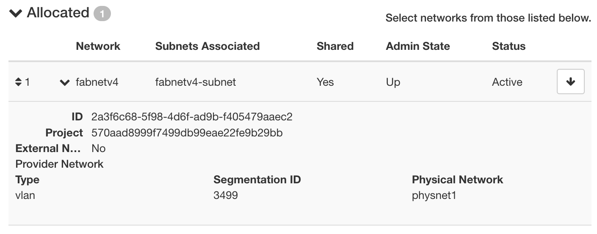

.. _multisitelayer3:

External Layer 3 Connectivity
===============================

In addition to configuring networks and floating IPs within a given site (see :ref:`basic-networking`), we provide a shared network named
"fabnetv4", which can route traffic via the FABRIC testbed's layer3 experimental network. Nodes attached to this network may
send traffic to "fabnetv4" on other Chameleon sites, or to anythign in the FABNET IPv4 address space, without needing public
IPs or traversing a Neutron router.

Besides being easier to set up, this provides lower latency, higher bandwidth, and overall more flexiblity for multi-site
experiments.

.. image:: networks/fabnetv4.svg
  :width: 500
  :alt: Diagram showing L3 connectivity between Chameleon and FABRIC

.. _network-l3multisite-create:

Using FabnetV4
______________

+------+----------------+------------------+
| Site | Current status | Fabnet Router IP |
+------+----------------+------------------+
| UC   | Testing        | 10.191.128.1/23  |
+------+----------------+------------------+
| TACC | Available      | 10.191.130.1/23  |
+------+----------------+------------------+

At sites where the feature is available, you will be able to see the `fabnetv4` network in Horizon,

Or by executing::

    OS_CLOUD=tacc openstack network show fabnetv4 --fit-width
    +---------------------------+--------------------------------------+
    | Field                     | Value                                |
    +---------------------------+--------------------------------------+
    | admin_state_up            | UP                                   |
    | id                        | 2a3f6c68-5f98-4d6f-ad9b-f405479aaec2 |
    | name                      | fabnetv4                             |
    | project_id                | 570aad8999f7499db99eae22fe9b29bb     |
    | provider:network_type     | vlan                                 |
    | provider:physical_network | physnet1                             |
    | provider:segmentation_id  | 3499                                 |
    | router:external           | Internal                             |
    | shared                    | True                                 |
    | status                    | ACTIVE                               |
    | subnets                   | 58283a6f-d834-4ba4-baf3-acfb59dc8648 |
    +---------------------------+--------------------------------------+

You can therefore use it the same way as you would use `sharednet1`, but DHCP will provide an extra route, directing traffic
towards `10.128.0.0/10` via the Fabnet router IP for the site.

To launch a server on fabnet::

    openstack server create \
    --network fabnetv4 \
    ..<other usual options>

.. note::
  The fabnet router will not send traffic to the public internet. All traffic via floating IPs or otherwise internet bound
  will still traverse a neutron router at the chameleon site, as with any other isolated network.

After launching your instance, the following traceroutes demonstrate the new paths.

Tracroute from TACC to Google public DNS still traverses the Neutron rotuer::

    cc@fabnet-v4-test:~$ mtr -n 8.8.8.8 --report
    Start: 2024-03-01T00:55:07+0000
    HOST: fabnet-v4-test              Loss%   Snt   Last   Avg  Best  Wrst StDev
      1.|-- 10.191.131.254             0.0%    10    0.1   0.1   0.1   0.3   0.0
      2.|-- 129.114.109.254            0.0%    10    4.5   4.3   1.1  12.8   4.4
      3.|-- 129.114.0.142              0.0%    10    0.6   6.4   0.5  33.7  12.3
      4.|-- 192.124.226.21             0.0%    10    6.0   6.1   5.8   6.9   0.3
      5.|-- 192.124.228.2              0.0%    10    6.3   6.2   6.1   6.3   0.1
      6.|-- 108.170.231.42             0.0%    10    7.3   7.4   7.2   7.6   0.1
      7.|-- 142.251.71.113             0.0%    10    6.3   6.3   6.2   6.4   0.1
      8.|-- 8.8.8.8                    0.0%    10    6.3   6.3   6.1   6.4   0.1

Traceroute from TACC to closest FABNET router shows a layer 2 path::

    HOST: fabnet-v4-test              Loss%   Snt   Last   Avg  Best  Wrst StDev
      1.|-- 10.191.130.1               0.0%    10    0.6   0.7   0.5   0.7   0.1

Tracroute from TACC to FABNET router at STAR shows multiple hops through FABNET::

    cc@fabnet-v4-test:~$ mtr -n 10.191.128.1 -r
    Start: 2024-03-01T01:02:15+0000
    HOST: fabnet-v4-test              Loss%   Snt   Last   Avg  Best  Wrst StDev
      1.|-- 10.130.158.1               0.0%    10    0.8   0.7   0.7   0.8   0.1
      2.|-- 10.130.128.158             0.0%    10    6.6   6.5   6.4   6.6   0.1
      3.|-- 10.133.128.134             0.0%    10   23.2  23.2  23.1  23.3   0.1
      4.|-- 10.191.128.1               0.0%    10   42.2  42.2  42.2  42.2   0.0
