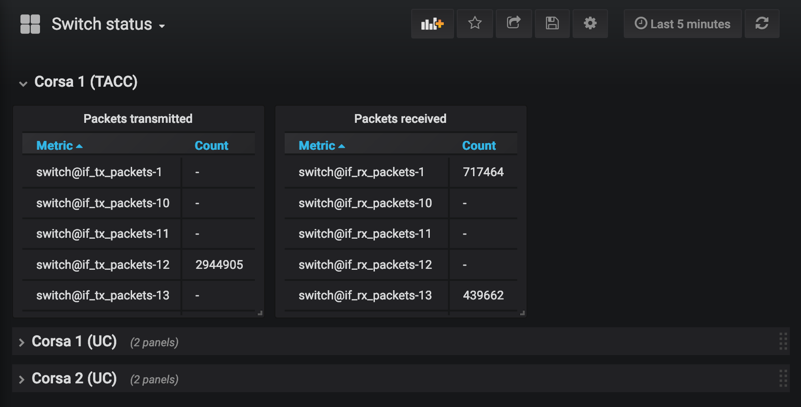
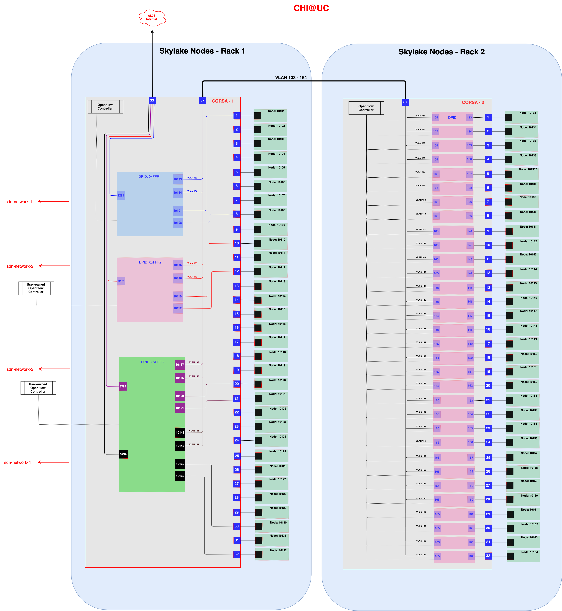
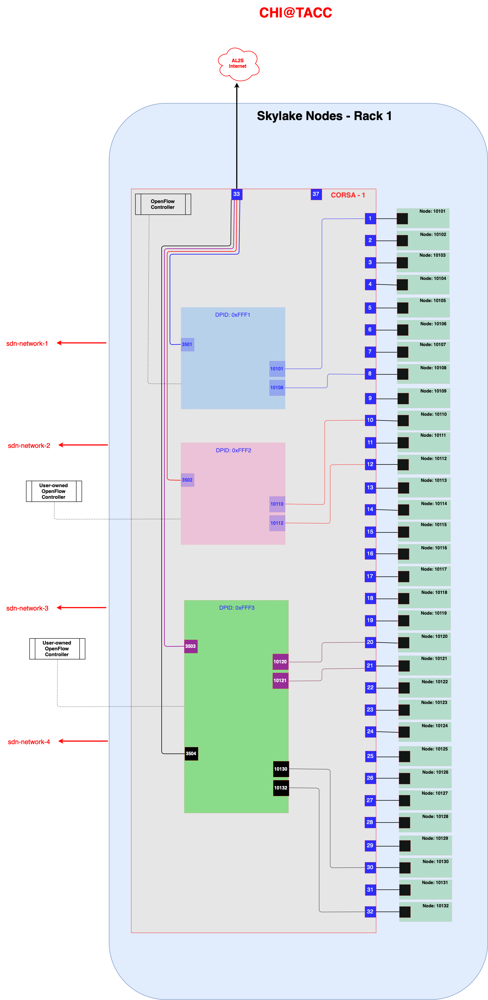

.. _sdn:

Software Defined Networking
===========================

.. Tip:: A good way to start working with OpenFlow on Chameleon is the `OpenFlow Quick Start`_ appliance.

.. _OpenFlow Quick Start: https://www.chameleoncloud.org/appliances/56/

Chameleon's Bring Your Own Controller (BYOC) functionality enables tenants to create isolated network switches managed using an OpenFlow controller provided by the tenant.  This feature is targeted at users wishing to experiment with software-defined networking (SDN) as well as enabling custom network appliances supporting experiments that have non-standard networking requirements. This document focuses on how to use OpenFlow networks on Chameleon. A complete discussion of OpenFlow and SDN is beyond the scope of this document.

.. Note::  **More information on OpenFlow**:
           https://www.sdxcentral.com/sdn/definitions/what-is-openflow/  and
           https://www.opennetworking.org/technical-communities/areas/specification/open-datapath/

OpenFlow switches, like traditional switches, forward network traffic between a number of ports used to connect other networks and devices. The primary difference is that OpenFlow switches rely on external software (a "controller") to dynamically manage the rules (or "flows") that determine how and where the traffic is forwarded. In addition, OpenFlow enables a much larger set of possible rules which can be imposed on the traffic.

The basic requirements of an OpenFlow switch are the switch and the controller. The switch is configured with the IP address and port of a controller (software) that manages the switch's rules.  When a packet arrives at the switch, the packet is tested against the rules that are known by the switch to determine what action(s) to take.  Typically, if there are no rules that apply to a packet, the packet is sent to the controller which replies with a set of rules for that type of packet. The new rules are cached in the switch and applied to subsequent packets until the rules expire or are explicitly removed.

.. Note:: Some common OpenFlow controllers are
  `Open Daylight <https://www.opendaylight.org>`_, `Ryu <https://osrg.github.io/ryu>`_,
  `ONOS <https://onosproject.org>`_, `Floodlight <http://www.projectfloodlight.org/floodlight>`_,
  and `NOX <https://github.com/noxrepo/nox>`_.

Chameleon and OpenFlow
----------------------

BYOC is part of the expanded deployment for Chameleon's phase 2. It enables tenants to allocate OpenFlow switches controlled by their own OpenFlow controller. This capability is limited to the phase 2 hardware additions that include the Corsa DP2000 series OpenFlow switches and Skylake compute nodes. The Corsa switches are key to enabling the BYOC functionality.  These switches allow for the creation of mutually isolated forwarding contexts which can be thought of as virtual OpenFlow switches even though they are the native abstraction used by the Corsa DP2000s. Each isolated forwarding context can be configured to use its own OpenFlow controller. The Chameleon BYOC functionality enables tenants to specify the IP and port of an arbitrary OpenFlow controller when they create private networks.

.. Important:: OpenFlow capabilities are site-dependent. At UC and TACC, only Skylakes are supported.

Specifying an OpenFlow controller for your private network is just a special case of creating a private network. Before proceeding you should become familiar with using regular private VLANs on Chameleon and be able to create your own private VLANs. Background information can be found in the document covering Reconfigurable Networking.

.. attention::
   Currently it is not possible to specify an OpenFlow controller using the Horizon portal.  However, OpenFlow networks with tenant owned controllers can be created using Heat templates which integrate the instructions below.

Using the CLI, an external OpenFlow controller (IP and port) can be specified on the command line using the ``--description`` field as shown below. Creating the subnet and router is the same as any other Chameleon network.

.. code-block:: bash

   openstack network create --provider-network-type vlan --provider-physical-network exogeni
   --description OFController=<OF_Controller_IP>:<OF_Controller_Port> <network_name>

.. note::
   To reserve a stitchable VLAN segment and use it for OpenFlow, you must use the Blazar CLI. See :ref:`reservation-cli-vlan`.

The output should look like the following:

.. code-block:: text

   +---------------------------+--------------------------------------+
   | Field                     | Value                                |
   +---------------------------+--------------------------------------+
   | admin_state_up            | UP                                   |
   | availability_zone_hints   |                                      |
   | availability_zones        |                                      |
   | created_at                | 2018-05-23T14:38:18Z                 |
   | description               | OFController=162.250.136.46:6653     |
   | dns_domain                | None                                 |
   | id                        | 5e359c6f-a69e-4f4d-b92a-784a5f6ca59f |
   | ipv4_address_scope        | None                                 |
   | ipv6_address_scope        | None                                 |
   | is_default                | None                                 |
   | mtu                       | 1500                                 |
   | name                      | exogeni-exogeni-3294                 |
   | port_security_enabled     | False                                |
   | project_id                | e8ae724d28374d0fa15a0e16674b5c47     |
   | provider:network_type     | vlan                                 |
   | provider:physical_network | exogeni                              |
   | provider:segmentation_id  | 3294                                 |
   | qos_policy_id             | None                                 |
   | revision_number           | 2                                    |
   | router:external           | Internal                             |
   | segments                  | None                                 |
   | shared                    | False                                |
   | status                    | ACTIVE                               |
   | subnets                   |                                      |
   | updated_at                | 2018-05-23T14:38:18Z                 |
   +---------------------------+--------------------------------------+

Example CLI command used to create the network:

.. code-block:: bash

   NET="exogeni-3294"
   PHYSICAL_NETWORK_TENANT="exogeni"
   NET_TYPE="vlan"
   NET_NAME="${PHYSICAL_NETWORK_TENANT}-${NET}"
   OF_CONTROLLER_IP="162.250.136.46"
   OF_CONTROLLER_PORT="6653"
   openstack network create --provider-network-type ${NET_TYPE} \
                            --provider-physical-network ${PHYSICAL_NETWORK_TENANT} \
                            --description OFController=${OF_CONTROLLER_IP}:${OF_CONTROLLER_PORT} \
                            ${NET_NAME}

.. code-block:: text

   +---------------------------+--------------------------------------+
   | Field                     | Value                                |
   +---------------------------+--------------------------------------+
   | admin_state_up            | UP                                   |
   | availability_zone_hints   |                                      |
   | availability_zones        |                                      |
   | created_at                | 2018-05-23T14:38:18Z                 |
   | description               | OFController=162.250.136.46:6653     |
   | dns_domain                | None                                 |
   | id                        | 5e359c6f-a69e-4f4d-b92a-784a5f6ca59f |
   | ipv4_address_scope        | None                                 |
   | ipv6_address_scope        | None                                 |
   | is_default                | None                                 |
   | mtu                       | 1500                                 |
   | name                      | exogeni-exogeni-3294                 |
   | port_security_enabled     | False                                |
   | project_id                | e8ae724d28374d0fa15a0e16674b5c47     |
   | provider:network_type     | vlan                                 |
   | provider:physical_network | exogeni                              |
   | provider:segmentation_id  | 3294                                 |
   | qos_policy_id             | None                                 |
   | revision_number           | 2                                    |
   | router:external           | Internal                             |
   | segments                  | None                                 |
   | shared                    | False                                |
   | status                    | ACTIVE                               |
   | subnets                   |                                      |
   | updated_at                | 2018-05-23T14:38:18Z                 |
   +---------------------------+--------------------------------------+

At this point your OpenFlow network switch will have been created and connected to the OpenFlow at the IP/Port that you sepcified.  Using your controller you can explore the OpenFlow switch. There should be only one port on the swtich with is the uplink that connects to the OpenStack services and, optionally, any externally stitched networks such as ExoGENI. The uplink port ID will be the segmentation ID (VLAN ID) of the network shown in the Chameleon portal.  When nodes are created and connected to your network ports will be added to your OpenFlow swtich.  Each compute node will always have the same port ID on the switch.  The mapping of port IDs to compute nodes is in the following section.

Port Mapping
------------

You will likely need your OpenFlow controller to know which of its ports connects to which of your Chameleon nodes. The uplink port will always match the segmentation ID (VLAN ID) of the network. The following tables list the OpenFlow port numberings for each baremetal node; these port values will be stable for every deployment of a particular node.

CHI\@UC
^^^^^^^

.. note::
   Only `compute_skylake` nodes can participate in SDN experiments at CHI\@UC and CHI\@TACC.

+--------------------------------------+-------+--------------------------------------+-------+
| Node UUID (compute_skylake rack 1)   | Port  | Node UUID (compute_skylake rack 2)   | Port  |
+======================================+=======+======================================+=======+
| fd6408d7-018f-49d0-8a58-965ef177e423 | 10101 | e7388428-f23f-4404-9222-57e77ccef41b | 10133 |
+--------------------------------------+-------+--------------------------------------+-------+
| d30580f2-dab2-4e9e-9a85-93aa7b768341 | 10102 | 36da963d-4cf5-45ca-b300-756572812c98 | 10134 |
+--------------------------------------+-------+--------------------------------------+-------+
| cba40c26-f76a-4dce-95e0-a58da2ad699d | 10103 | 21511c7b-39b3-4cfd-aa8b-f519b43aeeba | 10135 |
+--------------------------------------+-------+--------------------------------------+-------+
| 1bff5f81-95b2-4d76-88b3-4a45610acb38 | 10104 | 5b5c7005-b345-4cc1-ae72-83654da15107 | 10136 |
+--------------------------------------+-------+--------------------------------------+-------+
| ff9ebde7-582c-4a75-9ea0-bd3d154c33db | 10105 | b73a5add-2104-4645-95f1-bec85d0c718e | 10137 |
+--------------------------------------+-------+--------------------------------------+-------+
| 44d95746-3573-47c2-8912-aaea639ed6ad | 10106 | 81b02796-a84a-413b-a207-67e8fd04cc77 | 10138 |
+--------------------------------------+-------+--------------------------------------+-------+
| b71a17ce-fce2-4346-b943-8c49298a06db | 10107 | 490a3354-5ed2-4330-9e64-c3bcfd7519d4 | 10139 |
+--------------------------------------+-------+--------------------------------------+-------+
| 8fb01824-cd0a-4bb3-9bfa-87d3f0dc4ada | 10108 | 36bcdda5-9564-4c87-964b-fc9472ef6c4c | 10140 |
+--------------------------------------+-------+--------------------------------------+-------+
| 4ebd7a4f-2e80-4dd5-b2f8-cdcbdce6fe2c | 10109 | debd9df3-9529-416d-90c6-a0ffe65c7967 | 10141 |
+--------------------------------------+-------+--------------------------------------+-------+
| 6715e9aa-146e-4a90-8316-b5d3ad5d2ed6 | 10110 | de729ebb-2d75-401e-b2eb-3739bd28317f | 10142 |
+--------------------------------------+-------+--------------------------------------+-------+
| 30a424b3-28a6-44bd-a4a6-d439439e8a09 | 10111 | 7d1815aa-48b7-49a0-b64d-1a3db83d5cf3 | 10143 |
+--------------------------------------+-------+--------------------------------------+-------+
| 7a3bde6b-ef18-458a-9ec7-0232188d6fc3 | 10112 | 9f63b9c7-8b73-4a46-9826-2efd7aca04c1 | 10144 |
+--------------------------------------+-------+--------------------------------------+-------+
| 2ea88b95-0b72-4cdc-847e-e089ae71bf41 | 10113 | fa6fbe1e-f0cf-4d92-be60-88d8765594d7 | 10145 |
+--------------------------------------+-------+--------------------------------------+-------+
| 979cfa5d-456b-45f6-8ed8-0d528dba7ba4 | 10114 | f6da59d3-676e-4d30-8c5f-20cee1b9ed3b | 10146 |
+--------------------------------------+-------+--------------------------------------+-------+
| 581c40ec-c957-4399-b62a-d03d114dfb7c | 10115 | 1526e829-8a5f-4f84-9745-84abf9ae7713 | 10147 |
+--------------------------------------+-------+--------------------------------------+-------+
| 32866b85-6ae1-4433-8561-1919a0b28712 | 10116 | 830a4333-a419-4346-a695-c1c0debc89a1 | 10148 |
+--------------------------------------+-------+--------------------------------------+-------+
| a9e465a9-8b6d-453c-8186-f4297efba3cd | 10117 | cd5a237e-1a4c-4fca-b25c-0d5a051e2865 | 10149 |
+--------------------------------------+-------+--------------------------------------+-------+
| d74f4c82-180f-48bd-b193-307391e80f6e | 10118 | 37c796cb-b4c5-4b9d-8088-06065b32631b | 10150 |
+--------------------------------------+-------+--------------------------------------+-------+
| 480ef54f-41fa-4058-b880-d61acf802f0e | 10119 | eba60b5f-8bd0-470c-8aa9-ffa1743eb35f | 10151 |
+--------------------------------------+-------+--------------------------------------+-------+
| 303310ee-baf0-4bd3-b3c9-7f28d14936e4 | 10120 | d847a8c8-1aa0-41d0-936f-ff5a473b4fcb | 10152 |
+--------------------------------------+-------+--------------------------------------+-------+
| 3993facb-7a19-4847-adeb-30eca59aebfa | 10121 | 9d34ccb6-bf0a-4d70-a440-d444c969ec23 | 10153 |
+--------------------------------------+-------+--------------------------------------+-------+
| 5ae22a06-b2dc-4d5c-b51e-d95e39e839dc | 10122 | 97c958b0-dc6e-4747-91c8-c7eead256734 | 10154 |
+--------------------------------------+-------+--------------------------------------+-------+
| ba374279-bd33-4b4a-b2fe-2deea6746374 | 10123 | a9895567-38de-4317-935b-a5e9d97b6cea | 10155 |
+--------------------------------------+-------+--------------------------------------+-------+
| 9e7c95b4-e5a4-4356-af87-4fc1b6262894 | 10124 | a61fc0a9-3716-4758-93bf-56a4dccf195f | 10156 |
+--------------------------------------+-------+--------------------------------------+-------+
| 9779cf7e-4e2a-4d85-bd7e-c0bea8f7ffd0 | 10125 | 30e03bc2-04b7-4d29-9bba-27facca111ae | 10157 |
+--------------------------------------+-------+--------------------------------------+-------+
| 9d478047-bca8-4987-ac52-616862d57b70 | 10126 | 149a9db5-e312-4d7b-bc51-bf1a33329179 | 10158 |
+--------------------------------------+-------+--------------------------------------+-------+
| afed1e2f-f295-43b4-9dc6-5a5d3ca1e0ac | 10127 | 80a084c0-4198-42fc-87ae-9fc1899eb336 | 10159 |
+--------------------------------------+-------+--------------------------------------+-------+
| 1a77c31c-bb61-43e4-9350-b7394258aed5 | 10128 | b0194ee7-9866-4de1-a86d-e2ffd4a3c58a | 10160 |
+--------------------------------------+-------+--------------------------------------+-------+
| 61ba06af-1f7b-4ea5-8e85-6519c0187c68 | 10129 | 4a351095-4f77-4a68-88c7-a306b67b2269 | 10161 |
+--------------------------------------+-------+--------------------------------------+-------+
| e46f6e1a-38f5-451d-a5ed-3b82a6444fcb | 10130 | 8c7b8067-cfa4-49b4-9812-778e78631bf8 | 10162 |
+--------------------------------------+-------+--------------------------------------+-------+
| 448de3a5-3200-4e6e-a4c3-e5348e5e70af | 10131 | 219a58dd-a3b2-4c4f-8517-ab72bc82c741 | 10163 |
+--------------------------------------+-------+--------------------------------------+-------+
| 21f7c8f2-b527-42a9-b8f1-c23cb6bdc91a | 10132 | 03129bbe-330c-4591-bc17-96d7e15d3e74 | 10164 |
+--------------------------------------+-------+--------------------------------------+-------+

CHI\@TACC
^^^^^^^^^
+--------------------------------------+-------+
| Node UUID (compute_skylake rack 1)   | Port  |
+======================================+=======+
| 63aea74f-4e42-4f3e-b9b6-c5c473a911fa | 10101 |
+--------------------------------------+-------+
| c8b533e3-2576-4129-90cd-6485dcc85d98 | 10102 |
+--------------------------------------+-------+
| 8343783f-5429-405e-bc8f-dbfbacc7d1c8 | 10103 |
+--------------------------------------+-------+
| 9e14111e-2a0c-4cd1-a7c2-b2496a54600a | 10104 |
+--------------------------------------+-------+
| 11b0e303-34ee-4da1-afbf-a9ed5263d1fa | 10105 |
+--------------------------------------+-------+
| af9af518-b4c8-4b8f-a80c-a0181a471cee | 10106 |
+--------------------------------------+-------+
| 6cccbf68-e772-495d-b60b-46430f3d8884 | 10107 |
+--------------------------------------+-------+
| f14b4bca-5db5-4285-87d4-06c849e557b3 | 10108 |
+--------------------------------------+-------+
| 0ddb2370-cfd4-4396-baf7-7edade40c10d | 10109 |
+--------------------------------------+-------+
| 4d49141f-4234-4731-88ca-57e0e0fcb56f | 10110 |
+--------------------------------------+-------+
| 7a0678ff-f11e-44c5-9187-2123207209be | 10111 |
+--------------------------------------+-------+
| 93b959f3-d668-49cf-a322-d4aac516b46b | 10112 |
+--------------------------------------+-------+
| 1bed26c8-642c-4277-b2a3-cda4a8343628 | 10113 |
+--------------------------------------+-------+
| 618ce8d2-4514-419d-b461-5935a4abd0a7 | 10114 |
+--------------------------------------+-------+
| 9bd4b3b1-3d39-4b60-950c-8685ad7e7008 | 10115 |
+--------------------------------------+-------+
| b0fd7e7a-fec1-4d6e-9f41-94263a5b8267 | 10116 |
+--------------------------------------+-------+
| 43643723-8142-4b69-8a18-58f4e041c367 | 10117 |
+--------------------------------------+-------+
| 7571a78a-342f-41ef-816d-cfdb0476c748 | 10118 |
+--------------------------------------+-------+
| fad519dd-a0b0-43d2-aef4-c30cd25209f4 | 10119 |
+--------------------------------------+-------+
| 1ee5e615-2714-4166-82c5-b9b276e09186 | 10120 |
+--------------------------------------+-------+
| 8b60e999-fd22-4521-8b3a-ae02e79af873 | 10121 |
+--------------------------------------+-------+
| 1985e4d5-2c16-444e-889d-e92b4b30bfd8 | 10122 |
+--------------------------------------+-------+
| 9515fa6a-de4b-45b7-a98f-89d8b8831873 | 10123 |
+--------------------------------------+-------+
| 0b0bceb9-14bf-423e-890f-3ef187511d71 | 10124 |
+--------------------------------------+-------+
| 2a0aa343-ec4e-4683-aa7d-d28fd2d5c3d0 | 10125 |
+--------------------------------------+-------+
| 43e67651-3d33-413e-8f77-19f752d99803 | 10126 |
+--------------------------------------+-------+
| 06b164d5-3514-4ebe-8928-0bd2f9508b80 | 10127 |
+--------------------------------------+-------+
| 1e2e7689-527a-4608-a91c-287ccfb90b0a | 10128 |
+--------------------------------------+-------+
| 58c30415-4421-4247-867c-4199a4ff9eb9 | 10129 |
+--------------------------------------+-------+
| e5ab8372-050e-44af-95a4-cc3ed7963cb7 | 10130 |
+--------------------------------------+-------+
| 9d05db81-05e5-441b-9462-1e17d86e1a6b | 10131 |
+--------------------------------------+-------+
| f59f3140-57a0-4452-98dc-edfbb53f07e1 | 10132 |
+--------------------------------------+-------+

Debugging Your Controller
-------------------------

To assist you in debugging your OpenFlow controller, Chameleon exposes a limited set of metrics exposed from the actual Corsa DP2000 switches. Currently you can see raw packet counts for each physical port on the switch. The data can be retrieved either from a Grafana web interface, or via a special Gnocchi metric resource accessed with the OpenStack CLI.

Accessing the Grafana Interface
^^^^^^^^^^^^^^^^^^^^^^^^^^^^^^^

Log in with your Chameleon username and password to the `Chameleon Grafana instance <https://grafana.chameleon.tacc.utexas.edu>`_. You should be automatically taken to a "Switch Status" dashboard with tables showing the last-known packet counter across all ports on the Corsa switches, both at TACC and UC. This can help you figure out if your controller is allowing traffic to hit the switch at all, or if your nodes are in fact sending traffic through the switch.

Accessing via Gnocchi Metrics
^^^^^^^^^^^^^^^^^^^^^^^^^^^^^

The metrics can also be queried via :ref:`Gnocchi metrics <metrics>`. The metrics are located under specific Gnocchi resources and can be queried by passing the metric UUID.

.. code-block:: bash

  # TACC Corsa #1
  openstack --os-region CHI\@TACC metric resource show 28596c49-0c14-5f08-a9e5-84790a05eef3
  # UC Corsa #1
  openstack --os-region CHI\@UC metric resource show b72663e7-86fb-5785-82ed-b01ea9e0f282
  # UC Corsa #2
  openstack --os-region CHI\@UC metric resource show 18e5e81e-798f-5299-9160-0f0ce34c17a9

This command will show all metrics available to view, and their UUID, e.g.:

.. code-block:: text

  +-----------------------+-------------------------------------------------------------------+
  | Field                 | Value                                                             |
  +-----------------------+-------------------------------------------------------------------+
  | created_by_project_id | 4e9f3b6fbaf245e780b25fae2c166d4e                                  |
  | created_by_user_id    | 5c9803db428c48daa2730892871a9242                                  |
  | creator               | 5c9803db428c48daa2730892871a9242:4e9f3b6fbaf245e780b25fae2c166d4e |
  | ended_at              | None                                                              |
  | id                    | b72663e7-86fb-5785-82ed-b01ea9e0f282                              |
  | metrics               | switch@if_rx_packets-1: c8144fb6-9a40-4eba-b3d4-c16b1b9dddff      |
  |                       | switch@if_rx_packets-2: 89947128-f794-4f01-bace-1b5a4fd93d32      |
  |                       | ...                                                               |
  |                       | switch@if_tx_packets-1: 4d66dea3-0d7a-4656-bd1e-813c6a4000d6      |
  |                       | switch@if_tx_packets-2: 6dfc2627-03fe-4ce8-8497-1a40ccea60e3      |
  |                       | ...                                                               |
  | original_resource_id  | collectd:chameleon-corsa1                                         |
  | project_id            | None                                                              |
  | revision_end          | None                                                              |
  | revision_start        | 2019-02-26T05:46:25.626125+00:00                                  |
  | started_at            | 2019-02-26T05:46:25.626103+00:00                                  |
  | type                  | switch                                                            |
  | user_id               | None                                                              |
  +-----------------------+-------------------------------------------------------------------+

You can then query an individual metric's values with:

.. code-block:: bash

  openstack metric measures show $METRIC_UUID

Corsa DP2000 Virtual Forwarding Contexts: Network Layout and Advanced Features
------------------------------------------------------------------------------

Virtual Forwarding Contexts (VFC) are the native OpenFlow abstraction used by the Corsa DP2000 series switches. Each VFC can be thought of as a virtual OpenFlow switch.  Chameleon users can create VFCs by creating isolated networks on Chameleon via CLI or using complex appliaces.

In this section, actual rack and switch layout of Skylake Nodes and Corsa DP2000 switches for both Chameleon sites is represented in the following figures. Also, example isolated networks with different controller options are shown along with associated VFCs and tunnels from Skylake Nodes are shown.

Users are able to specify an external OpenFlow controller and can assign a name to their VFCs. If an external controller is not specified, VFC is controlled by the OpenFlow controller (Learning Bridge Application) running on the switch.

1. Create an isolated network without an external OpenFlow controller and a VFC name:

.. code-block:: bash

   openstack network create --provider-network-type vlan --provider-physical-network physnet1
   sdn-network-1

2. Create an isolated network with an external OpenFlow controller and without a VFC name:

.. code-block:: bash

   openstack network create --provider-network-type vlan --provider-physical-network physnet1
   --description OFController=<OF_Controller_IP>:<OF_Controller_Port> sdn-network-2

3. Create an isolated network with an external OpenFlow controller and give a name to the VFC:

.. code-block:: bash

   openstack network create --provider-network-type vlan --provider-physical-network physnet1
   --description OFController=<OF_Controller_IP>:<OF_Controller_Port>,VSwitchName=<VFCName>
   sdn-network-3

A named VFC will be created for the isolated network. Subsequent isolated networks that are created with the same VFC name specification will be attached to the same VFC. Current implementation lets the user specify only one OpenFlow controller to the VFCs. Also, subsequent isolated network creation commands should include exactly the same ``--description``.

.. code-block:: bash

   openstack network create --provider-network-type vlan --provider-physical-network physnet1
   --description OFController=<OF_Controller_IP>:<OF_Controller_Port>,VSwitchName=<VFCName>
   sdn-network-4

4. Skylake Nodes at UC:
   |CHI@UC| has two racks with Skylake Nodes. Each rack has a TOR Corsa DP2000 series switch. VFCs for isolated networks are created on Corsa-1. Nodes on the second rack are connected to the VFC via statically provisioned VFCs on Corsa-2. You will see the ports on the VFCs as described in "Port Mapping" section.

5. Skylake Nodes at TACC:
   |CHI@TACC| has one rack with Skylake Nodes. You will see the ports on the VFCs as described in "Port Mapping" section.

Controllers for Corsa DP2000 series switches
--------------------------------------------

OpenFlow controllers often need to be aware of the slight differences in implementation across switch vendors. What follows is a description of the quirks we have found while using the Corsa DP2000 series switches as well as a simple controller configuration that is compatible with Chameleon OpenFlow networks.

We have used Ryu and OpenDaylight controllers for the VFCs (Virtual Forwarding Context) on Corsa switches.  We have provided a sample OpenFlow Ryu controller application that is available on GitHub. In addition, we have provided a Chameleon appliance that creates a Ryu controller based on these code modifications.

This controller is derived from the Ryu simple_switch_13.py with the following considerations. If you want use any other OpenFlow controller you will have to make similar considerations.

1. VFCs on Corsa switches are created by allocating specific amounts of system resources. Each VFC has a limited amount of resources in order to accommodate the requests of all Chameleon users. This limits the number of flows that can be put in the flow tables. Controllers will need to be careful not to fill up the flow tables. In our example, an idle timeout (defaulting to 5 minutes) to any rule inserted into the VFC via the controller is added to ensure the flow tables are cleaned up. This way, the switch removes the rule itself, once traffic matching the rule stops passing (for the specified interval).

2. The Corsa switches do not support Actions=FLOOD since this reserved port type is only for hybrid switches and it is optional. Corsa is an Openflow-only switch which supports the required port ALL. Controllers must replace the Actions=FLOOD to Actions=ALL in packet out messages.

3. Flow tables are modified according to the status of the ports being added or deleted from the VFC.

The following changes are made to the application:

Added the functions below:

.. code-block:: python

   def _port_status_handler(self, ev):
   def delete_flow(self, datapath, port):

Added IDLE_TIMEOUT to flow modification in:

.. code-block:: python

   def add_flow(self, datapath, priority, match, actions, buffer_id=None):

Changes are made in the function below to change ``Actions=FLOOD`` to ``actions=ALL`` in packet out message in the ``def _packet_in_handler(self, ev):`` method.

This controller application can be run by the script below:

.. code-block:: bash

   CHAMELEON_RYU_URL="https://github.com/ChameleonCloud/ryu.git"
   CHAMELEON_RYU_APP="simple_switch_13_custom_chameleon.py"

   yum install -y epel-release
   yum install -y python-pip git
   pip install ryu

   RYU_DIR="/opt/ryu"

   mkdir ${RYU_DIR} && mkdir ${RYU_DIR}/repo

   git clone ${CHAMELEON_RYU_URL} ${RYU_DIR}/repo
   ln -s ${RYU_DIR}/repo/ryu/app/${CHAMELEON_RYU_APP} ${RYU_DIR}/${CHAMELEON_RYU_APP}

   RYU_PID_FILE="/var/run/ryu/ryu-manager.pid"
   RYU_LOG_FILE="/var/log/ryu/ryu-manager.log"
   RYU_CONFIG_DIR="/opt/ryu/etc"
   RYU_APP="${RYU_DIR}/${CHAMELEON_RYU_APP}"
   OFP_TCP_LISTEN_PORT="6653"

   /usr/bin/ryu-manager --pid-file \${RYU_PID_FILE} --ofp-tcp-listen-port \${OFP_TCP_LISTEN_PORT} --log-file \${RYU_LOG_FILE} \${RYU_APP}
