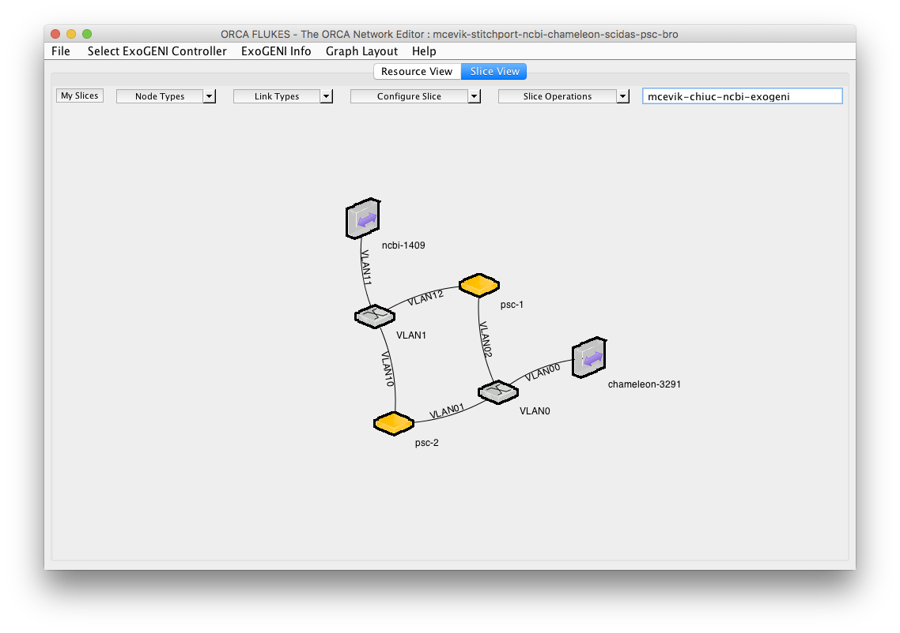
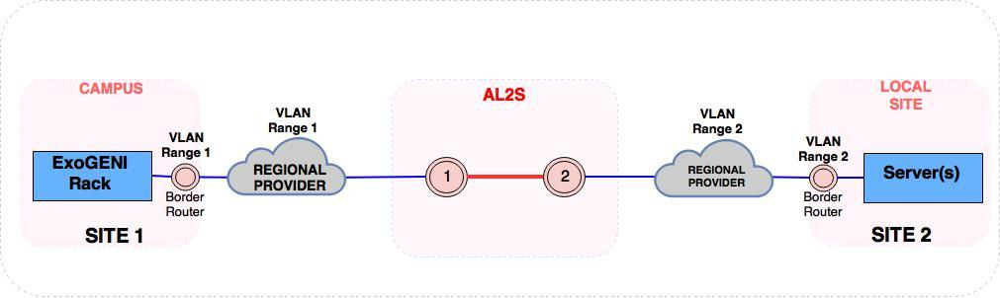
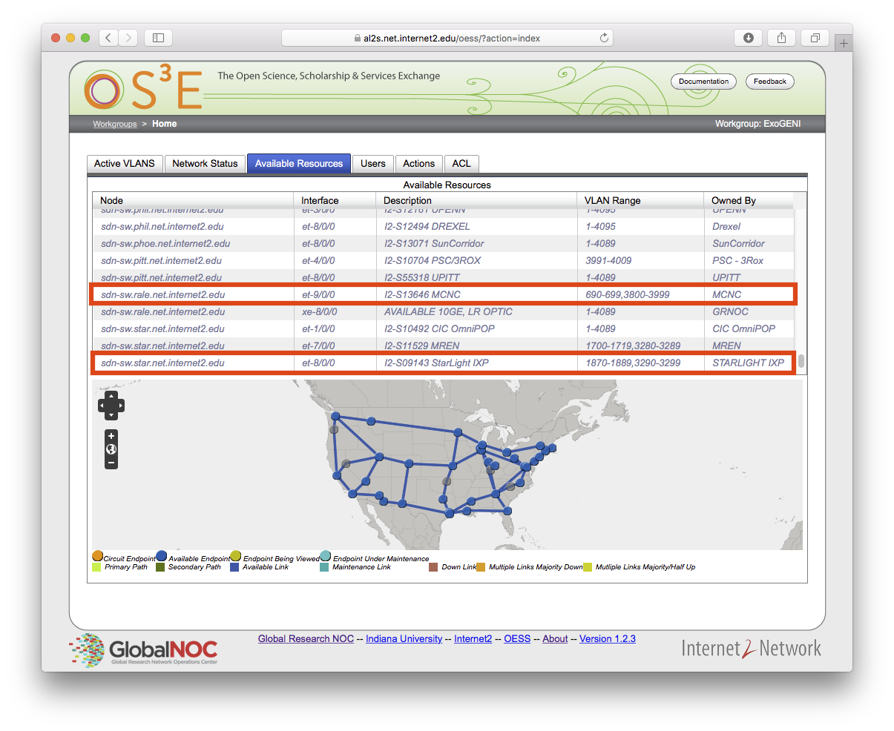

.. _stitching:

_______________________________________
External Layer2 Connections (Stitching)
_______________________________________

Chameleon provides support for sophisticated networking experiments by providing `GENI-style stitching <http://groups.geni.net/geni/wiki/GeniNetworkStitchingSites>`_. This capability enables users to deploy networking experiments (layer 2 and layer 3) that extend across Chameleon, potentially other testbeds such as `GENI <http://www.geni.net/>`_, and into physical resources on their own campus networks. Users can create a dedicated network associated with a dynamic VLAN, subnet with own DHCP server, and router for external connections. 

Currently, it is possible to connect user-configured networks to other domains (e.g. GENI) over circuits created on Internet2’s Advanced Layer 2 Service (AL2S). In this setup, a pool of VLANs is extended from Chameleon CHI@UC racks to the AL2S endpoint at StarLight. Currently, 10 VLAN tags (3290-3299) are dedicated to this AL2S endpoint, although 3290 is reserved for system use. A user-configured network that is associated with one of the dedicated AL2S VLAN tags (segmentation ID must be the same as AL2S VLAN tag) can be stitched to external domains (e.g. GENI). A circuit on AL2S needs to be created.

This document describes how to stitch Chameleon experiments to external resources including `ExoGENI <http://www.exogeni.net/>`_ and `Internet2 <https://www.internet2.edu/>`_ connected campuses. You will need to know how to create stitchable dynamic VLANs as described in the :doc:`networks` documentation. After you have created such VLAN this document will describe how to create a slice in three cases: connect to ExoGENI, connect to other domains using ExoGENI as an intermediary, or connect to other domains directly.

This document also describes connecting isolated stitchable networks across Chameleon sites (`CHI@UC <https://chi.uc.chameleoncloud.org>`_ and `CHI@TACC <https://chi.tacc.chameleoncloud.org>`_ ) over layer-2 circuits.  

Chameleon has the capability to create dynamically managed VLANs associated with user-configured private IP subnets as described on :doc:`networks`. Users can create a dedicated network associated with a dynamic VLAN, subnet with own DHCP server, and router for external connections. These networks can be created through the web as well as command line interface. User-configured networks (isolated networks) are associated with VLANs by *Segmentation IDs*.

In the following sections, this workflow is described for different settings.

.. _network-stitchable-create:

Configuring a Stitchable Network
________________________________

Follow the technical documentation for :ref:`network-cli-create` using the CLI, but replace the provider network with the appropriate external testbed (e.g. replace ``physnet1`` with ``exogeni``). 
In this documentation, we will describe how to stitch to the ExoGENI testbed:

.. code-block:: bash

   openstack network create --provider-network-type vlan --provider-physical-network exogeni <network_name>

.. note::
   If you made a reservation for a stitchable VLAN segment, the network will have been created automatically.

Connecting Chameleon to ExoGENI
_______________________________

`ExoGENI <http://www.exogeni.net/>`_ is one of the two primary `GENI <http://www.geni.net/>`_ testbeds. ExoGENI allows users to create isolated experimental environments with compute and network resources distributed across 20 sites. ExoGENI has a special type of connection called “stitchport” which is a formally defined meeting point between VLANs dynamically provisioned within Chameleon and ExoGENI slices. Users can create slices on ExoGENI testbed, and connect these slices with Chameleon nodes by using a stitchport.

Stitchports that exist in ExoGENI topology are listed on ExoGENI Wiki (`ExoGENI Resource Types: Stitchport Identifiers <https://wiki.exogeni.net/doku.php?id=public:experimenters:resource_types:start#stitch_port_identifiers>`_). URLs for port locations and corresponding VLAN tags are used to create a stitchport connection. Stitchport information for Chameleon is listed as below:

- Port Location: ``ChameleonUC@ION``

    URL: http://geni-orca.renci.org/owl/ion.rdf#AL2S/Chameleon/Cisco/6509/GigabitEthernet/1/1

    Allowed VLANs: 3291-3299

- Port Location: ``ChameleonTACC@ION``

    URL: http://geni-orca.renci.org/owl/ion.rdf#AL2S/TACC/Cisco/6509/TenGigabitEthernet/1/1

    Allowed VLANs: 3501-3509

Layer 2 connections on ExoGENI are provisioned on AL2S by an agent that submits requests to OESS on behalf of the user slice. Users do not need to have an OESS account. An ExoGENI slice with a stitchport can be created as below. (Information for using ExoGENI and creating slices can be found at http://www.exogeni.net)

#. Connect the node to a stitchport:

   .. figure:: networks/connectstitchport.png

#. Supply the URL and VLAN tag to the stitchport properties. VLAN 3299 will be used for Chameleon connection. The user-configured network on Chameleon must have segmentation ID: 3299.

   .. figure:: networks/portdetails.png

#. Submit request. A manifest for the reservations will be returned.

   .. figure:: networks/submitrequest.png

#. After the slice creation is completed, nodes in the slice will be able to connect to the Chameleon nodes that are connected to the user-configured network with segmentation ID: 3299.

   .. figure:: networks/createcomplete.png

#. It is also possible to connect ExoGENI nodes to both `CHI@UC <https://chi.uc.chameleoncloud.org>`_ and `CHI@TACC <https://chi.tacc.chameleoncloud.org>`_ with multiple interfaces.

   .. figure:: networks/multipleinterfaces.png

Connecting Chameleon to user owned domains via ExoGENI
______________________________________________________

Using ExoGENI to connect to Chameleon can be further extended by using ExoGENI as an intermediary domain.

In this use case, a local site can be connected to ExoGENI via stitchports, and an ExoGENI slice can be created to route traffic to Chameleon. In the example below, a stitchport connects the local site (NCBI) to an ExoGENI slice which is connected to Chameleon. Nodes on the ExoGENI slice can be used to route traffic from NCBI nodes to Chameleon nodes. In this case, all layer 2 circuits will be provisioned by ExoGENI.

Connecting a local site to ExoGENI via stitchports is a process that requires multiple steps involving site owners, regional network providers, and ExoGENI.

ExoGENI racks are located on campuses across the US. Campuses are connected to Internet2 AL2S via regional provider networks. A set of VLAN tags is reserved for ExoGENI from the pool of available VLAN tags by the regional providers and campus administrations. These VLANs are plumbed on both regional provider and campus networks all the way from AL2S endpoint to the rack or server(s). Some campuses/institutions are directly connected to AL2S nodes without a regional provider (e.g. Pittsburgh Supercomputing Center, George Washington University (CAREEN)).

Stitchports can be used to connect a specific location to ExoGENI racks.

#. VLAN(s) from the local site should be extended through the campus network all the way to the AL2S endpoint.
#. ExoGENI must update the topology to activate the stitchport.

ExoGENI administrators can provide assistance and can be contacted at geni-orca-users@googlegroups.com

Connecting Chameleon to user owned domains
__________________________________________

Users can connect their local domains to Chameleon over manually created layer-2 circuits on AL2S. Local domains need to be connected to the other AL2S endpoint of the circuit by users.

Circuits on AL2S are created through the Internet2 `AL2S OESS portal <https://al2s.net.internet2.edu/oess/>`_. The `OESS (Open Exchange Software Suite) <https://docs.globalnoc.iu.edu/sdn/oess.html>`_ is a set of software used to configure and control dynamic layer 2 virtual circuit (VLAN) networks on OpenFlow enabled switches. It includes a web-based user interface as well as a web services API.

Chameleon is connected to the AL2S endpoint at StarLight:

.. code::

   Node: sdn-sw.star.net.internet2.edu
   Interface: et-8/0/0
   VLAN range: 3290-3299

A user can log into the AL2S OESS portal and create a circuit connecting the Chameleon endpoint to the user-owned endpoint. The user should have an account to log in to the AL2S OESS portal. On OESS, users are members of workgroups. After logging in to the portal, a user can see the workgroups that he/she is a member of.

.. figure:: networks/oess.png

Network resources on AL2S are granted access to the workgroups. This access is granted by the owner of the AL2S network resource (campus network administrators or network engineers at regional providers). After granting access to the resources, they become available for the workgroup and start showing up in the “Available Resources” section. For the user to create such a circuit on AL2S with Chameleon endpoint, the workgroup that the user has membership should be granted access for this endpoint. This can be requested from Chameleon by opening a ticket with our help desk.

As an example, Chameleon resources can be seen in “Available Resources” section for a user in the “ExoGENI” workgroup after access to the workgroup is granted.

The user in the ExoGENI workgroup can create a circuit with two endpoints to connect a local site to Chameleon.

.. code:: 

   Endpoint 1 (Local site):
   Node: sdn-sw.rale.net.internet2.edu
   Interface: et-9/0/0
   VLAN: 3998
   
   Endpoint 2 (`CHI@UC <https://chi.uc.chameleoncloud.org>`_):
   Node: sdn-sw.star.net.internet2.edu
   Interface: et-8/0/0
   VLAN: 3290

To create a circuit, follow these instructions:

#. Create a new VLAN

   .. figure:: networks/createvlan.png

#. Select endpoints

   .. figure:: networks/selectendpoints.png

#. Submit circuit request

   .. figure:: networks/submitcircuit.png

#. When the circuit is provisioned, you should see this:

   .. figure:: networks/circuitprovisioned.png

#. In addition, the Path can be seen on the map. Utilization data becomes available after 3 hours.

   .. figure:: networks/pathseen.png

At this point, a layer-2 circuit is created on AL2S. The user-configured network with segmentation ID 3290 can be connected to the local servers. The user needs to extend the VLANs at the local site (3998 in this case) to the AL2S endpoint.

To obtain an account to access AL2S OESS portal, users should contact Internet2. Information can be found from the links below:

- `AL2S Participants <https://www.internet2.edu/products-services/advanced-networking/layer-2-services/al2s-participants/>`_
- `AL2S Layer 2 Service Workgroups <https://www.internet2.edu/products-services/advanced-networking/layer-2-services/#service-participate>`_
- `AL2S FAQ <https://www.internet2.edu/products-services/advanced-networking/layer-2-services/#service-faq>`_
- `Using OESS <https://docs.globalnoc.iu.edu/sdn/oess/using-oess.html>`_

Connecting Stitchable Isolated Networks across Chameleon Sites
______________________________________________________________

1. Create isolated networks by specifying the "exogeni" provider. Follow the documentation for :ref:`network-stitchable-create`
   A "stitchable" VLAN tag will be returned and "Physical Network" will appear as "Exogeni" on the dashboard.
   This step will be executed the same way on both UC and TACC sites. 

2. After having stitchable isolated networks on UC and TACC sites, a request should be sent to the `Help Desk ticket submission page <https://www.chameleoncloud.org/user/help/ticket/new/guest/>`_ for creation of AL2S circuits. 
In the request, following information should be specified:
- Information for the network at UC (Project ID, name of the network, ID of the network)
- Information for the network at TACC (Project ID, name of the network, ID of the network)
- Duration of the circuit in active state
