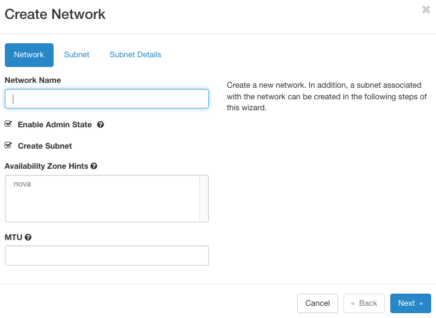
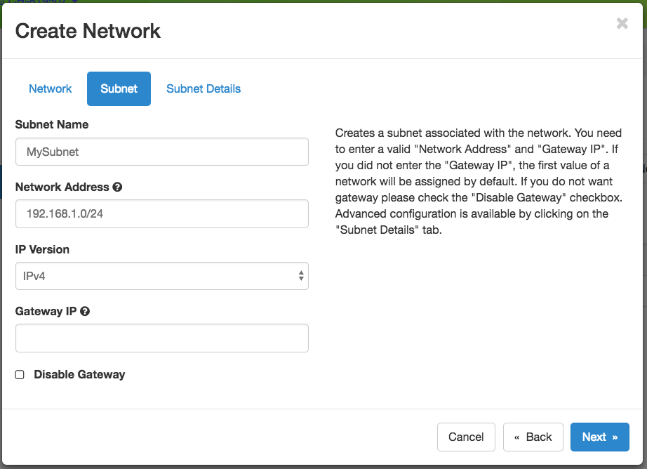
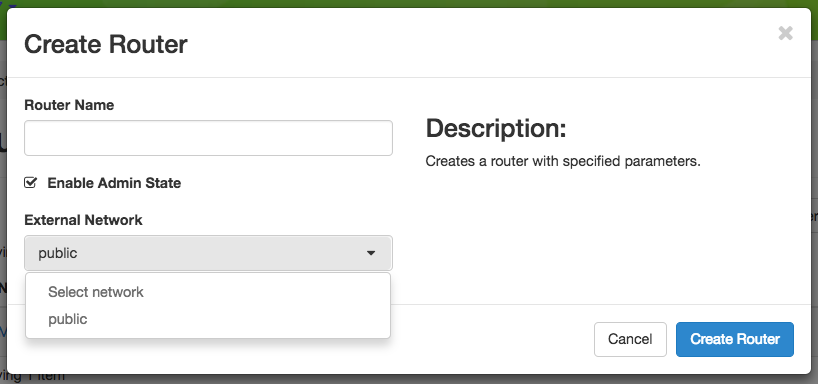

.. _network-isolation:

Isolated Network VLANs
======================

By default, bare metal nodes on each Chameleon site share the same local network (shared VLAN and IP subnet). However, some experiments may require more network isolation, which is now supported by Chameleon.

Chameleon's implementation of network isolation is based on dynamically managed VLANs (network layer 2) associated with user-configured private IP subnets (network layer 3). This means that all network communications local to the IP subnet or the broadcast domain (such as Ethernet broadcast, ARP, IP broadcast, DHCP, etc.) will be restricted to the user-configured network and its associated VLAN. This feature enables a range of experiments in networking and security. For example, this allows running your own DHCP server to configure virtual machines running on bare metal nodes, without impacting other users.

.. note::

   - Strong network isolation is provided at network layer 2 only. Even using separate IP subnetworks, any bare metal node can still communicate with each other and with the Internet through the network's router. We are investigating solutions to provide stronger isolation at network layer 3.
   - Network isolation works on all nodes, including our low-power HP Moonshot nodes (low-power Xeon, Atom, ARM64).

To use this feature, you will need to create a dedicated network and router. You can use a :ref:`Heat template <complex>`, use the *Network* panel of the GUI, or use the CLI.

Configuring Networking using a Heat template
--------------------------------------------

#. Go to *Project* > *Orchestration* > *Stacks*.
#. Click the *Launch Stack* button to open an interactive dialog.
#. Select *URL* as *Template Source* and paste https://raw.githubusercontent.com/ChameleonCloud/heat-templates/master/network-isolation/network-isolation.yaml to *Template URL*.
#. Click the *Next* button to navigate to the *Launch Stack* dialog.
#. Provide a name for your stack, enter your password, and set a private IP range, such as 192.168.1.0/24.
#. Set the first and the last IP addresses of *DHCP* range.

   .. important::
      The first IP adddress in the DHCP range should never be \*.1 and \*.2. The last IP address in the range must be less than \*.255.

#. Start creating the network and router by clicking the *Launch* button.

Creating a Network using the GUI
--------------------------------

To create a Network from either the *Network Topology* page or the *Networks* page, click the *+Create Network* button to open the *Create Network* dialog.

   The Create Network dialog

In *Create Network* dialog, name your network. In general, you will also want to create a *Subnet* for your new Network, so make sure you have *Create Subnet* checked. Click the *Next* button.

   The Subnet tab

When creating a *Subnet*, you must specify a  *Subnet Name* and a `CIDR <https://en.wikipedia.org/wiki/Classless_Inter-Domain_Routing>`_ *Network Address* that contains a private IP address and a subnet mask length. For example, you may create a `Class C <https://docs.microsoft.com/en-us/previous-versions/windows/it-pro/windows-2000-server/cc940018(v=technet.10)>`_ subnet with a 24-bit mask by entering ``192.168.1.0/24``. You may set a Gateway or leave it blank to use the default. Then, click the *Next* button.

.. attention:: **Do not** select the *Disable Gateway* checkbox!

.. figure:: networks/createnetworkdetails.png
   :alt: Subnet details

   Subnet details

You may specify *DHCP* and static *Route* information at *Subnet Details* section:

- *Allocation Pools* section allows you to specify *DHCP* address ranges in the format of ``<first address>,<last address>``. For example, entering ``192.168.1.2,192.168.1.100`` will create a *Subnet* with IP ranges from ``192.168.1.2`` to ``192.168.1.100``.
- *DNS Name Servers* section allows you to specify a list of DNS servers.

  .. note::
     At |CHI@TACC|, use ``129.114.97.1`` and ``129.114.97.2`` for your DNS servers
     At |CHI@UC|, use ``8.8.8.8`` and ``8.8.4.4`` for your DNS servers
- *Host Routes* section allows you to specify static routing information for the subnet in the format of ``<subnet CIDR>,<router IP address>``. For example, ``192.168.3.0/24,10.56.1.254`` means all traffic from this Subnet to ``192.168.3.0`` will be forwarded to the Router Interface at ``10.56.1.254``.

.. note:: All three sections above are line separated.

Click *Create* button and a new Network will be created. Check if the network is created without error.

Creating a Router
^^^^^^^^^^^^^^^^^

To create a *Router* from either the *Network Topology* page or the *Routers* page, click the *+Create Router* button to open the *Create Router* dialog.

   The Create Router dialog

In this dialog, specify a *Router Name*. Optionally, you may select *public* as the *External Network* if you want to have external access.  Click *Create Router* to complete the process.

Adding a Router Interface
^^^^^^^^^^^^^^^^^^^^^^^^^

A Router may have multiple *Interfaces*, each connected to a *Network*. You may add an *Interface* to an existing *Router* by clicking on *Add Interface* from either the *Network Topology* page or the *Routers* page to open the *Add Interface* dialog.

.. figure:: networks/topologyaddinterface.png
   :alt: The Router interface in the Network Topology page

   The Router interface in the Network Topology page

.. figure:: networks/networkaddinterface.png
   :alt: The Interfaces tab in the Router detail page

   The Interfaces tab in the Router detail page

.. figure:: networks/addinterface.png
   :alt: The Add Interface dialog

   The Add Interface dialog

First, select a network and subnet you have created. You can specify an *IP address*; otherwise, Chameleon will attempt to assign an IP address automatically. The gateway IP you assigned to the subnet will be automatically picked.

Deleting Networking Objects
^^^^^^^^^^^^^^^^^^^^^^^^^^^

.. attention::
   Network objects such as *Routers* and *Networks* must be deleted in the reverse order of which they were created. Objects **can not** be deleted while other objects are depending on them.

.. attention::
   **Before starting to delete network objects, make sure all instances using them are terminated!**

#. Go to *Project* > *Network* > *Routers*, and click on the router you would like to delete.
#. Go to *Static Routes* tab, and click on the *Delete Static Routes* button in the *Action* column. The *Static Routes* will be deleted after confirm.
#. Go to *Instances* tab, delete the Gateway interface by clicking on *Delete Interface* button in the *Action* column and confirm the deletion.
#. Now you can safely delete the router by clicking on the dropdown on the upper right corner. Then, click on *Delete Router*. Finally, confirm your deletion of the router.

   .. figure:: networks/deleterouterbutton.png
      :alt: Dropdown for deleting router

      Dropdown for deleting router

#. Go to *Project* > *Network* > *Networks*, and delete the network by using the dropdown in the *Action* column. Alternatively, you may delete the network by selecting the network using the checkbox and click on *Delete Networks* button on the upper right corner. Confirm your deletion to finish the process.

Configuring Networking using the CLI
------------------------------------

.. tip:: Reading :ref:`cli` is highly recommended before continuing on the following sections.

Before using the CLI, make sure you have configured environment variables using :ref:`cli-rc-script`.

.. _network-cli-create:

Creating a Network
^^^^^^^^^^^^^^^^^^

You can create an *Isolated* VLAN Network using the command:

.. code-block:: bash

   openstack network create --provider-network-type vlan --provider-physical-network physnet1 <network_name>

The output should look like the following:

.. code::

   +---------------------------+--------------------------------------+
   | Field                     | Value                                |
   +---------------------------+--------------------------------------+
   | admin_state_up            | UP                                   |
   | availability_zone_hints   |                                      |
   | availability_zones        |                                      |
   | created_at                | 2018-03-23T23:45:19Z                 |
   | description               |                                      |
   | dns_domain                | None                                 |
   | id                        | 21ed933c-323d-4708-930c-d5f82c507430 |
   | ipv4_address_scope        | None                                 |
   | ipv6_address_scope        | None                                 |
   | is_default                | None                                 |
   | is_vlan_transparent       | None                                 |
   | mtu                       | 1500                                 |
   | name                      | MyNetwork                            |
   | port_security_enabled     | False                                |
   | project_id                | d5233415ee0b467baec14cbd2d0e1331     |
   | provider:network_type     | vlan                                 |
   | provider:physical_network | physnet1                             |
   | provider:segmentation_id  | 2018                                 |
   | qos_policy_id             | None                                 |
   | revision_number           | 2                                    |
   | router:external           | Internal                             |
   | segments                  | None                                 |
   | shared                    | False                                |
   | status                    | ACTIVE                               |
   | subnets                   |                                      |
   | tags                      |                                      |
   | updated_at                | 2018-03-23T23:45:19Z                 |
   +---------------------------+--------------------------------------+

.. note::

    Note the ``provider:segmentation_id`` field in the above output. Each *Isolated*
    VLAN Network requires a unique network segment to operate. There are a finite
    number of valid network segments on Chameleon. If you are unable to create a
    network because there are no valid network segments available, then you can
    create a network automatically by :ref:`reservation-cli-vlan`.

Once you have created a Network, you may create a subnet with the command:

.. code-block:: bash

   openstack subnet create --subnet-range <cidr> --dhcp --network <network_name> <subnet_name>

For example, the command:

.. code-block:: bash

   openstack subnet create --subnet-range 192.168.1.0/24 --dhcp --network MyNetwork MySubnet

will create a subnet with the following output:

.. code::

   +-------------------+--------------------------------------+
   | Field             | Value                                |
   +-------------------+--------------------------------------+
   | allocation_pools  | 192.168.1.2-192.168.1.254            |
   | cidr              | 192.168.1.0/24                       |
   | created_at        | 2018-03-23T23:50:11Z                 |
   | description       |                                      |
   | dns_nameservers   |                                      |
   | enable_dhcp       | True                                 |
   | gateway_ip        | 192.168.1.1                          |
   | host_routes       |                                      |
   | id                | 8be4e80d-ba49-4cdc-8480-ba43dd4724c2 |
   | ip_version        | 4                                    |
   | ipv6_address_mode | None                                 |
   | ipv6_ra_mode      | None                                 |
   | name              | MySubnet                             |
   | network_id        | 21ed933c-323d-4708-930c-d5f82c507430 |
   | project_id        | d5233415ee0b467baec14cbd2d0e1331     |
   | revision_number   | 2                                    |
   | segment_id        | None                                 |
   | service_types     |                                      |
   | subnetpool_id     | None                                 |
   | tags              |                                      |
   | updated_at        | 2018-03-23T23:50:11Z                 |
   +-------------------+--------------------------------------+

To see more options when creating a subnet, use the following command:

.. code-block:: bash

   openstack subnet create --help

Creating a Router
^^^^^^^^^^^^^^^^^

To create a router, use the following command:

.. code-block:: bash

   openstack router create <router_name>

Your output should look like:

.. code::

   +-------------------------+--------------------------------------+
   | Field                   | Value                                |
   +-------------------------+--------------------------------------+
   | admin_state_up          | UP                                   |
   | availability_zone_hints |                                      |
   | availability_zones      |                                      |
   | created_at              | 2018-03-23T23:56:35Z                 |
   | description             |                                      |
   | distributed             | False                                |
   | external_gateway_info   | None                                 |
   | flavor_id               | None                                 |
   | ha                      | False                                |
   | id                      | 9b5d4516-804a-4c01-9016-3a27fc4197d1 |
   | name                    | MyRouter                             |
   | project_id              | d5233415ee0b467baec14cbd2d0e1331     |
   | revision_number         | None                                 |
   | routes                  |                                      |
   | status                  | ACTIVE                               |
   | tags                    |                                      |
   | updated_at              | 2018-03-23T23:56:35Z                 |
   +-------------------------+--------------------------------------+

Adding a Router Interface
^^^^^^^^^^^^^^^^^^^^^^^^^

A Router Interface can be added and attached to a subnet with the command:

.. code-block:: bash

   openstack router add subnet <router_name> <subnet_name>

In addition, you can specify an *External Gateway* for your router and connect it to the ``public`` Network with the following command:

.. code-block:: bash

   openstack router set --external-gateway public <router_name>

Deleting Networking Objects
^^^^^^^^^^^^^^^^^^^^^^^^^^^

To delete a router with an External Gateway and subnets associated to it, use the following commands:

.. code-block:: bash

   openstack router unset --external-gateway <router_name>
   openstack router remove subnet <router_name> <subnet_name>
   openstack router delete <subnet>
   openstack network delete <network_name>
