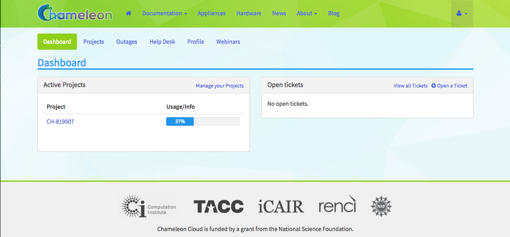
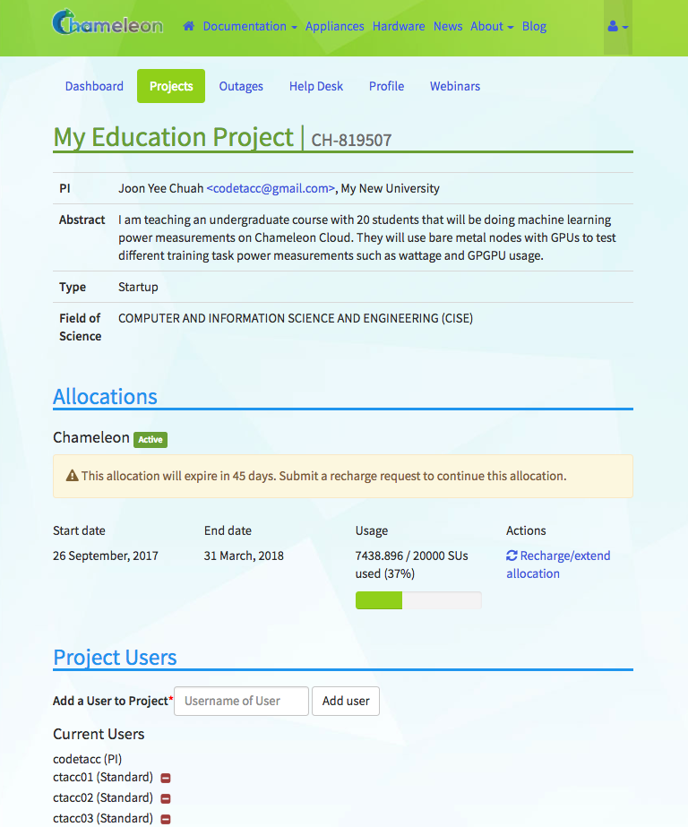

==================
Project Management
==================

Project management tasks, such as adding users to your project or requesting a renewal, is performed through the portal at https://chameleoncloud.org. After you have `created a user account <https://www.chameleoncloud.org/user/register/>`_ and verified your e-mail address from the system generated verification e-mail, you may `login to the portal <https://www.chameleoncloud.org/login/>`_. You will be taken to the Dashboard_.

The Dashboard_ consists of the following panes:

- `The Dashboard main page <Dashboard>`_
- Projects_
- Outages_
- `Help Desk <Help Desk>`_
- Profile_
- Webinars_

.. _dashboard-page:

Dashboard
____________

The Dashboard's main page consists of two control panels - the Active Projects control panel and the Open Tickets panel.

  The project dashboard

The left panel is the Active Projects control panel, which allows you to view your active projects and their current usage. You may click on a project here to view that project.

The right panel is the Open Tickets panel, where you may view active help desk tickets or `Open a Ticket <https://www.chameleoncloud.org/user/help/ticket/new/>`_.

.. _projects-page:

Projects
_________

The Dashboard's `Projects Page <https://www.chameleoncloud.org/user/projects/>`_ allows you to manage your current projects. 

.. figure:: project/projects.png
  :alt: Project list

  Project list

Each individual Project has its own:

- Service Unit allocations
- Users that have access to the project
- System resources such as Security Groups, Floating IP Addresses and Instances
- Assets such as snapshots, object containers, metrics and network configuration

__________________
Creating a Project
__________________

When you click the *+Create a Project* button, you will be presented the `Create a New Project <https://www.chameleoncloud.org/user/projects/new/>`_ web form. Fill out the form with your project description. Your request will be reviewed by a system administrator and you will be notified once your projects get approved. Project durations are six months with a default allocation of 20,000 :ref:`service-units`.

.. figure:: project/createproject.png
  :alt: The Create a New Project form

  The Create a New Project form

.. _service-units:

_________________
Service Units
_________________

One Service Unit is equivalent to one hour of usage of one bare metal node. For example, a reservation for 5 bare metal nodes for 8 hours would use 40 Service Units.

.. _project-details:

__________________
Project Details
__________________

Clicking on a project from either the :ref:`dashboard-page` main page or the :ref:`projects-page` page will allow you to manage one of your approved Projects.

  Project details

From within the details page of your project, you may :ref:`recharge-extend-allocation` and manage `Project Users <Project Users>`_ on your project.

.. _recharge-extend-allocation:

__________________________________
Recharge or Extend Your Allocation
__________________________________

In the *Allocations* section of your :ref:`project-details`, you may view your project start and end dates, current Service Unit usage and request a Service Unit recharge or project extension. To request a Service unit recharge or project extension, click the link next to your project in the *Actions* column of this section.

_________________
Manage Users
_________________

In the *Project Users* section of your :ref:`project-details`, you may manage users that are attached to your Project. While each user has their own Chameleon User account independent of your project, they may be added as members to one or more projects. Users do not have to be PI elligible to have membership in a project. It is highly recommended that if you are an educator with students, each student should have their own non-PI Chameleon account and be added to your project. 

You may add a user to your account by filling out their username and clicking the *Add user* button. You may remove a user from your project by locating their username in the user list and clicking the *-* button next to their username.

Outages
_________

The `Outages <https://www.chameleoncloud.org/user/outages/>`_ page of the Dashboard contains a list of system outage announcements. You may subscribe to an RSS feed of these outages by clicking on the *RSS* icon.

.. figure:: project/outages.png
  :alt: The Outages announcement page

  The Outages announcement page

Help Desk
_________

The `Help Desk <https://www.chameleoncloud.org/user/help/>`_ allows you to submit help request tickets and view the status of any open tickets.

.. figure:: project/helpdesk.png
  :alt: The Help Desk page

  The Help Desk page

To create a new help ticket, click the `+Create a new ticket <https://www.chameleoncloud.org/user/help/ticket/new/>`_ button and fill in the form. A system administrator will respond to your ticket and contact you within 3 business days.

Profile
_________

The `Profile <https://www.chameleoncloud.org/user/profile/>`_ page allows you to manage your biographical information and membership to any Chameleon mailing lists.

.. figure:: project/profile.png
  :alt: The Profile page

  The Profile page

To edit your biographical information, click the `Edit Profile <https://www.chameleoncloud.org/user/profile/edit/>`_ button. To subscribe to or unsubscribe from any Chameleon mailing lists, click the `Manage Email Subscriptions <https://www.chameleoncloud.org/user/profile/subscriptions/>`_ button.

Webinars
_________

The `Webinars <https://www.chameleoncloud.org/user/webinar/>`_ page provides a list of upcoming webinars for Chameleon user training.

