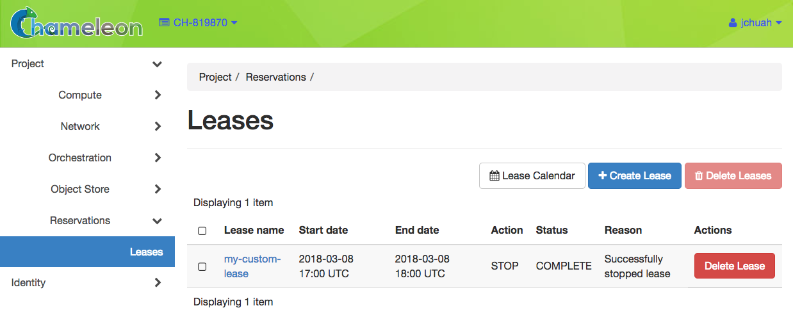
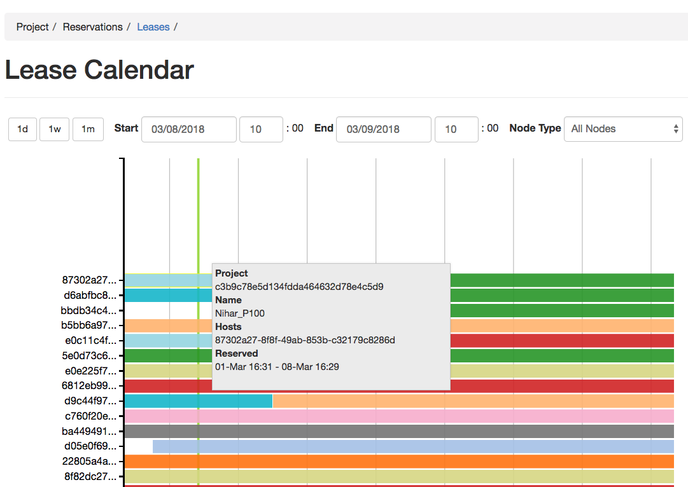
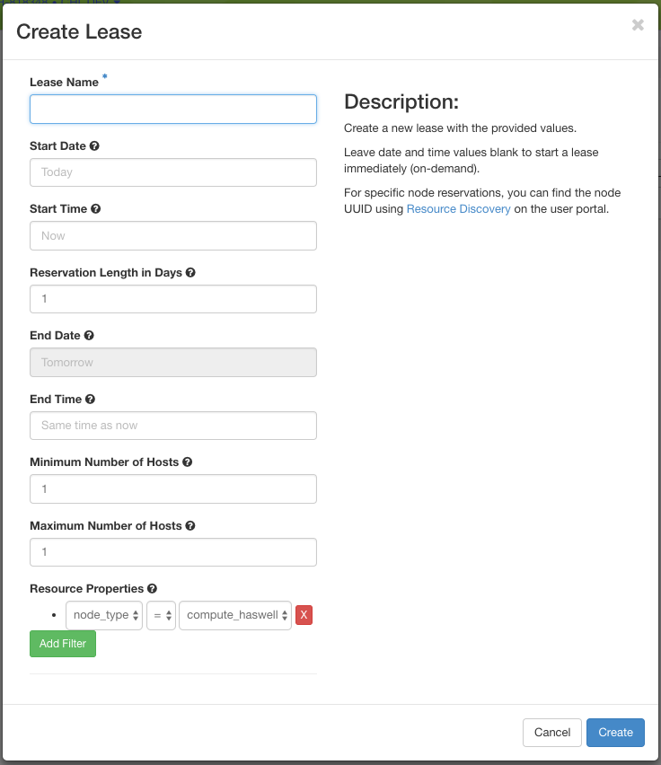
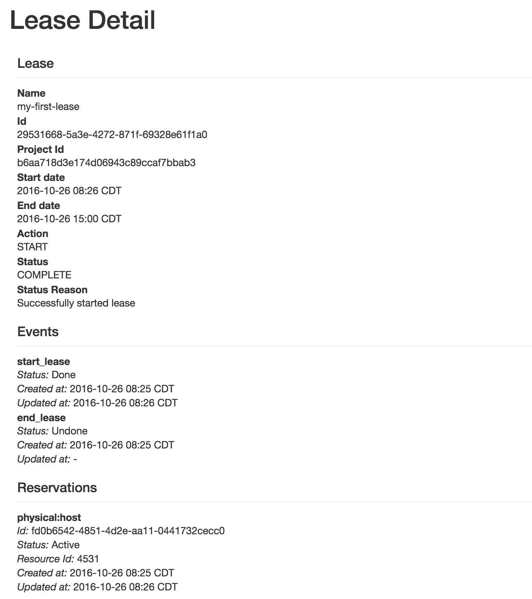
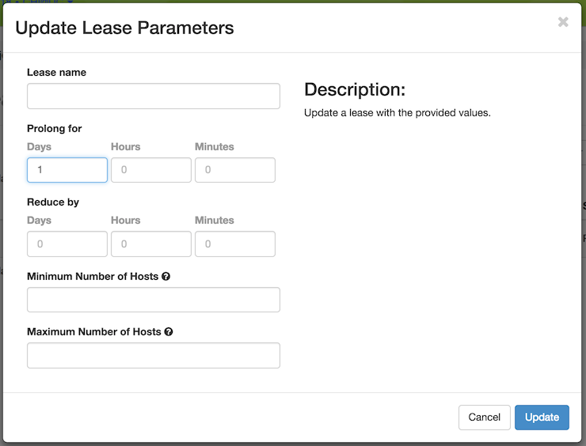

.. _reservations:

===================
Reservations
===================

___________________
Introduction
___________________

Unlike virtual resources on a regular on-demand cloud, physical resources on Chameleon must be reserved before using them for an experiment. Once a reservation has been accepted, users are guaranteed that resources will be available at the time they chose (except in extraordinary circumstances such as hardware or platform failures), which helps to plan large scale experiments.

Chameleon resources are reserved via `Blazar <https://docs.openstack.org/blazar/latest/>`_ (previously known as *Climate*) which provides Reservation as a Service for OpenStack.

___________________________________________________
Provisioning and Managing Resources Using the GUI
___________________________________________________

To make reservations of the resources, first log into the Horizon web interface - either `CHI@TACC <https://chi.tacc.chameleoncloud.org>`_ or `CHI@UC <https://chi.uc.chameleoncloud.org>`_. Then, choose a project and configure your local timezone. For details on how to choose a project and update personalized settings, please see :doc:`gui`.

In the navigation sidebar, go to the *Reservations* section and click *Leases*.

   The Leases page in the GUI

The Lease Calendar
__________________

To discover when resources are available, access the lease calendar by clicking on the *Lease Calendar* button. This will display a Gantt chart of the reservations which allows you to find when resources are available. The *Y* axis represents the different physical nodes in the system and the *X* axis represents time.

   The Lease Calendar

.. tip::
   The nodes are identified by their *UUIDs*. The colors are used to indicate different reservations, i.e. the nodes that belong to the same reservation are colored the same. Hovering over the chart provides the details about the reservation. To change the display time frame, click on ``1d``, ``1w``, and ``1m`` buttons or fill in the start and end times.

.. _reservations-create-lease-gui:

Creating a Lease
________________

Once you have chosen a time period when you want to reserve resources, go back to the *Leases* screen and click on the *Create Lease* button. It should bring up the window displayed below:

   The Create Lease dialog

#. Pick a name for the Lease. The name needs to be unique across your project.
#. Pick a start and end date and time. If you would like to start your Lease as soon as possible, you may leave these blank and Chameleon will attempt to reserve your nodes to begin immediately with a default Lease duration of 1 day.

   .. note:: 
      If you have not selected a timezone earlier, the default timezone is **UTC**. Therefore, the date must be entered in **UTC**! 
      
   .. tip:: You can get the UTC time by running ``date -u`` in your terminal.

#. Choose the minimum and maximum number of hosts. The default is 1 node.
#. Choose a node type in the drop down menu below the *node_type* and *=* drop down lists.

   .. note:: You may only request one type of node in each individual Lease. If you wish to request multiple node types, you must create separate Leases for each node type.

#. Click on the *Create* button.

Once created, the lease details will be displayed. At the bottom of the page are the details about the reservation. Initially the reservation is in the ``Pending`` status, and stays in this state until it reaches the start time.

   Lease details page
   
Once the start time of the lease is reached, the lease will be started and its reservation will change to ``Active``; you may need to refresh the page to see the updates.

.. tip:: The lease is identified by a *UUID*. You may find it useful when using the CLI or submitting tickets on our `help desk <https://www.chameleoncloud.org/user/help/>`_.

.. role:: redbold

.. _lease-policy:

.. attention:: 
   To ensure fairness to all users, resource reservations (leases) are limited to a duration of :redbold:`7 days`. However, an active lease within :redbold:`48 hours` of its end time can be prolonged by :redbold:`up to 7 days` from the moment of request if resources are available.
   
   Chameleon will send an email reminder to you 48 hours before your lease ends. If your lease duration is less than 48 hours, Chameleon will send you an email right after your lease is created. You can :ref:`disable the email notification by using the command line <disable-blazar-notification>`. 

Extending a Lease
_________________

To prolong a lease, click on the *Update Lease* button in *Actions* column.

   The Update Lease Parameters dialog

Fill out the form by specifying the amount of additional time to add to the lease. Then, click on the *Update* button to finish your request.

.. tip:: 
   If there is an advance reservation blocking your lease prolongation that could potentially be moved, you can interact through the users mailing list to coordinate with others users. Additionally, if you know from the start that your lease will require longer than a week and can justify it, you can submit a ticket on our `help desk <https://www.chameleoncloud.org/user/help/>`_ to request a **one-time exception** of creating a longer lease.

Reserving a Node by UUID
________________________

You may reserve a specific node by providing its *UUID*. To learn more about how to find a node with a specific type, please see :doc:`discovery`. In the *Create Lease* dialog, select *uid* in the *Resource Type* dropdown. Then, choose the *UUID* of the node you would like to reserve.

.. figure:: reservations/uid.png
   :alt: Selecting a node by UUID

   Selecting a node by UUID

.. _reservations-extend-lease-gui:

.. _reservation-cli:

___________________________________________________
Provisioning and Managing Resources Using the CLI
___________________________________________________

The sections above present the most user friendly mode of usage, with most actions performed via the web interface. However, Chameleon can be accessed via the OpenStack command line tools which provides more capabilities. This section presents some advanced usage using the command line tools.

.. tip:: Reading :doc:`cli` is highly recommanded before continuing on the following sections.

Blazar Client Installation
____________________________

To reserve specific nodes, based on their identifier or their resource specifications, you must use the `Blazar <https://docs.openstack.org/blazar/latest/>`_ command line client. To use the CLI, you must install the ``python-blazarclient``. To install ``python-blazarclient``, run the following command:

.. code-block:: bash

   pip install 'python-blazarclient>=1.1.1'

.. note:: We need to install version 1.1.1 or greater to support multi-region clouds.

Before using *Blazar Client*, You must configure the environment variables for your project via ``source`` :ref:`the OpenStack RC Script <cli-rc-script>` or use the CLI switches every time you run the commands. Type ``blazar`` in your terminal session to enter the *Interactive Mode*. You may also use ``blazar`` in the *Shell Mode*.

.. note:: ``blazar`` is previously known as ``climate``. In Chameleon, ``blazar`` and ``climate`` are used interchangeably, but they have the same functionality.

Creating a Lease
________________

To create a lease, use the ``lease-create`` command. The following arguments are required:

- ``--physical-reservation`` with the ``min``, ``max``, and ``resource_properties`` attributes
- ``--start-date`` in ``"YYYY-MM-DD HH:MM"`` format
- ``--end-date`` in ``"YYYY-MM-DD HH:MM"`` format
- A lease name

For example, the following command will create a lease with the name of ``my-first-lease`` and the node type of ``compute_haswell`` that starts on June 17th, 2015 at 4:00pm and ends on June 17th, 2015 at 6:00pm:

.. code-block:: bash

   blazar lease-create --physical-reservation min=1,max=1,resource_properties='["=", "$node_type", "compute_haswell"]' --start-date "2015-06-17 16:00" --end-date "2015-06-17 18:00" my-first-lease

Instead of specifying the node type, you may also reserve a specific node by providing it's *UUID*. For example, to reserve the node with *UUID* of ``c9f98cc9-25e9-424e-8a89-002989054ec2``, you may run the command similar to the following:

.. code-block:: bash

   blazar lease-create --physical-reservation min=1,max=1,resource_properties='["=", "$uid", "c9f98cc9-25e9-424e-8a89-002989054ec2"]' --start-date "2015-06-17 16:00" --end-date "2015-06-17 18:00" my-custom-lease

.. _disable-blazar-notification:
.. attention:: 
   To specify a ``before_end`` action, simply add ``before_end=<action_type>`` to ``physical-reservation`` parameter. For example:
   
   .. code-block:: bash

      blazar lease-create --physical-reservation min=1,max=1,resource_properties='["=", "$uid", "c9f98cc9-25e9-424e-8a89-002989054ec2"]',before_end=email --start-date "2015-06-17 16:00" --end-date "2015-06-17 18:00" my-custom-lease
   
   Currently supported ``before_end`` action types include 
   
   +-----------------+-------------------------------------------------------------------------------+
   | **Action Type** | **Description**                                                               |
   +-----------------+-------------------------------------------------------------------------------+
   |  ``email``      | Send an email notification                                                    |
   +-----------------+-------------------------------------------------------------------------------+
   | ``default``     | Default action used when no action is specified; Currently set to ``email``   |
   +-----------------+-------------------------------------------------------------------------------+
   |    ``''``       | Do nothing                                                                    |
   +-----------------+-------------------------------------------------------------------------------+
      
   The default ``before_end`` action is set to ``email``. To disable the email notification, set ``before_end=''``. 
    

Actually, you may use any resource property that is in the resource registry to reserve the nodes. To see the list of properties of nodes, first get the full list of nodes with the command:

.. code-block:: bash

   blazar host-list
   
The output should look like:

.. code-block:: text

   +------+--------------------------------------+-------+-----------+----------+
   | id   | hypervisor_hostname                  | vcpus | memory_mb | local_gb |
   +------+--------------------------------------+-------+-----------+----------+
   | 151  | 00401ba8-4fb0-4f1e-a7dc-e93065ebdd15 |    24 |    128000 |      200 |
   | 233  | 004c89fa-ff13-4563-9012-f2d62c1a7aff |    24 |    128000 |      200 |
   | 330  | 01029fb8-0a0b-4949-92b0-a756fb8588e5 |    24 |    128000 |      200 |
   | 146  | 036b16e3-9fa6-442c-8e6d-cfe12ed5c8a3 |    24 |    128000 |      200 |
   | 992  | 05dd5e25-440f-4492-b3b8-9d39af83b8bc |     8 |      3200 |      100 |
   | 219  | 066d92f5-7cb9-49ea-8f05-842566672ebf |    24 |    128000 |      200 |
   | 3216 | 06b164d5-3514-4ebe-8928-0bd2f9508b80 |     0 |         0 |        0 |
   | 156  | 07030786-d6e8-46b4-b0f2-79b0b303b518 |    24 |    128000 |      200 |
   | 212  | 07051549-c404-44af-8e73-8beb5891864a |    24 |    128000 |      200 |
   | 175  | 07fd65f0-b814-429b-a2fb-3a4afa52de41 |    24 |    128000 |      200 |
   | 255  | 081d2cb1-b6b5-4014-b226-7a42d8588307 |    24 |    128000 |      200 |

To get resource properties of a host, run ``host-show`` command with the ``id`` listed in the first column. For example, to get the resource properties of the host 151,  run:

.. code-block:: bash

   blazar host-show 151

The output should look like:

.. code-block:: text

   +----------------------------------+---------------------------------------------+
   | Field                            | Value                                       |
   +----------------------------------+---------------------------------------------+
   | architecture.platform_type       | x86_64                                      |
   | architecture.smp_size            | 2                                           |
   | architecture.smt_size            | 48                                          |
   | bios.release_date                | 03/09/2015                                  |
   | bios.vendor                      | Dell Inc.                                   |
   | bios.version                     | 1.2                                         |
   | chassis.manufacturer             | Dell Inc.                                   |
   | chassis.name                     | PowerEdge R630                              |
   | chassis.serial                   | 4VJGD42                                     |
   | cpu_info                         | baremetal cpu                               |
   | created_at                       | 2015-06-26 20:50:58                         |
   | gpu.gpu                          | False                                       |
   | hypervisor_hostname              | 00401ba8-4fb0-4f1e-a7dc-e93065ebdd15        |
   | hypervisor_type                  | ironic                                      |
   | hypervisor_version               | 1                                           |
   | id                               | 151                                         |
   | uid                              | c9f98cc9-25e9-424e-8a89-002989054ec2        |
   | updated_at                       |                                             |
   | vcpus                            | 48                                          |
   | version                          | 78dbf26565cf24050718674dcf322331fab8ead5    |
   +----------------------------------+---------------------------------------------+

Any of the property listed in the field column may be used to reserve the nodes. For example, you can use ``resource_properties='["=", "$architecture.smp_size", "2"]'`` to reserve a node with two physical processors.

.. note:: Remember to use ``$`` in front of the property.

Extending a Lease
_________________

To extend your lease, use ``lease-update`` command, and provide time duration via ``--prolong-for`` switch. The format of the duration is a number followed by a letter specifying the time unit. ``w`` is for weeks, ``d`` is for days and ``h`` is for hours. For example, if you would like to extend the ``my-first-lease`` by one day, run the following command:

.. code-block:: bash

   blazar lease-update --prolong-for "1d" my-first-lease
   
Chameleon Node Types
_____________________

The following node types are reservable on Chameleon.

+--------------------------+------------------------------------------------------------------------------+
| Node Type                | ``resource_properties='["=", "$node_type", "<Chameleon node type name>"]'``  |
+--------------------------+------------------------------------------------------------------------------+
| Haswell compute nodes    | ``compute_haswell``                                                          |
+--------------------------+------------------------------------------------------------------------------+
| Skylake compute nodes    | ``compute_skylake``                                                          |
+--------------------------+------------------------------------------------------------------------------+
| Storage nodes            | ``storage``                                                                  |
+--------------------------+------------------------------------------------------------------------------+
| Haswell Infiniband nodes | ``compute_haswell_ib``                                                       |
+--------------------------+------------------------------------------------------------------------------+
| Storage Hierarchy nodes  | ``storage_hierarchy``                                                        |
+--------------------------+------------------------------------------------------------------------------+
| NVIDIA K80 nodes         | ``gpu_k80``                                                                  |
+--------------------------+------------------------------------------------------------------------------+
| NVIDIA M40 nodes         | ``gpu_m40``                                                                  |
+--------------------------+------------------------------------------------------------------------------+
| NVIDIA P100 nodes        | ``gpu_p100``                                                                 |
+--------------------------+------------------------------------------------------------------------------+
| NVIDIA P100 NVLink nodes | ``gpu_p100_nvlink``                                                          |
+--------------------------+------------------------------------------------------------------------------+
| FPGA nodes               | ``fpga``                                                                     |
+--------------------------+------------------------------------------------------------------------------+
| Low power Xeon nodes     | ``lowpower_xeon``                                                            |
+--------------------------+------------------------------------------------------------------------------+
| Atom nodes               | ``atom``                                                                     |
+--------------------------+------------------------------------------------------------------------------+
| ARM64 nodes              | ``arm64``                                                                    |
+--------------------------+------------------------------------------------------------------------------+
