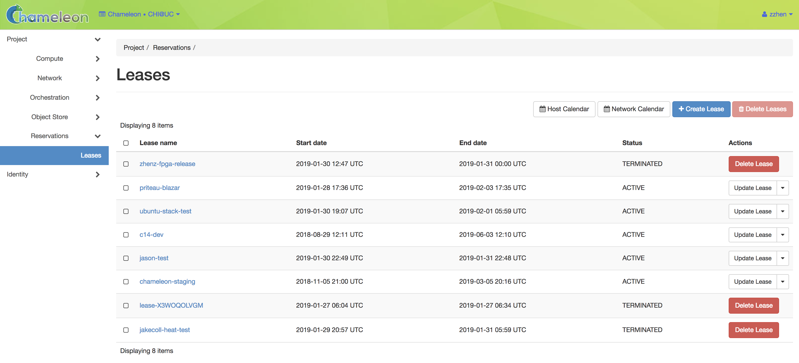
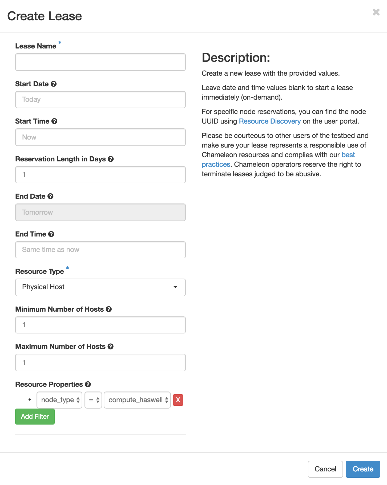

===================
Reservations
===================

___________________
Introduction
___________________

In order to use bare metal resources, you must reserve them in advance by creating a *Lease*. This is highly recommended for bare metal resources that are in high demand, such as GPU nodes. A Lease for a set of nodes ensures that you will be the only user with access to those specific nodes for the duration of the Lease. Leases can be made well in advance of when you need to use bare metal resources, and may contain requests for specific nodes by node UUID. Leases are shared by all members of a Project. Leases have a maximum duration of *7 days* but may be extended within 48 hours prior to the end of the Lease through the GUI. If you require a Lease longer than 7 days, you may request it by opening a ticket at the :ref:`help-desk`.

The Reservation mechanism is implemented using the Blazar OpenStack module. You may make reservations through the GUI at each Chameleon site or through the CLI. 

_________________________________________
Managing Reservations using the GUI
_________________________________________

To manage reservations using the GUI, log in to the GUI for the Chameleon site where the specific resources you wish to use are located - either `CHI@TACC <https://chi.tacc.chameleoncloud.org>`_ or `CHI@UC <https://chi.uc.chameleoncloud.org>`_. In the navigation sidebar, go to the *Reservations* section and click *Leases*.

   The Leases page in the GUI

The Lease Calendar
__________________

If you wish to see the availability and usage of Chameleon bare metal nodes, you may view them by clicking on the *Lease Calendar* button. This will load the Lease Calendar.

.. figure:: reservations/leasecalendar.png
   :alt: The Lease Calendar

   The Lease Calendar

The Lease Calendar is a Gantt chart display Chameleon bare metal nodes by UUID. Individual reservations are represented by colored bars of the same color. All reservations system-wide are displayed, including those from other projects. Hovering over a reservation will display details of the reservation. You may also alter the Gantt chart's display time frame or filter the types of nodes being displayed by using the *Node Type* dropdown.

.. _reservations-create-lease-gui:

Creating a Lease
________________

You may create a new Lease by clicking on the *+Create Lease* button. This will display the *Create Lease* dialog.

   The Create Lease dialog

#. Pick a name for the Lease. The name needs to be unique across your project.
#. Pick a start and end date and time. If you would like to start your Lease as soon as possible, you may leave these blank and Chameleon will attempt to reserve your nodes to begin immediately with a default Lease duration of 1 day.

   .. note:: The start and end date and times use your user setting's configured Timezone. By default, this is UTC. You may configure your Timezone setting by visiting the GUI's :ref:`gui-settings` settings page.

#. Choose the minimum and maximum number of hosts you require. The default is 1 node.
#. Choose a node type in the drop down menu below the *node_type* and *=* drop down lists.

   .. note:: You may only request one type of node in each individual Lease. If you wish to request multiple node types, you must create separate Leases for each node type.

#. Click on the *Create* button.

If your Lease was successfully created, you will be taken to the *Lease Detail* page for the Lease that was created.

.. figure:: reservations/leasedetails.png
   :alt: Lease details page

   Lease details page

The *Id* field in the Lease Detail page displays your Lease UUID. This value is useful when using the CLI or communicating issues when opening a ticket at the :ref:`help-desk`. In addition, the *Action*, *Status* and *Status Reason* fields display the state of your Lease. If your Lease fails to start at the appointed time, you may delete your Lease and re-create it.

Extending a Lease
_________________

You may extend a Lease that has not yet expired by clicking on the *Update Lease* button next to it on the Leases page in the GUI. This will open the *Update Lease Parameters* dialog.

.. figure:: reservations/updatelease.png
   :alt: The Update Lease Parameters dialog

   The Update Lease Parameters dialog

To prolong a lease, fill out the form specifying the amount of additional time to add to the lease. When you are finished, click the *Update* button.

Reserving a Node by UUID
_______________________

You may specify a specific node to reserve if you know its UUID. In the *Create Lease* dialog, select *uid* in the *Resource Type* dropdown. Next, select your node UUID in the dropdown underneath it. 

.. figure:: reservations/uid.png
   :alt: Selecting a node by UUID

   Selecting a node by UUID

.. _reservations-extend-lease-gui:

.. _reservation-cli:

___________________________________
Managing Reservations using the CLI
___________________________________ 

To manage your reservations with the CLI, you must install the ``python-blazarclient`` Python package in addition to the ``python-openstackclient`` package. You may use the following command to install ``python-blazarclient``:

.. code-block:: bash
   pip install python-blazarclient

The Blazar Client is similar to the OpenStack Client. You must first set environment variables for your project using :ref:`cli-rc-script` or use the same set of CLI switches to authenticate the client with Chameleon. Once installed, you may type ``blazar`` in your terminal session to open the CLI in Interactive Mode, or you may use ``blazar`` in shell mode for scripting.

.. note:: ``blazar`` previously used the development name ``climate``. Both ``blazar`` and ``climate`` are occasionally used interchangeably on Chameleon and have the same functionality.

Retrieving a Node List
______________________

The ``host-list`` command retrieves a list of nodes at your Chameleon site. The output may appear like this:

.. code-block::

   +------+--------------------------------------+-------+-----------+----------+
   | id   | hypervisor_hostname                  | vcpus | memory_mb | local_gb |
   +------+--------------------------------------+-------+-----------+----------+
   | 151  | 00401ba8-4fb0-4f1e-a7dc-e93065ebdd15 |    24 |    128000 |      200 |
   | 233  | 004c89fa-ff13-4563-9012-f2d62c1a7aff |    24 |    128000 |      200 |
   | 330  | 01029fb8-0a0b-4949-92b0-a756fb8588e5 |    24 |    128000 |      200 |
   | 146  | 036b16e3-9fa6-442c-8e6d-cfe12ed5c8a3 |    24 |    128000 |      200 |
   | 992  | 05dd5e25-440f-4492-b3b8-9d39af83b8bc |     8 |      3200 |      100 |
   | 219  | 066d92f5-7cb9-49ea-8f05-842566672ebf |    24 |    128000 |      200 |
   | 3216 | 06b164d5-3514-4ebe-8928-0bd2f9508b80 |     0 |         0 |        0 |
   | 156  | 07030786-d6e8-46b4-b0f2-79b0b303b518 |    24 |    128000 |      200 |
   | 212  | 07051549-c404-44af-8e73-8beb5891864a |    24 |    128000 |      200 |
   | 175  | 07fd65f0-b814-429b-a2fb-3a4afa52de41 |    24 |    128000 |      200 |
   | 255  | 081d2cb1-b6b5-4014-b226-7a42d8588307 |    24 |    128000 |      200 |

You may retrieve details about an individual node with the ``host-show`` command by using the ``id`` from this chart. For example, you can retrieve details about the node with ``id`` 151 by using the command:

.. code-block::

   blazar host-show 151

You will receive verbose details about this host that may look like this:

.. code-block::

   +----------------------------------+---------------------------------------------+
   | Field                            | Value                                       |
   +----------------------------------+---------------------------------------------+
   | architecture.platform_type       | x86_64                                      |
   | architecture.smp_size            | 2                                           |
   | architecture.smt_size            | 48                                          |
   | bios.release_date                | 03/09/2015                                  |
   | bios.vendor                      | Dell Inc.                                   |
   | bios.version                     | 1.2                                         |
   | chassis.manufacturer             | Dell Inc.                                   |
   | chassis.name                     | PowerEdge R630                              |
   | chassis.serial                   | 4VJGD42                                     |
   | cpu_info                         | baremetal cpu                               |
   | created_at                       | 2015-06-26 20:50:58                         |
   | gpu.gpu                          | False                                       |
   | hypervisor_hostname              | 00401ba8-4fb0-4f1e-a7dc-e93065ebdd15        |
   | hypervisor_type                  | ironic                                      |
   | hypervisor_version               | 1                                           |
   | id                               | 151                                         |
   | uid                              | c9f98cc9-25e9-424e-8a89-002989054ec2        |
   | updated_at                       |                                             |
   | vcpus                            | 48                                          |
   | version                          | 78dbf26565cf24050718674dcf322331fab8ead5    |
   +----------------------------------+---------------------------------------------+

Any of these fields may be used in the reservation process. The ``uid`` field is the UUID of the node, used for making a specific reservation for that node.

Creating a Lease
________________

You may use the ``lease-create`` commmand to create a Lease. You must provide the following arguments:

- ``--physical-reservation`` switch to request specific node types or node UUIDs, with the ``min``, ``max``, and ``resource_properties`` attributes
- ``--start-date`` followed by a date and time in ``"YYYY-MM-DD HH:MM"`` format
- ``--end-date`` followed by a date and time in ``"YYYY-MM-DD HH:MM"`` format
- A lease name

For example, if you wish to create a reservation for a compute node called ``my-first-lease`` that starts on June 17th, 2015 at 4:00pm and ends on June 17th, 2015 at 6:00pm, you would use the command:

.. code-block:: bash

   blazar lease-create --physical-reservation min=1,max=1,resource_properties='["=", "$node_type", "compute"]' --start-date "2015-06-17 16:00" --end-date "2015-06-17 18:00" my-first-lease

Extending a Lease
_________________

You may extend a lease by using the ``lease-update`` command with the ``--prolong-for`` switch and a duration, in quotes. The format of the duration is a number followed by a letter specifying a unit of time. ``w`` is for weeks, ``d`` is for days and ``h`` is for hours. For example, if you wish to extend a lease by one day, you would use the command:

.. code-block:: bash

   blazar lease-update --prolong-for "1d" my-first-lease

Reserving a Node by UUID
________________________

If you wish to reserve a specific node by UUID, you may specify a parameter type and value in ``resource_properties``. For example, if you wish to reserve node ``c9f98cc9-25e9-424e-8a89-002989054ec2``, you would use the command:

.. code-block:: bash

   blazar lease-create --physical-reservation min=1,max=1,resource_properties='["=", "$uid", "c9f98cc9-25e9-424e-8a89-002989054ec2"]' --start-date "2015-06-17 16:00" --end-date "2015-06-17 18:00" my-custom-lease

.. note:: When specifying the ``resource_properties`` parameters, use the ``$`` symbol in front of the resource type string.

Here are examples for reserving different types of nodes:

+--------------------------+---------------------------------------------------------------------------------------------------------------------------------------------------------------------------------------------------------+
| Node Type                | Command                                                                                                                                                                                                 |
+--------------------------+---------------------------------------------------------------------------------------------------------------------------------------------------------------------------------------------------------+
| Compute nodes            | ``blazar lease-create --physical-reservation min=1,max=1,resource_properties='["=", "$node_type", "compute"]' --start-date "2016-06-22 20:38" --end-date "2016-06-25 15:00" my-compute-nodes``          |
+--------------------------+---------------------------------------------------------------------------------------------------------------------------------------------------------------------------------------------------------+
| Storage nodes            | ``blazar lease-create --physical-reservation min=1,max=1,resource_properties='["=", "$node_type", "storage"]' --start-date "2016-06-22 20:38" --end-date "2016-06-25 15:00" my-storage-nodes``          |
+--------------------------+---------------------------------------------------------------------------------------------------------------------------------------------------------------------------------------------------------+
| Infiniband nodes         | ``blazar lease-create --physical-reservation min=1,max=1,resource_properties='["=", "$node_type", "compute_ib"]' --start-date "2016-06-22 20:38" --end-date "2016-06-25 15:00" my-infiniband-nodes``    |
+--------------------------+---------------------------------------------------------------------------------------------------------------------------------------------------------------------------------------------------------+
| Storage Hierarchy nodes  | ``blazar lease-create --physical-reservation min=1,max=1,resource_properties='["=", "$node_type", "storage_hierarchy"]' --start-date "2016-06-22 20:38" --end-date "2016-06-25 15:00" my-ssd-nodes``    |
+--------------------------+---------------------------------------------------------------------------------------------------------------------------------------------------------------------------------------------------------+
| NVIDIA K80 nodes         | ``blazar lease-create --physical-reservation min=1,max=1,hypervisor_properties='["=", "$node_type", "gpu_k80"]' --start-date "2016-06-28 17:32" --end-date "2016-06-28 20:32" my-k80-nodes``            |
+--------------------------+---------------------------------------------------------------------------------------------------------------------------------------------------------------------------------------------------------+
| NVIDIA M40 nodes         | ``blazar lease-create --physical-reservation min=1,max=1,hypervisor_properties='["=", "$node_type", "gpu_m40"]' --start-date "2016-06-28 17:32" --end-date "2016-06-28 20:32" my-m40-nodes``            |
+--------------------------+---------------------------------------------------------------------------------------------------------------------------------------------------------------------------------------------------------+
| NVIDIA P100 nodes        | ``blazar lease-create --physical-reservation min=1,max=1,hypervisor_properties='["=", "$node_type", "gpu_p100"]' --start-date "2016-06-28 17:32" --end-date "2016-06-28 20:32" my-p100-nodes``          |
+--------------------------+---------------------------------------------------------------------------------------------------------------------------------------------------------------------------------------------------------+
| NVIDIA P100 NVLink nodes | ``blazar lease-create --physical-reservation min=1,max=1,hypervisor_properties='["=", "$node_type", "gpu_p100_nvlink"]' --start-date "2016-06-28 17:32" --end-date "2016-06-28 20:32" my-nvlink-nodes`` |
+--------------------------+---------------------------------------------------------------------------------------------------------------------------------------------------------------------------------------------------------+
| FPGA nodes               | ``blazar lease-create --physical-reservation min=1,max=1,hypervisor_properties='["=", "$node_type", "fpga"]' --start-date "2016-06-28 17:32" --end-date "2016-06-28 20:32" my-fpga-nodes``              |
+--------------------------+---------------------------------------------------------------------------------------------------------------------------------------------------------------------------------------------------------+
| Low power Xeon nodes     | ``blazar lease-create --physical-reservation min=1,max=1,hypervisor_properties='["=", "$node_type", "lowpower_xeon"]' --start-date "2016-06-28 17:32" --end-date "2016-06-28 20:32" my-xeon-nodes``     |
+--------------------------+---------------------------------------------------------------------------------------------------------------------------------------------------------------------------------------------------------+
| Atom nodes               | ``blazar lease-create --physical-reservation min=1,max=1,hypervisor_properties='["=", "$node_type", "atom"]' --start-date "2016-06-28 17:32" --end-date "2016-06-28 20:32" my-atom-nodes``              |
+--------------------------+---------------------------------------------------------------------------------------------------------------------------------------------------------------------------------------------------------+
| ARM64 nodes              | ``blazar lease-create --physical-reservation min=1,max=1,hypervisor_properties='["=", "$node_type", "arm64"]' --start-date "2016-06-28 17:32" --end-date "2016-06-28 20:32" my-arm64-nodes``            |
+--------------------------+---------------------------------------------------------------------------------------------------------------------------------------------------------------------------------------------------------+

