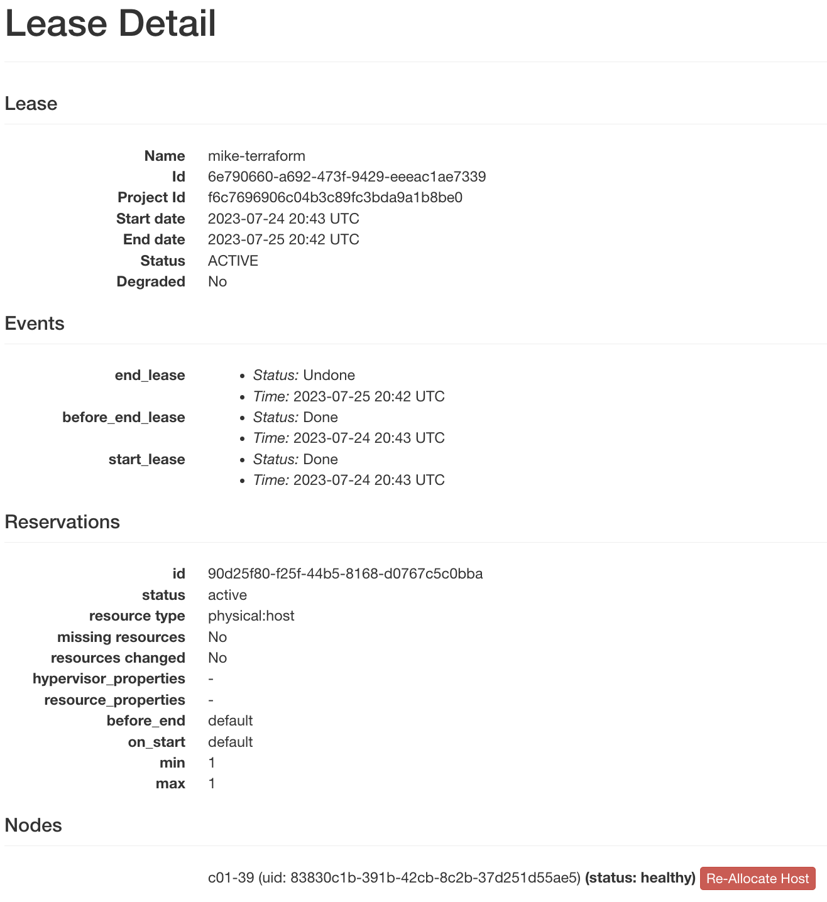

.. _reservations:

=============
Reservations
=============

Unlike virtual resources on a regular on-demand cloud, physical resources on
Chameleon must be reserved before using them for an experiment. Once a
reservation has been accepted, users are guaranteed that resources will be
available at the time they chose (except in extraordinary circumstances such as
hardware or platform failures), which helps to plan large scale experiments.

Chameleon resources are reserved via `Blazar
<https://docs.openstack.org/blazar/latest/>`_ which provides Reservation as a
Service for OpenStack.

Three types of resources can be reserved: physical bare metal hosts, network
segments (VLANs), and floating IPs.

Provisioning and Managing Resources Using the GUI
=================================================

To make reservations of the resources, first log into the Horizon web interface
- either |CHI@TACC| or |CHI@UC|. Then, choose a project and configure your local
timezone. For details on how to choose a project and update personalized
settings, please see :ref:`gui`.

In the navigation sidebar, go to the *Reservations* section and click *Leases*.

.. figure:: reservations/leasespage.png
   :alt: The Leases page in the GUI

   The Leases page in the GUI

The Lease Calendars
-------------------

To discover when resources are available, You can access the lease calendars by
clicking on the *Host Calendar* button for physical hosts and clicking on the
*Network Calendar* button for VLANs. This will display a Gantt chart of the
reservations which allows you to find when resources are available. The *Y* axis
represents the different physical nodes in the system and the *X* axis
represents time.

.. figure:: reservations/hostcalendar.png
   :alt: The Host Calendar

   The Host Calendar

.. figure:: reservations/networkcalendar.png
   :alt: The Network Calendar

   The Network Calendar

.. tip::

   The nodes and VLANs are identified by their *UUIDs*. The colors are used to
   indicate different reservations, i.e. the resources that belong to the same
   reservation are colored the same. Hovering over the chart provides the
   details about the reservation. To change the display time frame, click on
   ``1d``, ``1w``, and ``1m`` buttons or fill in the start and end times.

.. _reservations-create-lease-gui:

Creating a Lease to Reserve Resources
-------------------------------------

Once you have chosen a time period when you want to reserve resources, go back
to the *Leases* screen and click on the *Create Lease* button. It should bring
up the window displayed below:

.. figure:: reservations/createleasedialog.png
   :alt: The Create Lease dialog

   The Create Lease dialog

#. Pick a name for the lease. The name needs to be unique across your project.

#. Pick a start time and lease duration in days. If you would like to start your
   lease as soon as possible, you may leave the start time blank and Chameleon
   will attempt to reserve your nodes to begin immediately with a default Lease
   duration of 1 day.

   .. note::

      If you have not selected a timezone earlier, the default timezone is
      **UTC**. Therefore, the date must be entered in **UTC**!

   .. tip:: You can get the UTC time by running ``date -u`` in your terminal.

#. To reserve a bare metal node, navigate to the "Hosts" tab.

	.. figure:: reservations/nodereservationdialog.png
	   :alt: The Create Lease dialog Host reservation tab
	
	   The Create Lease dialog Host reservation tab

    a. Check "Reserve Hosts".

    b. Choose the minimum and maximum number of hosts.

    c. Choose a node type in the drop down menu below the *node_type* and *=* drop down lists.

       .. note::

          You may only request one type of node in each individual lease. If you
          wish to request multiple node types, you must create separate Leases for
          each node type.

#. To reserve a vlan segment, navigate to the "Networks" tab.

	.. figure:: reservations/networkreservationdialog.png
	   :alt: The Create Lease dialog Network reservation tab
	
	   The Create Lease dialog Network reservation tab

    a. Check "Reserve Network"

    b. Enter the network name and description

        .. note::

           When a VLAN segment reservation ends, all Neutron resources attached to
           the network will be automatically deleted. Bare metal instances using the
           network will lose network connectivity.

        .. tip::

           Network name is required when reserving VLAN segment.

#. To reserve floating IPs, navigate to the "Networks" tab.

    a. Check "Reserve Floating IPs".
    b. Choose the number of floating IPs.

#. Click on the *Create* button.

Once created, the lease details will be displayed. At the bottom of the page are
the details about the reservation. Initially the reservation is in the
``Pending`` status, and stays in this state until it reaches the start time.

    .. tip::

       If you want Blazar to launch an instances or complex appliance as soon as
       the lease starts, read the ``Advanced Reservation Orchestration`` section
       our :ref:`complex` documentation.

   Lease details page

Once the start time of the lease is reached, the lease will be started and its
reservation will change to ``Active``; you may need to refresh the page to see
the updates.

.. tip::

   The lease is identified by a *UUID*. You may find it useful when using the
   CLI or submitting tickets on our |Help Desk|.

.. role:: redbold

.. _lease-policy:

.. attention::

   To ensure fairness to all users, resource reservations (leases) are limited
   to a duration of :redbold:`7 days`. However, an active lease within
   :redbold:`48 hours` of its end time can be prolonged by :redbold:`up to 7
   days` from the moment of request if resources are available.

   Chameleon will send an email reminder to you 48 hours before your lease ends.
   If your lease duration is less than 48 hours, Chameleon will send you an
   email right after your lease is created. You can :ref:`disable the email
   notification by using the command line <disable-blazar-notification>`.

Extending a Lease
-----------------

To prolong a lease, click on the *Update Lease* button in *Actions* column.

.. figure:: reservations/updatelease.png
   :alt: The Update Lease Parameters dialog

   The Update Lease Parameters dialog

Fill out the form by specifying the amount of additional time to add to the
lease. Then, click on the *Update* button to finish your request.

.. tip::

   If there is an advance reservation blocking your lease prolongation that
   could potentially be moved, you can interact through the users mailing list
   to coordinate with others users. Additionally, if you know from the start
   that your lease will require longer than a week and can justify it, you can
   submit a ticket on our |Help Desk| to request a **one-time exception** of
   creating a longer lease.

Changing the Number of Nodes of a Lease
^^^^^^^^^^^^^^^^^^^^^^^^^^^^^^^^^^^^^^^

It is now possible to change the number of nodes reserved in a lease. For
advance reservations that haven't yet started, the node count can be increased
or decreased. For reservations already started, only new nodes can be added.

To change the number of nodes of a lease, click on the *Update Lease* button in
*Actions* column.

.. figure:: reservations/updateleasenodecount.png
   :alt: The Update Lease Parameters dialog, changing the number of reserved nodes

   The Update Lease Parameters dialog, changing the number of reserved nodes

Navigate to the "Hosts" tab,  and fill out the form by specifying the new minimum 
and maximum numbers of hosts. Then, click on the *Update* button to finish your request.

Changing the Number of Floating IPs in a Lease
^^^^^^^^^^^^^^^^^^^^^^^^^^^^^^^^^^^^^^^^^^^^^^

It is possible to change the number of floating IPs in a lease, whether the
lease is pending or active. In some situations, you cannot renew a lease due to
another user reserving the same floating IP in your lease. In this case, you
can set your lease to have 0 floating IPs, and create a second lease just for
reserving floating IPs.

To change the number of floating IPs, click on the *Update Lease* button in
*Actions* column.

.. figure:: reservations/updateleasefloatingipcount.png
   :alt: The Update Lease Parameters dialog, changing the number of reserved IPs

   The Update Lease Parameters dialog, changing the number of reserved IPs

Navigate to the "Floating IPs" tab,  and fill out the form by specifying the
amount of floating IPs. Then, click on the *Update* button to finish your request.

Reserving a Node by UUID
------------------------

You may reserve a specific node by providing its *UUID*. To learn more about how
to find a node with a specific type, please see :ref:`resource-discovery`. In
the *Create Lease* dialog, select *uid* in the *Resource Type* dropdown. Then,
choose the *UUID* of the node you would like to reserve.

.. figure:: reservations/uid.png
   :alt: Selecting a node by UUID

   Selecting a node by UUID

.. _reservations-extend-lease-gui:

.. _reservation-cli:

Provisioning and Managing Resources Using the CLI
=================================================

The sections above present the most user friendly mode of usage, with most
actions performed via the web interface. However, Chameleon can be accessed via
the OpenStack command line tools which provides more capabilities. This section
presents some advanced usage using the command line tools.

.. tip::

   Reading :ref:`cli` is highly recommended before continuing on the following
   sections.

Blazar Client Installation
--------------------------

To reserve specific nodes, based on their identifier or their resource
specifications, you must use the `Blazar
<https://docs.openstack.org/blazar/latest/>`_ command line client. To use the
CLI, you must install the ``python-blazarclient``. To install
``python-blazarclient``, run the following command:

.. code-block:: bash

   pip install git+https://github.com/ChameleonCloud/python-blazarclient.git@chameleoncloud/xena

.. note::
   To reserve VLAN segments or floating IPs, you must use a Chameleon fork of
   the Blazar client, as above.

Before using *Blazar Client*, You must configure the environment variables for
your project via ``source`` :ref:`the OpenStack RC Script <cli-rc-script>` or
use the CLI switches every time you run the commands. Type ``blazar`` in your
terminal session to enter the *Interactive Mode*. You may also use ``blazar`` in
the *Shell Mode*.

Creating a Lease to Reserve Physical Hosts
------------------------------------------

To create a lease, use the ``lease-create`` command. The following arguments are
required:

- ``--reservation`` with the ``min``, ``max``, ``resource_type``, and ``resource_properties`` attributes
- ``--start-date`` in ``"YYYY-MM-DD HH:MM"`` format
- ``--end-date`` in ``"YYYY-MM-DD HH:MM"`` format
- A lease name

If ``--start-date`` is ommitted, then the current date and time will be used by default.

For example, the following command will create a lease with the name of
``my-first-lease`` and the node type of ``compute_skylake`` that starts on June
17th, 2022 at 4:00pm and ends on June 17th, 2022 at 6:00pm:

.. code-block:: bash

   openstack reservation lease create \
     --reservation min=1,max=1,resource_type=physical:host,resource_properties='["=", "$node_type", "compute_skylake"]' \
     --start-date "2022-06-17 16:00" \
     --end-date "2022-06-17 18:00" \
     my-first-lease

Instead of specifying the node type, you may also reserve a specific node by
providing it's *UUID*. For example, to reserve the node with *UUID* of
``c9f98cc9-25e9-424e-8a89-002989054ec2``, you may run the command similar to the
following:

.. code-block:: bash

   openstack reservation lease create \
     --reservation min=1,max=1,resource_type=physical:host,resource_properties='["=", "$uid", "c9f98cc9-25e9-424e-8a89-002989054ec2"]' \
     --start-date "2022-06-17 16:00" \
     --end-date "2022-06-17 18:00" \
     my-custom-lease

To create a lease with multiple resource properties, you must combine them like
``["and", [property1], [property2], [...] ]``. For example, to reserve a node
with *$architecture.smt_size* of *48* and *node_type* of *compute_haswell*:

.. code-block:: bash

   openstack reservation lease create \
     --reservation min=1,max=1,resource_type=physical:host,resource_properties='["and", ["=", "$architecture.smt_size", "48"], ["=", "$node_type", "compute_haswell"]]' \
     --start-date "2022-06-17 16:00" \
     --end-date "2022-06-17 18:00" \
     my-custom-lease

.. _disable-blazar-notification:
.. attention::

   To specify a ``before_end`` action, simply add ``before_end=<action_type>``
   to ``reservation`` parameter. For example:

   .. code-block:: bash

      openstack reservation lease create \
        --reservation min=1,max=1,resource_type=physical:host,resource_properties='["=", "$uid", "c9f98cc9-25e9-424e-8a89-002989054ec2"]',before_end=email \
        --start-date "2022-06-17 16:00" \
        --end-date "2022-06-17 18:00" \
        my-custom-lease

   Currently supported ``before_end`` action types include

   +-----------------+---------------------------------------------------------+
   | **Action Type** | **Description**                                         |
   +-----------------+---------------------------------------------------------+
   |  ``email``      | Send an email notification.                             |
   +-----------------+---------------------------------------------------------+
   | ``default``     | Default action used when no action is specified;        |
   |                 | Currently set to ``email``.                             |
   +-----------------+---------------------------------------------------------+
   |    ``''``       | Do nothing.                                             |
   +-----------------+---------------------------------------------------------+

   The default ``before_end`` action is set to ``email``. To disable the email
   notification, set ``before_end=''``.

Actually, you may use any resource property that is in the resource registry to
reserve the nodes. To see the list of properties of nodes, first get the full
list of nodes with the command:

.. code-block:: bash

   openstack reservation host list

The output should look like:

.. code-block:: text

   +------+--------------------------------------+-------+-----------+----------+
   | id   | hypervisor_hostname                  | vcpus | memory_mb | local_gb |
   +------+--------------------------------------+-------+-----------+----------+
   | 151  | 00401ba8-4fb0-4f1e-a7dc-e93065ebdd15 |    24 |    128000 |      200 |
   | 233  | 004c89fa-ff13-4563-9012-f2d62c1a7aff |    24 |    128000 |      200 |
   | 330  | 01029fb8-0a0b-4949-92b0-a756fb8588e5 |    24 |    128000 |      200 |
   | 146  | 036b16e3-9fa6-442c-8e6d-cfe12ed5c8a3 |    24 |    128000 |      200 |
   | 992  | 05dd5e25-440f-4492-b3b8-9d39af83b8bc |     8 |      3200 |      100 |
   | 219  | 066d92f5-7cb9-49ea-8f05-842566672ebf |    24 |    128000 |      200 |
   | 3216 | 06b164d5-3514-4ebe-8928-0bd2f9508b80 |     0 |         0 |        0 |
   | 156  | 07030786-d6e8-46b4-b0f2-79b0b303b518 |    24 |    128000 |      200 |
   | 212  | 07051549-c404-44af-8e73-8beb5891864a |    24 |    128000 |      200 |
   | 175  | 07fd65f0-b814-429b-a2fb-3a4afa52de41 |    24 |    128000 |      200 |
   | 255  | 081d2cb1-b6b5-4014-b226-7a42d8588307 |    24 |    128000 |      200 |

To get resource properties of a host, run ``host-show`` command with the ``id``
listed in the first column. For example, to get the resource properties of the
host 151,  run:

.. code-block:: bash

   openstack reservation host show 151

The output should look like:

.. code-block:: text

   +----------------------------------+---------------------------------------------+
   | Field                            | Value                                       |
   +----------------------------------+---------------------------------------------+
   | architecture.platform_type       | x86_64                                      |
   | architecture.smp_size            | 2                                           |
   | architecture.smt_size            | 48                                          |
   | bios.release_date                | 03/09/2022                                  |
   | bios.vendor                      | Dell Inc.                                   |
   | bios.version                     | 1.2                                         |
   | chassis.manufacturer             | Dell Inc.                                   |
   | chassis.name                     | PowerEdge R630                              |
   | chassis.serial                   | 4VJGD42                                     |
   | cpu_info                         | baremetal cpu                               |
   | created_at                       | 2022-06-26 20:50:58                         |
   | gpu.gpu                          | False                                       |
   | hypervisor_hostname              | 00401ba8-4fb0-4f1e-a7dc-e93065ebdd15        |
   | hypervisor_type                  | ironic                                      |
   | hypervisor_version               | 1                                           |
   | id                               | 151                                         |
   | uid                              | c9f98cc9-25e9-424e-8a89-002989054ec2        |
   | updated_at                       |                                             |
   | vcpus                            | 48                                          |
   | version                          | 78dbf26565cf24050718674dcf322331fab8ead5    |
   +----------------------------------+---------------------------------------------+

Any of the property listed in the field column may be used to reserve the nodes.
For example, you can use ``resource_properties='["=", "$architecture.smp_size",
"2"]'`` to reserve a node with two physical processors.

.. note:: Remember to use ``$`` in front of the property.

Extending a Lease
-----------------

To extend your lease, use ``lease-update`` command, and provide time duration
via ``--prolong-for`` switch. The format of the duration is a number followed by
a letter specifying the time unit. ``w`` is for weeks, ``d`` is for days and
``h`` is for hours. For example, if you would like to extend the
``my-first-lease`` by one day, run the following command:

.. code-block:: bash

   openstack reservation lease update --prolong-for "1d" my-first-lease

Chameleon Node Types
--------------------

The following node types are reservable on Chameleon.

+--------------------------+------------------------------------------------------------------------------+
| Node Type                | ``resource_properties='["=", "$node_type", "<Chameleon node type name>"]'``  |
+--------------------------+------------------------------------------------------------------------------+
| Skylake compute nodes    | ``compute_skylake``                                                          |
+--------------------------+------------------------------------------------------------------------------+
| Storage nodes            | ``storage``                                                                  |
+--------------------------+------------------------------------------------------------------------------+
| Haswell Infiniband nodes | ``compute_haswell_ib``                                                       |
+--------------------------+------------------------------------------------------------------------------+
| Storage Hierarchy nodes  | ``storage_hierarchy``                                                        |
+--------------------------+------------------------------------------------------------------------------+
| NVIDIA K80 nodes         | ``gpu_k80``                                                                  |
+--------------------------+------------------------------------------------------------------------------+
| NVIDIA M40 nodes         | ``gpu_m40``                                                                  |
+--------------------------+------------------------------------------------------------------------------+
| NVIDIA P100 nodes        | ``gpu_p100``                                                                 |
+--------------------------+------------------------------------------------------------------------------+
| NVIDIA P100 NVLink nodes | ``gpu_p100_nvlink``                                                          |
+--------------------------+------------------------------------------------------------------------------+
| NVIDIA RTX 6000 nodes    | ``gpu_rtx_6000``                                                             |
+--------------------------+------------------------------------------------------------------------------+
| FPGA nodes               | ``fpga``                                                                     |
+--------------------------+------------------------------------------------------------------------------+
| Low power Xeon nodes     | ``lowpower_xeon``                                                            |
+--------------------------+------------------------------------------------------------------------------+
| Atom nodes               | ``atom``                                                                     |
+--------------------------+------------------------------------------------------------------------------+
| ARM64 nodes              | ``arm64``                                                                    |
+--------------------------+------------------------------------------------------------------------------+

.. _reservation-cli-vlan:

Creating a Lease to Reserve a VLAN Segment
------------------------------------------

To create a lease, use the ``lease-create`` command. The following arguments are
required:

- ``--reservation`` with the ``resource_type`` and ``network_name`` attributes
- ``--start-date`` in ``"YYYY-MM-DD HH:MM"`` format
- ``--end-date`` in ``"YYYY-MM-DD HH:MM"`` format
- A lease name

Optional attributes include ``network_description`` and ``resource_properties``
which can both be added to the ``--reservation`` argument.

For example, the following command will create a lease with the name of
``my-first-vlan-lease`` and the network name ``my-network`` that starts on June
17th, 2022 at 4:00pm and ends on June 17th, 2022 at 6:00pm:

.. code-block:: bash

   openstack reservation lease create --reservation resource_type=network,network_name="my-network" --start-date "2022-06-17 16:00" --end-date "2022-06-17 18:00" my-first-vlan-lease

Adding the ``network_description`` attribute provides its value as the
description field when creating the Neutron network, allowing to leverage
Chameleon :ref:`sdn` features.

.. code-block:: bash

   openstack reservation lease create --reservation resource_type=network,network_name="my-network",network_description="OFController=${OF_CONTROLLER_IP}:${OF_CONTROLLER_PORT}" --start-date "2022-06-17 16:00" --end-date "2022-06-17 18:00" my-first-vlan-lease

Adding the ``resource_properties`` attribute allows you to reserve a specific
*network segment* or *physical network* type. There are currently only two
physical network types ``physnet1`` and ``exogeni``. You can read more about
both types in :ref:`networking`. The following two examples show how to reserve
a network by ``segment_id`` or ``physical_network``.

.. code-block:: bash

   openstack reservation lease create --reservation resource_type=network,network_name=my-network,resource_properties='["==","$segment_id","3501"]' --start-date "2022-06-17 16:00" --end-date "2022-06-17 18:00" my-first-vlan-lease

.. code-block:: bash

   openstack reservation lease create --reservation resource_type=network,network_name=my-network,resource_properties='["==","$physical_network","physnet1"]' --start-date "2022-06-17 16:00" --end-date "2022-06-17 18:00" my-first-vlan-lease

While separate leases can be created to reserve nodes and VLAN segments, it is also possible to combine multiple reservations within a single lease. The following example creates a lease reserving one Skylake compute node and one VLAN segment:

.. code-block:: bash

   openstack reservation lease create --reservation min=1,max=1,resource_type=physical:host,resource_properties='["=", "$node_type", "compute_skylake"]' --reservation resource_type=network,network_name="my-network" --start-date "2022-06-17 16:00" --end-date "2022-06-17 18:00" my-combined-lease

.. _reservation-cli-fip:

Creating a Lease to Reserve Floating IPs
----------------------------------------

To create a lease, use the ``lease-create`` command. The following arguments are required:

- ``--reservation`` with the ``resource_type`` and ``network_id`` attributes
- ``--start-date`` in ``"YYYY-MM-DD HH:MM"`` format
- ``--end-date`` in ``"YYYY-MM-DD HH:MM"`` format
- A lease name

Multiple floating IPs can be reserved using the ``amount`` attribute. If ommitted, only one floating IP is reserved.

For example, the following command will create a lease with the name of
``my-first-fip-lease`` that starts on June 17th, 2022 at 4:00pm and ends on
June 17th, 2022 at 6:00pm and reserves three floating IPs:

.. code-block:: bash

   pip install python-openstackclient
   PUBLIC_NETWORK_ID=$(openstack network show public -c id -f value)
   openstack reservation lease create --reservation resource_type=virtual:floatingip,network_id=${PUBLIC_NETWORK_ID},amount=3 --start-date "2022-06-17 16:00" --end-date "2022-06-17 18:00" my-first-fip-lease

Reallocating a Node in Your Lease
---------------------------------

After creating your lease, you can view its details in the Horizon web
interface. On this page, at the bottom, you can see a list of nodes in your
lease. If you wish to reallocate one of the nodes in your lease, you can press
the red "Re-Allocate Host" button next to it.

.. figure:: reservations/reallocatehost.png
   :alt: The re-allocate buttons on the lease detail page
   
   The nodes on the lease detail page.

You can also do the same on the command-line. Run the command that follows, 
entering your lease ID and the node ID where appropriate.

.. code-block:: bash

    openstack reservation host reallocate --lease-id LEASE_ID NODE_ID

If you re-allocate a host because it is malfunctioning, please make sure to
report it to the `Help Desk <https://chameleoncloud.org/user/help/>`_ so that 
we can fix it.
