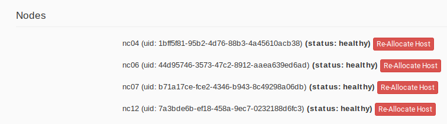

.. _reservation-cli:

Provisioning and Managing Resources Using the CLI
=================================================

The sections above present the most user friendly mode of usage, with most
actions performed via the GUI. However, Chameleon can be accessed via
the OpenStack command line tools which provides more capabilities. This section
presents some advanced usage using the command line tools.

.. tip::

   Reading :ref:`cli` is highly recommended before continuing on the following
   sections.

Blazar Client Installation
--------------------------

To reserve specific nodes, based on their identifier or their resource
specifications, you must use the `Blazar
<https://docs.openstack.org/blazar/latest/>`_ command line client. To use the
CLI, you must install the ``python-blazarclient``. To install
``python-blazarclient``, run the following command:

.. code-block:: bash

   pip install git+https://github.com/ChameleonCloud/python-blazarclient.git@chameleoncloud/xena

.. note::
   To reserve VLAN segments or floating IPs, you must use a Chameleon fork of
   the Blazar client, as above.

Before using *Blazar Client*, You must configure the environment variables for
your project via ``source`` :ref:`the OpenStack RC Script <cli-rc-script>` or
use the CLI switches every time you run the commands. Type ``blazar`` in your
terminal session to enter the *Interactive Mode*. You may also use ``blazar`` in
the *Shell Mode*.

Creating a Lease to Reserve Physical Hosts
------------------------------------------

To create a lease, use the ``lease-create`` command. The following arguments are
required:

- ``--reservation`` with the ``min``, ``max``, ``resource_type``, and ``resource_properties`` attributes
- ``--start-date`` in ``"YYYY-MM-DD HH:MM"`` format
- ``--end-date`` in ``"YYYY-MM-DD HH:MM"`` format
- A lease name

If ``--start-date`` is ommitted, then the current date and time will be used by default.

For example, the following command will create a lease with the name of
``my-first-lease`` and the node type of ``compute_skylake`` that starts on June
17th, 2022 at 4:00pm and ends on June 17th, 2022 at 6:00pm:

.. code-block:: bash

   openstack reservation lease create \
     --reservation min=1,max=1,resource_type=physical:host,resource_properties='["=", "$node_type", "compute_skylake"]' \
     --start-date "2022-06-17 16:00" \
     --end-date "2022-06-17 18:00" \
     my-first-lease

Instead of specifying the node type, you may also reserve a specific node by
providing it's *UUID*. For example, to reserve the node with *UUID* of
``c9f98cc9-25e9-424e-8a89-002989054ec2``, you may run the command similar to the
following:

.. code-block:: bash

   openstack reservation lease create \
     --reservation min=1,max=1,resource_type=physical:host,resource_properties='["=", "$uid", "c9f98cc9-25e9-424e-8a89-002989054ec2"]' \
     --start-date "2022-06-17 16:00" \
     --end-date "2022-06-17 18:00" \
     my-custom-lease

To create a lease with multiple resource properties, you must combine them like
``["and", [property1], [property2], [...] ]``. For example, to reserve a node
with *$architecture.smt_size* of *48* and *node_type* of *compute_haswell*:

.. code-block:: bash

   openstack reservation lease create \
     --reservation min=1,max=1,resource_type=physical:host,resource_properties='["and", ["=", "$architecture.smt_size", "48"], ["=", "$node_type", "compute_haswell"]]' \
     --start-date "2022-06-17 16:00" \
     --end-date "2022-06-17 18:00" \
     my-custom-lease

.. _disable-blazar-notification:
.. attention::

   To specify a ``before_end`` action, simply add ``before_end=<action_type>``
   to ``reservation`` parameter. For example:

   .. code-block:: bash

      openstack reservation lease create \
        --reservation min=1,max=1,resource_type=physical:host,resource_properties='["=", "$uid", "c9f98cc9-25e9-424e-8a89-002989054ec2"]',before_end=email \
        --start-date "2022-06-17 16:00" \
        --end-date "2022-06-17 18:00" \
        my-custom-lease

   Currently supported ``before_end`` action types include

   +-----------------+---------------------------------------------------------+
   | **Action Type** | **Description**                                         |
   +-----------------+---------------------------------------------------------+
   |  ``email``      | Send an email notification.                             |
   +-----------------+---------------------------------------------------------+
   | ``default``     | Default action used when no action is specified;        |
   |                 | Currently set to ``email``.                             |
   +-----------------+---------------------------------------------------------+
   |    ``''``       | Do nothing.                                             |
   +-----------------+---------------------------------------------------------+

   The default ``before_end`` action is set to ``email``. To disable the email
   notification, set ``before_end=''``.

Actually, you may use any resource property that is in the resource registry to
reserve the nodes. To see the list of properties of nodes, first get the full
list of nodes with the command:

.. code-block:: bash

   openstack reservation host list

The output should look like:

.. code-block:: text

   +------+--------------------------------------+-------+-----------+----------+
   | id   | hypervisor_hostname                  | vcpus | memory_mb | local_gb |
   +------+--------------------------------------+-------+-----------+----------+
   | 151  | 00401ba8-4fb0-4f1e-a7dc-e93065ebdd15 |    24 |    128000 |      200 |
   | 233  | 004c89fa-ff13-4563-9012-f2d62c1a7aff |    24 |    128000 |      200 |
   | 330  | 01029fb8-0a0b-4949-92b0-a756fb8588e5 |    24 |    128000 |      200 |
   | 146  | 036b16e3-9fa6-442c-8e6d-cfe12ed5c8a3 |    24 |    128000 |      200 |
   | 992  | 05dd5e25-440f-4492-b3b8-9d39af83b8bc |     8 |      3200 |      100 |
   | 219  | 066d92f5-7cb9-49ea-8f05-842566672ebf |    24 |    128000 |      200 |
   | 3216 | 06b164d5-3514-4ebe-8928-0bd2f9508b80 |     0 |         0 |        0 |
   | 156  | 07030786-d6e8-46b4-b0f2-79b0b303b518 |    24 |    128000 |      200 |
   | 212  | 07051549-c404-44af-8e73-8beb5891864a |    24 |    128000 |      200 |
   | 175  | 07fd65f0-b814-429b-a2fb-3a4afa52de41 |    24 |    128000 |      200 |
   | 255  | 081d2cb1-b6b5-4014-b226-7a42d8588307 |    24 |    128000 |      200 |

To get resource properties of a host, run ``host-show`` command with the ``id``
listed in the first column. For example, to get the resource properties of the
host 151,  run:

.. code-block:: bash

   openstack reservation host show 151

The output should look like:

.. code-block:: text

   +----------------------------------+---------------------------------------------+
   | Field                            | Value                                       |
   +----------------------------------+---------------------------------------------+
   | architecture.platform_type       | x86_64                                      |
   | architecture.smp_size            | 2                                           |
   | architecture.smt_size            | 48                                          |
   | bios.release_date                | 03/09/2022                                  |
   | bios.vendor                      | Dell Inc.                                   |
   | bios.version                     | 1.2                                         |
   | chassis.manufacturer             | Dell Inc.                                   |
   | chassis.name                     | PowerEdge R630                              |
   | chassis.serial                   | 4VJGD42                                     |
   | cpu_info                         | baremetal cpu                               |
   | created_at                       | 2022-06-26 20:50:58                         |
   | gpu.gpu                          | False                                       |
   | hypervisor_hostname              | 00401ba8-4fb0-4f1e-a7dc-e93065ebdd15        |
   | hypervisor_type                  | ironic                                      |
   | hypervisor_version               | 1                                           |
   | id                               | 151                                         |
   | uid                              | c9f98cc9-25e9-424e-8a89-002989054ec2        |
   | updated_at                       |                                             |
   | vcpus                            | 48                                          |
   | version                          | 78dbf26565cf24050718674dcf322331fab8ead5    |
   +----------------------------------+---------------------------------------------+

Any of the property listed in the field column may be used to reserve the nodes.
For example, you can use ``resource_properties='["=", "$architecture.smp_size",
"2"]'`` to reserve a node with two physical processors.

.. note:: Remember to use ``$`` in front of the property.

Extending a Lease
-----------------

To extend your lease, use ``lease-update`` command, and provide time duration
via ``--prolong-for`` switch. The format of the duration is a number followed by
a letter specifying the time unit. ``w`` is for weeks, ``d`` is for days and
``h`` is for hours. For example, if you would like to extend the
``my-first-lease`` by one day, run the following command:

.. code-block:: bash

   openstack reservation lease update --prolong-for "1d" my-first-lease

Chameleon Node Types
--------------------

The following node types are reservable on Chameleon.

+--------------------------+------------------------------------------------------------------------------+
| Node Type                | ``resource_properties='["=", "$node_type", "<Chameleon node type name>"]'``  |
+--------------------------+------------------------------------------------------------------------------+
| Skylake compute nodes    | ``compute_skylake``                                                          |
+--------------------------+------------------------------------------------------------------------------+
| Storage nodes            | ``storage``                                                                  |
+--------------------------+------------------------------------------------------------------------------+
| Haswell Infiniband nodes | ``compute_haswell_ib``                                                       |
+--------------------------+------------------------------------------------------------------------------+
| Storage Hierarchy nodes  | ``storage_hierarchy``                                                        |
+--------------------------+------------------------------------------------------------------------------+
| NVIDIA K80 nodes         | ``gpu_k80``                                                                  |
+--------------------------+------------------------------------------------------------------------------+
| NVIDIA M40 nodes         | ``gpu_m40``                                                                  |
+--------------------------+------------------------------------------------------------------------------+
| NVIDIA P100 nodes        | ``gpu_p100``                                                                 |
+--------------------------+------------------------------------------------------------------------------+
| NVIDIA P100 NVLink nodes | ``gpu_p100_nvlink``                                                          |
+--------------------------+------------------------------------------------------------------------------+
| NVIDIA RTX 6000 nodes    | ``gpu_rtx_6000``                                                             |
+--------------------------+------------------------------------------------------------------------------+
| FPGA nodes               | ``fpga``                                                                     |
+--------------------------+------------------------------------------------------------------------------+
| Low power Xeon nodes     | ``lowpower_xeon``                                                            |
+--------------------------+------------------------------------------------------------------------------+
| Atom nodes               | ``atom``                                                                     |
+--------------------------+------------------------------------------------------------------------------+
| ARM64 nodes              | ``arm64``                                                                    |
+--------------------------+------------------------------------------------------------------------------+

.. _reservation-cli-vlan:

Creating a Lease to Reserve a VLAN Segment
------------------------------------------

To create a lease, use the ``lease-create`` command. The following arguments are
required:

- ``--reservation`` with the ``resource_type`` and ``network_name`` attributes
- ``--start-date`` in ``"YYYY-MM-DD HH:MM"`` format
- ``--end-date`` in ``"YYYY-MM-DD HH:MM"`` format
- A lease name

Optional attributes include ``network_description`` and ``resource_properties``
which can both be added to the ``--reservation`` argument.

For example, the following command will create a lease with the name of
``my-first-vlan-lease`` and the network name ``my-network`` that starts on June
17th, 2022 at 4:00pm and ends on June 17th, 2022 at 6:00pm:

.. code-block:: bash

   openstack reservation lease create --reservation resource_type=network,network_name="my-network" --start-date "2022-06-17 16:00" --end-date "2022-06-17 18:00" my-first-vlan-lease

Adding the ``network_description`` attribute provides its value as the
description field when creating the Neutron network for advanced networking configurations.

.. code-block:: bash

   openstack reservation lease create --reservation resource_type=network,network_name="my-network",network_description="OFController=${OF_CONTROLLER_IP}:${OF_CONTROLLER_PORT}" --start-date "2022-06-17 16:00" --end-date "2022-06-17 18:00" my-first-vlan-lease

Adding the ``resource_properties`` attribute allows you to reserve a specific
*network segment* or *physical network* type. There are currently only two
physical network types ``physnet1`` and ``exogeni``. You can read more about
both types in :ref:`networking`. The following two examples show how to reserve
a network by ``segment_id`` or ``physical_network``.

.. code-block:: bash

   openstack reservation lease create --reservation resource_type=network,network_name=my-network,resource_properties='["==","$segment_id","3501"]' --start-date "2022-06-17 16:00" --end-date "2022-06-17 18:00" my-first-vlan-lease

.. code-block:: bash

   openstack reservation lease create --reservation resource_type=network,network_name=my-network,resource_properties='["==","$physical_network","physnet1"]' --start-date "2022-06-17 16:00" --end-date "2022-06-17 18:00" my-first-vlan-lease

While separate leases can be created to reserve nodes and VLAN segments, it is
also possible to combine multiple reservations within a single lease. The
following example creates a lease reserving one Skylake compute node and one
VLAN segment:

.. code-block:: bash

   openstack reservation lease create --reservation min=1,max=1,resource_type=physical:host,resource_properties='["=", "$node_type", "compute_skylake"]' --reservation resource_type=network,network_name="my-network" --start-date "2022-06-17 16:00" --end-date "2022-06-17 18:00" my-combined-lease

.. _reservation-cli-fip:

Creating a Lease to Reserve Floating IPs
----------------------------------------

To create a lease, use the ``lease-create`` command. The following arguments are required:

- ``--reservation`` with the ``resource_type`` and ``network_id`` attributes
- ``--start-date`` in ``"YYYY-MM-DD HH:MM"`` format
- ``--end-date`` in ``"YYYY-MM-DD HH:MM"`` format
- A lease name

Multiple floating IPs can be reserved using the ``amount`` attribute. If
ommitted, only one floating IP is reserved.

For example, the following command will create a lease with the name of
``my-first-fip-lease`` that starts on June 17th, 2022 at 4:00pm and ends on
June 17th, 2022 at 6:00pm and reserves three floating IPs:

.. code-block:: bash

   pip install python-openstackclient
   PUBLIC_NETWORK_ID=$(openstack network show public -c id -f value)
   openstack reservation lease create --reservation resource_type=virtual:floatingip,network_id=${PUBLIC_NETWORK_ID},amount=3 --start-date "2022-06-17 16:00" --end-date "2022-06-17 18:00" my-first-fip-lease

Reallocating a Node in Your Lease
---------------------------------

After creating your lease, you can view its details in the Horizon web
interface. On this page, at the bottom, you can see a list of nodes in your
lease. If you wish to reallocate one of the nodes in your lease, you can press
the red "Re-Allocate Host" button next to it.

   The nodes on the lease detail page.

You can also do the same on the command-line. Run the command that follows,
entering your lease ID and the node ID where appropriate.

.. code-block:: bash

    openstack reservation host reallocate --lease-id LEASE_ID NODE_ID

If you re-allocate a host because it is malfunctioning, please make sure to
report it to the `Help Desk <https://chameleoncloud.org/user/help/>`_ so that
we can fix it.

Creating a Lease for a Flavor (on KVM@TACC)
-------------------------------------------

Since KVM@TACC is virtualized, instead of creating a lease for a physical host,
you create a lease for a VM flavor. First, this requires finding what flavor you
wish to create an instance of. You can find the list of available flavors by
running the command:

.. code-block:: bash

   openstack flavor list

which should return something like:

.. code-block:: bash

   +--------------------------------------+---------------+--------+------+-----------+-------+-----------+
   | ID                                   | Name          |    RAM | Disk | Ephemeral | VCPUs | Is Public |
   +--------------------------------------+---------------+--------+------+-----------+-------+-----------+
   | 1                                    | m1.tiny       |    512 |    1 |         0 |     1 | True      |
   | 2                                    | m1.small      |   2048 |   20 |         0 |     1 | True      |
   | 3                                    | m1.medium     |   4096 |   40 |         0 |     2 | True      |
   | 4                                    | m1.large      |   8192 |   40 |         0 |     4 | True      |
   | 5                                    | m1.xlarge     |  16384 |   40 |         0 |     8 | True      |
   | 6                                    | m1.xxlarge    |  32768 |   40 |         0 |    16 | True      |
   | e81f12f8-de06-4107-acfd-e649217036ef | g1.h100.pci.1 | 250000 |   40 |         0 |    48 | True      |
   +--------------------------------------+---------------+--------+------+-----------+-------+-----------+

Note the ID of the flavor you wish to create a lease for. Then to create a lease,
use the ``lease-create`` command. The following arguments are
required:

- ``--reservation`` with ``resource_type=flavor:instance``, ``flavor_id`` and ``amount`` attributes
- ``--start-date`` in ``"YYYY-MM-DD HH:MM"`` format
- ``--end-date`` in ``"YYYY-MM-DD HH:MM"`` format

For example, the following command will create a lease with the name of
``my-first-lease`` for 2 ``m1.large`` instances that starts on June
17th, 2022 at 4:00pm and ends on June 17th, 2022 at 6:00pm:

.. code-block:: bash

   openstack reservation lease create \
     --reservation "resource_type=flavor:instance,flavor_id=4,amount=2" \
     --start-date "2022-06-17 16:00" \
     --end-date "2022-06-17 18:00" \
     my-first-lease
