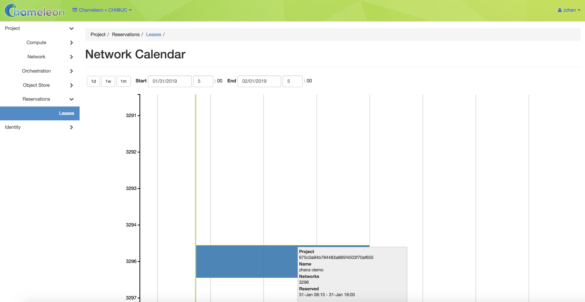
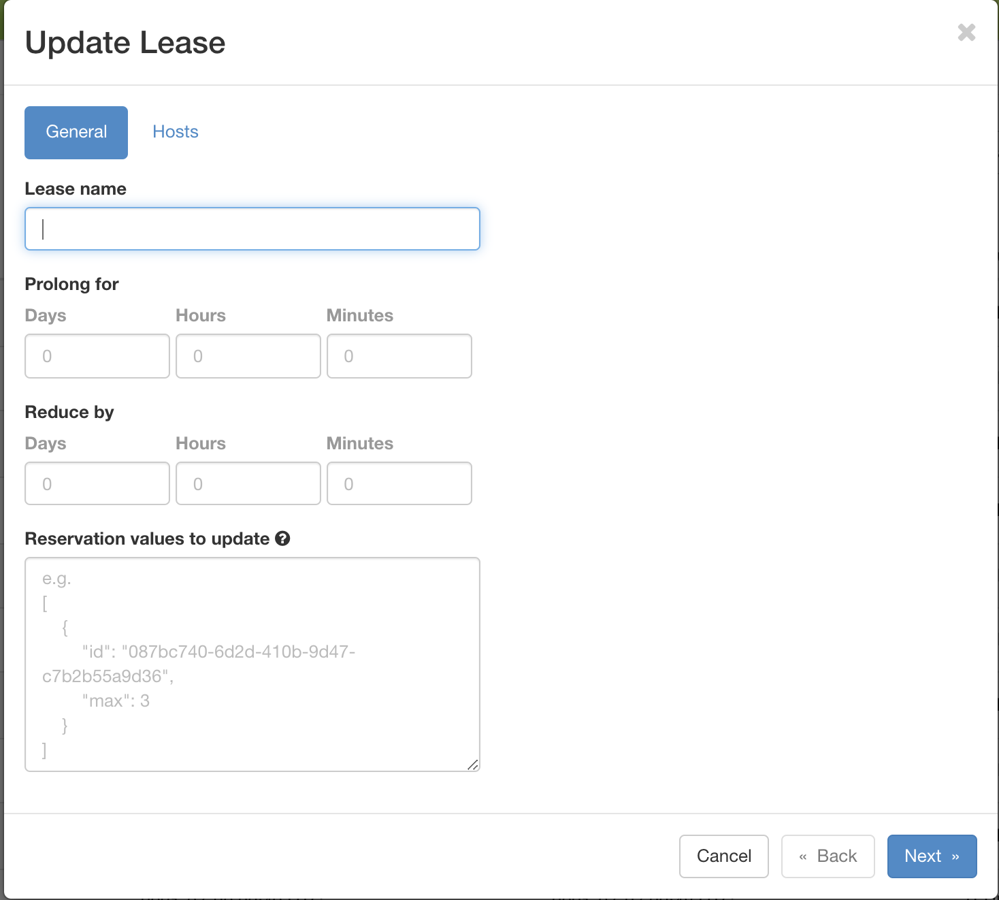

Provisioning and Managing Resources Using the GUI
=================================================

To make reservations of the resources, first log into the Horizon GUI
- either |CHI@TACC| or |CHI@UC|. Then, choose a project and configure your local
timezone. For details on how to choose a project and update personalized
settings, see :ref:`gui`.

In the navigation sidebar, go to the *Reservations* section and click *Leases*.

.. figure:: reservations/leasespage.png
   :alt: The Leases page in the GUI

   The Leases page in the GUI

.. _the-lease-calendars:

The Lease Calendars
-------------------

To discover when resources are available, You can access the lease calendars by
clicking on the *Host Calendar* button for physical hosts and clicking on the
*Network Calendar* button for VLANs. This will display a Gantt chart of the
reservations which allows you to find when resources are available. The *Y* axis
represents the different physical nodes in the system and the *X* axis
represents time.

.. figure:: reservations/hostcalendar.png
   :alt: The Host Calendar

   The Host Calendar

.. tip::
   Education projects may require "sub-leases" to facillitate student access to a
   node during a project, while keeping that node available to the project. This
   ensures that resources required for a class are not unavailable before a deadline.
   If this is required for your usage, we can temporarily grant exclusive access to
   a node to your project. Create a lease for the node, and contact the |Help Desk|
   to request exclusive node access for your project.

   The Network Calendar

.. tip::

   The nodes and VLANs are identified by their *UUIDs*. The colors are used to
   indicate different reservations, i.e. the resources that belong to the same
   reservation are colored the same. Hovering over the chart provides the
   details about the reservation. To change the display time frame, click on
   ``1d``, ``1w``, and ``1m`` buttons or fill in the start and end times.

.. _reservations-create-lease-gui:

Creating a Lease to Reserve Resources
-------------------------------------

Once you have chosen a time period when you want to reserve resources, go back
to the *Leases* screen and click on the *Create Lease* button. It should bring
up the window displayed below:

   The Create Lease dialog

#. Pick a name for the lease. The name needs to be unique across your project.

#. Pick a start time and lease duration in days. If you would like to start your
   lease as soon as possible, you may leave the start time blank and Chameleon
   will attempt to reserve your nodes to begin immediately with a default Lease
   duration of 1 day.

   .. note::

      If you have not selected a timezone earlier, the default timezone is
      **UTC**. Therefore, the date must be entered in **UTC**!

   .. tip:: You can get the UTC time by running ``date -u`` in your terminal.

#. To reserve a bare metal node, navigate to the "Hosts" tab.

	.. figure:: reservations/nodereservationdialog.png
	   :alt: The Create Lease dialog Host reservation tab

	   The Create Lease dialog Host reservation tab

    a. Check "Reserve Hosts".

    b. Choose the minimum and maximum number of hosts.

    c. Choose a node type in the drop down menu below the *node_type* and *=* drop down lists.

       .. note::

          You may only request one type of node in each individual lease. If you
          wish to request multiple node types, you must create separate Leases for
          each node type.

       .. warning::

          You must select = when matching the node_type to a specific selection.
          Using other operators like >= may yield unexpected results.

#. To reserve a vlan segment, navigate to the "Networks" tab.

	.. figure:: reservations/networkreservationdialog.png
	   :alt: The Create Lease dialog Network reservation tab

	   The Create Lease dialog Network reservation tab

    a. Check "Reserve Network"

    b. Enter the network name and description

        .. note::

           When a VLAN segment reservation ends, all Neutron resources attached to
           the network will be automatically deleted. Bare metal instances using the
           network will lose network connectivity.

        .. tip::

           Network name is required when reserving VLAN segment.

#. To reserve floating IPs, navigate to the "Networks" tab.

    a. Check "Reserve Floating IPs".
    b. Choose the number of floating IPs.

#. Click on the *Create* button.

Once created, the lease details will be displayed. At the bottom of the page are
the details about the reservation. Initially the reservation is in the
``Pending`` status, and stays in this state until it reaches the start time.

    .. tip::

       If you want Blazar to launch an instances or complex appliance as soon as
       the lease starts, read the ``Advanced Reservation Orchestration`` section
       our :ref:`complex` documentation.

.. figure:: reservations/leasedetails.png
   :alt: Lease details page

   Lease details page

Once the start time of the lease is reached, the lease will be started and its
reservation will change to ``Active``; you may need to refresh the page to see
the updates.

.. tip::

   The lease is identified by a *UUID*. You may find it useful when using the
   CLI or submitting tickets on our |Help Desk|.

.. role:: redbold

.. _lease-policy:

.. attention::

   To ensure fairness to all users, resource reservations (leases) are limited
   to a duration of :redbold:`7 days`. However, an active lease within
   :redbold:`48 hours` of its end time can be prolonged by :redbold:`up to 7
   days` from the moment of request if resources are available.

   Chameleon will send an email reminder to you 48 hours before your lease ends.
   If your lease duration is less than 48 hours, Chameleon will send you an
   email right after your lease is created. You can :ref:`disable the email
   notification by using the command line <disable-blazar-notification>`.

Extending a Lease
-----------------

To prolong a lease, click on the *Update Lease* button in *Actions* column.

   The Update Lease Parameters dialog

Fill out the form by specifying the amount of additional time to add to the
lease. Then, click on the *Update* button to finish your request.

.. tip::

   If there is an advance reservation blocking your lease prolongation that
   could potentially be moved, you can interact through the users mailing list
   to coordinate with others users. Additionally, if you know from the start
   that your lease will require longer than a week and can justify it, you can
   submit a ticket on our |Help Desk| to request a **one-time exception** of
   creating a longer lease. You may also other exceptions to our other policies,
   such as idle lease termination, by submitting a request.

Changing the Number of Nodes of a Lease
^^^^^^^^^^^^^^^^^^^^^^^^^^^^^^^^^^^^^^^

It is now possible to change the number of nodes reserved in a lease. For
advance reservations that haven't yet started, the node count can be increased
or decreased. For reservations already started, only new nodes can be added.

To change the number of nodes of a lease, click on the *Update Lease* button in
*Actions* column.

.. figure:: reservations/updateleasenodecount.png
   :alt: The Update Lease Parameters dialog, changing the number of reserved nodes

   The Update Lease Parameters dialog, changing the number of reserved nodes

Navigate to the "Hosts" tab,  and fill out the form by specifying the new minimum
and maximum numbers of hosts. Then, click on the *Update* button to finish your request.

Changing the Number of Floating IPs in a Lease
^^^^^^^^^^^^^^^^^^^^^^^^^^^^^^^^^^^^^^^^^^^^^^

It is possible to change the number of floating IPs in a lease, whether the
lease is pending or active. In some situations, you cannot renew a lease due to
another user reserving the same floating IP in your lease. In this case, you
can set your lease to have 0 floating IPs, and create a second lease just for
reserving floating IPs.

To change the number of floating IPs, click on the *Update Lease* button in
*Actions* column.

.. figure:: reservations/updateleasefloatingipcount.png
   :alt: The Update Lease Parameters dialog, changing the number of reserved IPs

   The Update Lease Parameters dialog, changing the number of reserved IPs

Navigate to the "Floating IPs" tab,  and fill out the form by specifying the
amount of floating IPs. Then, click on the *Update* button to finish your request.

Reserving a Node by UUID
------------------------

You may reserve a specific node by providing its *UUID*. To learn more about how
to find a node with a specific type, see :ref:`resource-discovery`. In
the *Create Lease* dialog, select *uid* in the *Resource Type* dropdown. Then,
choose the *UUID* of the node you would like to reserve.

.. figure:: reservations/uid.png
   :alt: Selecting a node by UUID

   Selecting a node by UUID

.. _reservations-extend-lease-gui: