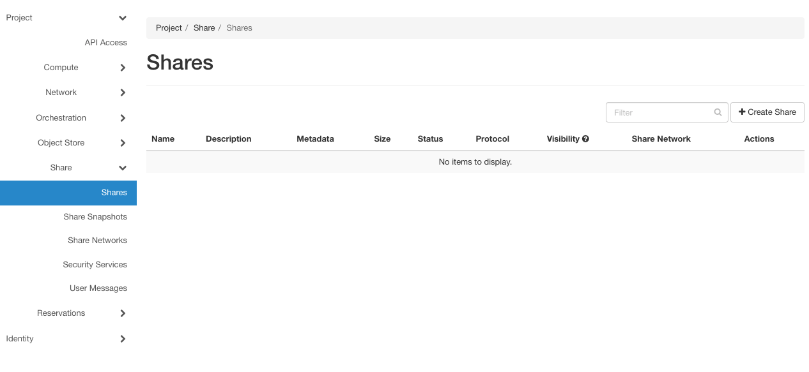
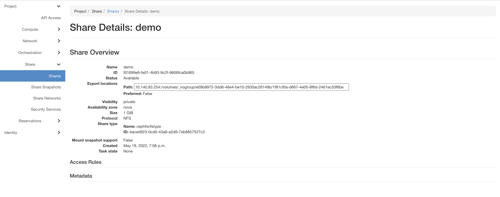
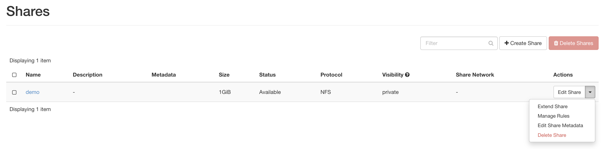

Managing Shares using GUI
=========================

To manage your share, use the `Shares` page at `CHI@UC <https://chi.uc.chameleoncloud.org/>`_ or `CHI@TACC <https://chi.tacc.chameleoncloud.org/>`_
by navigating to `Project > Share > Shares`.

    The Shares page

Create Share
------------

Click the `Create Share` button. In the `Create Share` dialog, provide a name and the size of your share, and then click the `Create` button to
create a share.

.. figure:: createshare.png
    :alt: The Create Share dialog

    The Create Share dialog

.. note::

  A storage network is not required for creating shares. It's only required to access the shares.

.. _view-share-gui:

View Share
----------

You can look at the details of a share by clicking the share name in the `Shares` page. Note that the paths of the `export locations` are important
as you will use this path to mount your share to your bare metal instances. You can also see the other properties, such as visibility and size.
The access rules are listed in the `share details` page, though you can not edit the rules, as they are controlled by the reservation service.

    The Share details
    
Edit Share
----------
You can manage the properties and extend the size of a share by clicking the `Action` dropdown in the `Shares` page. 

    The Action dropdown

Delete Share
------------
You can use the `Action` dropdown to delete a single share, or select multiple shares and click the `Delete Shares` button. 

.. important::

  Be careful when deleting shares, as the action is irreversible. However, the termination of your storage network reservation **DOES NOT** delete your share.
  Your shares persist until you manually delete them.