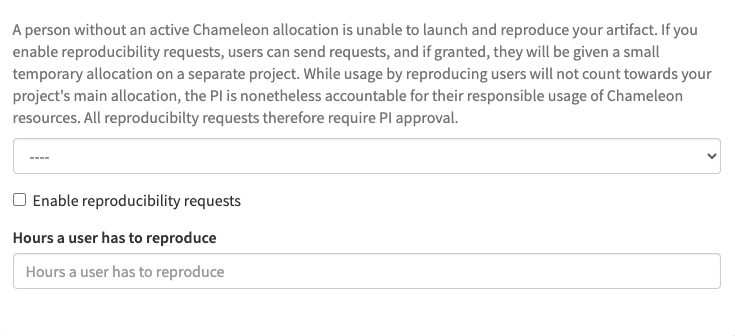
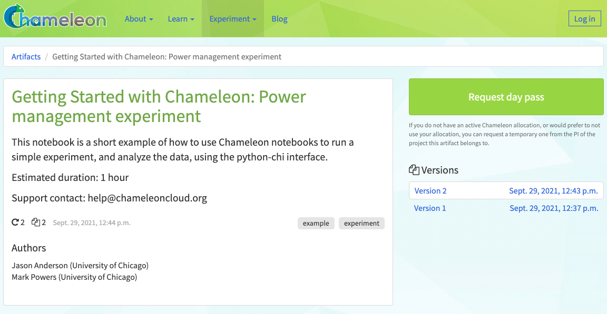

.. _trovi:

====================
Trovi sharing portal
====================

`Chameleon Trovi <https://www.chameleoncloud.org/experiment/share>`_ is a
sharing portal that allows you to share digital research and education
artifacts, such as packaged experiments, workshop tutorials, or class materials.
Each research artifact is represented as a deposition (a remotely accessible
folder) where a user can put Jupyter notebooks, links to images, orchestration
templates, data, software, and other digital representations that together
represent a focused contribution that can be run on Chameleon. Users can use
these artifacts to recreate and rerun experiments or class exercises on a
Jupyter Notebook within Chameleon. They can also create their own artifacts and
publish them directly to Trovi from within :ref:`Chameleon's Jupyter server
<jupyter>`.

To get started, find the "Trovi" dropdown option under the "Experiment" section
of chameleoncloud.org. Once you're on the Trovi homepage, you'll see a list of
publicly available experiments and other digital artifacts. You can now browse
those artifacts or upload your own.

.. figure:: sharing/sharing_dropdown.png
   :alt: Location of Trovi in the UI.
   :figclass: screenshot

   The "Trovi" option under the "Experiment" section takes you to Trovi.

Browsing artifacts
==================

Trovi allows you to browse artifacts, presented in a scrolling list format. On
the right hand side, there are multiple filtering options. By clicking on the
project name, you can see all the artifacts that belong to that project. The
"All" choice shows you all of the artifacts you have access to. You can also see
how many times people have downloaded and launched your notebook with the icons
in the bottom left corner of an artifact.

.. note::

   Some Trovi artifacts are supported by the Chameleon team and are denoted
   with a small Chameleon logo. You can contact the |Help Desk| if you are
   using these artifacts and encounter issues.

Launching an artifact
---------------------

The most powerful feature available via Trovi is the ability to re-launch the
available artifacts within Chameleon. Clicking "Launch with JupyterHub" will
open a new Jupyter Notebook server with the artifacts downloaded (we support
artifacts up to 500MB in total size, please contact the |Help Desk| if you need
more space). The animation below shows how easy it is:

.. figure:: sharing/sharing_launching.gif
   :alt: Animation of clicking launch button.
   :figclass: screenshot

   Clicking the "Launch with JupyterHub" button to import a Trovi artifact into
   your own Jupyter server.

Packaging shared artifacts
==========================

You can publish new artifacts to Trovi either from your primary Jupyter server
or by editing a previously-shared artifact. In the latter case, you are
effectively creating a new "forked" artifact owned by you.

When you've finished creating or making changes to an experiment, in the Jupyter
interface, select the directory (not a single file) you wish to package. Then,
click on the "Share" tab and select "Package as a new artifact". Your artifact
is now packaged and uploaded to Chameleon file storage, and you'll be prompted
to fill out descriptions about the artifact. Don't worry if you want to change
this later---you will be able to :ref:`edit them on the Trovi portal or within
Jupyter <trovi-edit>`.

Congratulations! Your artifact is now uploaded to Trovi---but to make it
accessible to others you need to :ref:`adjust its sharing settings
<trovi-sharing>`.

.. figure:: sharing/sharing_packaging.gif
   :alt: Animation of packaging a new artifact from Jupyter.
   :figclass: screenshot

.. _trovi-new-version:

Saving new versions
-------------------

If you make changes to your artifact, you can submit an updated version. Within
Jupyter, you navigate to the "Sharing" tab, but this time you click "Create new
artifact version". The different versions are viewable on the Trovi portal
after clicking on the artifact.

.. figure:: sharing/sharing_new_version.gif
   :alt: Animation of uploading a new artifact version from Jupyter.
   :figclass: screenshot

.. _trovi-edit:

Editing artifacts
-----------------

You can edit an artifact's metadata, including its title, description, and list
of authors at any time via the Jupyter interface.

.. figure:: sharing/sharing_edit_meta.gif
   :alt: Animation of editing an artifact's metadata.
   :figclass: screenshot

This edit view is also available from Trovi via the "Edit" button.

.. _trovi-sharing:

Adjusting sharing settings
--------------------------

When you first upload your packaged artifact to Trovi, its visibility is set as
private, meaning only you can see or launch it. There are multiple options to
change the visibility of the artifact, and you have the option to decide how
visible you want it to be.

1. **Publish with DOI**: this option allows you to :ref:`publish a version of your
   artifact to Zenodo <trovi-zenodo>` and receive a DOI, which you can use to
   cite your artifact in, e.g., an academic paper.
2. **Publish without DOI**: this option allows any Chameleon user to find and
   launch your artifact. It can be useful if you want to distribute the artifact
   widely but do not necessarily with to publish it to Zenodo and get a DOI
   for citation.
3. **Share via private link**: this option allows you to share the experiment to
   select people, like individual colleagues, advisors, or students. Anybody in
   possession of the link can view and launch any version of the artifact.
4. **Share with projects**: this option allows you to share the experiment with
   members of a Chameleon Project. You can also share amongst multiple projects.

To make your artifact shareable follow the actions shown in the animation below:
first select how your want to share and then your sharing destination.

.. _trovi-zenodo:

Publishing to Zenodo
^^^^^^^^^^^^^^^^^^^^

Trovi is intended for sharing work in progress with a limited group of "friends
and family". However, once you complete your experiment package you may want to
publish it so that you can reference it from your paper. To do that Chameleon
supports integration with Zenodo, an open-access storage repository backed by
CERN, for permanent artifact hosting. To share your artifact and store it on
Zenodo, go to the "Share" page for the artifact. On the right-hand side you'll
see a list of all versions you've saved. Pick the version you want to publish to
Zenodo and check "Request DOI", then click "Save."

.. important::

   Once published, **Zenodo artifacts cannot be deleted** and are additionally
   **publicly available**. Your artifact will appear in Trovi in the "Public"
   section, and any Chameleon user can access it, as can anybody on the
   Internet via Zenodo's own listing.

   If you wish to make your artifact public but don't to publish it, use the
   "Publish without DOI" option. With this option it is possible to make the
   artifact private later on if you wish; this is not possible when publishing
   to Zenodo.

This also creates a DOI, which you can easily include in your
paper. The artifacts shared on Zenodo also appear on Trovi.

.. _sharing-day-passes:

Using Day Passes
================
Normally, only Chameleon users with active allocations are able to launch and
view Trovi artifacts. To allow anyone to launch an artifact, we also provide
day passes. This allows for a non-Chameleon user to have access to Chameleon
for a limited amount of time, using a small, separate allocation tied to your
allocation. People interested in reproducing your project will send requests
to the managers of a project. If approved, the requesting user will recieve an
email invitation to join the reproducibility project. When they accept, they
can use this project to run your artifact. After the specified time limit,
they will be automatically removed from this project.

.. _sharing-enable-day-pass:

Allowing Reproducibility Requests
---------------------------------

First, the owner of an artifact must permit reproducibility requests. This can
be revoked at any time, preventing future requests. Additionally, you must also
give your artifact a value for "Hours a user has to reproduce." This value
specifies how long a user will have access to Chameleon for. The artifact
owner must also assign their artifact to a project via the dropdown selector.
As these requests are granting access to Chameleon resources, this is needed
to tie granted requests to a PI.

These fields can be accessed by navigating to an artifact's detail page, and
then selecting "Share." At the bottom of the share page, you will see the
below forms, which are the project assignment, the enabling of reproducibility
requests, and the hours to reproduce.

After these items are saved, an allocation request is automatically made. Your
artifact should now appear with a "Request Day Pass" button below the "Launch"
button. The "Launch" button will not appear for users that are not a member
in an active Chameleon project.

Requesting a Day Pass
^^^^^^^^^^^^^^^^^^^^^

When you select "Request Day Pass", you will be taken a form where you are asked
to submit your name, institution, and a reason why you want to
reproduce the artifact. The goal of this form is to explain to the PI why you
are interested in reproducing the artifact, as the PI is still responsible
for overseeing the proper use of Chameleon resources, and the PI may be a
stranger to you.

After submitting the form, the managers (and PI) of the project associated with
the artifact will receive an email informing them of the request.

Reviewing a Day Pass Request
^^^^^^^^^^^^^^^^^^^^^^^^^^^^

After recieving an email with the day pass request, PIs and project managers
can navigate to the review page by clicking the link in the email. Here, they
will see all of the details submitted with the request. A decision can be made
by choosing "approved" or "rejected" in the selector, and then clicking submit.

.. figure:: sharing/review_day_pass_request.png
   :alt: An image showing the "Review Day Pass" screen
   :figclass: screenshot

After this decision is made, an email is sent to the requestor with the result.
If the request is approved, an invitation is sent to the user.

Using an Invitation
^^^^^^^^^^^^^^^^^^^

If your day pass request is approved, an email will be sent to you with an
invite link. After clicking this link, you will be automatically added to the
project. The email will also mention how long the invitation is for. When the
invite is accepted, you will be taken to the project page for the
reproducibility project. Please note the ID of the project (CHI-XXXXX), which
may be needed to configure an artifact.

Next, you can navigate back to the original artifact URL you were given. The
"Launch" button can be used now to start running the artifact.

After the duration for the invite has passed, you will be automatically removed
from the project.
