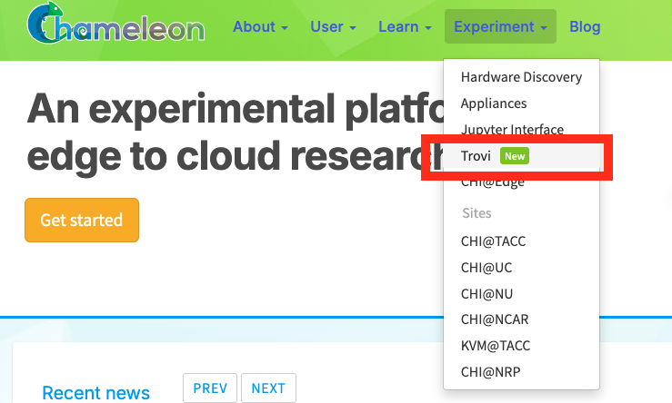
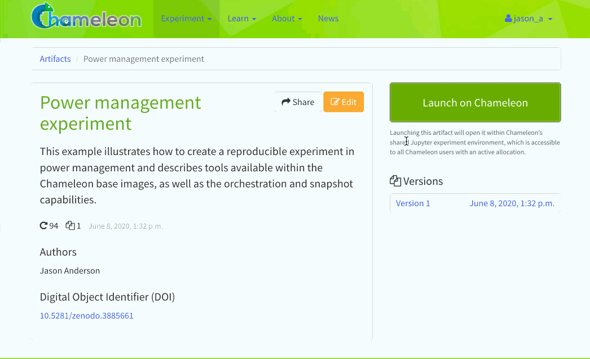
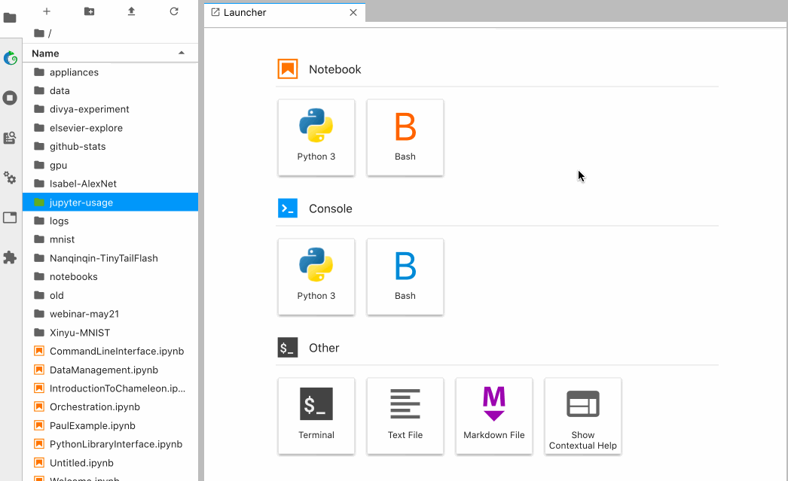

.. _trovi:

====================
Trovi sharing portal
====================

`Chameleon Trovi <https://www.chameleoncloud.org/experiment/share>`_ is a
sharing portal that allows you to share digital research and education
artifacts, such as packaged experiments, workshop tutorials, or class materials.
Each research artifact is represented as a deposition (a remotely accessible
folder) where a user can put Jupyter notebooks, links to images, orchestration
templates, data, software, and other digital representations that together
represent a focused contribution that can be run on Chameleon. Users can use
these artifacts to recreate and rerun experiments or class exercises on a
Jupyter Notebook within Chameleon. They can also create their own artifacts and
publish them directly to Trovi from within :ref:`Chameleon's Jupyter server
<jupyter>`.

To get started, find the "Trovi" dropdown option under the "Experiment" section
of chameleoncloud.org. Once you're on the Trovi homepage, you'll see a list of
publicly available experiments and other digital artifacts. You can now browse
those artifacts or upload your own.

   The "Trovi" option under the "Experiment" section takes you to Trovi.

Browsing artifacts
==================

Trovi allows you to browse artifacts, presented in a scrolling list format. On
the right hand side, there are multiple filtering options. The
"All" choice shows you all of the artifacts you have access to. You can also see
how many times people have downloaded and launched your notebook with the icons
in the bottom left corner of an artifact.

.. note::

   Some Trovi artifacts are supported by the Chameleon team and are denoted
   with a small Chameleon logo. You can contact the |Help Desk| if you are
   using these artifacts and encounter issues.

Launching an artifact
---------------------

The most powerful feature available via Trovi is the ability to re-launch the
available artifacts within Chameleon. Clicking "Launch with JupyterHub" will
open a new Jupyter Notebook server with the artifacts downloaded (we support
artifacts up to 500MB in total size, please contact the |Help Desk| if you need
more space). The animation below shows how easy it is:

   Clicking the "Launch with JupyterHub" button to import a Trovi artifact into
   your own Jupyter server.

Packaging shared artifacts
==========================

You can publish new artifacts to Trovi either from your primary Jupyter server
or by editing a previously-shared artifact. In the latter case, you are
effectively creating a new "forked" artifact owned by you.

When you've finished creating or making changes to an experiment, in the Jupyter
interface, select the directory (not a single file) you wish to package. Then,
click on the "Share" tab and select "Package as a new artifact". Your artifact
is now packaged and uploaded to Chameleon file storage, and you'll be prompted
to fill out descriptions about the artifact. Don't worry if you want to change
this later---you will be able to :ref:`edit them on the Trovi portal or within
Jupyter <trovi-edit>`.

Congratulations! Your artifact is now uploaded to Trovi---but to make it
accessible to others you need to :ref:`adjust its sharing settings
<trovi-sharing>`.

.. figure:: sharing/sharing_packaging.gif
   :alt: Animation of packaging a new artifact from Jupyter.
   :figclass: screenshot

.. _trovi-new-version:

Saving new versions
-------------------

If you make changes to your artifact, you can submit an updated version. Within
Jupyter, you navigate to the "Sharing" tab, but this time you click "Create new
artifact version". The different versions are viewable on the Trovi portal
after clicking on the artifact.

.. _trovi-edit:

Editing artifacts
-----------------

You can edit an artifact's metadata, including its title, description, and list
of authors at any time via the Jupyter interface. To delete single artifact
versions, click the "trashcan" icon next to it in the edit view. To delete the
entire artifact, click the red "Delete All" button. 

.. note::
   Any artifacts published to :ref:`Zenodo <trovi-zenodo>` cannot be deleted.

This edit view is also available from Trovi via the "Edit" button.

.. _create-git-version:

Creating a version from Git
^^^^^^^^^^^^^^^^^^^^^^^^^^^

Under an artifact's edit settings, you will also see a button for creating a
new version from Git. This will allow you to enter a Git URL, the same one used
to clone your repository, and also a reference (lease as HEAD for the latest
commit). When a user launches your artifact, their notebook will checkout the
specified commit.

.. _trovi-sharing:

Adjusting sharing settings
--------------------------

When you first upload your packaged artifact to Trovi, its visibility is set as
private, meaning only you can see or launch it. There are multiple options to
change the visibility of the artifact, and you have the option to decide how
visible you want it to be.

1. **Publish with DOI**: this option allows you to :ref:`publish a version of your
   artifact to Zenodo <trovi-zenodo>` and receive a DOI, which you can use to
   cite your artifact in, e.g., an academic paper.
2. **Publish without DOI**: this option allows any Chameleon user to find and
   launch your artifact. It can be useful if you want to distribute the artifact
   widely but do not necessarily with to publish it to Zenodo and get a DOI
   for citation.
3. **Share via private link**: this option allows you to share the experiment to
   select people, like individual colleagues, advisors, or students. Anybody in
   possession of the link can view and launch any version of the artifact.

To make your artifact shareable, select it in Trovi, click "Share", and check the box before "Enable all users to find and share".

.. _trovi-zenodo:

Publishing to Zenodo
^^^^^^^^^^^^^^^^^^^^

Trovi is intended for sharing work in progress with a limited group of "friends
and family". However, once you complete your experiment package you may want to
publish it so that you can reference it from your paper. To do that Chameleon
supports integration with Zenodo, an open-access storage repository backed by
CERN, for permanent artifact hosting. To share your artifact and store it on
Zenodo, go to the "Share" page for the artifact. On the right-hand side you'll
see a list of all versions you've saved. Pick the version you want to publish to
Zenodo and check "Request DOI", then click "Save."

.. important::

   Once published, **Zenodo artifacts cannot be deleted** and are additionally
   **publicly available**. Your artifact will appear in Trovi in the "Public"
   section, and any Chameleon user can access it, as can anybody on the
   Internet via Zenodo's own listing.

   If you wish to make your artifact public but don't to publish it, use the
   "Publish without DOI" option. With this option it is possible to make the
   artifact private later on if you wish; this is not possible when publishing
   to Zenodo.

This also creates a DOI, which you can easily include in your
paper. The artifacts shared on Zenodo also appear on Trovi.

Importing an artifact
---------------------

Instead of creating an artifact inside Jupyterhub, you can package an existing
Git repository into an artifact. When a user launches the artifact, the
contents of the repository will be added to a Jupyter notebook.

To create an artifact, click "Import Artifact" on the sidebar of Trovi. You are
first asked for the artifact's metadata. At the bottom of the form, there is
a button for "Import from Git." After clicking this, you will need to enter a
git remote URL, and choose which commit to tie the version to.

To update the artifact, you must create a :ref:`new version <create-git-version>`.
This ensures that a given version of your artifact always has the same contents.

Exporting via git
-----------------

If you wish to move your code and notebooks outside of your Jupyter notebook,
one option is to export it into a git repository.

#. Click the "+" button on the top left of your notebook, and choose "Terminal".

#. Run the command ``cd work``. If there is a specific directory you wish to
   export, you can ``cd`` again into it.

#. Follow the instructions to set up a repository per your git host. For GitHub
   see `this document <https://docs.github.com/en/get-started/importing-your-projects-to-github/importing-source-code-to-github/adding-locally-hosted-code-to-github>`_.

#. After the repository is setup, you should be able to commit and push with
   the git CLI.
