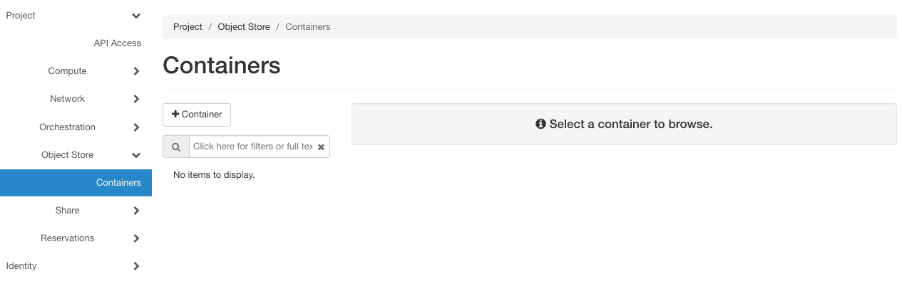
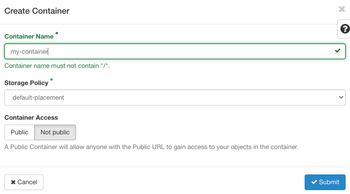
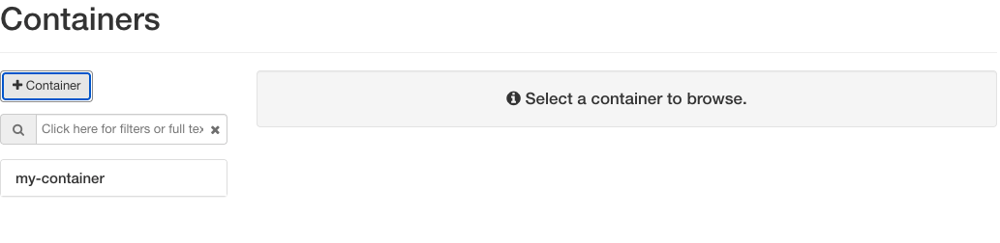
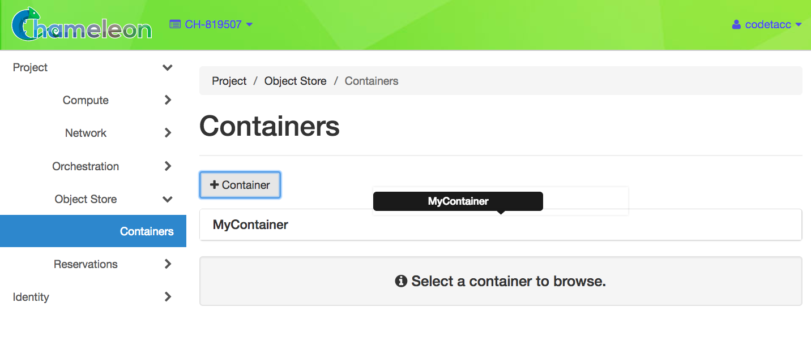
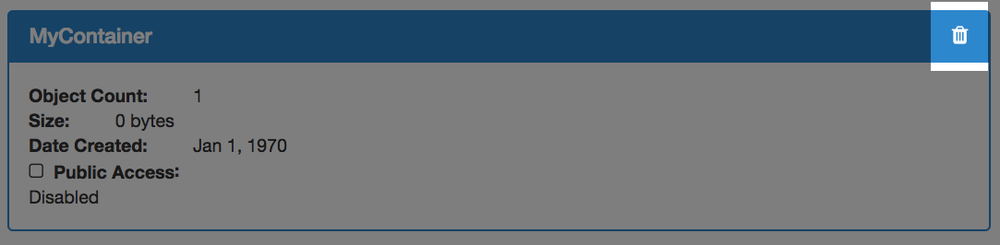
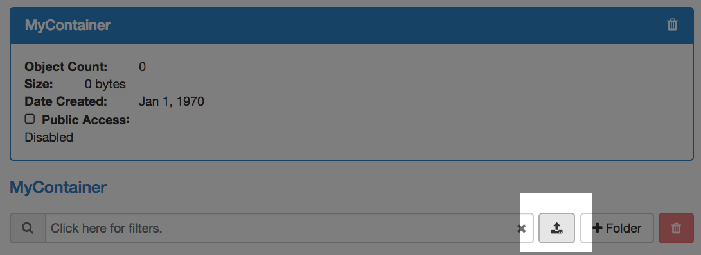
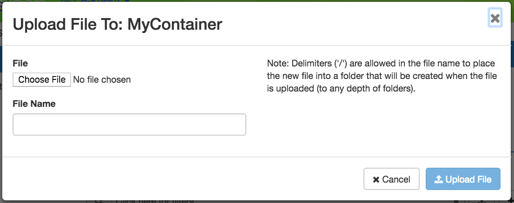
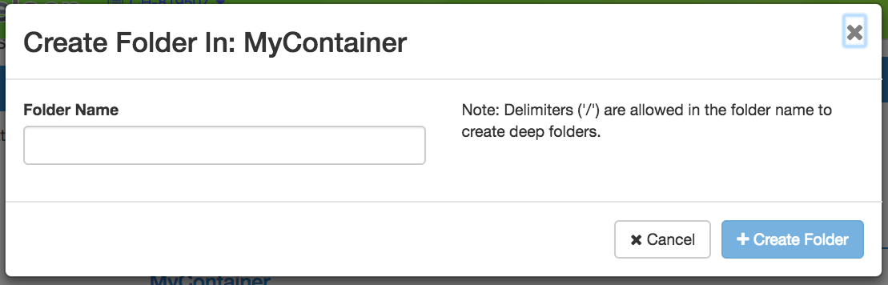
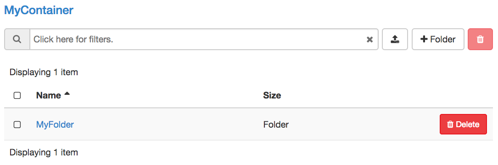
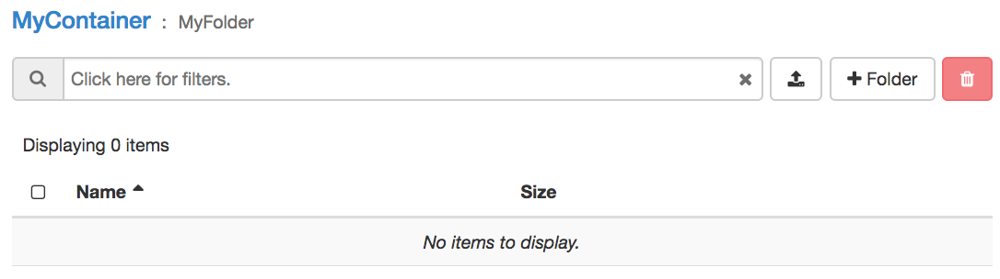

.. _object-store:

============
Object Store
============

Chameleon provides an object store service through the `OpenStack Swift
<https://docs.openstack.org/swift/latest/>`_ interface. It is intended to be
used for storing and retrieving data used during experiments, such as input
files needed for your applications, or results produced by your experiments.

.. hint::
   Chameleon object store service is currently backed by a `Ceph
   <https://ceph.com/>`_ cluster with more than 2.1 PB of capacity. The data is
   replicated, keeping two copies of each object, effectively providing over 1
   PB of storage available to users. This storage capacity will increase as the
   project goes on. The replication should provide good availability in case of
   hardware failures. However, all copies are kept within the same data center
   and are not backed up on a separate system; if you feel that this does not
   provide sufficient reliability in your case, you should consider backing up
   really critical data externally.

Availability
============

You can access the *Object Store* from instances running on |CHI@TACC| and
|CHI@UC|. Each region has its own store, meaning that objects uploaded to one
are not visible to the other. In general you should use the store local to the
region where your instances are running for the best performance.  To make it
easier for you to use the *Object Store* client, we installed it in all
appliances supported by Chameleon. Additionally, you can also access the *Object
Store* from the |CHI@TACC| or |CHI@UC| web interfaces under the *Object Store*
panel.

.. hint::
   `KVM\@TACC <https://kvm.tacc.chameleoncloud.org>`_ users can access the TACC
   store by using their |CHI@TACC| :ref:`OpenStack RC file <cli-rc-script>`.

Objects and Containers
======================

*Objects* are equivalent to individual files. They are stored in *Containers*,
which are data structures that can contain multiple *Objects*. When uploading
*Objects*, they must be stored inside of *Containers*. You may perform
operations on individual *Objects* inside Containers, such as downloading or
deleting them. You may also work with entire *Containers* and perform operations
such as downloading an entire *Container*.

Managing Object Store using the GUI
===================================

To access the *Object Store* using the GUI at |CHI@TACC| or |CHI@UC|, use the
navigation sidebar to go to *Project* > *Object Store* > *Containers*.

   The Containers page

Working with Containers
-----------------------

To create a container, click the *+Container* button. This will open the *Create
Container* dialog.

   The Create Container dialog

Choose a unique name of your container and set the visibility to either *Public*
or *Not Public*. When you are finished, click the *Submit* button. You will see
your new *Container* appear in the list on the *Containers* page.

   The Container list

You may click on a *Container* to see the details and work with *Objects* belong
to it.

   Container details

.. attention::
   Downloading a container is not available from the GUI. Use the CLI to
   download containers.

You may delete a container by clicking the *Delete* icon in the upper right of
the *Container Detail Panel*.

   The Delete Container button

Working with Objects
--------------------

To upload a local file to a container, click the button with the *Upload* symbol
next to the search bar.

   The Upload button

This will open the *Upload File* dialog.

   The Upload File dialog

Choose a file to upload from your local file system and give a name to the
object.

Working with Folders
--------------------

If you wish to create a *Folder* within your *Container*, click the *+Folder*
button and give a name to your folder in the *Create Folder* dialog.

   The Create Folder dialog

Your new folder will appear in the *Container details*.

   A Container with a Folder

You may browse your folder and upload files to it by clicking on the folder.

   A Folder within the Container

.. _object-store-cli:

Managing Object Store using the CLI
====================================

.. tip::
   Reading :ref:`cli` is highly recommanded before continuing on the following
   sections.

In addition to :ref:`cli-installing`, you must also install
``python-swiftclient`` package:

.. code-block:: bash

   pip install python-swiftclient

Then, you must set environment variables for your account and project using
:ref:`cli-rc-script`.

Working with Containers
-----------------------

To create a *Container*, use the following command:

.. code-block:: bash

   openstack container create <container_name>

.. tip::
   By default, the *Container* created using the above command will not be
   visible to the public.

To view all containers that belong to your project, run:

.. code-block:: bash

   openstack container list

.. tip::
   You may use ``--prefix <prefix>`` as a filter to list the containers whose
   name starts with ``<prefix>``.

To see details of a container, use the command:

.. code-block:: bash

   openstack container show <container_name>

To view a list of objects within a container, use the command:

.. code-block:: bash

   openstack object list <container_name>

To download a container with all the objects belong to it, use the following
command:

.. code-block:: bash

   openstack container save <container_name>

To delete a container and wipe out all the objects belong to it, use the
following command, and **be careful**!

.. code-block:: bash

   openstack container delete --recursive <container_name>

Working with Objects
--------------------

You may upload a file from your local machine to a container using the following
command:

.. code-block:: bash

   openstack object create <container_name> <local_filename>

.. tip::
   Optionally, you may name the object differently from it's original name in
   your local machine by using the ``--name`` parameter.

To delete an object from a container, run:

.. code-block:: bash

   openstack object delete <container_name> <object_name>

If you wish to download an individual object directly from a container, use the
command:

.. code-block:: bash

   openstack object save <container_name> <object_name>

Large object support
^^^^^^^^^^^^^^^^^^^^

The Swift CLI only supports objects up to 4GB. Larger objects are supported,
provided they are uploaded in segments. This advanced functionality is only
supported using a separate Swift interface. For a version compatible with
Chameleon's authentication, you need `python-swiftclient >= 3.11.1`, and
to generate and use an :ref:`Application Credential <cli-application-credential>`

.. code-block:: bash

   pip install "python-swiftclient>=3.11.1"

Instead of invoking commands via ``openstack``, you will instead use the
``swift`` command, which supports a ``--segment-size`` parameter, specifying
the segment size in bits. ``--segment-size 4831838208`` is close to the segment
limit of 4GB.

There is also a ``--changed`` flag, which prevents uploading of the object if
the checksum has not changed:

.. code-block:: bash

   swift --os-auth-type v3applicationcredential \
   --os-application-credential-id <credential_id> \
   --os-application-credential-secret <credential_secret> \
   upload --changed --segment-size 4831838208 \
   <container_name> <path>

Working with Folders
--------------------

There isn't "folders" when you managing the *Object Store* with the CLI.
However, when you create an object, you may use the delimiter ``/`` to specify
the path.

.. _cc-cloudfuse:

Mounting Object Store as a File System
======================================

.. tip::
   Cloudfuse can upload objects up to 4GB. For larger objects, please use the
   Swift CLI.

When logged into an instance using Chameleon-supported images, such as
`CC-CentOS8 <https://www.chameleoncloud.org/appliances/83/>`_ and
`CC-Ubuntu18.04 <https://www.chameleoncloud.org/appliances/69/>`_, you will see
a directory called ``my_mounting_point`` which is a pre-mounted directory to
your Chameleon Object Store at the same site of your instance. Each Object Store
container that you have access to will appear as a subdirectory inside this
mount.

The ``cc-cloudfuse`` tool (Source: `ChameleonCloud/cc-cloudfuse
<https://github.com/ChameleonCloud/cc-cloudfuse>`_) is pre-installed in
Chameleon-supported images. It is based on the ``cloudfuse`` tool (Source:
`redbo/cloudfuse <https://github.com/redbo/cloudfuse>`_), which is used to mount
your Chameleon Object Store as a directory on your Linux environment.

.. important::

   Some older Chameleon-supported images have an outdated version of this tool
   installed, which is not compatible with authentication using federated identity.
   If you wish to continue using a historical image, you should update the tool
   by following the `installation instructions
   <https://github.com/ChameleonCloud/cc-cloudfuse#installation>`_.

To mount, use the following command:

.. code-block:: bash

   cc-cloudfuse mount <mount_dir>

Now you can access your Chameleon Object Store as your local file system.

To unmount, use the following command:

.. code-block:: bash

   cc-cloudfuse unmount <mount_dir>

.. important::
   **Limitations**

   The primary usage scenario of the ``cc-cloudfuse`` tool is to allow you to
   interact with Chameleon Object Store using familiar file system operations.
   Because the ``cc-cloudfuse`` runs on top of an object store, it is important
   to understand that not all functionality will behave identically to a regular
   file system.

   #. Symbolic links, file permissions, and POSIX file locking operations are
      not supported.

   #. Updating an existing file is an expensive operation as it downloads the
      entire file to local disk before it can modify the contents.

   #. You can mount from multiple nodes, but there is no synchronization
      between nodes regarding writes to Object Storage.

   #. The mounting root directory can only contain directories, as they are
      mapped to Object Store containers.

   #. Renaming directories is not allowed.

   #. It keeps an in-memory cache of the directory structure, so it may not be
      usable for large file systems. In addition, files added by other
      applications will not show up until the cache expires.

   #. The maximum number of listings is 10,000 items.

   Please keep these limitations in mind when evaluating ``cc-cloudfuse``.

.. note::
   You may experience persistence issues when using ``cc-cloudfuse``, especially
   when writing large files or writing many files at the same time. Unmounting
   and re-mounting usually resolves this.
