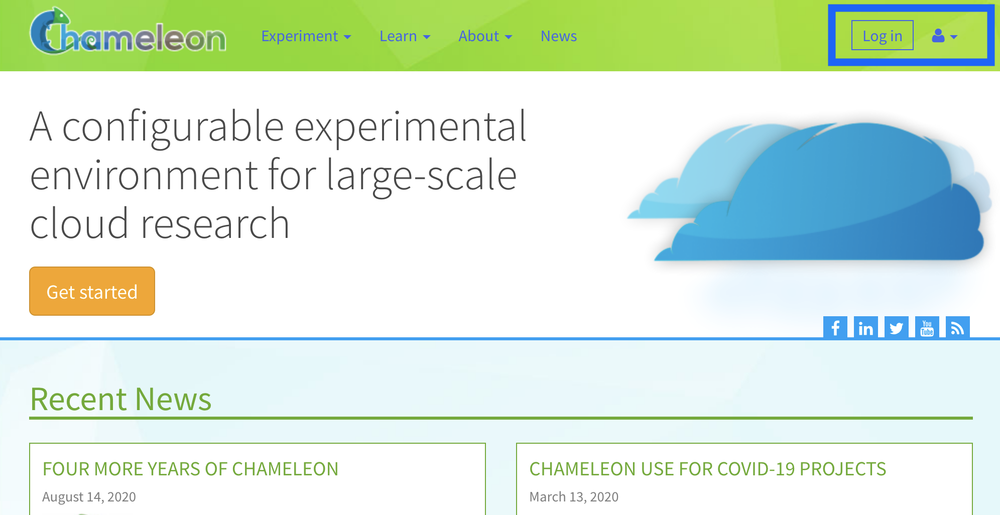

.. _InCommon: https://incommon.org/federation

.. _federation:

================================
Sign in with federated identity
================================

Federated login enables users to use a single set of credentials to log into
many different services. For example, federated login allows you to use your
university or other institutional credentials to log into Chameleon--there is
no need to create a new account. In addition, since federated login is supported
by many testbeds and services across scientific infrastructures you will be able
to sign in once and use multiple services.

Chameleon uses `Globus Auth <https://globus.org>`_, a popular authentication
service, to implement federated login and federates with entities supported by
Globus. Users can sign in using their existing institutional account if their
institution is an `InCommon`_ member, use their Google account, or create a
`Globus ID <https://globusid.org/what>`_ tied to an email and password that they
provide. In addition, Chameleon also federates with the TAS entity.

Logging in
==========

To log in to the Chameleon user portal, where you can manage your projects,
user profile, and submit |Help Desk| tickets, use the "Log in" button.

To log in to any of the testbed sites (|CHI@TACC|, |CHI@UC|, |KVM@TACC|) or the
:ref:`Jupyter environment <jupyter>`, just click their item in the "Experiment"
dropdown on |Home|. The login process is triggered
automatically.

.. important::

   You must be part of project with an active allocation to use the testbed
   sites! Refer to our :ref:`"getting started" guide <getting-started-project>`
   for more info.

.. note::

   You can bookmark the URLs to the testbed sites and Jupyter environment if
   you want to access them directly in the future.

.. figure:: federation/application-login.png
   :alt: Links for accessing testbed sites and the Jupyter interface
   :figclass: screenshot

You will be taken to a Single Sign On (SSO) page with a few options for how
to authenticate. The options are:

- **Sign in via federated identity**: this option allows you to re-use your
  existing institution, research lab, or university credentials to log in to
  Chameleon. It requires your host institution to participate in the `InCommon`_
  federation.
- **Google**: this option allows you to sign in with any Google account.
- **ORCiD**: you can also sign in with a valid ORCiD account.
- **TAS**: sign in via the TAS entity.
- For the time being, if you are an existing user, you can also leave SSO and
  go back to the old sign in page, where you sign in with your Chameleon
  username and password.

.. figure:: federation/sso-login.png
   :alt: Single Sign On (SSO) portal login
   :figclass: screenshot

   The Single Sign On (SSO) portal login page.

Legacy users (created before November 2020)
===========================================

Users who signed up for a Chameleon account prior to November 2020 must migrate
their account to use federated identity. Refer to the following step-by-step
guide for more details.

.. toctree::
   :maxdepth: 1

   federation/federation_migration
