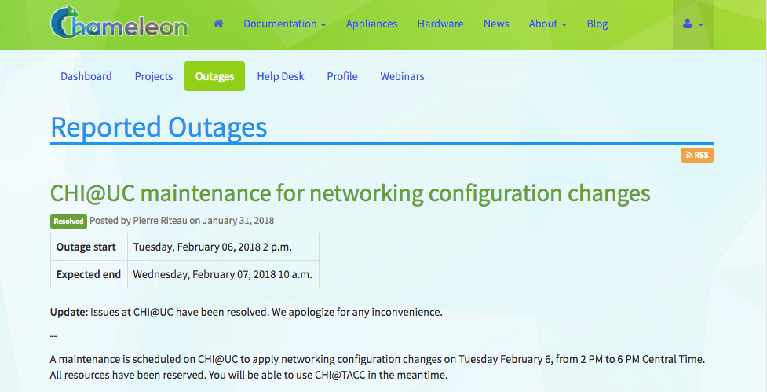

.. _help:

=============
Getting help
=============

Mailing lists
=============

You can communicate with other Chameleon users by sending email to
users@chameleoncloud.org. We also use this mailing list to communicate minor
announcements or provide early access to some new hardware or features. All
Chameleon users are registered by default: we recommend that you stay
registered. However, if you really want to opt-out, you can do so via `your user
profile <https://www.chameleoncloud.org/user/profile/>`_.

.. _outages-page:

Outages
=======

The `Outages <https://www.chameleoncloud.org/user/outages/>`_ page of the
Dashboard contains a list of system outage announcements. You may subscribe to
an RSS feed of these outages by clicking on the *RSS* icon.

  The Outages announcement page

.. _help-desk-page:

Help Desk
=========

The |Help Desk| allows you to submit help request tickets and view the status of
any open tickets.

.. figure:: help/helpdesk.png
  :alt: The Help Desk page

  The Help Desk page

To create a new help ticket, click the `+Create a new ticket
<https://www.chameleoncloud.org/user/help/ticket/new/>`_ button and fill in the
form. A system administrator will respond to your ticket within 3 business days.

.. note::
   An alternative way of asking for help is sending an email to the `Chameleon
   users mailing list <mailto:users@chameleoncloud.org>`_, especially when the
   Help Desk is down or you think it's something worth sharing with all
   Chameleon users. A system administrator will reply to your email and, if
   necessary, create a ticket for you.

.. _webinars-page:

Webinars
========

The `Webinars <https://www.chameleoncloud.org/user/webinar/>`_ page provides a
list of upcoming webinars for Chameleon user training.
