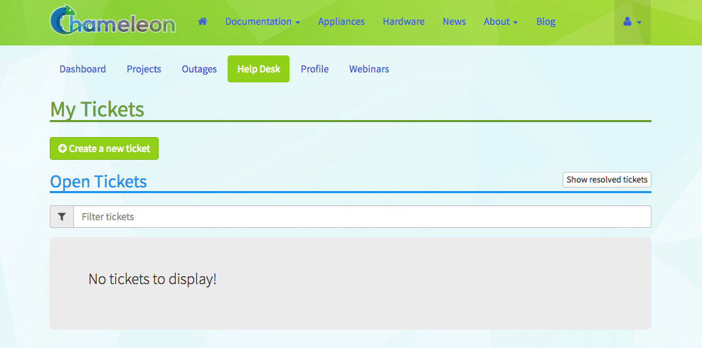

.. _help:

============
Getting Help
============

Chameleon offers several support channels to assist users with their
questions and issues. Depending on the nature of your inquiry, you can choose
from the following options:

Community Forum
===============

.. note::
   For immediate assistance or urgent issues, use the Help Desk rather 
   than the community forum. The Help Desk ensures your request receives prompt 
   attention from Chameleon staff.

Join the `Chameleon Community Forums <https://forum.chameleoncloud.org/>`_ to connect 
with other users, ask questions, and share experiences. The forum provides a space for:

* User discussions and community support
* Non-urgent questions about using Chameleon
* Sharing best practices and experimental approaches
* Announcements of new features and capabilities

The forum is actively monitored by Chameleon staff and experienced community members 
who provide assistance on a best-effort basis. For immediate help or urgent issues, 
use the Help Desk instead.

.. _outages-page:

Outages
=======

The `Outages <https://www.chameleoncloud.org/user/outages/>`_ page of the
Dashboard contains a list of system outage announcements. You may subscribe to
an RSS feed of these outages by clicking on the *RSS* icon.

.. figure:: help/outages.png
  :alt: The Outages announcement page

  The Outages announcement page

.. _help-desk-page:

Help Desk
=========

The |Help Desk| allows you to submit help request tickets and view the status of
any open tickets.

  The Help Desk page

To create a new help ticket, click the `+Create a new ticket
<https://www.chameleoncloud.org/user/help/ticket/new/>`_ button and fill in the
form. A system administrator will respond to your ticket within 3 business days.

.. _webinars-page:

Webinars
========

The `Webinars <https://www.chameleoncloud.org/user/webinar/>`_ page provides a
list of upcoming webinars for Chameleon user training.